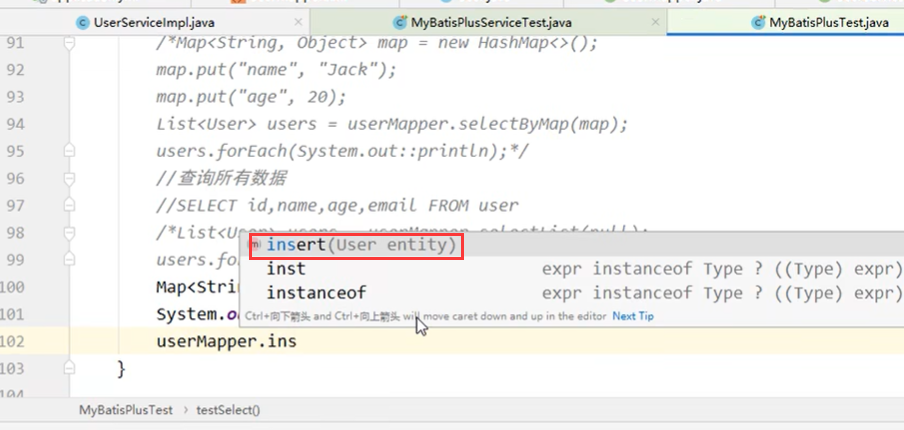
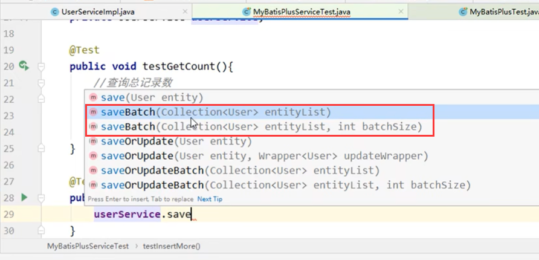
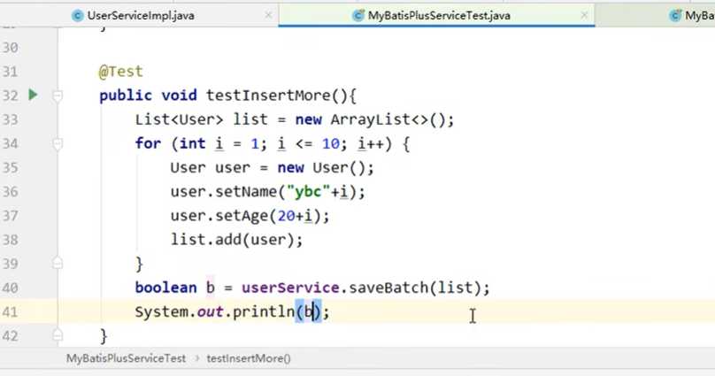
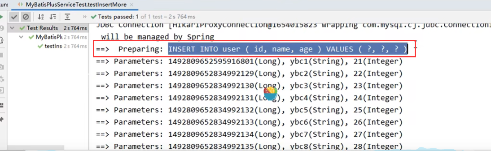

# 7、批量添加数据

​		我们发现我们的mapper继承了BaseMapper也没有批量添加的功能

​	为什么呢？ 因为在我们之后的业务场景里面很有可能添加一次数据是很多条比如1万条数据

​	那么如果是上万条数据放在一个SQL语句中执行，这个sql语句得有多长，效率会非常低而且容易引发问题

​	所以我们在mapper里面没有批量添加的功能

​	而这个批量添加的功能是在我们的Service中

​	我们查看SQL -- 可以发现Service的批量添加，也是通过mapper的单个添加SQL实现的，并没有拼接全部数据的SQL

