# 8、mybatisPlus常用注解

​	我们之前并没有指定mybatis要操作的表，为什么可以找到对应的表呢，我们之前看框架结构和实现就能明白，mybatis要操作的表由 实体 所决定，实体类进行和数据库表的匹配，和字段进行匹配，从而找到的表

​	比如我们现在数据库的表不叫user，叫t_user

​	然后我们执行一个添加数据的方法--报错

​		提示找不到user这个表

我们使用的表就是由实体决定了，是由代码中mapper的泛型T决定的

### 1、@Table

#### 	解决方案 2种

#### 	1、加入注解@TableName

​	

​		再次测试数据可以正常插入了

#### 2、第二种-全局配置

​			全局配置前缀

### 2、@TableId

​	 			mybatis默认是将id作为主键

​			如果是表的主键 不是id -插入数据的时候就有问题了

​		没有给uid赋值，所以报错 uid没有默认值

​	我们可以通过@TableId指定id，在属性上添加

​	测试插入数据 -- uid已经作为主键了

https://www.bilibili.com/video/BV12R4y157Be/?p=22&spm_id_from=pageDriver&vd_source=243ad3a9b323313aa1441e5dd414a4ef

### 3、@TableId的value属性

​			mybatis默认将id为主键，使用TableId注解是将属性设置为主键

​		如果实体类属性名称和数据库属性匹配不上的情况下，可以使用@Table的Value属性指定数据库的字段名称

​	比如数据库是uid属性，会报错---在字段列表中没有找到id列

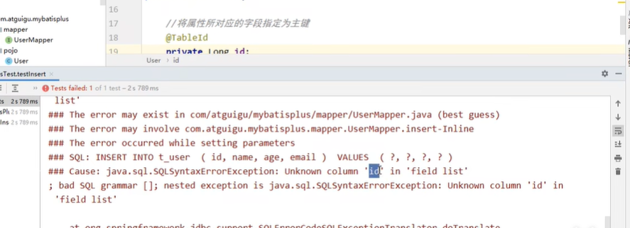

​	设置字段名称为uid就可以了

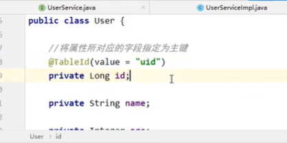

​	@TableId的value属性用于指定数据库表字段的主键属性

### 4、@TableId的Type

​			id默认的主键生成策略是雪花算法

​		比如我们现在不想使用雪花算法，想使用mysql的自动递增，该如何操作呢

​		首先数据库表设置主键为自动递增

​		然后设置@TableId的type属性 

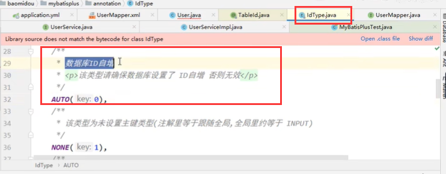

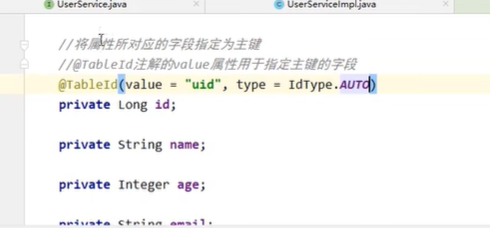

​		如果我们在代码中设置了id，那么就不会自增了，或者是雪花算法，没有id的情况下会自动生成

### 5、全局配置主键生成策略

​	可以通过全局配置文件来进行主键的生成策略配置

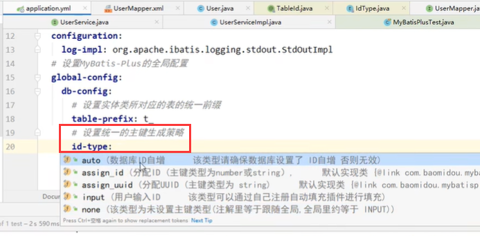

### 6、@TableField

​		字段名称与数据库不一致的情况就可以使用@TableField

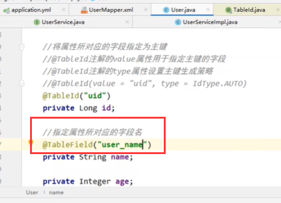

### 7、@TableLogic 逻辑删除

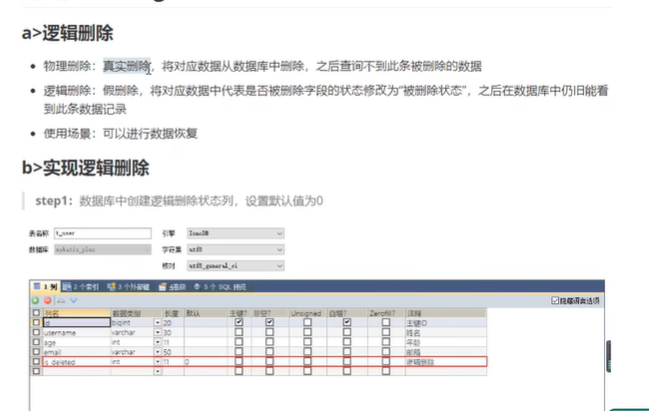

​	设置逻辑删除的字段

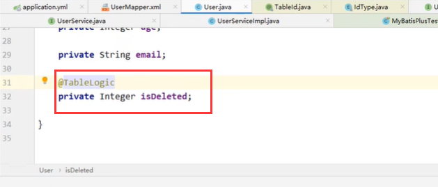

​	我们进行一个删除的操作--看看有什么效果

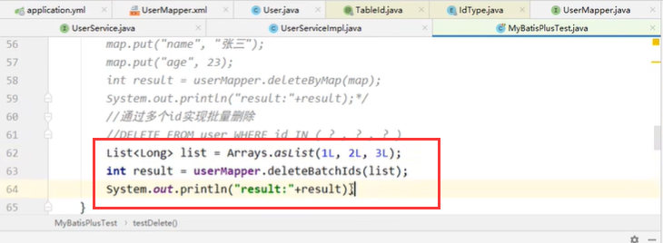

​	

​	我们发现之前的删除功能变为修改了

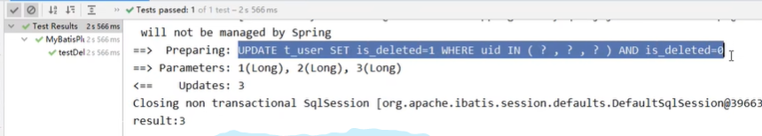

​		那么对于我们删除的数据用户是看不到的，我们现在执行查询看看效果

​	我们发现查询也是查询不到的

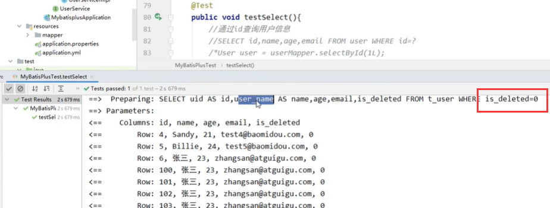

https://www.bilibili.com/video/BV12R4y157Be/?p=28&spm_id_from=pageDriver&vd_source=243ad3a9b323313aa1441e5dd414a4ef

​		

