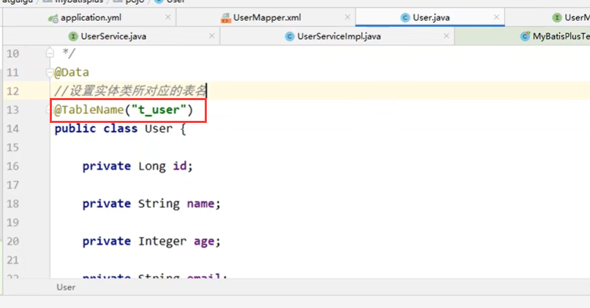

# 8、mybatisPlus常用注解

​	我们之前并没有指定mybatis要操作的表，为什么可以找到对应的表呢，我们之前看框架结构和实现就能明白，mybatis要操作的表由 实体 所决定，实体类进行和数据库表的匹配，和字段进行匹配，从而找到的表

​	比如我们现在数据库的表不叫user，叫t_user

​	然后我们执行一个添加数据的方法--报错

​		提示找不到user这个表

我们使用的表就是由实体决定了，是由代码中mapper的泛型T决定的

### 1、@Table

#### 	解决方案 2种

#### 	1、加入注解@TableName

​	

​		再次测试数据可以正常插入了

#### 2、第二种-全局配置

​			全局配置前缀

### 2、@TableId

​	 			mybatis默认是将id作为主键

​			如果是表的主键 不是id -插入数据的时候就有问题了

​		没有给uid赋值，所以报错 uid没有默认值

​	我们可以通过@TableId指定id，在属性上添加

​	测试插入数据 -- uid已经作为主键了

https://www.bilibili.com/video/BV12R4y157Be/?p=22&spm_id_from=pageDriver&vd_source=243ad3a9b323313aa1441e5dd414a4ef

