# 1.springData-JPA介绍


#### 什么是JPA？

```
	全英文名叫Java Persistence API，就是java持久化api，是SUN公司推出的一套基于ORM的规范。

持久化想必如雷贯耳，都2020年了，谁还不用个持久化框架啊，举起mybatis。

ORM呢？全英文名为Object-Relational Mapping：对象关系映射，简单来说是为了不使用JDBC那一套原始方法，来操作数据库，ORM框架横空出世（mybatis、hibernate等等）。

然而ORM框架出的太多了，百花齐放，琳琅满目，你一套标准，我一套标准，要是想换一套框架实现项目，可能要从头写，这样就不太好了吧。

百度这样介绍SUN的JPA规范：
	Sun引入新的JPA ORM规范出于俩个原因：
	1.简化现有JavaEE和Java SE应用开发工作；      
	2.Sun希望整合ORM技术，实现天下归一。
	
所以我们需要学习JPA，因为未来的ORM趋势就是JPA


```


#### spring-data-jpa

学jpa哪家强？哪家简单学哪家，springdata-jpa最简单，介绍如下：


springdata-jpa是springdata家族的一部分，可以轻松实现基于JPA的存储库。此模块处理对基于JPA的数据访问层的增强支持，它使构建使用数据访问技术的Spring驱动应用程序变得更加容易。


总的来说JPA是ORM规范，Hibernate、TopLink等是JPA规范的具体实现，这样的好处就是开发者可以面向JPA规范进行持久层的开发，而底层的实现则是可以切换的。Spring Data Jpa则是在JPA之上添加另一层抽象(Repository层的实现)，极大地简化持久层开发及ORM框架切换的成本。


也就是如下图：

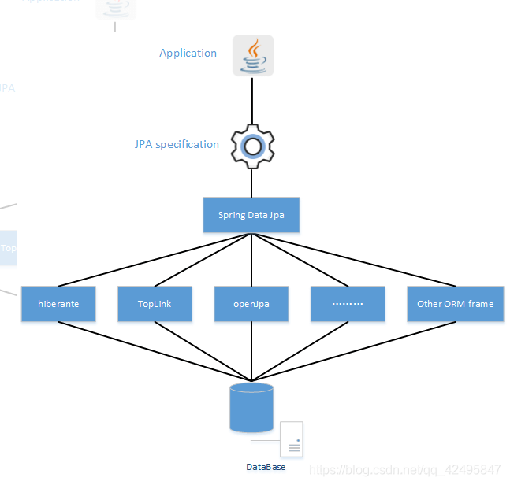


### 环境配置

话不多说，使用Maven管理包，使用springboot框架，建个空maven项目就行

#### POM信息

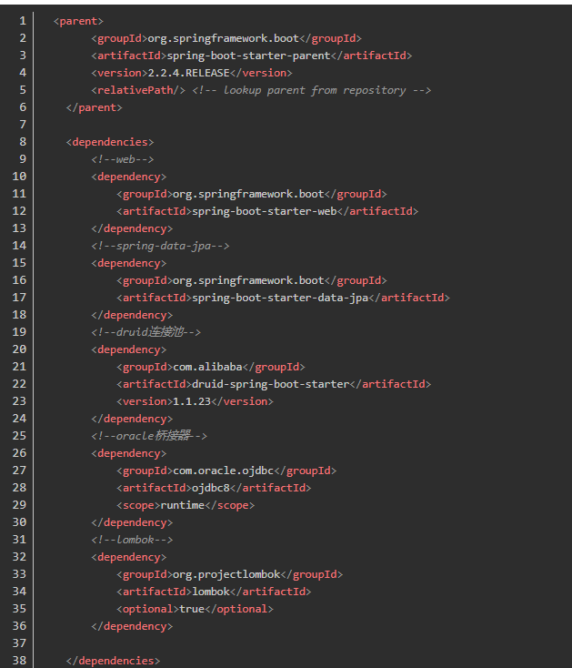看到lombok没？记得下载插件很好用的


#### application.yml

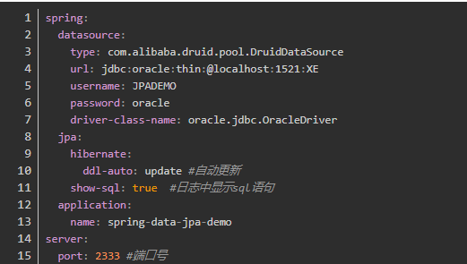


#### 文件夹架构

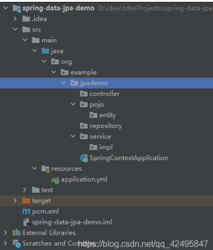


	- 标准的MVC结构，有助于解耦实现
	- 实体类放在pojo/entity下
	- dao(数据访问对象 data access object) 在JPA中叫做repository，请遵守这个规范，就像mybatis的dao叫mapper一样。


#### 创建数据库和表

Jpa支持mySQL和Oracle数据库，这里使用Oracle做例子

mysql数据库也就`实体类的主键声明`和使用的`桥接器`不同，之后的章节会做具体解释

1.1 建库前先看一下这个库存不存在

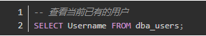


1.2 oracle建数据库语句


### 2.创建表

2.1 建一张用户表吧

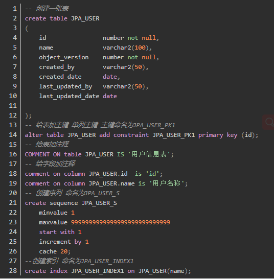


1.4 运行sql，成功！

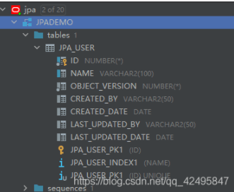

环境配好了，开始demo吧！

# 代码

## 1.Springboot启动类

SpringContextApplication

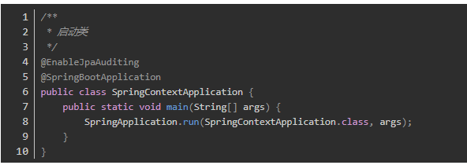

注意注意：

除了@SpringBootApplication启动注解外，

还有一个注解@EnableJpaAuditing，它是用来启动Jpa的审计功能，比如说在使用建表中经常会加入 版本号、创建时间、修改时间 、创建者、修改者 这五个字段。因此为了简化开发， 我们可以将其交给jpa来自动填充。

审计功能的创建人和修改者的注入方式下一节再讲哦，贪多嚼不烂。

## 2.entity实体类

自下而上，先把实体创建

JpaUser

```java
package org.example.jpademo.pojo.entity;

import com.fasterxml.jackson.annotation.JsonFormat;
import lombok.Data;
import org.springframework.data.annotation.CreatedBy;
import org.springframework.data.annotation.CreatedDate;
import org.springframework.data.annotation.LastModifiedBy;
import org.springframework.data.annotation.LastModifiedDate;
import org.springframework.data.jpa.domain.support.AuditingEntityListener;

import javax.persistence.*;
import java.util.Date;

/**
 * @Classname JpaUser
 * @Description TODO 用户实体类
 * @Date 2020/8/13 14:52
 * @Created by orange
 */
@Data
@Entity
@Table(name = "JPA_USER")
@EntityListeners(AuditingEntityListener.class)
public class JpaUser {

    @Id
    @Column(name = "ID")
    @GeneratedValue(strategy = GenerationType.SEQUENCE, generator = "JPA_USER_S")
    @SequenceGenerator(sequenceName = "JPA_USER_S", name = "JPA_USER_S", allocationSize = 1)
    private Long id;

    @Column(name = "NAME")
    private String name;

    @Column(name = "OBJECT_VERSION" )
    @Version
    private Long objectVersion;

    @Column(name = "CREATED_BY")
    @CreatedBy
    private String createdBy;

    @Column(name = "CREATED_DATE")
    @CreatedDate
    @JsonFormat(pattern = "yyyy-MM-dd HH:mm:ss", timezone = "GMT+8")
    private Date createdDate;

    @Column(name = "LAST_UPDATED_BY" )
    @LastModifiedBy
    private String lastUpdatedBy;

    @Column(name = "LAST_UPDATED_DATE" )
    @LastModifiedDate
    @JsonFormat(pattern = "yyyy-MM-dd HH:mm:ss", timezone = "GMT+8")
    private Date lastUpdatedDate;
}


```

这里把引入的包也贴了出来，防止大家导错包，

可以看到有非常多的注解，他们各个是什么意思呢？请看下方表格：

| 注解               | 作用                                                         | 常用属性                                                     |
| ------------------ | ------------------------------------------------------------ | ------------------------------------------------------------ |
| @Data              | 给实体类加get/set/toString/EqualsAndHashCode方法，是lombok的注解 |                                                              |
| @Entity            | 指定当前类是实体类                                           |                                                              |
| @Table             | 指定实体类和表之间的对应关系                                 | name：指定数据库表的名称                                     |
| @EntityListeners   | 在实体类增删改的时候监听，为创建人/创建时间等基础字段赋值    | value：指定监听类                                            |
| @Id                | 指定当前字段是主键                                           |                                                              |
| @SequenceGenerator | 指定数据库序列别名                                           | sequenceName：数据库序列名<br/>name：取的别名                |
| @GeneratedValue    | 指定主键的生成方式                                           | strategy ：指定主键生成策略<br/>generator：选择主键别名      |
| @Column            | 指定实体类属性和数据库表之间的对应关系                       | name：指定数据库表的列名称。<br/>unique：是否唯一<br/>nullable：是否可以为空<br/>nserttable：是否可以插入<br/>updateable：是否可以更新<br/>columnDefinition: 定义建表时创建此列的DDL |
| @CreatedBy         | 自动插入创建人                                               |                                                              |
| @CreatedDate       | 自动插入创建时间                                             |                                                              |
| @LastModifiedBy    | 自动修改更新人                                               |                                                              |
| @LastModifiedDate  | 自动修改更细时间                                             |                                                              |
| @Version           | 自动更新版本号                                               |                                                              |
| @JsonFormat        | 插入/修改/读取的时间转换成想要的格式                         | pattern：展示格式<br/>timezone：国际时间                     |

注意：

有了@EntityListeners(AuditingEntityListener.class)这个注解，@CreatedBy、@CreatedDate 、@LastModifiedBy 、@LastModifiedDate才生效哦，而且创建人和更新人需要另作注入操作，此篇埋个伏笔。


## 3.repository 数据访问层

​		此处便是spring-data-jpa中最令人虎躯一震的地方！

震惊，一个接口居然可以实现常用的所有操作！


JpaUserRepository代码如下：

```java
package org.example.jpademo.repository;

import org.example.jpademo.pojo.entity.JpaUser;
import org.springframework.data.jpa.repository.JpaRepository;

/**
 * @Classname JpaUserRepository
 * @Description TODO
 * @Date 2020/8/13 15:12
 * @Created by orange
 */
public interface JpaUserRepository extends JpaRepository<JpaUser, Long> {
}

```


​		你以为才开始吗？不，已经结束了

可以看到，这个接口继承了JpaRepository<实体类，ID类型>，spring-data-jpa只需要这个信息，就可以帮你完成常用的操作：增删改查。

这一节不具体展开JpaRepository中包含的所有方法，单纯使用最简单的增删改查来过瘾


#### 4.Service业务逻辑层

​		业务逻辑层是程序的逻辑核心，所有的重要的逻辑操作都应该往service中写，而不是写到Controller控制层里去哦。


​		而且service层是需要分层的：接口和实现类，这个不必多说，规范，规范。


​		我们实现最简单的新增、删除、修改、查询功能


接口如下：

JpaUserService

```java
public interface JpaUserService {
    /**
     * 新增用户
     * @param user 用户对象
     */
    JpaUser insertUser(JpaUser user);

    /**
     * 删除用户
     * @param id 删除id
     */
    void deleteUser(Long id);

    /**
     * 修改用户
     * @param user 用户信息
     */
    JpaUser updateUser(JpaUser user);

    /**
     * 查询所有用户
     */
    List<JpaUser> findAllUser();

    /**
     * 通过id查询用户
     * @param id 用户id
     */
    JpaUser findUserById(Long id);
}

```

接口实现：

JpaUserServiceImpl

```java
@Service
public class JpaUserServiceImpl implements JpaUserService {
    @Resource
    private JpaUserRepository jpaUserRepository;

    @Override
    public JpaUser insertUser(JpaUser user) {
        return jpaUserRepository.save(user);
    }

    @Override
    public void deleteUser(Long id) {
        jpaUserRepository.deleteById(id);
    }

    @Override
    public JpaUser updateUser(JpaUser user) {
        return jpaUserRepository.save(user);
    }

    @Override
    public List<JpaUser> findAllUser() {
        return jpaUserRepository.findAll();
    }

    @Override
    public JpaUser findUserById(Long id) {
        return jpaUserRepository.findById(id).orElse(null);
    }
}

```


是滴，你没有看错，一个sql语句也没有见着，直接通过jpaUserRepository接口把方法点了出来。

这一点比mybatis做的好，不过你要硬说mybatis-plus牛逼我也没办法。

数据访问层（dao）被确确实实的优化的很简便，这是spring-data-jpa很大的亮点。

细心的同学可能发现了，新增和修改都调用的save()方法，jpa靠什么区分是insert还是update呢？

靠的是主键id有没有赋值判断~id有值为update，id无值为insert。


#### 5.Controller控制层

控制层是前后台交互的层，我采用的是restful编写格式的接口，对于资源的具体操作类型，由HTTP动词表示。

简单借用晨瑞大佬文章中的解释：

GET（SELECT）：从服务器取出资源（一项或多项）。
POST（CREATE）：在服务器新建一个资源。
PUT（UPDATE）：在服务器更新完整资源（客户端提供改变后的完整资源）。
PATCH（UPDATE）：在服务器更新部分资源（客户端提供改变的属性）。
DELETE（DELETE）：从服务器删除资源。
简化一下：

GET：查询
POST：插入、新建
PUT：完全更新
PATCH：部分更新
DELETE：删除
举个栗子：

GET /zoos：获取所有动物园
POST /zoos：新建一个动物园
GET /zoos/ID：获取此ID的动物园信息
PUT /zoos/ID：更新此ID动物园部分信息（提供该动物园的全部信息）
PATCH /zoos/ID：更新此ID动物园全部信息（提供该动物园的部分信息）
DELETE /zoos/ID：删除此ID的动物园信息
GET /zoos/ID/animals：获取此ID动物园的所有动物
DELETE /zoos/ID/animals/ID：删除ID(前者)动物园的ID(后者)动物
好，如果你看懂了什么是restful编写格式，那么就看看控制层代码：


JpaUserController

```java
@RestController
@RequestMapping("/user")
public class JpaUserController {
    @Resource
    private JpaUserService jpaUserService;

    /**
     * 新增用户
     */
    @PostMapping("")
    public JpaUser addUser(@RequestBody JpaUser user){
        return jpaUserService.insertUser(user);
    }

    /**
     * 删除用户
     */
    @DeleteMapping("/{id}")
    public void deleteUser(@PathVariable("id") Long id){
        jpaUserService.deleteUser(id);
    }

    /**
     * 修改用户
     */
    @PutMapping("")
    public JpaUser updateUser(@RequestBody JpaUser user){
        return jpaUserService.updateUser(user);
    }

    /**
     * 全查用户
     */
    @GetMapping("")
    public List<JpaUser> findAll(){
        return jpaUserService.findAllUser();
    }

    /**
     * id查用户
     */
    @GetMapping("/{id}")
    public JpaUser findbyId(@PathVariable("id") Long id){
        return jpaUserService.findUserById(id);
    }


}

```


代码ok，开始测试！

# 测试

单单讲spring-data-jpa的话，就没有加swagger注解了，那么测试我们就使用postman来进行

## 1.用户插入

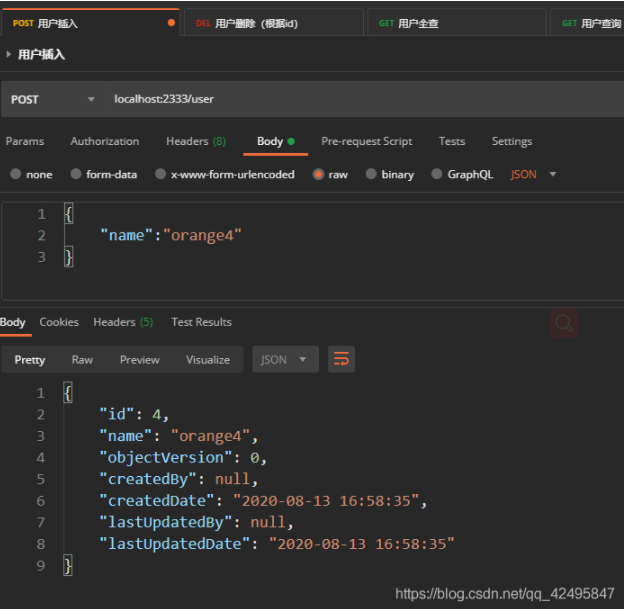


POST提交

URL：localhost:2333/user

body数据：

```json
{
    "name":"orange4"
}

```


返回数据

```json
{
    "id": 4,
    "name": "orange4",
    "objectVersion": 0,
    "createdBy": null,
    "createdDate": "2020-08-13 16:58:35",
    "lastUpdatedBy": null,
    "lastUpdatedDate": "2020-08-13 16:58:35"
}

```

分析：

id自动通过序列生成，

name是提交的数据，

版本号自动插入为0，

createdBy,lastUpdatedBy由于还未配置完整，暂时没有数据，

createdDate,lastUpdatedDate在插入时皆为当前时间


## 2.用户删除

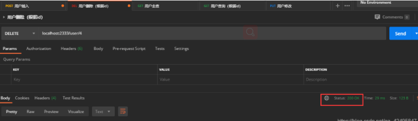

DELETE提交

URL：localhost:2333/user/4

返回数据：状态码 200

分析：

状态码200，代表服务器响应正确，删除成功


## 3.用户查询（全查）

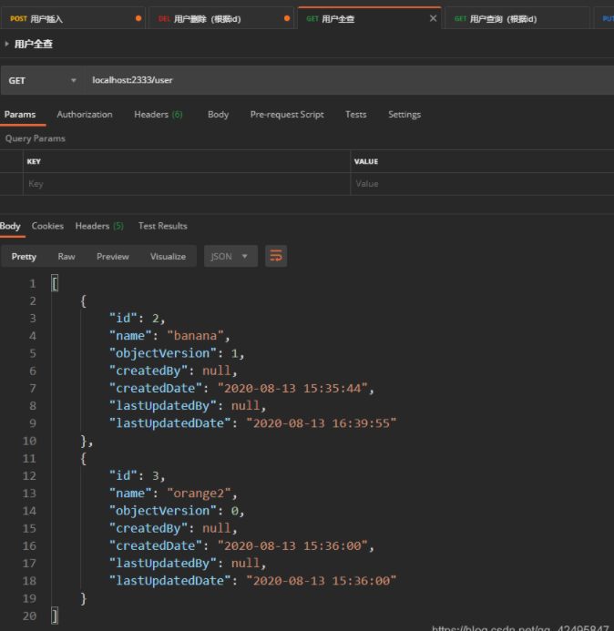


GET提交

URL：localhost:2333/user

返回数据：

```json
[
    {
        "id": 2,
        "name": "banana",
        "objectVersion": 1,
        "createdBy": null,
        "createdDate": "2020-08-13 15:35:44",
        "lastUpdatedBy": null,
        "lastUpdatedDate": "2020-08-13 16:39:55"
    },
    {
        "id": 3,
        "name": "orange2",
        "objectVersion": 0,
        "createdBy": null,
        "createdDate": "2020-08-13 15:36:00",
        "lastUpdatedBy": null,
        "lastUpdatedDate": "2020-08-13 15:36:00"
    }
]

```

分析：

上面插入的id为4的用户此处全查没有，也代表着删除操作的成功


## 4.用户修改

修改的时候需要全部实体数据哦，因为jpa的save()是全部修改，前端少传一个字段，数据库更新可能就变成null了，特别注意。之后会讲部分更新的实现。

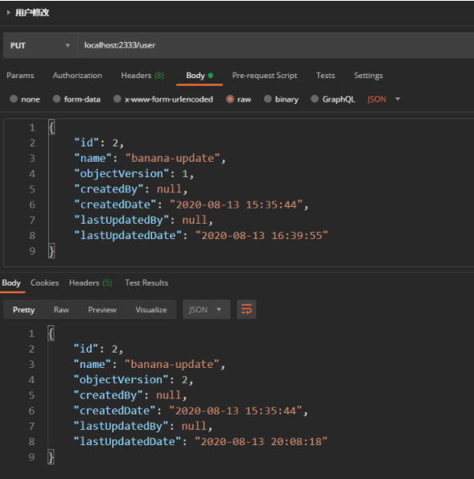


PUT提交

URL：localhost:2333/user

body数据：

```json
{
    "id": 2,
    "name": "banana-update",
    "objectVersion": 1,
    "createdBy": null,
    "createdDate": "2020-08-13 15:35:44",
    "lastUpdatedBy": null,
    "lastUpdatedDate": "2020-08-13 16:39:55"
}

		
```


返回数据：


```json
{
    "id": 2,
    "name": "banana-update",
    "objectVersion": 2,
    "createdBy": null,
    "createdDate": "2020-08-13 15:35:44",
    "lastUpdatedBy": null,
    "lastUpdatedDate": "2020-08-13 20:08:18"
}

```


分析：

因为有了id值，save()方法变为了修改方法，

name的值从banana修改成banana-update，

objectVersion版本号因为@Version注解，从1变为了2，

createdBy和createdDate别看没变，是因为前端传的字段中带了值，如果不传值，数据库会被清成null，切记切记，

lastUpdatedBy和lastUpdatedDate不需要管，传不传值都会自动更新。


注意点：

@Version注解加上后开启乐观锁，更新必须加上objectVersion字段，且值一定要和数据库中的版本号一致，这样才会触发更新操作。

如果不加objectVersion字段，且后端没有验证操作，id值会被忽略，从更新操作变为新增操作，这是一个坑。


## 5.用户查询（id查）

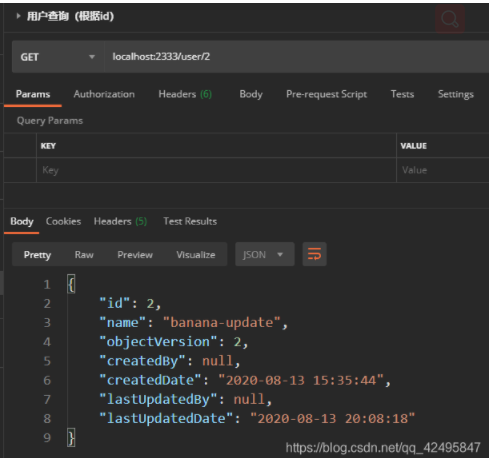


GET提交

URL：localhost:2333/user/2

返回数据：

```json
{
    "id": 2,
    "name": "banana-update",
    "objectVersion": 2,
    "createdBy": null,
    "createdDate": "2020-08-13 15:35:44",
    "lastUpdatedBy": null,
    "lastUpdatedDate": "2020-08-13 20:08:18"
}

```

分析：

和修改后的数据一样，就是个简单的id查询


总结
总的来说，jpa带给我的惊喜很多，惊吓也很多，和mybaits各有所长，你们选择哪一个呢？

小孩子才做选择，我全都要！

真·总结：

1.@Version注解加上后，更新操作一定要带上注解修饰的字段，且要与数据库中的值一致。

2.@CreatedBy和@CreatedDate会在更新时一并更新，需要主动去维护，或者在@Column注解中加上updatable = false，比如这样@Column(name = "CREATED_DATE",updatable = false)。


https://blog.csdn.net/qq_42495847/article/details/107991361


