# SpringData-JPA第三节

https://www.bilibili.com/video/BV1hW411g7jy?p=6&spm_id_from=pageDriver

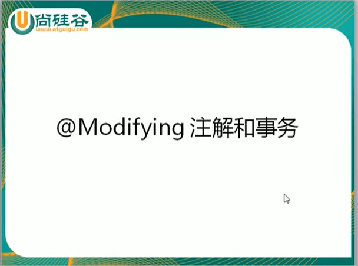

自定义查询的方法

注意：如果需要使用原生的SQL查询的话，需要参数nativeQuery设置为true

**根据ID更新email**

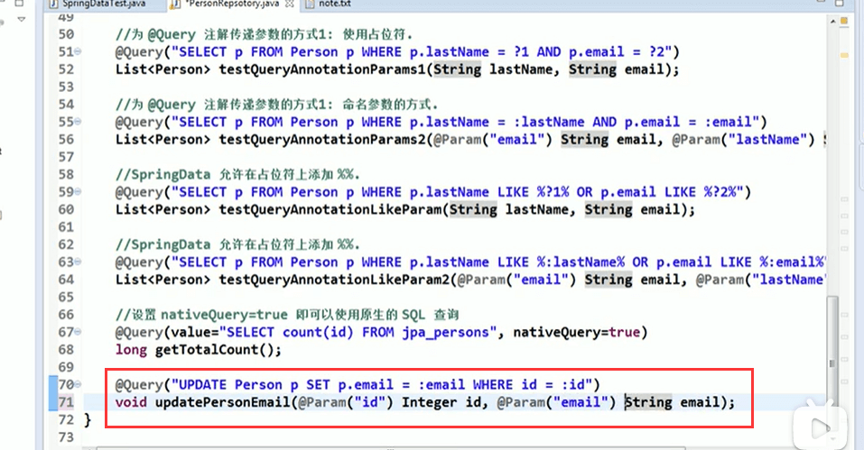

注意需要加上@modifying注解，还需要有事务

在@query注解中编写JPQL语句，但必须使用@Modifying注解进行修饰，以通知SpringData，这是一个Update 或 Delete操作

Update 或 Delete操作需要事务，此时需要定义service层，在Service层的方法上添加事务操作

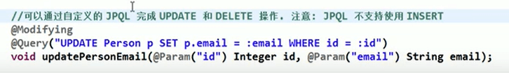

默认情况下，SpringData的每个方法上有事务，但都是一个只读事务，他们不能完成修改操作

#### CrudRepository接口

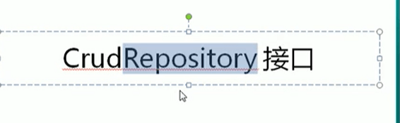

实现CrudRepository接口，并测试它的批量添加方法

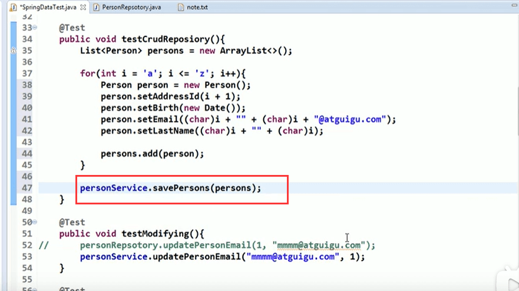

成功，他给我们提供了简单的增删改查的方法提供

#### PagingAndSortingRepository接口

他是属于crudRepository的子接口

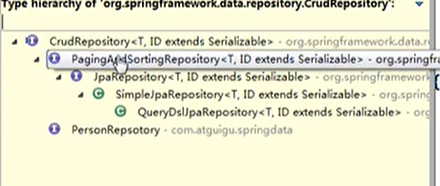

他有俩个方法一个是跟排序相关的方法sort参数，一个是跟分页相关的方法参数是Pageable---其实传Pageable可以包含sort

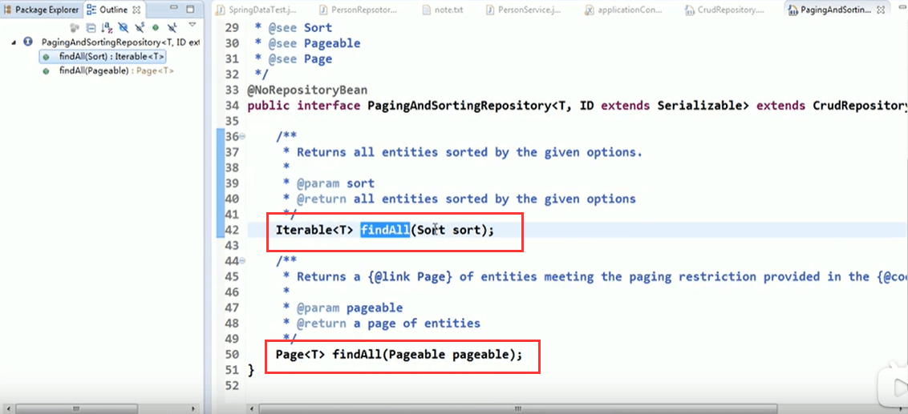

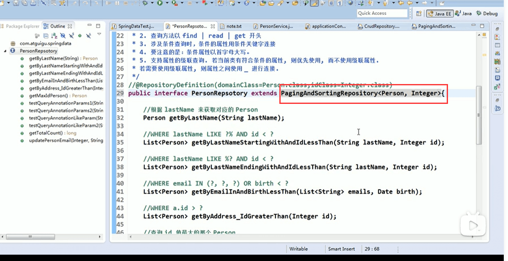

开始测试分页方法--需要传入参数Pageable而他是一个接口，他的实现是PageRequest

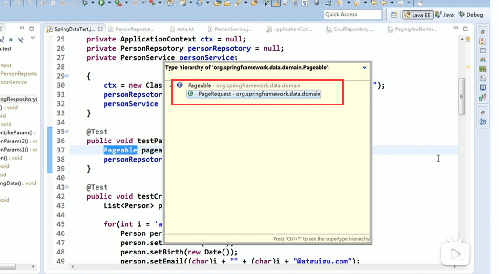

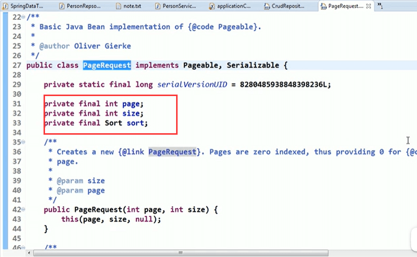

测试分页：

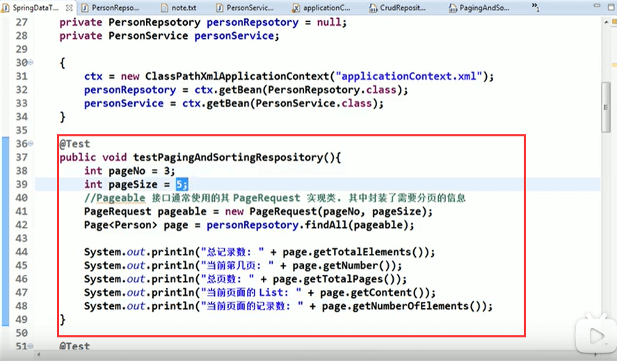

注意：PageNo是从0开始，页码数应该-1，那么当前的页码就应该+1了

如果想显示第6页呢？

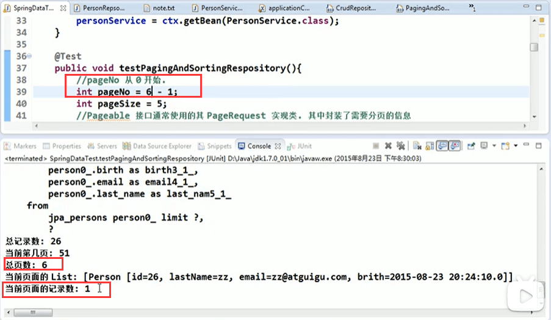

**排序相关的**

 	- 我们在创建Request的时候可以传入Sort，他不是接口就是一个类里面封装了排序的信息
 	- 创建Sort的时候需要传入Order或者多个Order，可变参数new Sort（order...）
 	- 创建Order注意使用SpringData的Order，需要2个参数Direction和property（Direction是升序还是降序，property是用哪个进行排序）
 	- 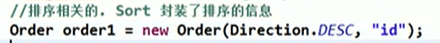
 	- 现在是按id进行降序，然后我们需要另一个需求，按email进行升序
 	- 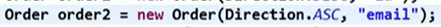

测试查看：

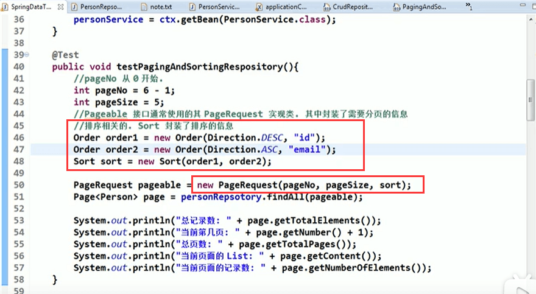

可以看到是达到排序效果了sql

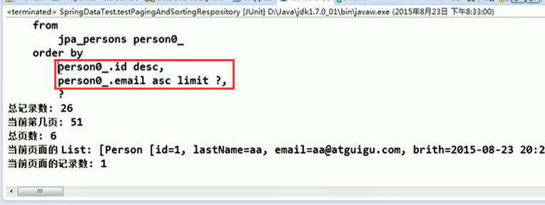

​	**注意**：Order是具体针对某一个属性进行升序还是降序。

​	**PagingAndSortingRepository接口它现在满足不了，通用的带查询条件的分页功能**

#### JpaRepository接口

JpaRepository接口是PagingAndSortingRepository接口的子接口

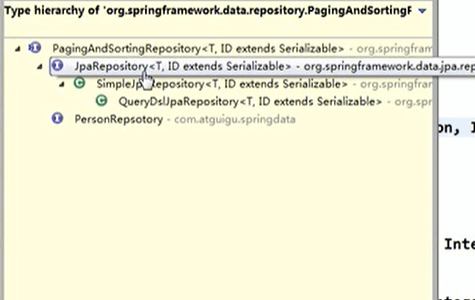

他里面又多了几个方法：

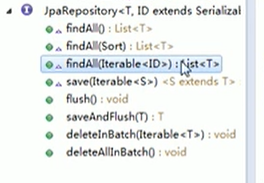

findAll：获取全部

findAllSort：获取全部并排序

findAllIterable：根据id集合查询

save:批量保存

flush：刷新

saveAndFlush：

deleteInBatch：批量删除

deleteAllInBatch：删除全部

**我们来测试一下saveAndFlush方法**

​	继承接口

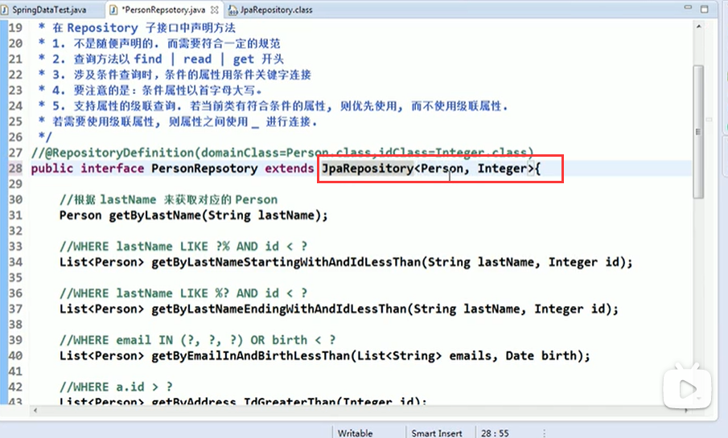

 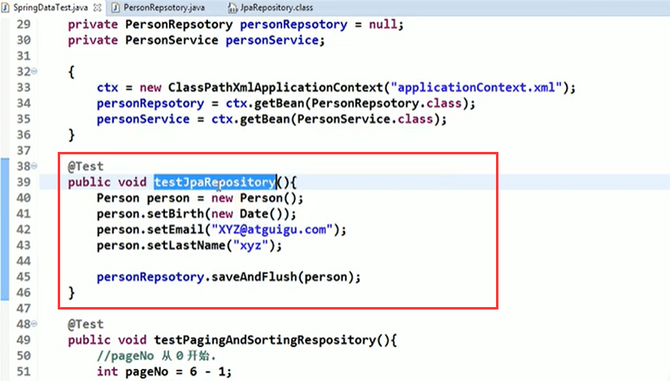

打印SQL语句：

设置id后执行方法：

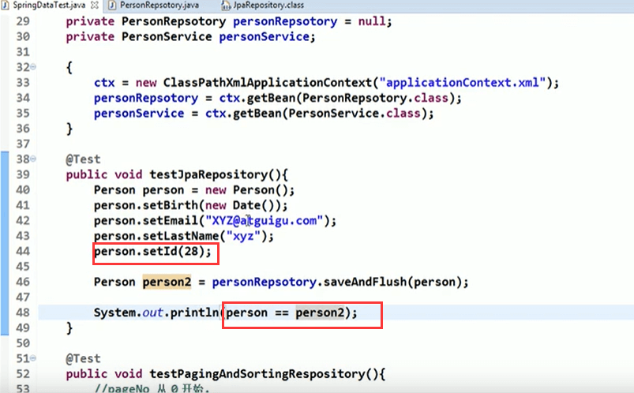

先执行了select发现有id，在执行update

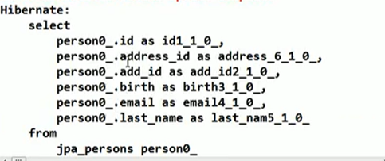

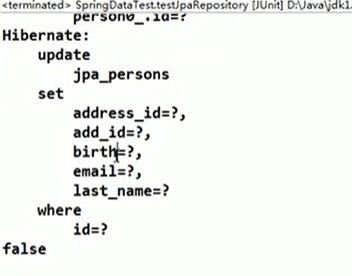

#### JpaSpecificationExecutor接口

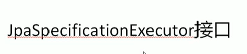

**注意：**这个接口有些特殊和另类，因为他根本就不属于Repository接口体系的接口

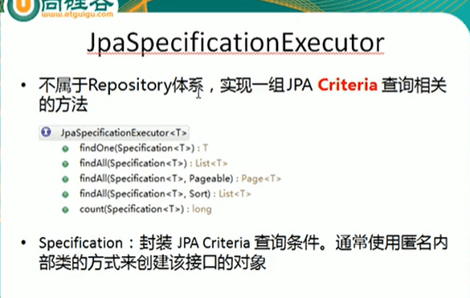

在repository接口下没有它

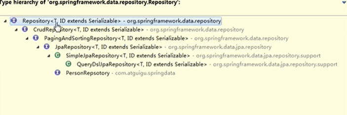

**JpaSpecificationExecutor接口可以实现带条件的分页查询**

他有5个方法：

这些方法都需要传入一个Specification对象，里面封装的查询条件

我们继承JpaSpecificationExecutor接口进行测试：

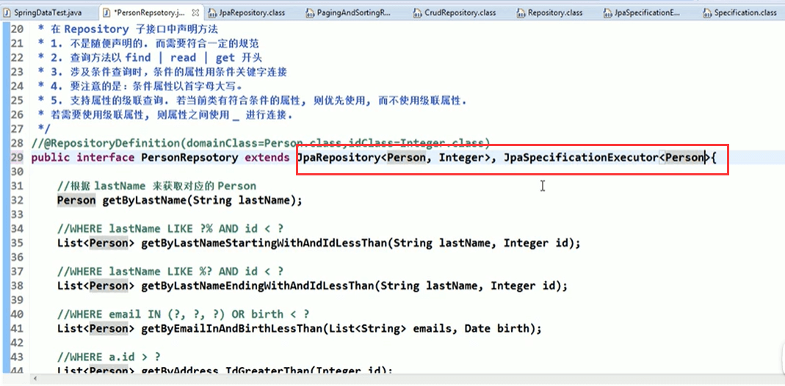

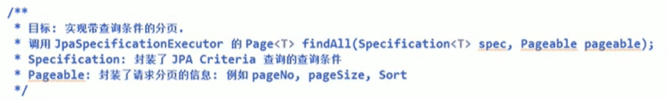

**第一步代码**

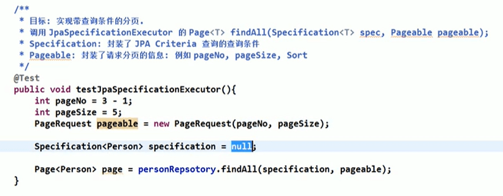

现在主要是Specification的问题，通常使用Specification 的匿名内部类

查询id大于5的数据：

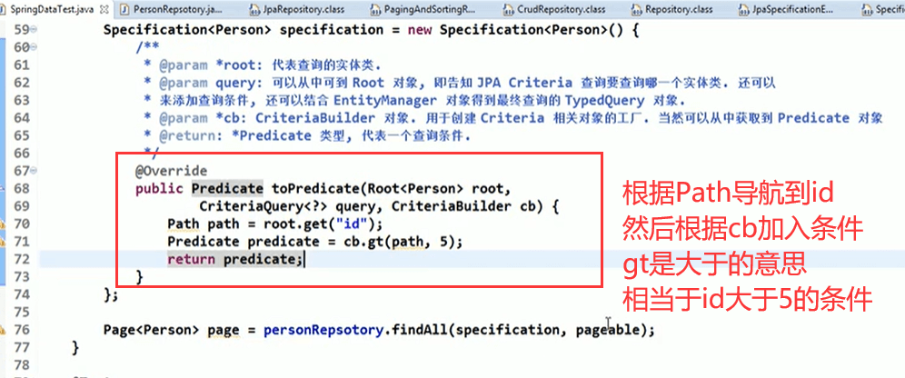

查询结果：

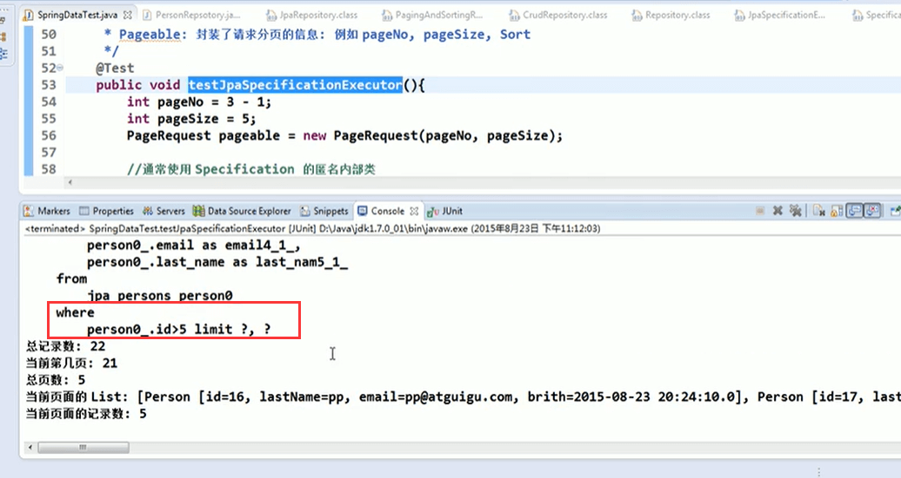

https://www.bilibili.com/video/BV1hW411g7jy?p=10&spm_id_from=pageDriver

#### 自定义Repository方法

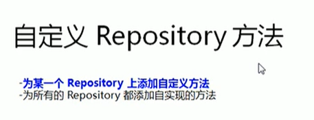

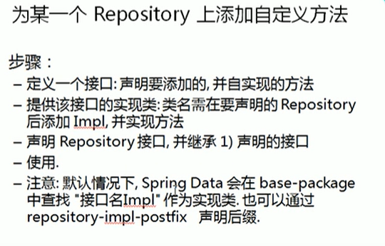

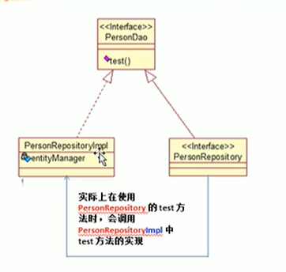

1定义一个接口：

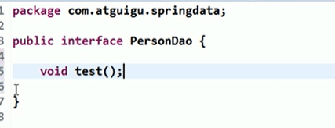

2提供一个实现：

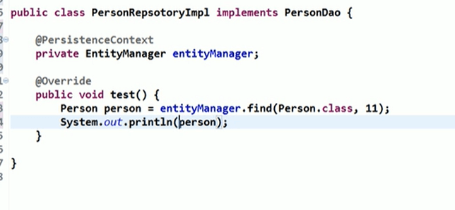

关于EntityManager可以查看

[JPA EntityManager详解]: https://www.jianshu.com/p/091360c47e6b

3.我们之前的PersonRepository继承PersonDao接口

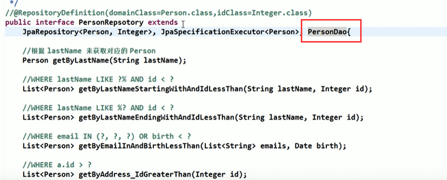

4.进行测试

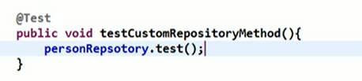

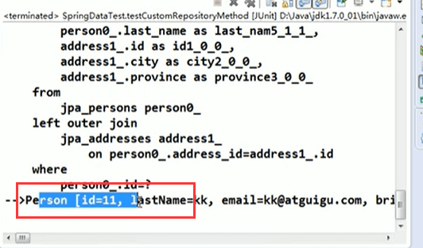

