# 3、Stream流的思想

​	什么是流？ 我们可以理解为工厂的流水线

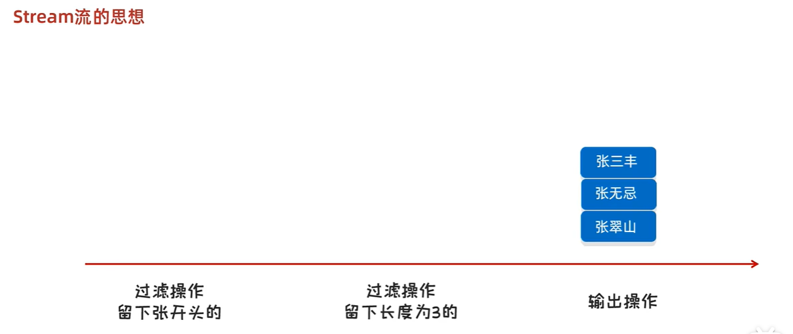

Stream 分为 中间方法--如过滤操作，可以多次过滤， 和 终结方法-如打印输出结果

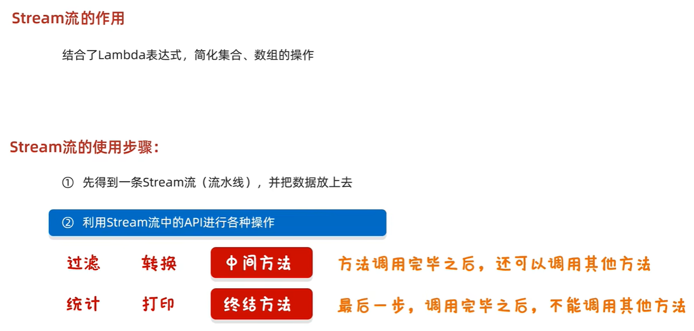

#### 如何获得一个流水线并把数据放上去呢？

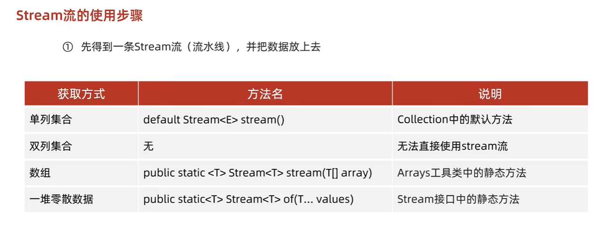

​	单列集合是可以Collection中默认方法直接获取的

​	双列集合 需要使用keySet()方法或者是entrySet方法 转化为单列集合 就可以使用获取stream流了

​	数组  可以使用数组的工具类Arrays里面的静态方法

​	一堆零散的数据：这些数据没有放到集合，或者是没有放到数组当中，是一堆零散的数据，这些数据可以使用Stream接口中的方法 of 来进行处理，但是这些数据是需要同一种数据类型的。

#### 1、案例1--单列集合

- 1、因为ArrayList是Collections的实现，所以直接可以调用stream

- 2、使用stream调用forEach循环，参数是一个匿名内部类的参数格式，我们先不使用Lamda表达式来实现

​		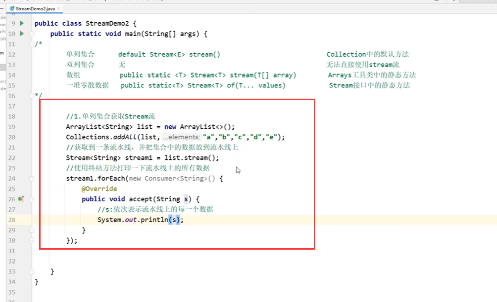

​		这不是最终代码，我们一般是这么来写的：而是直接使用链式编程，直接连贯起来

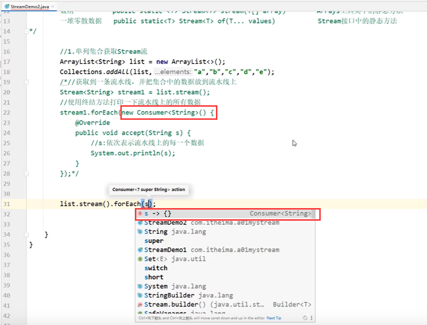

​	这个s就表示流水线上的每个数据

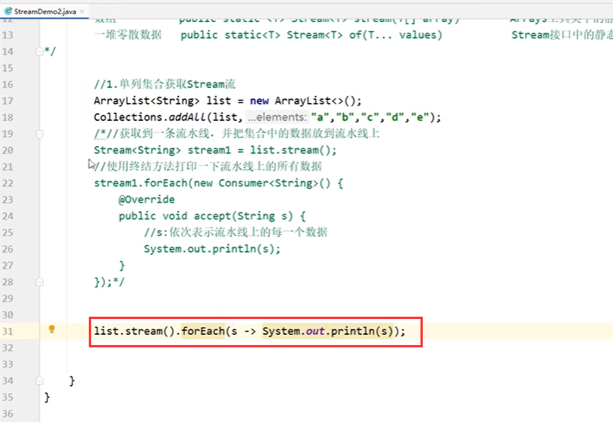

​	这就是单列集合获取Stream流

#### 2、案例-双列集合

-  1、我们无法通过双列集合直接获取 stream流，但是可以将所有的key放入Set 单列集合中就可以了
-  2、运行输出-可以得到所有的key值

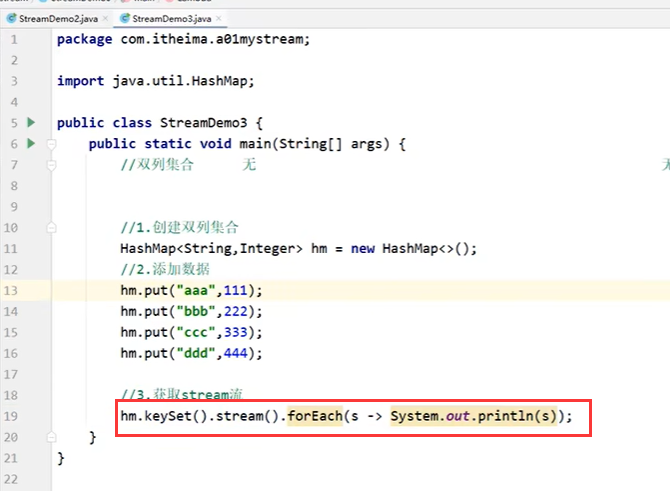

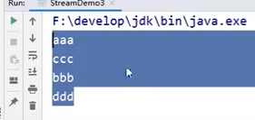

- 3、也可以是将双列集合转为 entrySet --就是 键值对 的单列集合--这样key 和 value就都有了

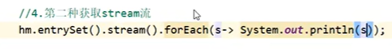

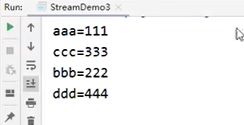

​	这样我们可以得到每个键值对

#### 3、案例-数组获取Stream

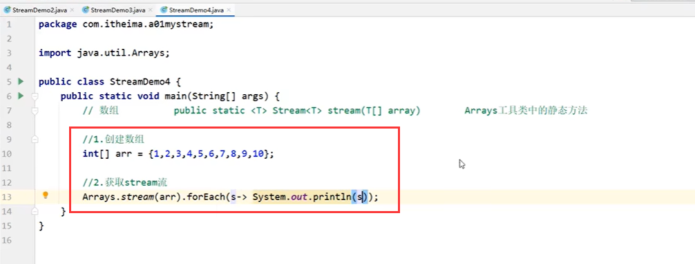

​	如果说是引用类型的数组也是可以的

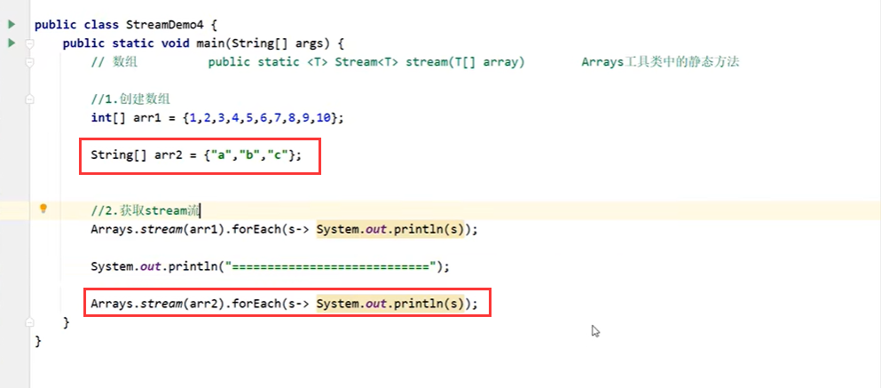

​	运行结果--没有问题

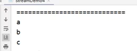

#### 4、案例-一堆零散的数据-获取stream流

​	使用Stream的静态方法 of方法是一个可变参数

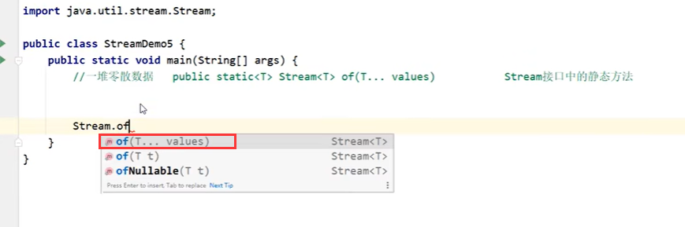

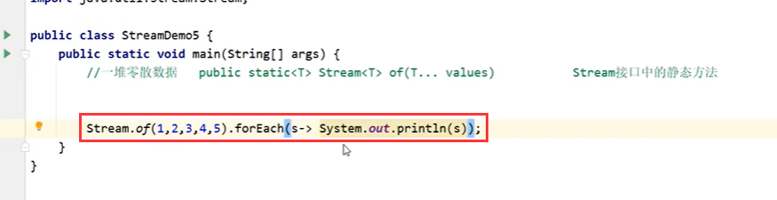

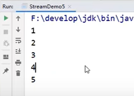

​	没有问题

注意：

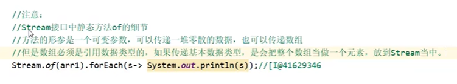

​		

​	

