# 4、Stream流中间方法

#### 1、常见的中间方法

​	

​		注意合并流 concat 是将俩个流合并为一个，类型需要一致，如果不一致也是 父子关系的类型才可以

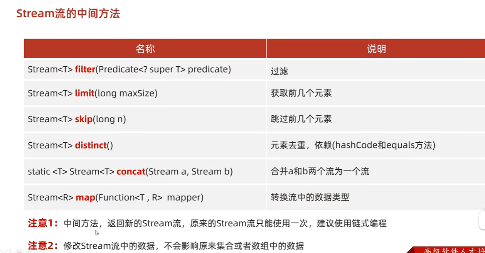

​	中间方法的一系列操作 对原集合数据是不影响的，因为我们只是操作或修改流中的集合数据。

#### 2、案例

#### 	2.1、filter方法 -- 过滤

​		我们先以内部类的方式实现一下

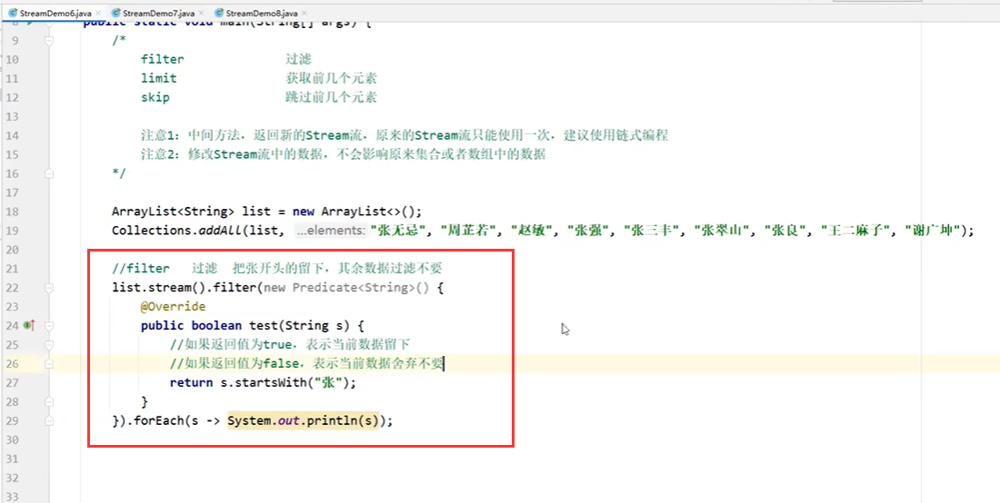

使用lamda的方式

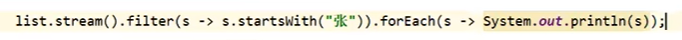

输出没有问题

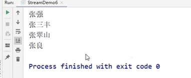

​	为了测试stream是否只能使用一次--我们使用变量的方式重复调用试试

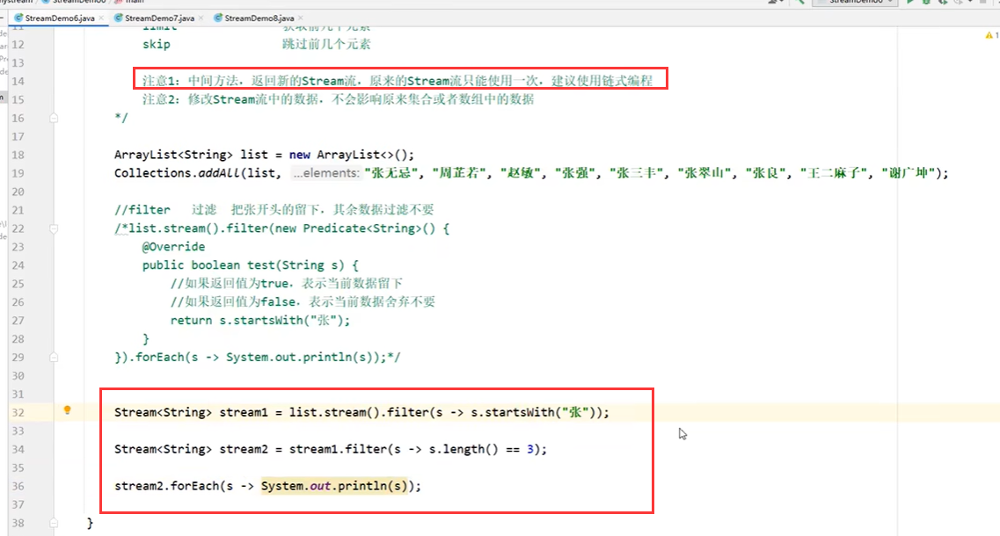

​		现在是没有问题，数据也没问题

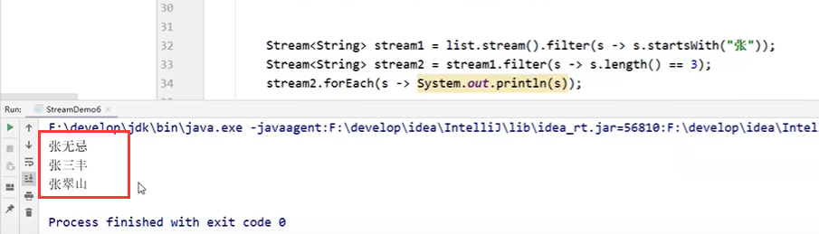

​	但是如果现在我们还想再使用一次stream1---发现会报错

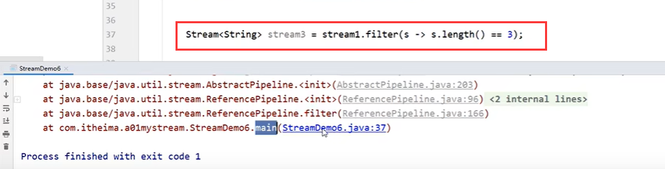

​	错误提示：流已经关闭了

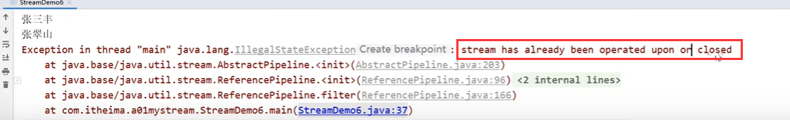

​	因为只能使用一次stream 所以就没有必要使用变量的方式使用了--使用链式编程

​	修改流中的数据不会影响到 原集合数据--我们验证一下

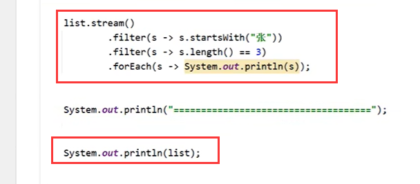

​	确实不会影响到

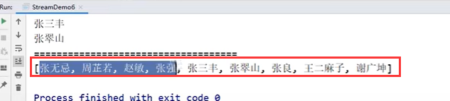

#### 	2.2、limit方法 -- 获取前几个数据

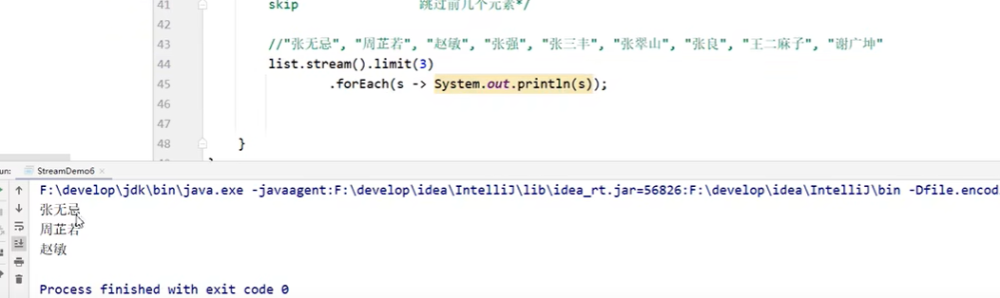

#### 2.3、skip方法 -- 跳过几个数据

​	跳过前4个数据

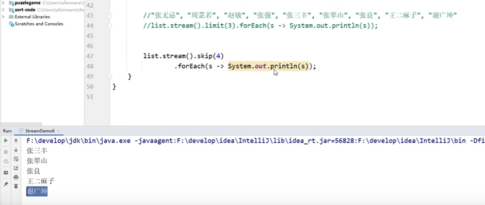

练习：

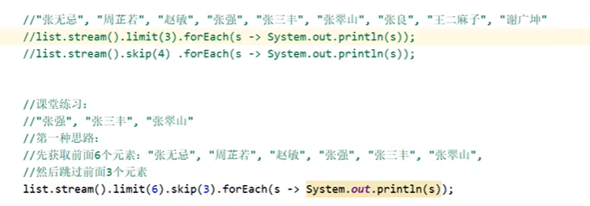

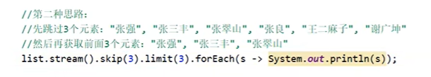

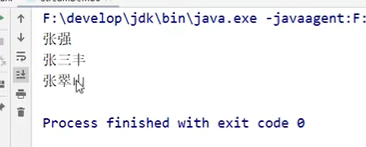

https://www.bilibili.com/video/BV1te411w722/?p=4&spm_id_from=pageDriver&vd_source=243ad3a9b323313aa1441e5dd414a4ef

