# 6、Stream流收集方法Collect详解

#### 1、收集List集合

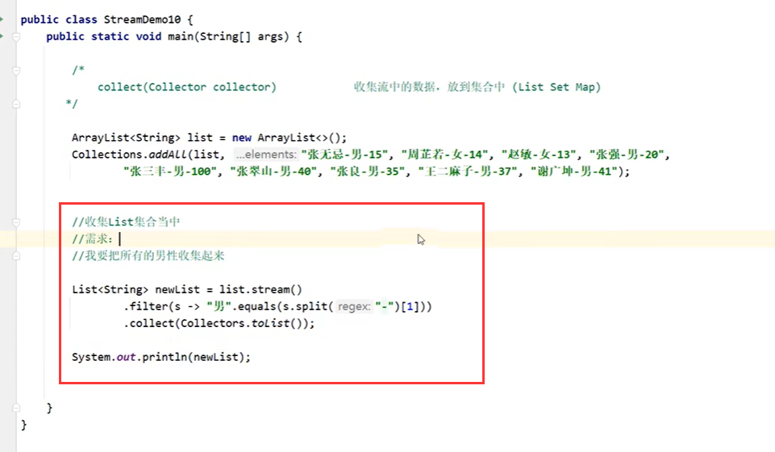

​	运行结果：

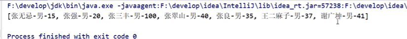

收集到Set集合

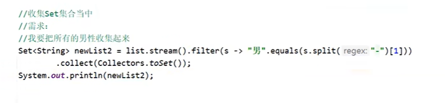

​	Set去除重复元素

	##### 收集到map中

​	收集到map集合需要 确定什么是key 什么是value

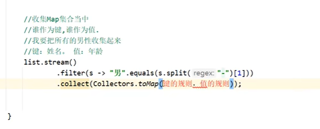

​	参考注释：

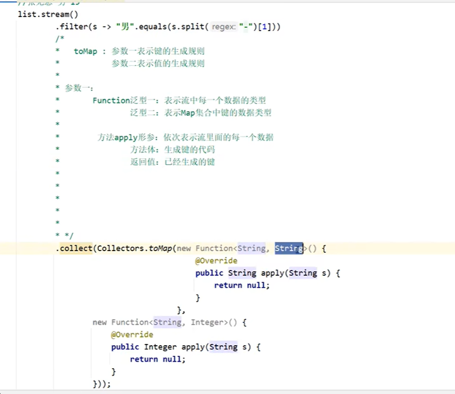

​		参数二：

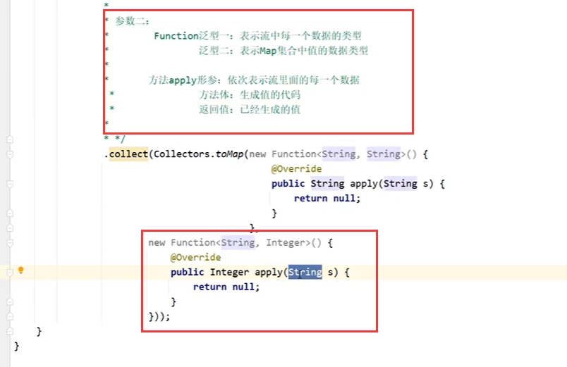

​	编写规则：

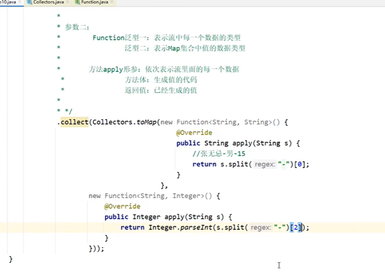

​	

​			这里需要注意的点是--可能key会重复的话代码会报错，必须保证key唯一

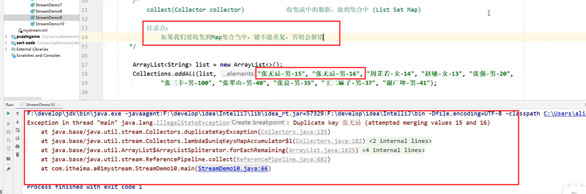

​	我们使用lambda来写一下：

​	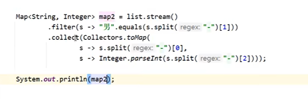

​	程序运行没有问题

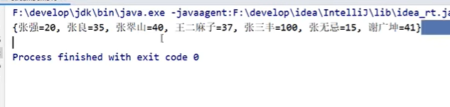

#### 总结：

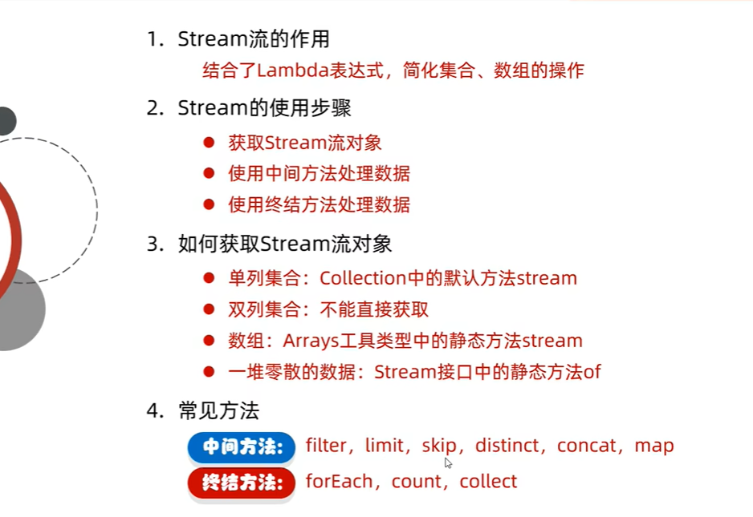

https://www.bilibili.com/video/BV1te411w722?p=6&spm_id_from=pageDriver&vd_source=243ad3a9b323313aa1441e5dd414a4ef

