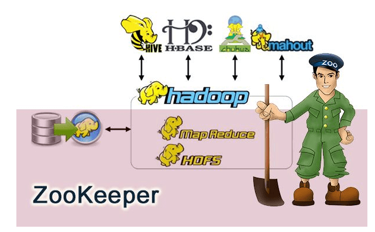

# 各个不同知识点的记录

:::tip
Zookeeper知识点整理
:::

## 前言

相信大家对 ZooKeeper 应该不算陌生。但是你真的了解 ZooKeeper 是个什么东西吗？如果别人/面试官让你给他讲讲  ZooKeeper 是个什么东西，你能回答到什么地步呢？

我本人曾经使用过 ZooKeeper 作为 Dubbo 的注册中心，另外在搭建 solr 集群的时候，我使用到了  ZooKeeper 作为 solr 集群的管理工具。前几天，总结项目经验的时候，我突然问自己 ZooKeeper 到底是个什么东西？想了半天，脑海中只是简单的能浮现出几句话：“①Zookeeper 可以被用作注册中心。 ②Zookeeper 是 Hadoop 生态系统的一员；③构建 Zookeeper 集群的时候，使用的服务器最好是奇数台。” 可见，我对于 Zookeeper 的理解仅仅是停留在了表面。

所以，**通过本文，希望带大家稍微详细的了解一下 ZooKeeper 。如果没有学过 ZooKeeper ，那么本文将会是你进入 ZooKeeper 大门的垫脚砖。如果你已经接触过 ZooKeeper ，那么本文将带你回顾一下 ZooKeeper 的一些基础概念。**

最后，**本文只涉及 ZooKeeper 的一些概念，并不涉及 ZooKeeper 的使用以及 ZooKeeper 集群的搭建。** 网上有介绍 ZooKeeper 的使用以及搭建 ZooKeeper 集群的文章，大家有需要可以自行查阅。

