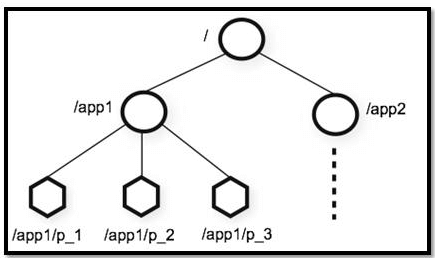
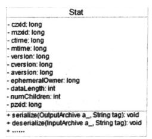
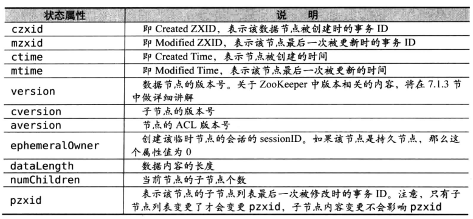
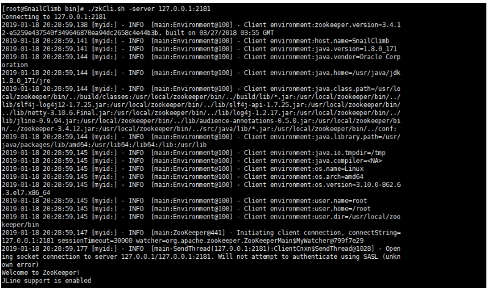
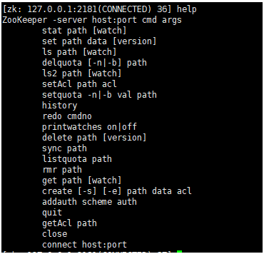

# ZooKeeper数据模型和常见命令

<!-- MarkdownTOC -->

- [ZooKeeper 数据模型](#zookeeper-数据模型)
- [ZNode\(数据节点\)的结构](#znode数据节点的结构)
- [测试 ZooKeeper 中的常见操作](#测试-zookeeper-中的常见操作)
  - [连接 ZooKeeper 服务](#连接-zookeeper-服务)
  - [查看常用命令\(help 命令\)](#查看常用命令help-命令)
  - [创建节点\(create 命令\)](#创建节点create-命令)
  - [更新节点数据内容\(set 命令\)](#更新节点数据内容set-命令)
  - [获取节点的数据\(get 命令\)](#获取节点的数据get-命令)
  - [查看某个目录下的子节点\(ls 命令\)](#查看某个目录下的子节点ls-命令)
  - [查看节点状态\(stat 命令\)](#查看节点状态stat-命令)
  - [查看节点信息和状态\(ls2 命令\)](#查看节点信息和状态ls2-命令)
  - [删除节点\(delete 命令\)](#删除节点delete-命令)
- [参考](#参考)

<!-- /MarkdownTOC -->

> 看本文之前如果你没有安装 ZooKeeper 的话，可以参考这篇文章：[《使用 SpringBoot+Dubbo 搭建一个简单分布式服务》](https://github.com/Snailclimb/springboot-integration-examples/blob/master/md/springboot-dubbo.md) 的 “开始实战 1 ：zookeeper 环境安装搭建” 这部分进行安装（Centos7.4 环境下）。如果你想对 ZooKeeper 有一个整体了解的话，可以参考这篇文章：[《可能是把 ZooKeeper 概念讲的最清楚的一篇文章》](https://github.com/Snailclimb/JavaGuide/blob/master/%E4%B8%BB%E6%B5%81%E6%A1%86%E6%9E%B6/ZooKeeper.md)

### ZooKeeper 数据模型

ZNode（数据节点）是 ZooKeeper 中数据的最小单元，每个ZNode上都可以保存数据，同时还是可以有子节点（这就像树结构一样，如下图所示）。可以看出，节点路径标识方式和Unix文件
系统路径非常相似，都是由一系列使用斜杠"/"进行分割的路径表示，开发人员可以向这个节点中写人数据，也可以在节点下面创建子节点。这些操作我们后面都会介绍到。


提到 ZooKeeper 数据模型，还有一个不得不得提的东西就是 **事务 ID** 。事务的ACID（Atomic：原子性；Consistency:一致性；Isolation：隔离性；Durability：持久性）四大特性我在这里就不多说了，相信大家也已经挺腻了。

在Zookeeper中，事务是指能够改变 ZooKeeper 服务器状态的操作，我们也称之为事务操作或更新操作，一般包括数据节点创建与删除、数据节点内容更新和客户端会话创建与失效等操作。对于每一个事务请求，**ZooKeeper 都会为其分配一个全局唯一的事务ID,用 ZXID 来表示**，通常是一个64位的数字。每一个ZXID对应一次更新操作，**从这些 ZXID 中可以间接地识别出Zookeeper处理这些更新操作请求的全局顺序**。


### ZNode(数据节点)的结构

每个 ZNode 由2部分组成:

- stat：状态信息
- data：数据内容

如下所示，我通过 get 命令来获取 根目录下的 dubbo 节点的内容。（get 命令在下面会介绍到）

```shell
[zk: 127.0.0.1:2181(CONNECTED) 6] get /dubbo    
# 该数据节点关联的数据内容为空
null
# 下面是该数据节点的一些状态信息，其实就是 Stat 对象的格式化输出
cZxid = 0x2
ctime = Tue Nov 27 11:05:34 CST 2018
mZxid = 0x2
mtime = Tue Nov 27 11:05:34 CST 2018
pZxid = 0x3
cversion = 1
dataVersion = 0
aclVersion = 0
ephemeralOwner = 0x0
dataLength = 0
numChildren = 1

```
这些状态信息其实就是 Stat 对象的格式化输出。Stat 类中包含了一个数据节点的所有状态信息的字段，包括事务ID、版本信息和子节点个数等，如下图所示（图源：《从Paxos到Zookeeper  分布式一致性原理与实践》，下面会介绍通过 stat 命令查看数据节点的状态）。

**Stat 类：**



关于数据节点的状态信息说明（也就是对Stat 类中的各字段进行说明），可以参考下图（图源：《从Paxos到Zookeeper  分布式一致性原理与实践》）。



### 测试 ZooKeeper 中的常见操作


#### 连接 ZooKeeper 服务

进入安装 ZooKeeper文件夹的 bin 目录下执行下面的命令连接 ZooKeeper 服务（Linux环境下）（连接之前首选要确定你的 ZooKeeper 服务已经启动成功）。

```shell
./zkCli.sh -server 127.0.0.1:2181
```


从上图可以看出控制台打印出了很多信息，包括我们的主机名称、JDK 版本、操作系统等等。如果你成功看到这些信息，说明你成功连接到  ZooKeeper 服务。

#### 查看常用命令(help 命令)

help 命令查看 zookeeper 常用命令



####  创建节点(create 命令)

通过 create 命令在根目录创建了node1节点，与它关联的字符串是"node1"

```shell
[zk: 127.0.0.1:2181(CONNECTED) 34] create /node1 “node1”
```
通过 create 命令在根目录创建了node1节点，与它关联的内容是数字 123

```shell
[zk: 127.0.0.1:2181(CONNECTED) 1] create /node1/node1.1 123
Created /node1/node1.1
```

#### 更新节点数据内容(set 命令)

```shell
[zk: 127.0.0.1:2181(CONNECTED) 11] set /node1 "set node1" 
```

#### 获取节点的数据(get 命令)

get 命令可以获取指定节点的数据内容和节点的状态,可以看出我们通过set 命令已经将节点数据内容改为 "set node1"。

```shell
set node1
cZxid = 0x47
ctime = Sun Jan 20 10:22:59 CST 2019
mZxid = 0x4b
mtime = Sun Jan 20 10:41:10 CST 2019
pZxid = 0x4a
cversion = 1
dataVersion = 1
aclVersion = 0
ephemeralOwner = 0x0
dataLength = 9
numChildren = 1

```

#### 查看某个目录下的子节点(ls 命令)

通过 ls 命令查看根目录下的节点

```shell
[zk: 127.0.0.1:2181(CONNECTED) 37] ls /
[dubbo, zookeeper, node1]
```
通过 ls 命令查看 node1 目录下的节点

```shell
[zk: 127.0.0.1:2181(CONNECTED) 5] ls /node1
[node1.1]
```
zookeeper 中的 ls 命令和 linux 命令中的 ls 类似， 这个命令将列出绝对路径path下的所有子节点信息（列出1级，并不递归）

#### 查看节点状态(stat 命令)

通过 stat 命令查看节点状态

```shell
[zk: 127.0.0.1:2181(CONNECTED) 10] stat /node1
cZxid = 0x47
ctime = Sun Jan 20 10:22:59 CST 2019
mZxid = 0x47
mtime = Sun Jan 20 10:22:59 CST 2019
pZxid = 0x4a
cversion = 1
dataVersion = 0
aclVersion = 0
ephemeralOwner = 0x0
dataLength = 11
numChildren = 1
```
上面显示的一些信息比如cversion、aclVersion、numChildren等等，我在上面 “ZNode(数据节点)的结构” 这部分已经介绍到。

#### 查看节点信息和状态(ls2 命令)


ls2 命令更像是 ls 命令和 stat 命令的结合。ls2 命令返回的信息包括2部分：子节点列表 + 当前节点的stat信息。

```shell
[zk: 127.0.0.1:2181(CONNECTED) 7] ls2 /node1
[node1.1]
cZxid = 0x47
ctime = Sun Jan 20 10:22:59 CST 2019
mZxid = 0x47
mtime = Sun Jan 20 10:22:59 CST 2019
pZxid = 0x4a
cversion = 1
dataVersion = 0
aclVersion = 0
ephemeralOwner = 0x0
dataLength = 11
numChildren = 1

```

#### 删除节点(delete 命令)

这个命令很简单，但是需要注意的一点是如果你要删除某一个节点，那么这个节点必须无子节点才行。

```shell
[zk: 127.0.0.1:2181(CONNECTED) 3] delete /node1/node1.1
```

在后面我会介绍到 Java 客户端 API的使用以及开源 Zookeeper 客户端 ZkClient 和 Curator 的使用。


### 参考

- 《从Paxos到Zookeeper  分布式一致性原理与实践》

