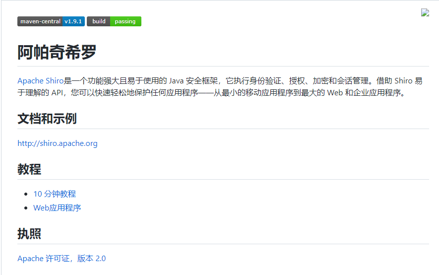
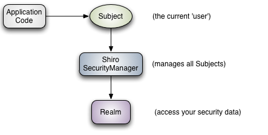
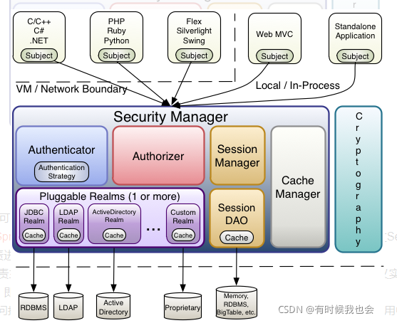

# 2.shiro框架动手实战-框架概述

​	作为一个技术同学如果想了解某个框架，那毫无疑问第一时间肯定是进入他的一个github地址看一下他的一个redmi介绍

​	github.com/apache/shiro

​	官网是shiro.apache.org

#### Shiro主要功能

​	Authentication：身份认证/登录，即验证用户是否是所声明用户

​	Authorization：授权验证，验证用户是否拥有某个权限，即能否去对具体资源进行某种操作。

​	Session Management：会话管理，用户信息保存在会话中。

​	Cryptography：加密，保护数据的安全性。

#### Shiro的扩展功能

​	Web Support ：shiro可以非常容易集成到web环境

​	Cacheing：缓存，避免每次查询DB，提高程序运行效率

​	Concurrency：多线程并发验证，在一个线程中开启另一个线程，能把权限自动传播过去

​	Testing：很方便的进行测试验证

​	Run AS允许一个用户假装成另外一个用户身份来进行操作

​	Remember Me：记住我

#### Shiro工作流程

​		应用代码会直接对应 Subject，所以说Shiro对外的核心是Subject

​		Subject：主体，与应用正在交互任何东西，这个主体不仅仅是人，也可以是与应用交互的网络爬虫或机器人等等

​		所有的Subject都会绑定在Shiro SecurityManager，Subject的所有交互都会委托给SecurityManager

​		可以说Subject是Shiro的一个基本概念，应用程序的第一步是和Subject打交道，但是SecurityManager才是一个实际的执行者。

​	SecurityManager：所有与安全有关的操作都会与其交互，是Shiro的核心，他管理所有的Subject

​	Realm：可以认为是安全信息的桥梁DAO，框架通过其来获取安全相关数据，比如从Realm获取相应的用户来进行比较确定当前用户身份是否合法，以及从realm中获得权限来验证这个用户是否能进行操作，简单的说它就是一个安全的数据源

#### Shiro架构模块

​		我们从内部看一下Shiro的架构图

SessionDAO：用于session的crud，可以自定义session的存放位置

CacheManager：缓存控制器，可以自定义具体缓存实现方式

​	我们可以看到个细节就是Realm可能会有多个

