# 1.session原理分析-subject原理介绍

​			我们在了解session原理之前，先了解一下subject的原理。

​			subject是shiro框架的一个核心对象，基本上外界与框架上的交互，如身份验证，授权，登录都是通过subject api来完成的

​	我们看一下subject的源码：

​		subject上的注释说了，这个是shiro的核心类定义了很多的操作

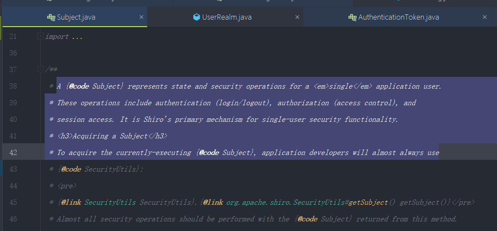

​	我们看一下方法：

​		里面有一个Builder内部类，我们看一下这个内部类中的内容

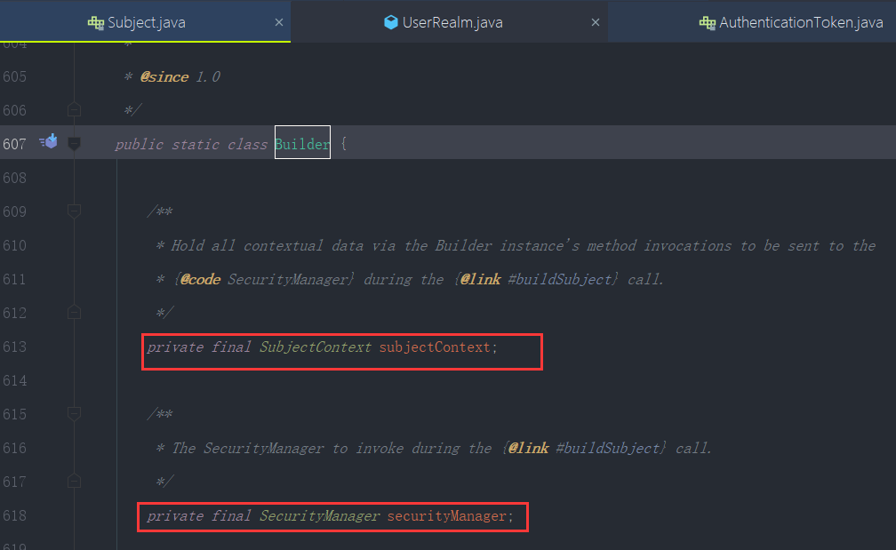

​	先看一下SubjectContext，键入进源码中，看一下注释写的是什么

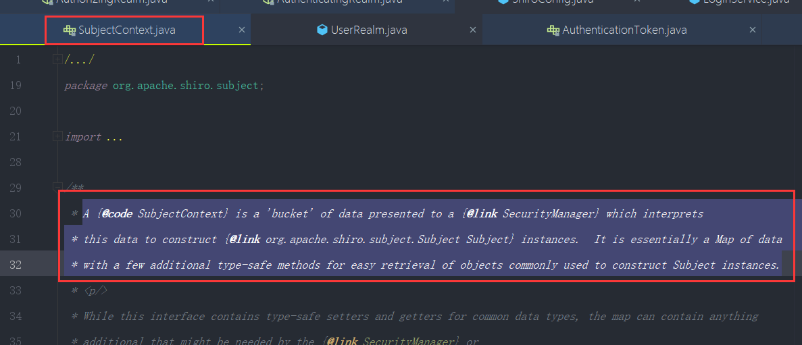

​	注释的内容是：SubjectContext是个传递给SecurityManager的bucket 用于构造subject实例

​	它继承Map对象，也就是说他上下文是以key，value的方式存储的

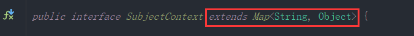

​	idea F4呼出层级关系看---subjectContext一共有2个实现

​	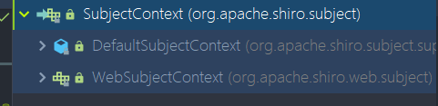

​	我们先看defaultSubjectContext

​	他有很多字符串，我们看到这些字符串可能觉得有点莫名其妙

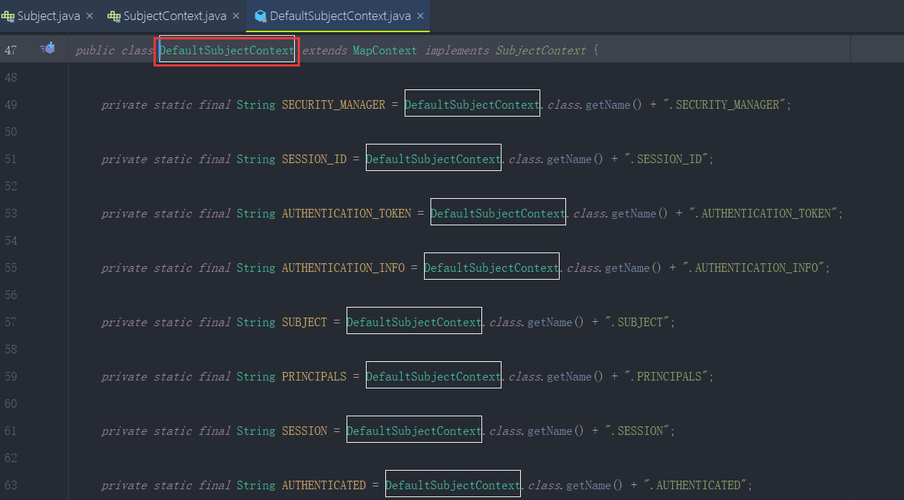

​	我们刚才提到因为SubjectContext是一个Map方式存储，所以这些字符串都是用于做Map的key值的

比如我们看一个 SECURITY_MANAGER 看他的用途，Idea ctrl+左键

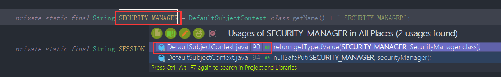

​	

可以看到他是用在getSecurityManager和setSecurityManager上的，使用map这个key值

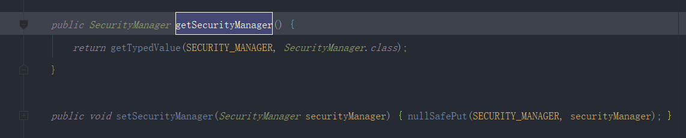

​	比如我们看一下这个nullSafePut其实就是判断一下value非空把值放进去

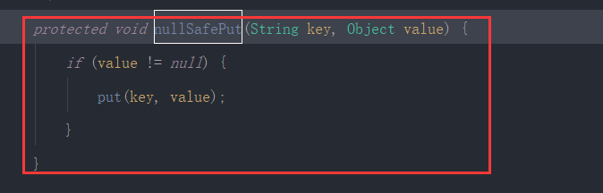

​	getTypedValue方法中，通过key获取他需要的返回对象，否则就报错

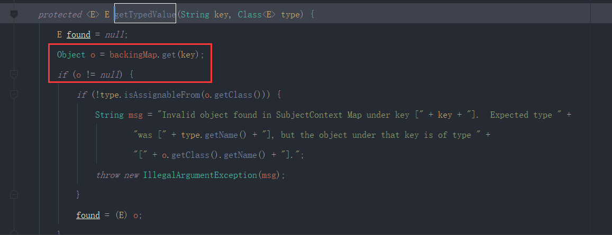

​	这俩个都是他的一个小的方法

​	我们看一下SubjectContext另外的一个实现WebSubjectContext

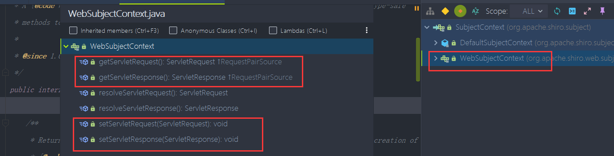

​	可以看到关于get和set的servlet的方法这些其实就是web环境的出入参

​	他的实现是DefaultWebSubjectContext，里面其实就是在刚刚DefaultSubjectContext基础上设置了2个web属性的key值

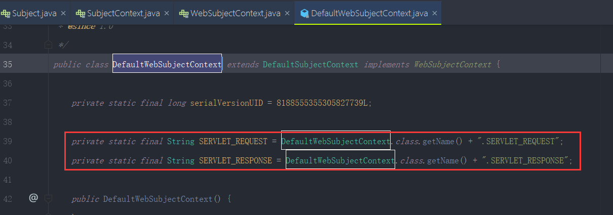

​	我们回到Subject类中

​		他的这个Builder()其实就是在调用它的构造方法，传入SecurityManager，然后new一个SubjectContext

​	给SubjectContext设置SecurityManager

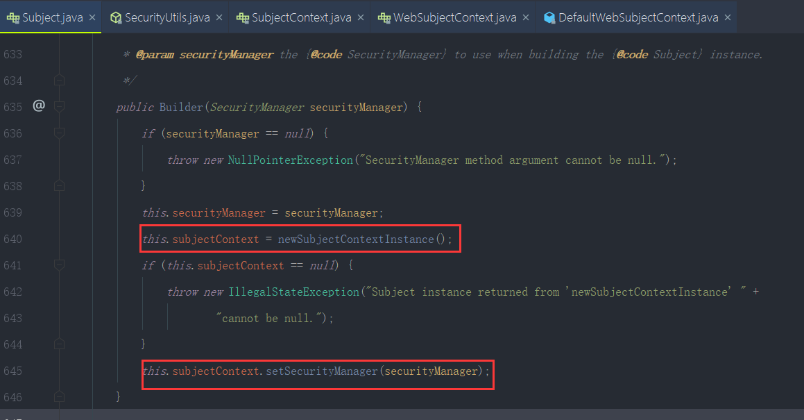

​	这样就完成了一个SubjectContext的构建

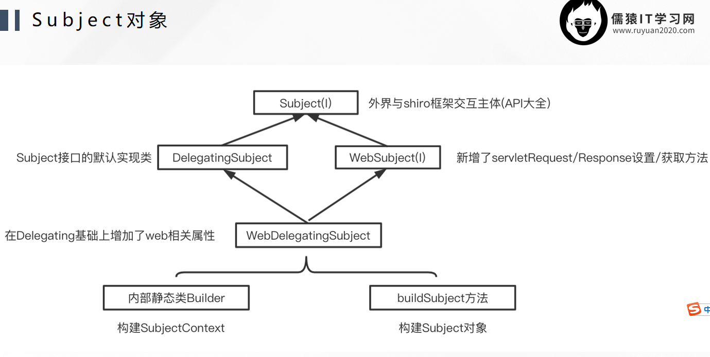

​	用于构建Subject对象的SubjectContext

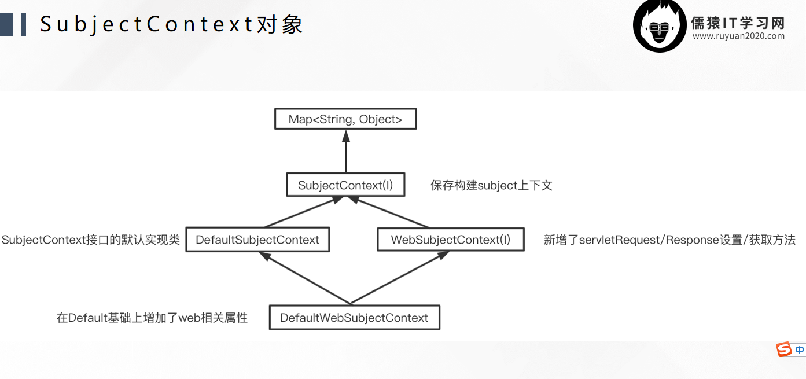

​	保存和创建的组件 结构：

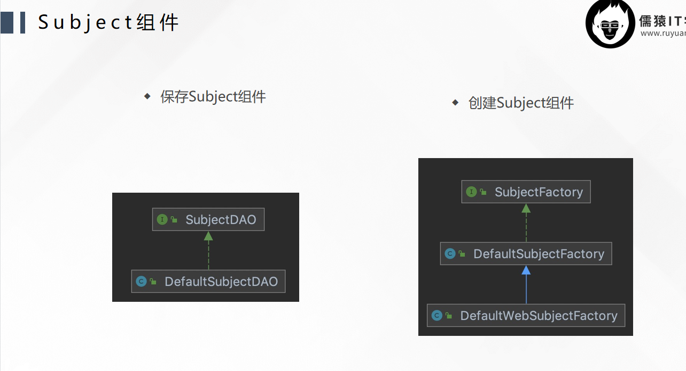

​	Subject创建流程流转：

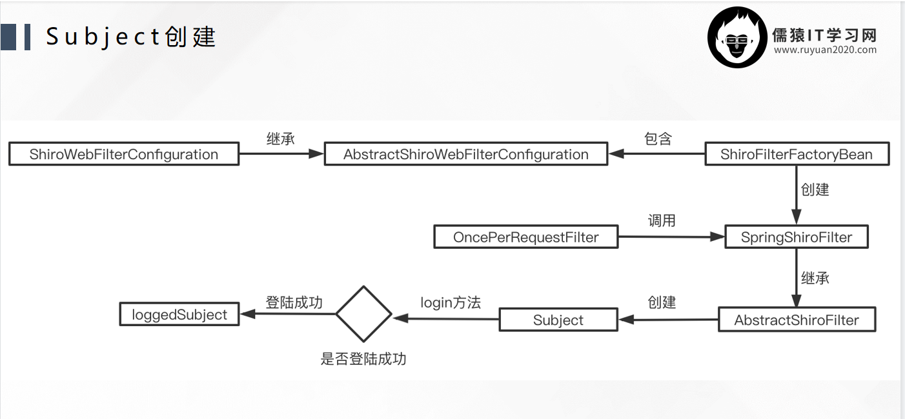

​	第39节完

