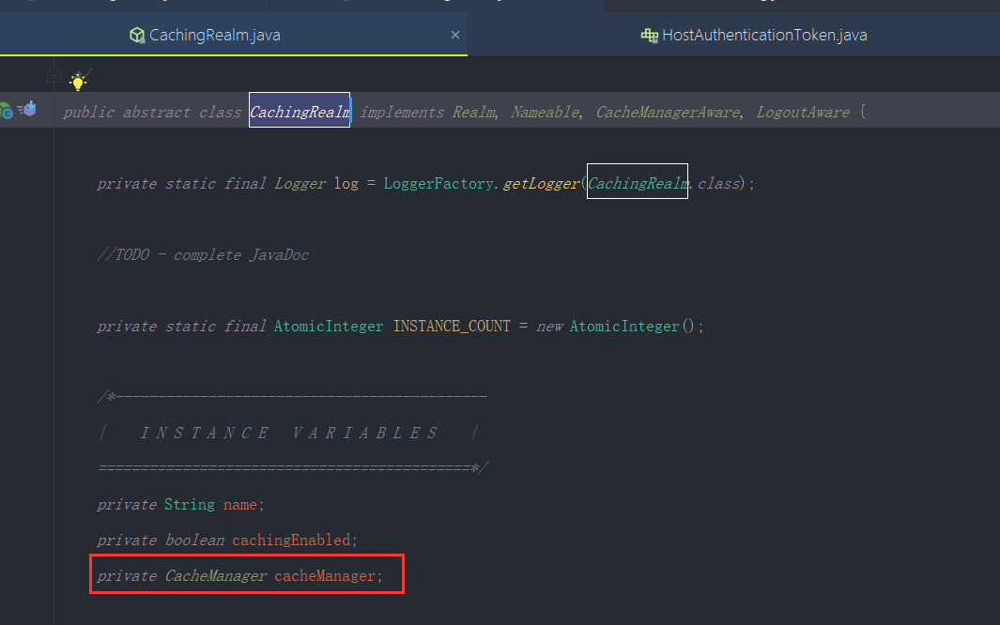

# 1.源码阅读思路


#### 1、源码类图

​	看法：在源码类图中，有实线和虚线，其中实线代表的是继承的关系，虚线代表的是实现的关系

​		类图中标有I的都是接口，标有C的都是class类


​	我们阅读的时候是从类图的最顶层往下看，按照顶层设计逐步实现方式来阅读这个源代码。

​	我们看到有类图中有很多接口其中大部分是声明类的接口及具备声明功能，以及告诉框架我需要什么


​	如果从第一层看，核心的就是realm接口，其实一般有源码阅读经验的都知道，一般一个框架的顶层都是一些接口，这就跟我们平时做一些大型项目的时候一样，各个域之间首先第一件事情是先确定好资源API，这个也称为协议，协议一般定好之后一般架构师会review一下，看这个API定的是否的合理，入参和出参是否通俗易懂，个域之间交互是否清晰，以及参数其他域是否认可。人家需要什么借口我们就设计什么接口，这样的话代码的符合程度会极快，良好的协议API设计永远是第一步。


​		那阅读一个类的源码，如果是第一次接触，完全不了解的同学可以针对这些注释看一遍，这些注释就是给想看源码的同学说明的。


​	第一段注释--说明Realm是一个安全组件，能够访问特点数据实体，如用户，角色和权限等等

​	第二段说明--Realm一般是于一个数据源数据是一对一的，例如，关系型数据库，文件系统 or。。。后面的我们就不阅读了，

​	

​		通过这种阅读源代码的方式，可以告诉大家当我们接触到一个陌生的类的时候，不妨先去看看注释说明

​	看完注释之后，我们看看这个接口定义了哪些方法


#### 2、查看接口定义的方法

​		String getName(); 从注释中可以看出，这个是获取 我这个Realm的名称的


​		boolean supports(AuthenticationToken token);

​				入参是Token，这个方法其实就是先判断身份是否合法，然后再去认证是否有权限

​		

​		AuthenticationInfo getAuthenticationInfo(AuthenticationToken token) throws AuthenticationException;

​		这个方法是通过token的信息，来获取对应账户的信息，这一步还没有验证成功，只是先拿到系统内的账户信息，然后再和你提交的信息做一个比较


​		我们看一下AuthenticationToken 这个类

​		他也是一个接口，我们看一下他的注释说明


​	AuthenticationToken是用户在身份验证期间提交用于尝试认证账户的密码集合

​	这个接口定义了2个方法：

​	Object getPrincipal(); 返回用户提交的账户名


​	Object getCredentials(); 返回用户提交的密码


我们查看一下这个接口的层级关系F4呼出层级关系


​	然后我们展开，查看一下实现的类


```
HostAuthenticationToken接口中有一个host方法，是返回客户端的一个地址

RememberMeAuthenticationToken接口有isRememberMe方法，这个是用户在登录的时候是否选择了记住我

	他们的共同实现是UsernamePasswordToken这个类

```


#### 3、我们看一下实现类UsernamePasswordToken


​	我们主要看一下这个类的实现


​		他是返回了一个用户名


```
getCredentials 返回的是密码
```


PPT总结


	#### 3、我们来看类图的第二层

​		CachingRealm


​	

​	我们来看一下这个类，通过这个类的名称我们可以看出应该是做缓存功能的

​	我们看一下第一段话的描述


​	这个描述可以看出他是在接口之上提供了缓存的支撑，既然提供了缓存的功能这里面就会出现一个CacheManager属性，这个属性是对缓存进行管理的



​		cachingEnable是缓存的开关

后续我们对缓存进行分析讲解的时候再来分析这个类

CachingRealm添加了缓存功能，防止频繁的访问数据源

```
getAvailablePrincipal：关键的方法--这个方法比较重要，获取有效凭证账户

首先获取该Realm对应的账户凭证没有的话默认取第一个
```


​	我们继续往下看第三层AuthenticatingRealm


​	看注释我们了解到这个类 支持身份认证的操作


​		


