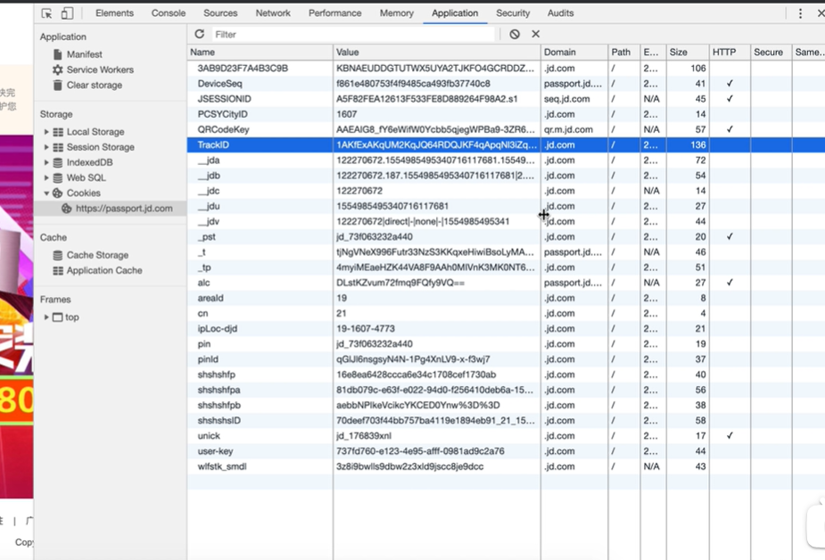
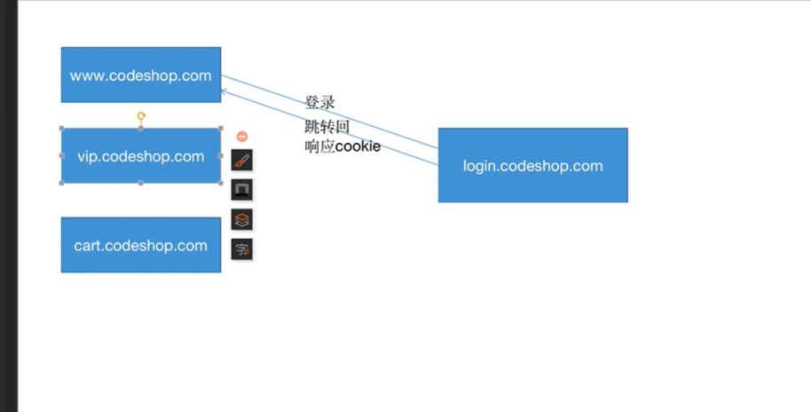
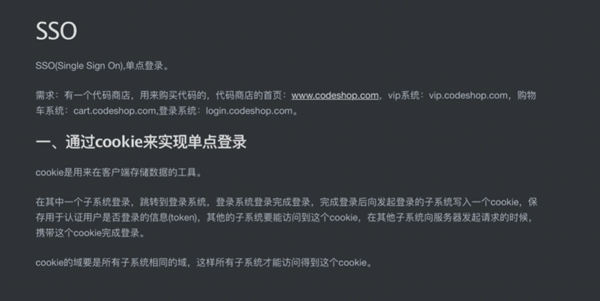

# 1、单点登录介绍

​	什么是单点登录？

​		例如--京东，不同的域名 我们在一个地方登录 其他几个地方也都登录了

​	我们在登录的时候--无论在哪个系统，登录的时候发现都是同一个登录的地址，这个登录的系统是专门用于登录的。。

### 1、通过cookie实现单点登录

​		实现单点登录的方式有很多，我们先了解一下使用cookie的实现原理

​	cookie能被带到服务器他们的域必须相同，如果是子系统必须是有相同的域才可以把cookie的数据带到服务器。

​		所以说在登录过后，向子系统写入cookie的时候，他们的域应该是他们的主域名，因为主域名都是相同的嘛，那么每一个子系统再去请求服务器的时候，就可以把这个域所在的cookie给携带过去，然后服务器就可以拿到这个cookie，去验证他是否已经登录了。这样就可以实现单点登录了。

​	这个图就是 客户端发起登录请求，服务端验证后响应给客户端并给客户端携带cookie

https://www.bilibili.com/video/BV1Gb411T7uq/?p=3&spm_id_from=pageDriver&vd_source=243ad3a9b323313aa1441e5dd414a4ef

​	

