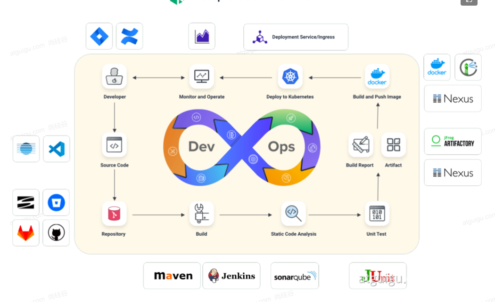
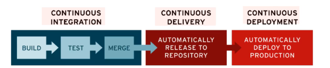
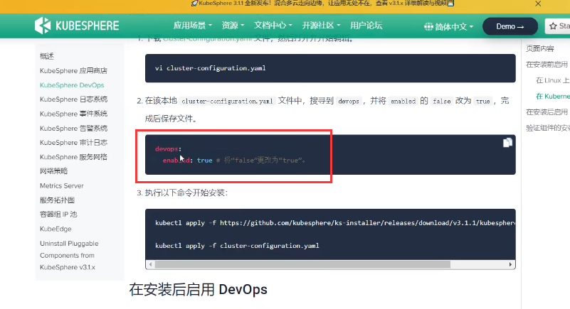

# 1.什么是devops及devops基础

​	什么是devops，其实是分为dev--开发者和ops--运维人员

# 1、DevOps简介

DevOps **是一系列做法和工具**，可以使 IT 和软件开发团队之间的**流程实现自动化**。其中，随着敏捷软件开发日趋流行，**持续集成 (CI)** 和**持续交付 (CD)** 已经成为该领域一个理想的解决方案。在 CI/CD 工作流中，每次集成都通过自动化构建来验证，包括编码、发布和测试，从而帮助开发者提前发现集成错误，团队也可以快速、安全、可靠地将内部软件交付到生产环境。

​	这个图特别重要，这个才是持续集成发布的闭环过程

 

​	continuous interfration 是持续集成阶段

​			build构建，test测试，merge合并到代码库中，这些过程应该是一个持续化的自动化的过程

​	continuous delivery 持续交付

​			automatically release 制品自动发布镜像到仓库

​	continuous deployment 持续部署

​			automatically deploy 自动化部署到 production生产

​			

#### Devops的落地

# 2、DevOps落地

https://kubesphere.com.cn/docs/devops-user-guide/understand-and-manage-devops-projects/overview/

## 1、内置的Agent

https://kubesphere.com.cn/docs/devops-user-guide/how-to-use/choose-jenkins-agent/

注意安装kubersphere需要开启devops

