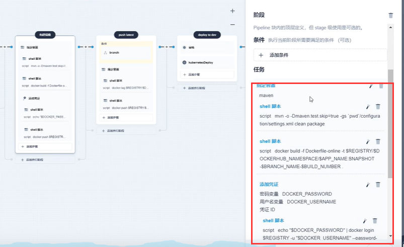
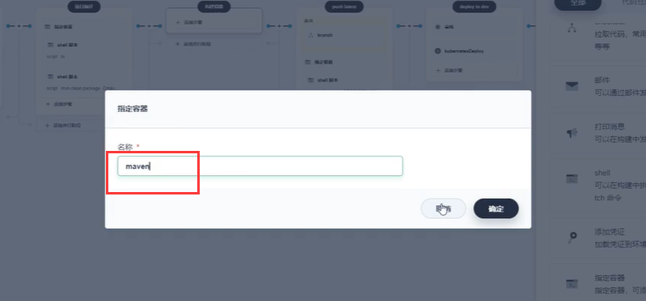
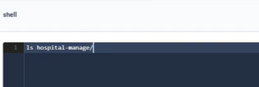
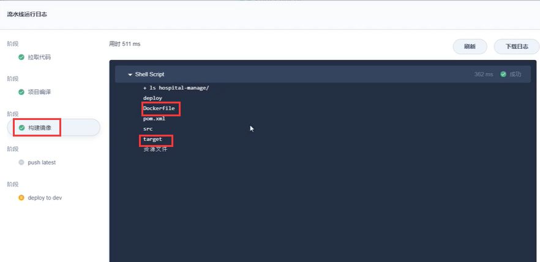
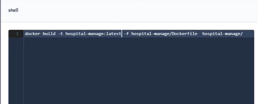
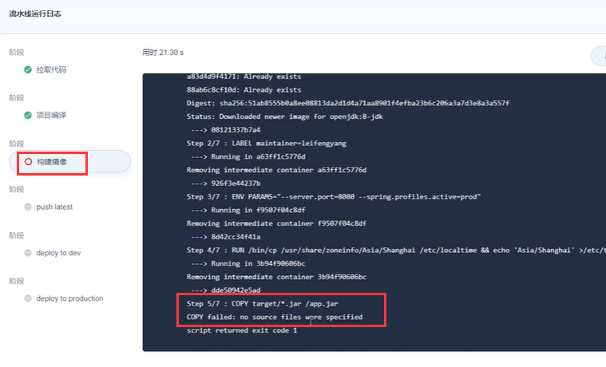
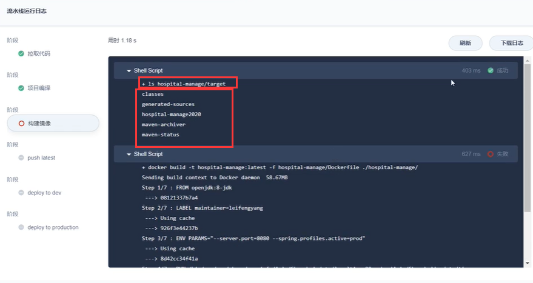
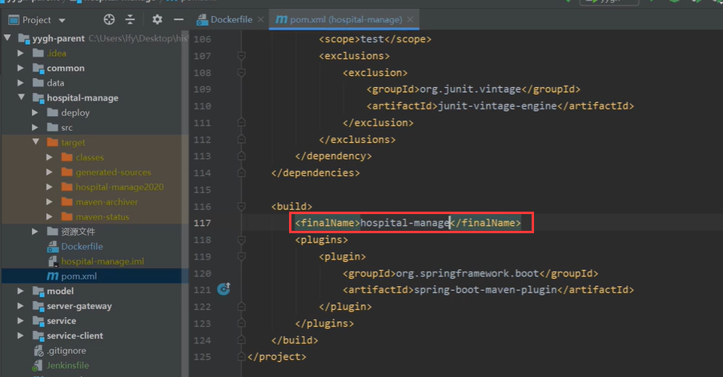
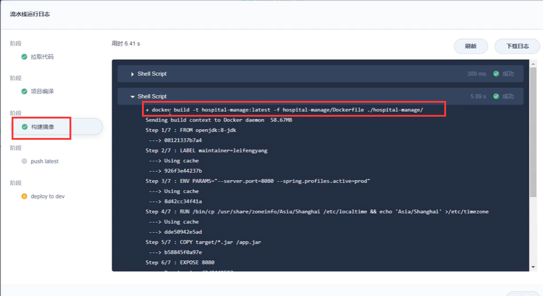

# 10.devops-可视化Pipeline-第三步-构建镜像-基本设置

​	我们现在进行第三步--构建镜像

​	我们还是在kubesphere中编辑构建流水线

​	这里有一些默认构建----我们先参考一下

我们先指定容器--因为我们要打包镜像，所以只要这个容器可以运行docker命令就可以

#### 1.第一步

​		第一步我们先啥也不做验证一下，添加shell脚本sh

​	我们运行一下先看看--没问题有target目录说明编译过

#### 第二步：

我们确认没有问题后，然后删除此步骤，添加shell步骤

​	使用docker命令构建镜像

​	然后我们运行流水线测试----我们发现在构建镜像时第五个步骤的时候发生错误了

​		原因了 没有找到target这个路径

​	我们添加查看 ls  /his-manager的shell脚本，运行流水线测试，发现确实没有target

​	那就说明我们的打包命令有问题

​	我们检查后发现 构建的pom中finalName配置有问题，我们修改为正确的项目名称

​	我们提交代码--然后重新构建一下

我们现在可以看到构建这个镜像成功了

https://www.bilibili.com/video/BV13Q4y1C7hS?p=115&vd_source=243ad3a9b323313aa1441e5dd414a4ef

