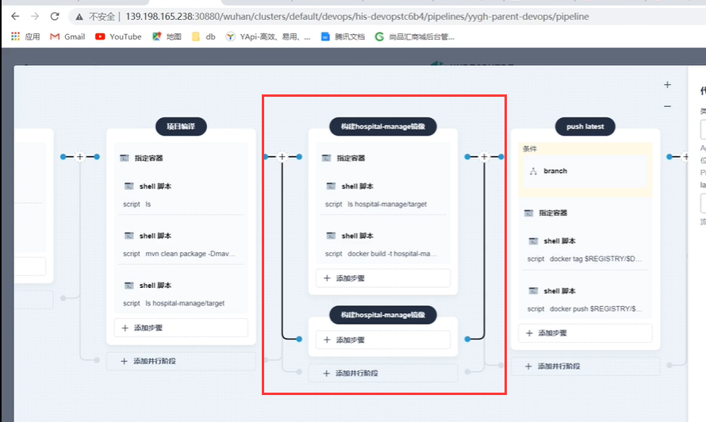
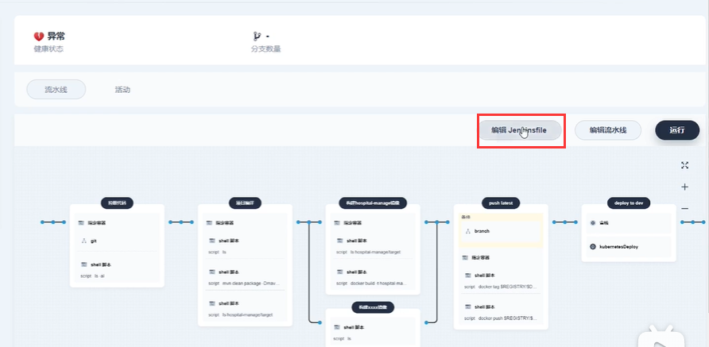
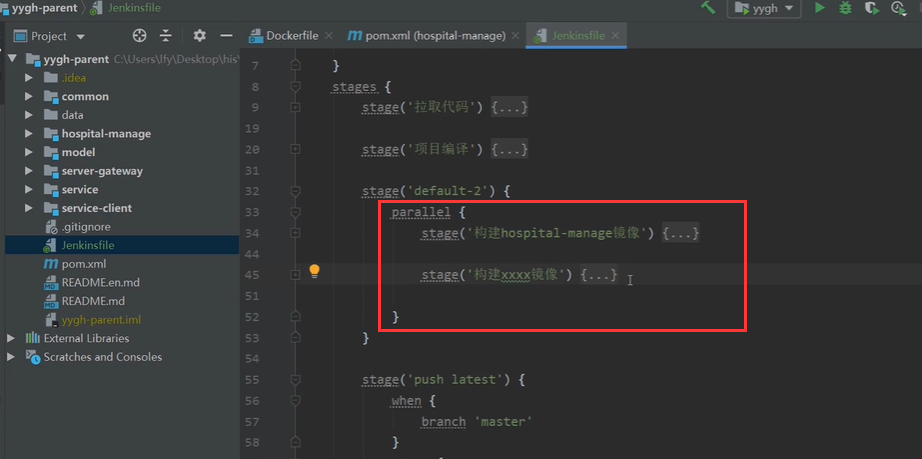
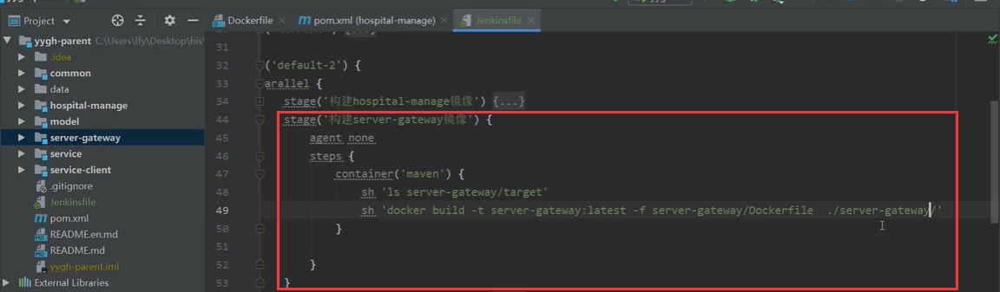
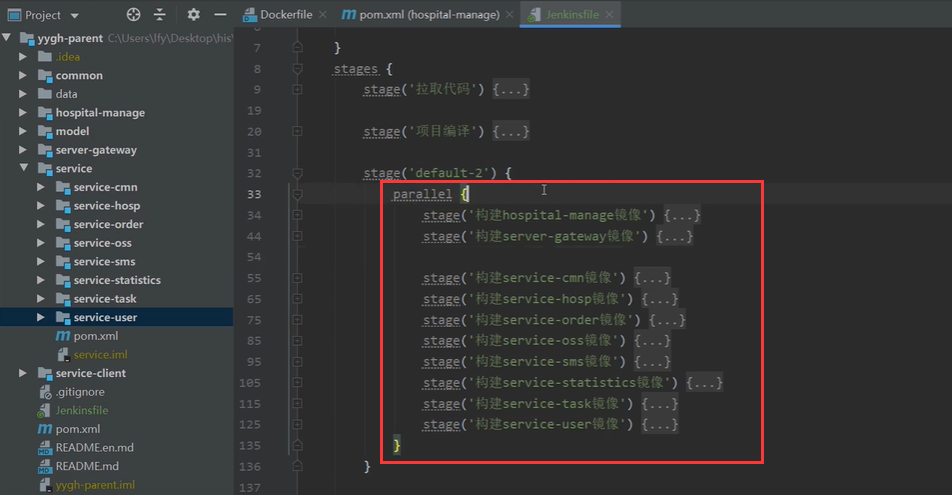
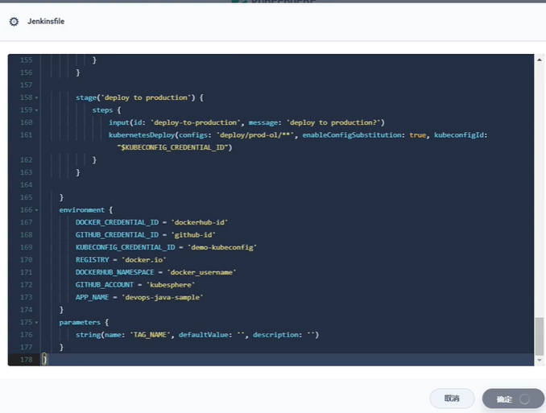
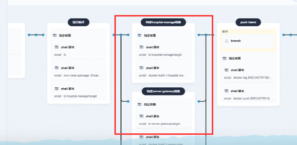
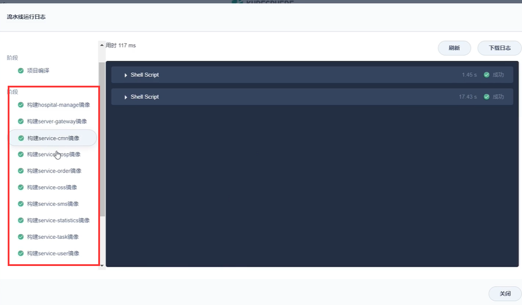

# 11.devops-可视化Pipeline-第三步-构建镜像-并发构建

​		我们细化第三步构建--还是编辑流水线

​	因为每个微服务的构建都是和之前构建基本一致，那么我们就添加并行阶段

​	并发构建--我们也可以在可视化界面操作，也可以使用编辑Jenkinsfile文件

​	我们编辑jenkinsfile然后放到我们本地进行编辑

​	我们在本地可以看到 parallel这里就是并发构建

比如我们构建servergetway

其余的微服务都这么去改----注意微服务路径问题

现在我们把微服务的流水线弄好后，复制到kubesphere的流水线中

我们就会看到很多的微服务并发构建过程

测试流水线---全部构建成功

https://www.bilibili.com/video/BV13Q4y1C7hS?p=116&spm_id_from=pageDriver&vd_source=243ad3a9b323313aa1441e5dd414a4ef

