# 12.devops-可视化Pipeline-第四步-推送镜像-基础操作

​		我们上一步是并发构建了每个微服务的镜像

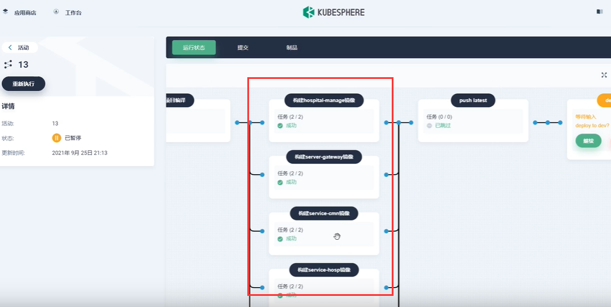

​	我们构建好的镜像--目前只是存在于我们集群中的某一台机器里面，而我们之后k8s部署这些微服务，需要把这些镜像拿来，所以我们需要把这些镜像统一推送到镜像仓库，然后k8s部署的时候从镜像仓库下载就可以了

接下来我们进入到流水线的第四步---推送镜像

​	我们以推送到阿里云镜像仓库为例

​	我们先在阿里云创建一个空间

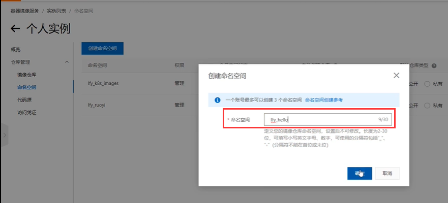

我们使用整理好了命令---使用变量的方式

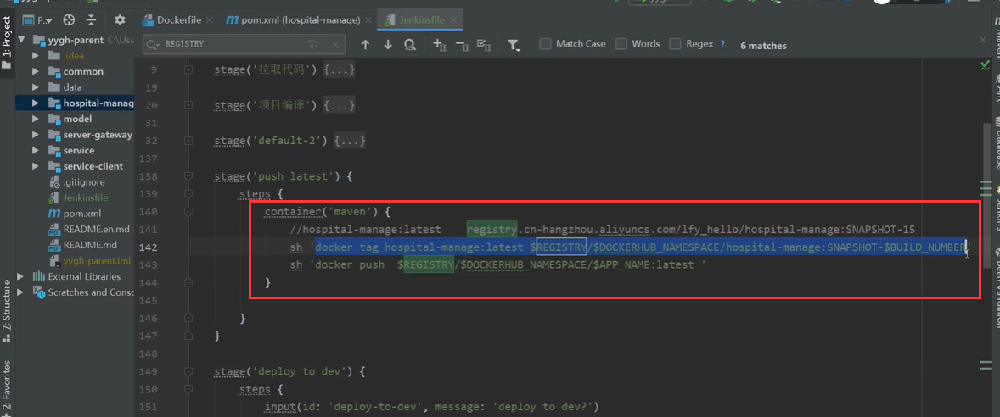

我们配置shell脚本

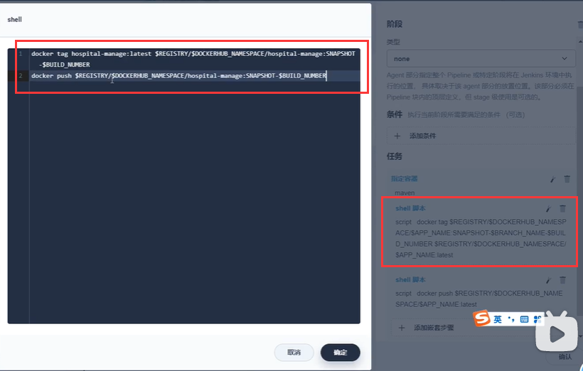

我们想一下在推送前得登录仓库，如何登录仓库呢？

​	添加凭证

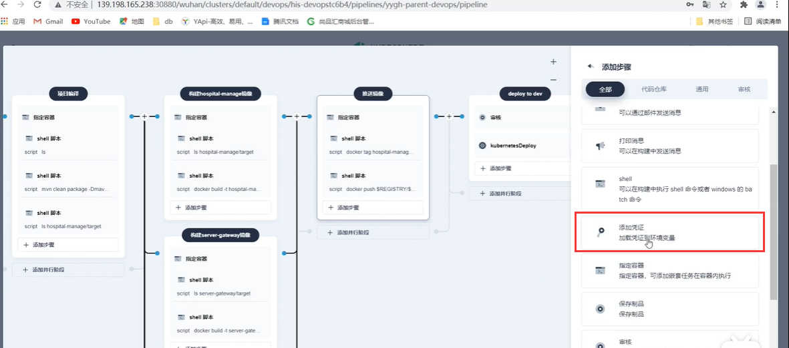

​	添加阿里云的镜像仓库凭证

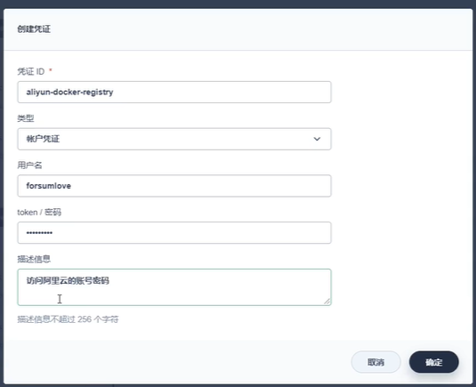

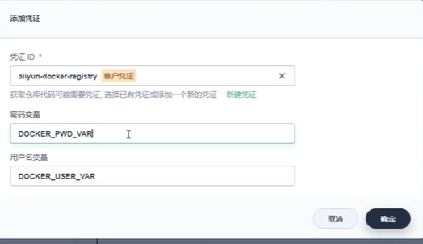

​	添加好凭证后，会产生变量，然后我们登录仓库，进行打包，然后进行推送

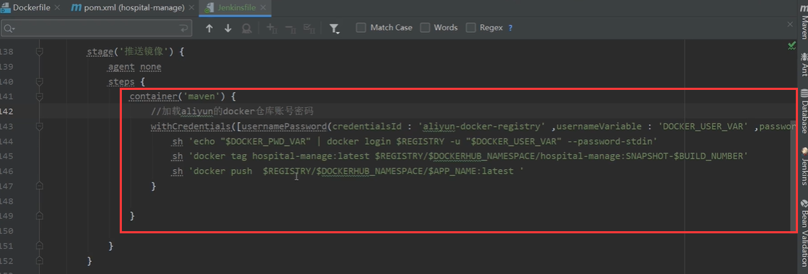

推送这个：

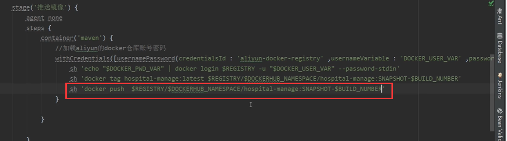

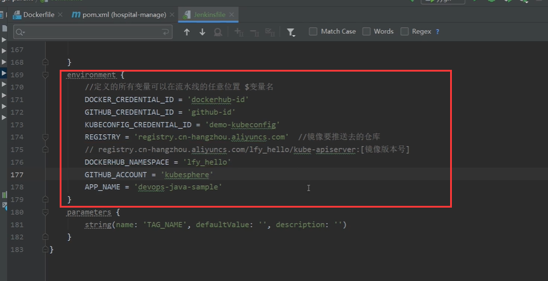

我们copy到可视化界面中的jenkinsfile

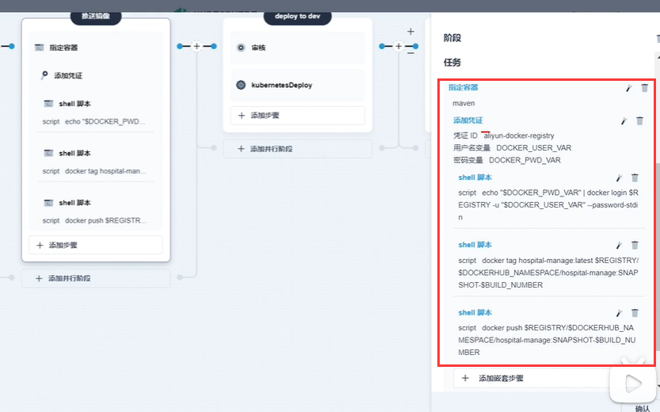

运行流水线进行测试--查看是否可以推送成功

​	镜像推送成功

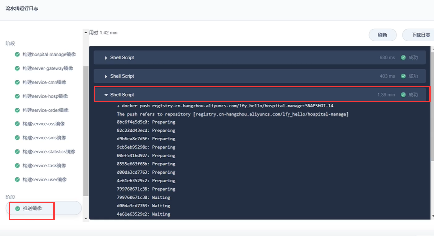

我们到阿里云里面看一下--可以看到是有镜像的

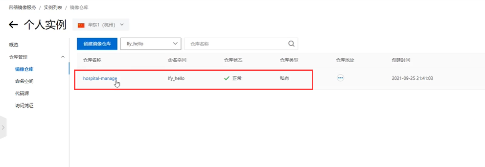

https://www.bilibili.com/video/BV13Q4y1C7hS?p=117&spm_id_from=pageDriver&vd_source=243ad3a9b323313aa1441e5dd414a4ef

​		