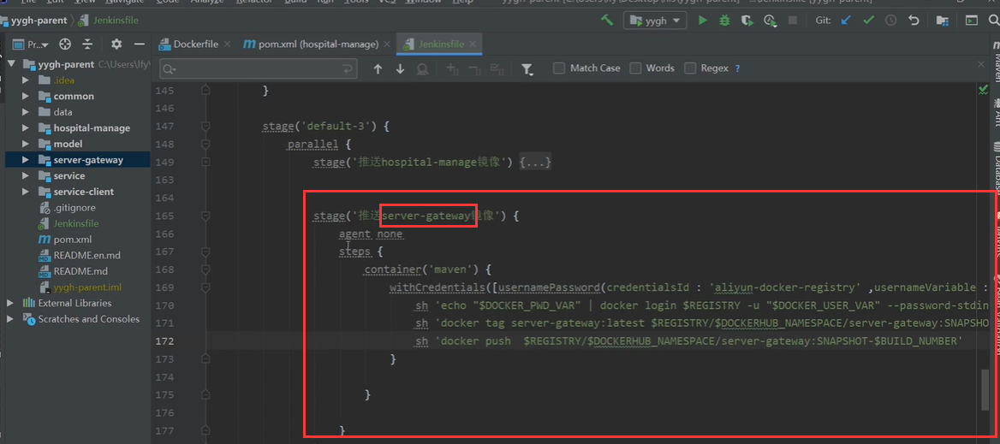
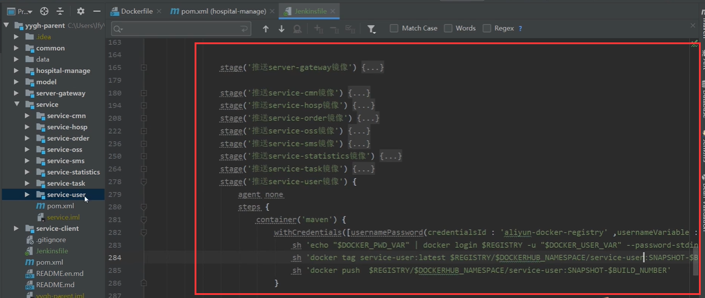
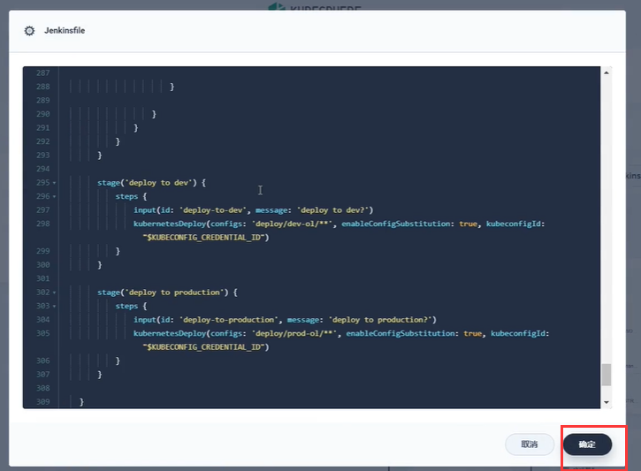
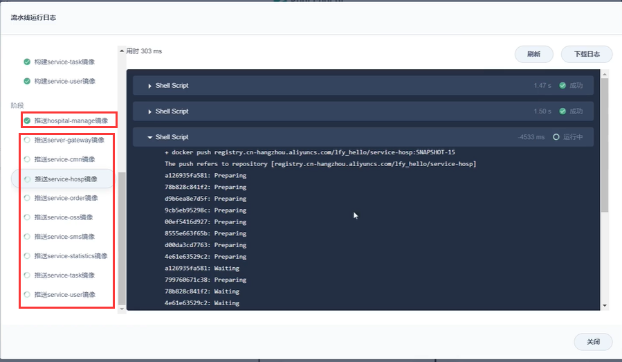
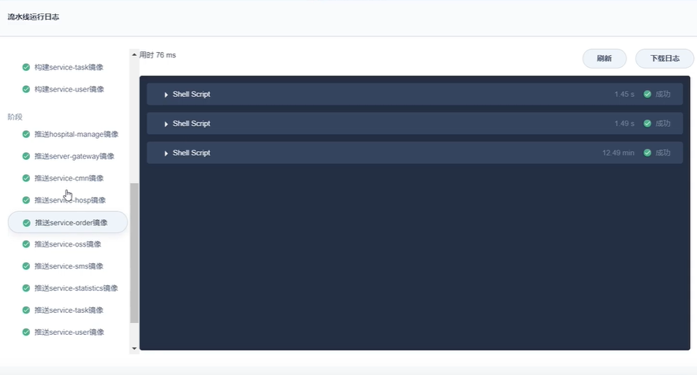
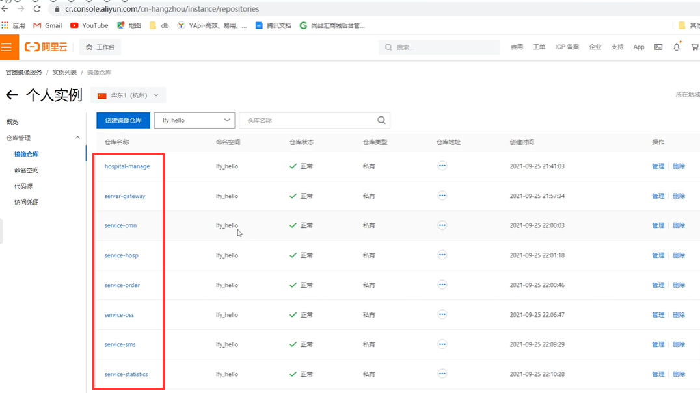

# 13.devops-可视化Pipeline-第四步-推送镜像-并发推送完成

​	我们推送镜像，之前是推送了一个镜像，那么很多微服务的镜像都需要推送，我们就在kubesphere的流水线中添加推送镜像的并行步骤。

​	我们在编辑器中速度更快一些

​	其他微服务也都是一样，进行修改名称就可以了

​	镜像的推送写好

​	将写好的jenkinsfile文件copy到可视化界面中

​	点击运行---测试，流水线----镜像推送可能有点慢

​	大约30分钟左右，镜像全部推送成功了

我们看一下阿里云仓库的镜像

https://www.bilibili.com/video/BV13Q4y1C7hS?p=118&spm_id_from=pageDriver&vd_source=243ad3a9b323313aa1441e5dd414a4ef

