# 14.devops-可视化Pipeline-第五步-部署到dev环境

​		我们现在进入到流水线的第五步--我们添加部署到dev环境

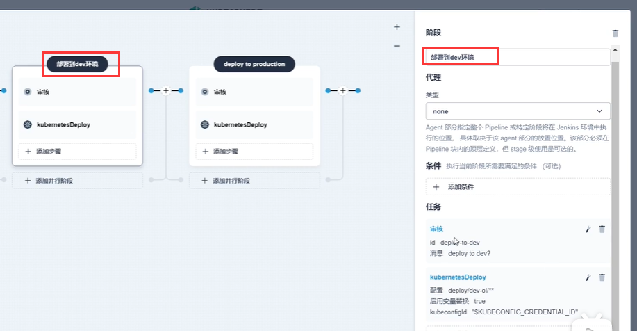

​		目前默认给的模板有--第一个是审核，第二个是部署

​	这个审核相当于人工卡点，走到这步的时候，流水线暂停，当某个人点击了确认之后，流水线继续，包括这个卡点我们还可以@这个有权限的人来审核，确认要不要进行构建

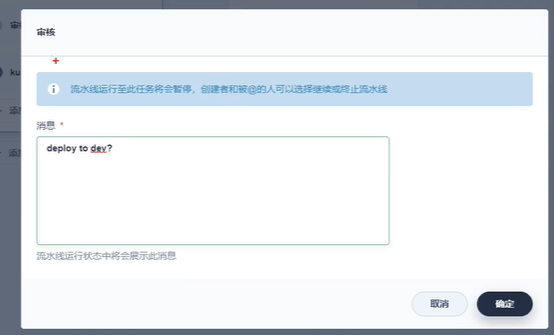

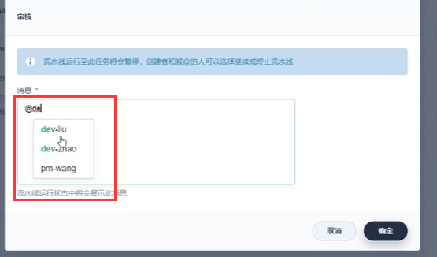

​	我们@了devliu 那么就需要等到devliu登录到这个系统后，他确认之后才可以继续流水线工作

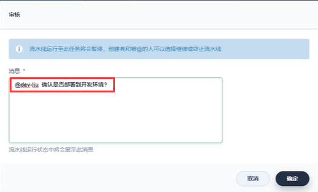

​		在开发期间我们就不使用这个卡点了，在真正如果到生产环境就需要了

​		我们现在就先把这个卡点去掉

​		我们看到模板中的第二个步骤是，模板中携带着是 按照一些配置文件 把他部署到k8s集群，有了这个东西我们以后每个微服务想要部署到集群，需要这么来做，每个微服务中都有一个deploy文件夹里面有deploy.yml文件，这个yml其实就声明了这个应用该如何部署到k8s平台上

​			在deploy.yml中，包括一些镜像也可以使用变量的方式

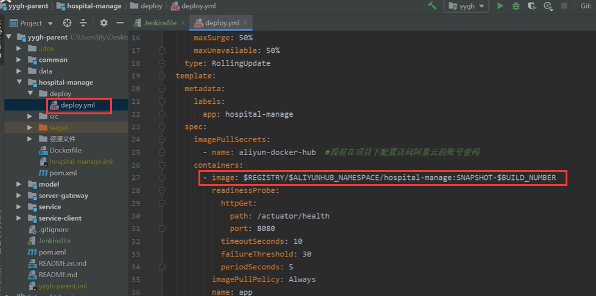

​	这些环境变量是在jenkinsfile中

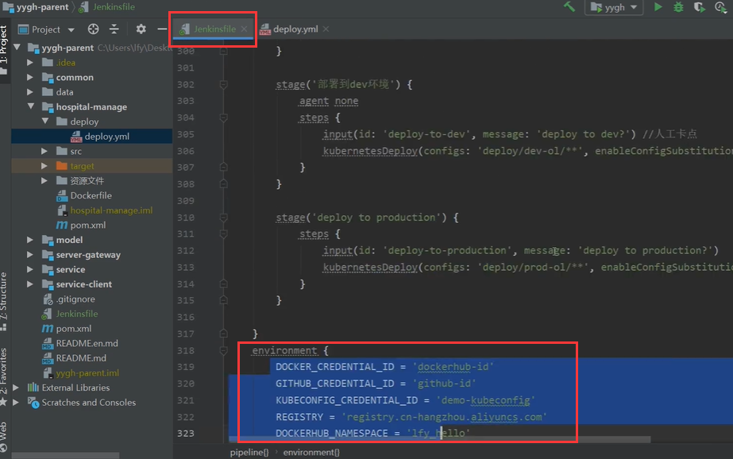

​	这个模板-不仅会部署Pod还会给我们产生负载均衡网络

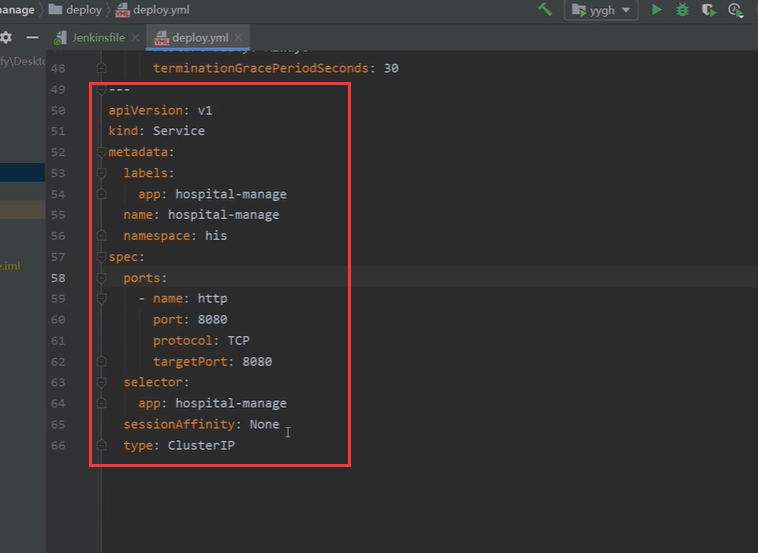

​		我们未来就使用这个规则部署微服务----给每个微服务准备一个deploy.yaml---k8s的部署配置文件

有了这个文件后，我们就可以使用kubesphere给我们抽取过来的可视化步骤--kubernetesDeploy

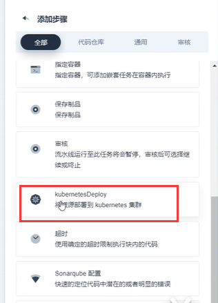

​		这个kubernetesDeploy步骤，需要传入配置文件的路径位置就能部署

​		在底层真正运行的命令是 kubectl apply  -f ***.yaml，而要运行这个命令就需要有kubectl的权限

​		一般在master节点是有这个命令权限的，而node节点是无法执行的，master可以执行的原因就是有.kube这个文件夹

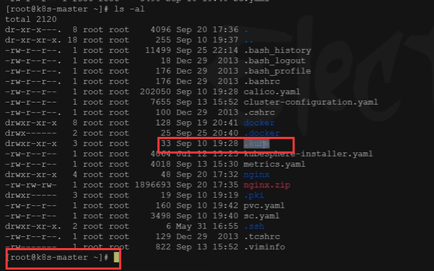

​	我们进入到.kube这个文件夹，里面有个config文件，这个文件其实就是kubectl的权限配置文件

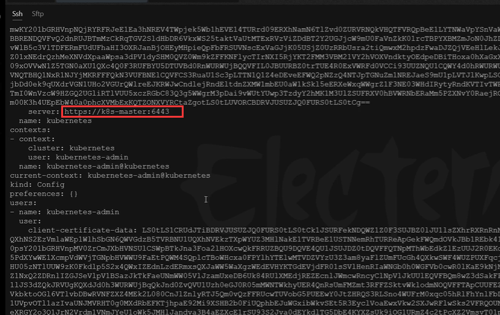

​		也就是说如果我们想在底层部署的话，我们也得有这个

​	

​		所以在我们流水线中，最重要的部署步骤 --添加或设置kubernetes的凭证

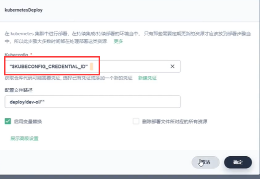

​		我们使用新建凭证，凭证的id我们之前在jenkinsfile中的变量中有copy过来

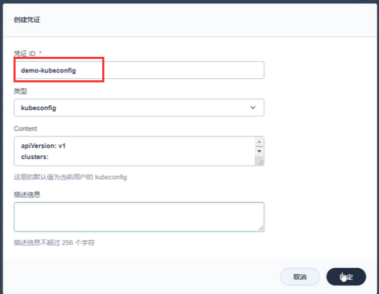

​	当他引用到这个变量的时候，这个变量在部署的时候其实就是一个授权，可以使用kubectl命令，将来我们把yaml传入就可以部署了

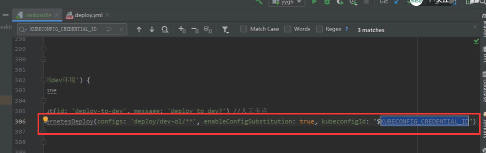

​	文件路径是  deploy文件夹下的** 全部 文件都会读取

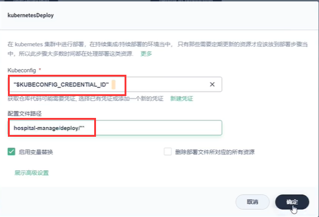

​		然后我们这一个微服务的部署就配置好了，其他的微服务我们设置并行流水线就可以了

​			copy--jenkinsfile脚本文件---到本地，我们本地编辑会比较快一些

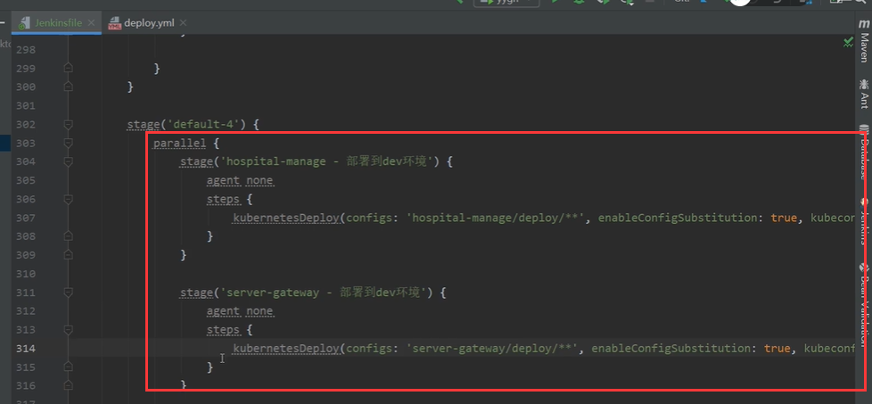

​	

​	微服务全部部署搞定

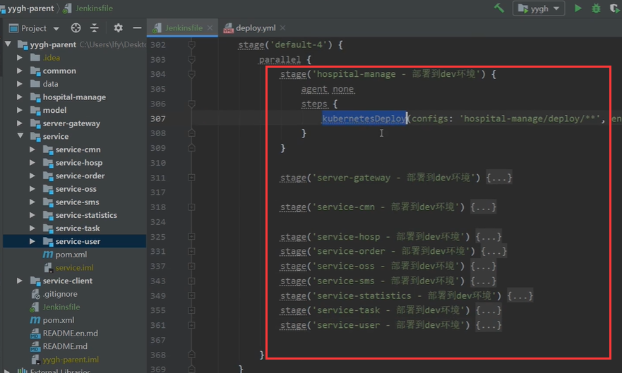

​	到这里还没有完，因为在deploy.yaml中，我们使用的是私有镜像仓库，需要用户和密码

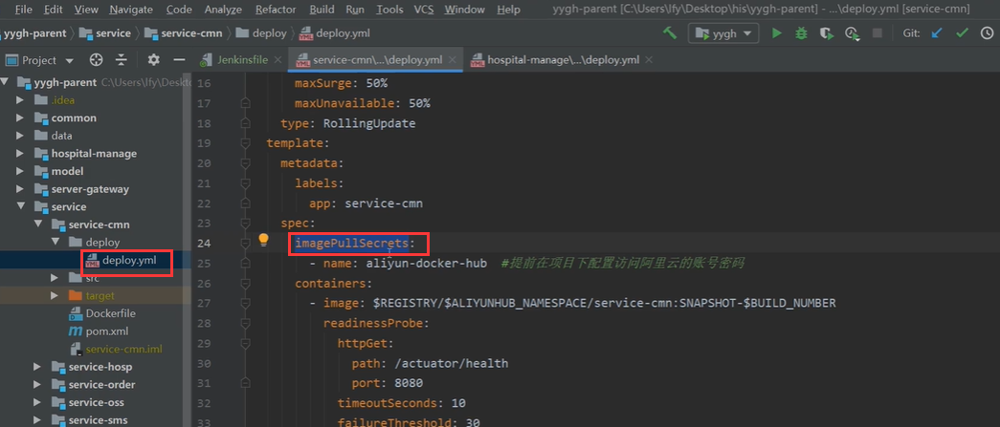

创建凭证：

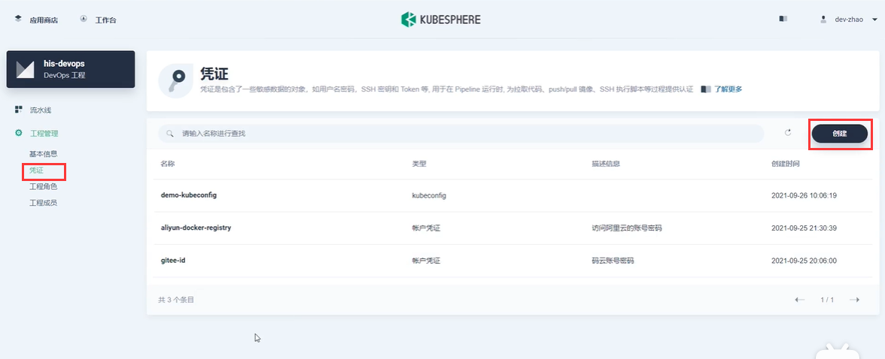

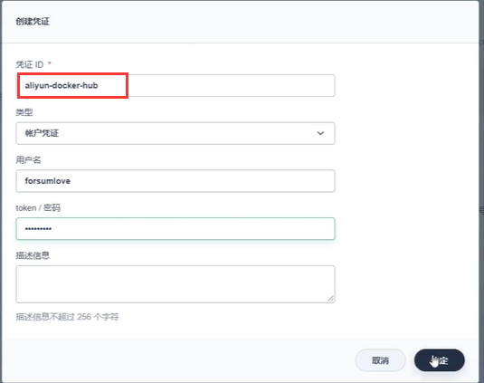

​		在这里配置可能还不够

​	我们应该在项目中配置-----配置中心--秘钥

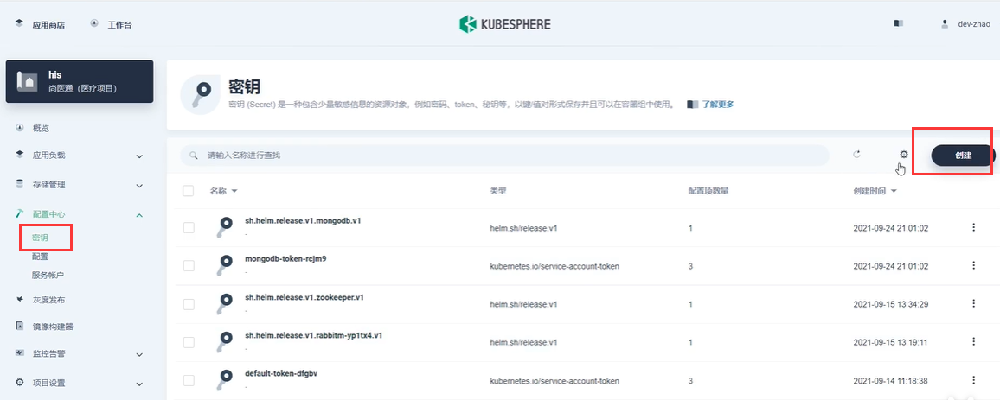

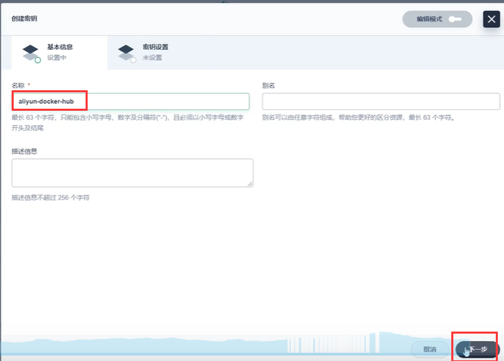

秘钥的类型：镜像仓库的秘钥

​	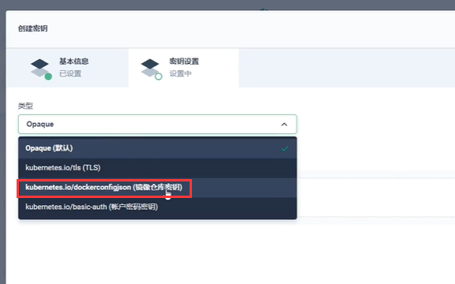

​	填写信息--进行验证--创建

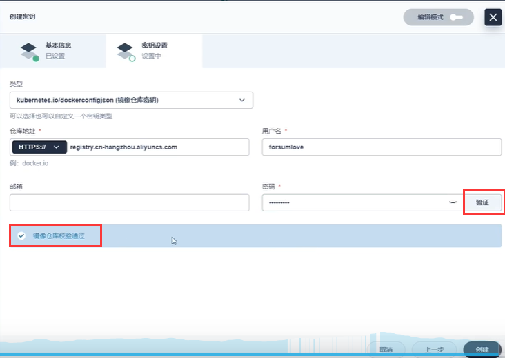

​		秘钥创建好了，如果公司使用的不是阿里云，habar的话那么就使用habar的账号

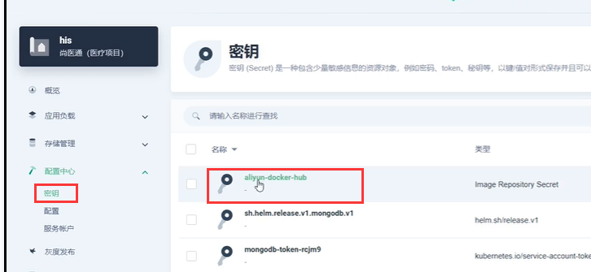

​		有了这个秘钥后--我们部署的时候deploy.yaml文件中使用的就是这个秘钥，然后可以获取到镜像了，然后部署镜像

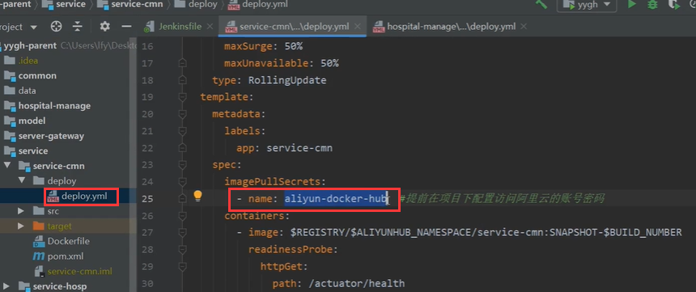

​		而且部署的deploy.yaml中每个namespace都是his，我们在可视化界面看到的每个项目都是k8s中的每个namespace

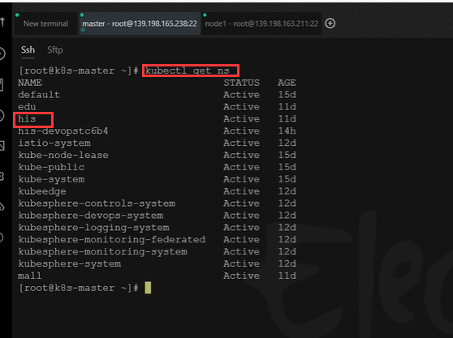

​		对了，将我们刚刚改好的jenkinsfile---copy到kubesphere流水线中

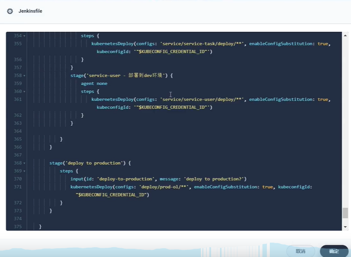

​	流水线我们运行测试一下

https://www.bilibili.com/video/BV13Q4y1C7hS?p=119&spm_id_from=pageDriver&vd_source=243ad3a9b323313aa1441e5dd414a4ef

