# 15.devops-可视化Pipeline-第五步-部署dev各种问题解决

​			

​				拉取代码---项目编译---然后构建镜像---构建完镜像---推送镜像----然后下载镜像---然后是项目部署（并发部署）

​		我们现在是在并发部署的时候遇到了一些问题：

​			Cannot  find kubeconfig  这里就是我们有一个kubeconfig中有一个id找不到了

​			这个其实是有的我们到jenkinsfile中寻找一下，使用idea打开jenkinsfile

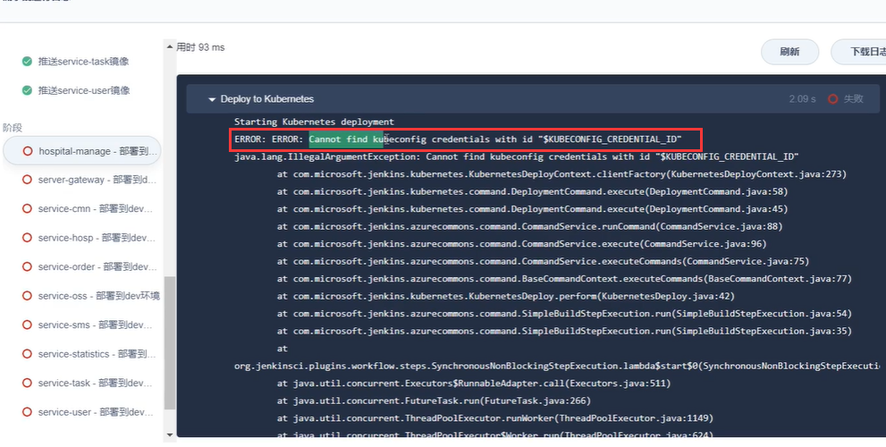

​		kubeconfig--credential-id  使用的是这个变量，是用这个变量取值的

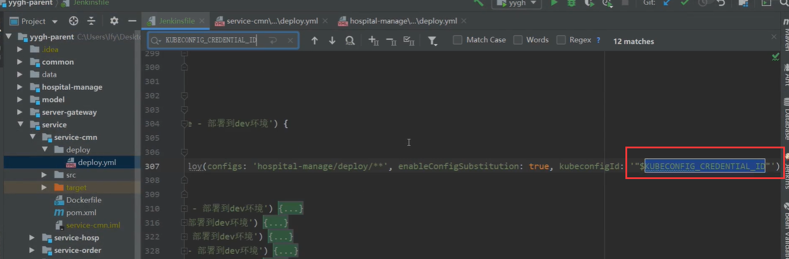

​		我们目前的变量定义的是  demo-kubeconfig

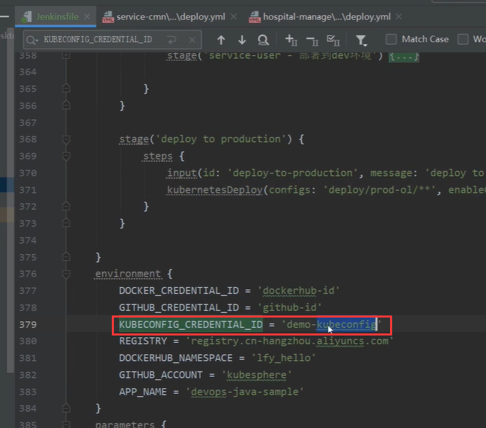

​		然后我们到流水线中，寻找一个这个config文件有没有---是有的

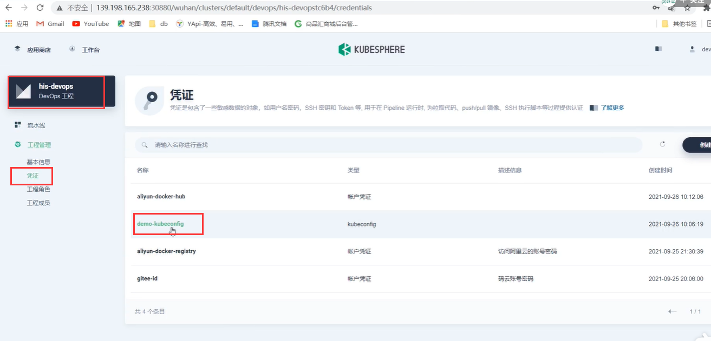

​		有这个值和文件--为什么会报错呢？原因是直接使用成字符串了，而我们实际上是需要动态取出这个变量的值

​		我们需要编辑一下这个jenkinsfile的文件

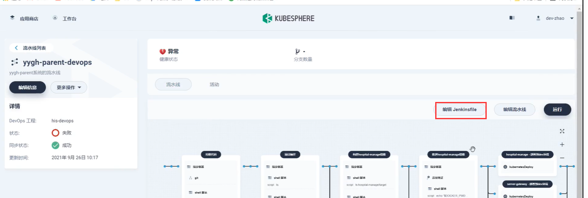

​		我们可以看到，下面的取值是使用的双引号取值，而上面有一个使用的双引号加单引号的方式取值，这里应该是不对的

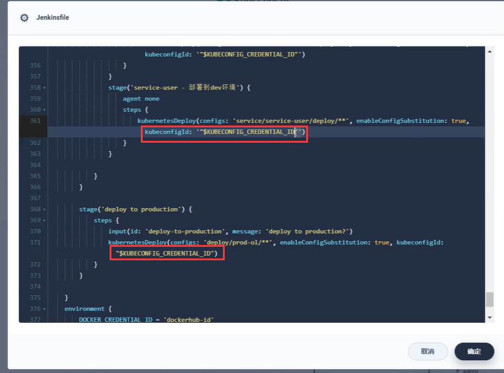

​		把这个有问题的全部替换掉--

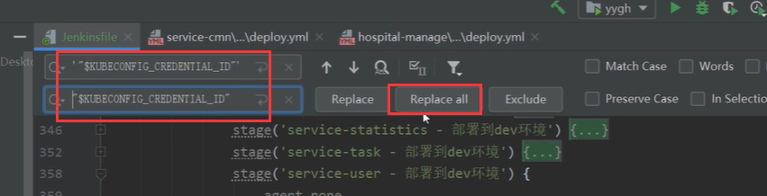

​		我们修改完jenkinsfile文件后，现在重新运行一下流水线

​		这次我们看到有部署成功的了

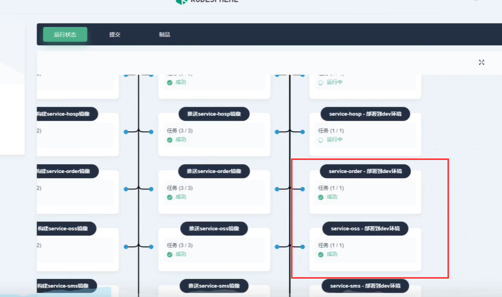

​		另外一个问题---应用负载中显示  都是 **最小副本不可用**

​		而最小副本不可用的原因是，我们现在先要下载镜像--这边还显示**无法解析镜像名称**

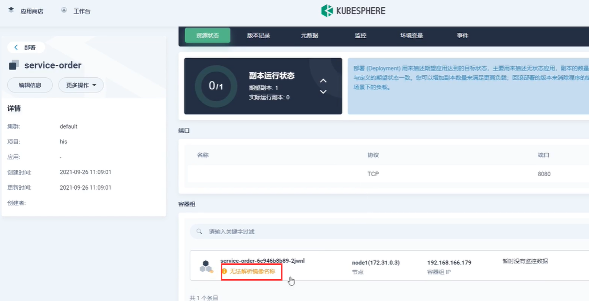

​	我们查看一下这边镜像用的是什么---编辑配置模板

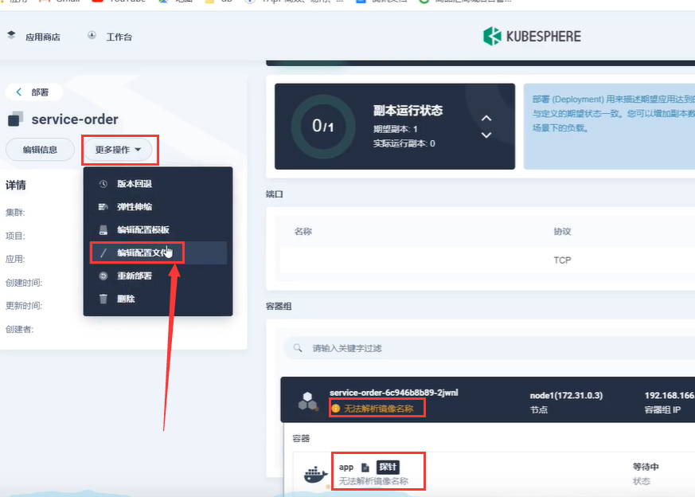

​		他这里使用到的是阿里云的$ALIYUNHUB_NAMESPACE

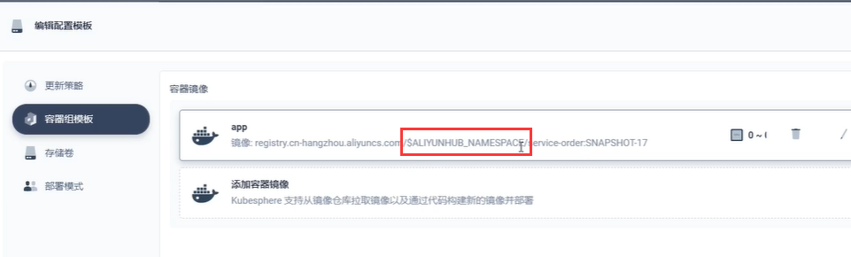

​		原因就是这个ALIYUNHUB_NAMESPACE并没有动态的解析出来值，所以我们添加配置这个变量，其实这个变量与DOCKERHUB_NAMESPACE是一样的--只不过现在使用成ALI的了

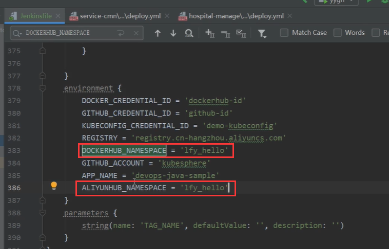

​		或者是我们把每个deploy中的每个ALIYUNHUB_NAMESPACE变量修改为DOCKERHUB_NAMESPACE

​		我们重新编辑流水线--将修改后的内容copy进去

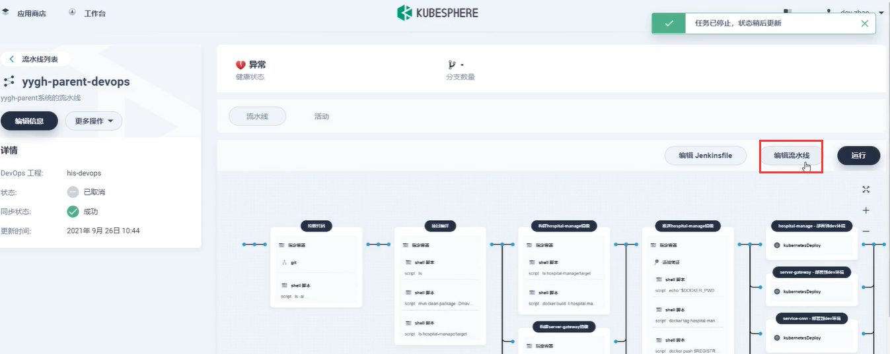

​		再次重新运行--进行流水线工作，之前部署失败的没有事情，因为是同源部署，下次更新是会覆盖的

​		目前显示是容器创建中--之前错误的就会被默认删除掉，新的创建完成后才会删除掉旧的

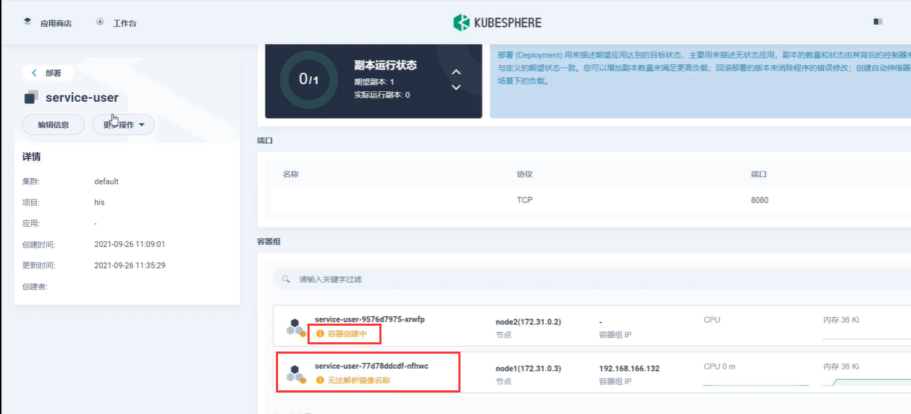

​		我们等待了一会发现有个提醒就是----容器没有准备就绪

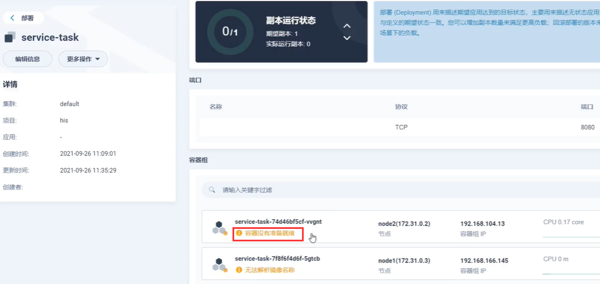

​		这个没有事情，我们继续等待就可以--因为我们之前有使用springboot做过探针服务，当容器真正启动成功后--就绪探针 就会显示 准备就绪

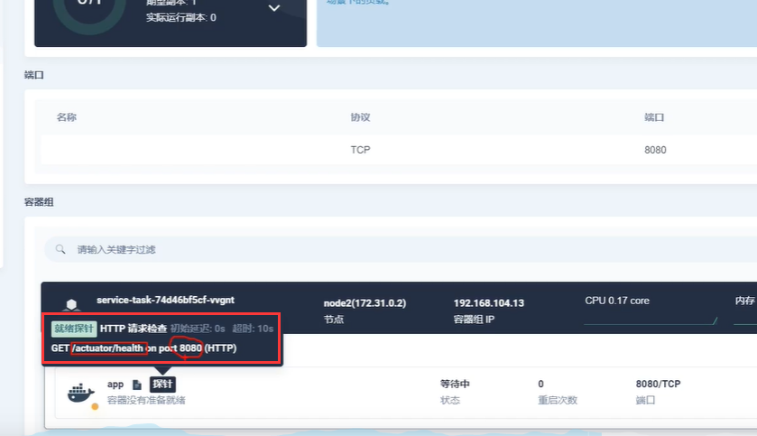

​		经过长时间的启动--发现还是显示这个，我们在本机启动起来一下项目看一下

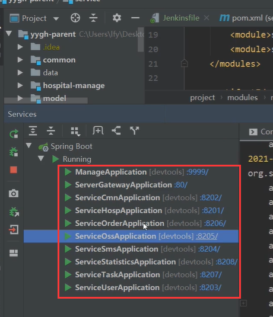

​		

​		本地的项目启动起来后----我们在本机随便访问一个项目，然后我们访问这个项目的actuator/health，我们发现有些项目打印的是DOWN，有些是UP

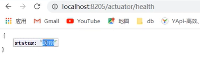

​		如果我们的项目整个Down后，页面的响应也就是503

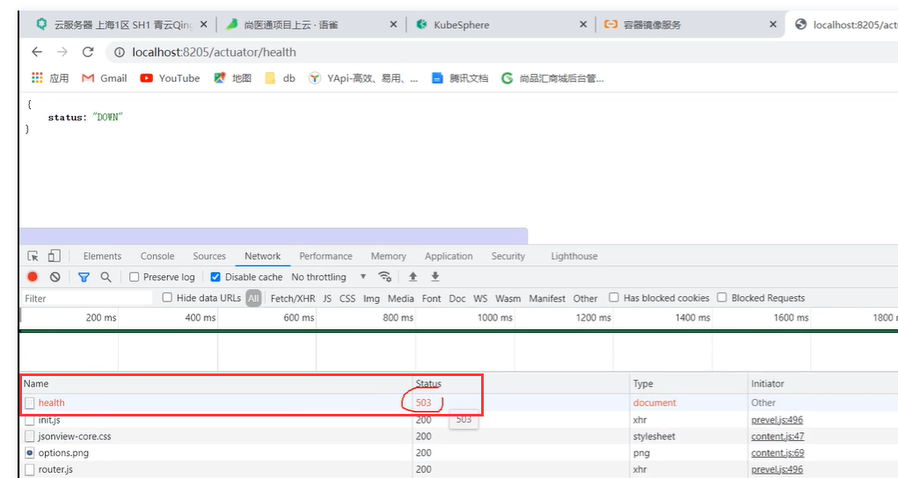

​		而k8s认为 2** 的响应码是正确的，5**返回的错误码就认为是错误的，其实整体我们看了一下是我们这个项目有些问题，因为有些微服务项目使用到了redis，但文档中没说，但是在控制台中会报出连向本机的redis的错误

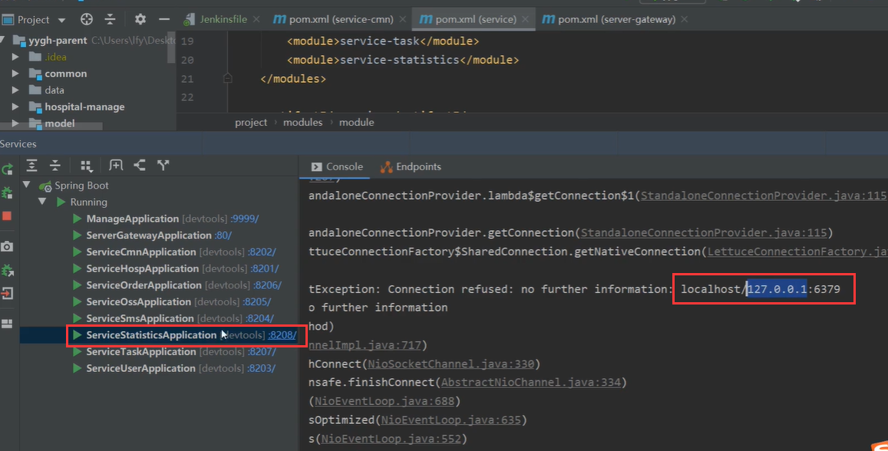

​		所以我们现在要做的是，我们的项目上云后--都会连接我们的Nacos，而Nacos会连接我们上云的线上环境的配置，那么现在我们就给每个应用，都加上redis的配置

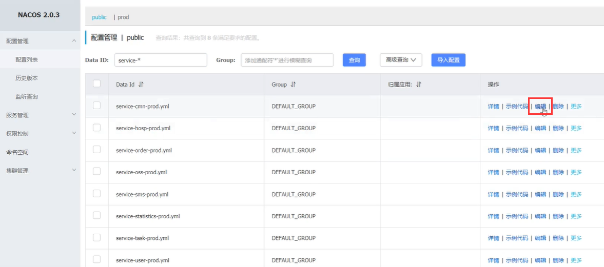

​	比如oss--现在没有配置redis，但是其实是实际以后是会使用到的

​		statistics微服务，test微服务，user微服务

​	这些我们都加入redis的配置

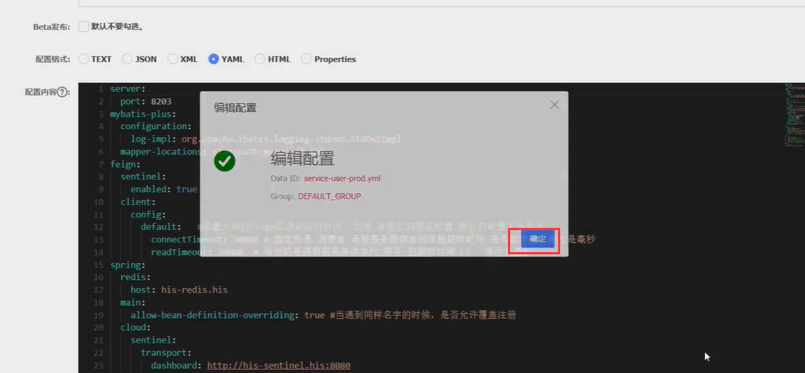

​	

​		重新运行一下流水线

https://www.bilibili.com/video/BV13Q4y1C7hS?p=120&spm_id_from=pageDriver&vd_source=243ad3a9b323313aa1441e5dd414a4ef

 

