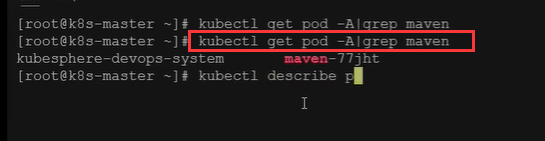

# 16.devops-可视化Pipeline-第五步-部署内存不足等问题解决

​		我们的有些部署是失败的---这里有个人工卡点--可以接受和终止

​		我们现在重新运行一下流水线

​		我们也可以使用kubectl get pod - A|grep maven   我们查看所有的关于maven的pod

​		我们还可以使用 kubectl describe pod -n 名称空间 Pod名称，这个就可以看pod的详情

​	pod的详情---我们可以看到这个Pod怎么了，我们看到这个Pod提示我们FailedScheduling 是调度不过来了

​			调度不过来的原因是这三个节点，有一个节点是taint 污点就是master节点不能用，剩余的2个节点提醒内存不够用了

​			实际我们的内存是够用的

​			我们使用kubectl  top nodes，我们可以看到MEMORY的内存并没有满

​		那么一旦出现这种情况怎么办呢？我们就需要把这个流水线 停掉，然后多启动几次，或者是我们把机器的内存再往大扩一点

​		我们现在重启流水线，查看应用的日志，我们发现日志打印的很少，因为在我们的项目中logback-spring.xml中的配置日志在dev开发环境中打印是全面的，而在pro生产环境打印是比较少的

​	在项目中生成环境配的是pro而我们现在使用的生产环境配置是prod，我们将改为prod，将所有的微服务生产环境日志的打印都改为prod

https://www.bilibili.com/video/BV13Q4y1C7hS?p=121&spm_id_from=pageDriver&vd_source=243ad3a9b323313aa1441e5dd414a4ef

https://www.bilibili.com/video/BV13Q4y1C7hS?p=121&spm_id_from=pageDriver&vd_source=243ad3a9b323313aa1441e5dd414a4ef

