# 17.devosp-可视化Pipeline-第五步-文件编码问题

​				我们重新运行流水线---流水线没有问题，显示都是成功的 

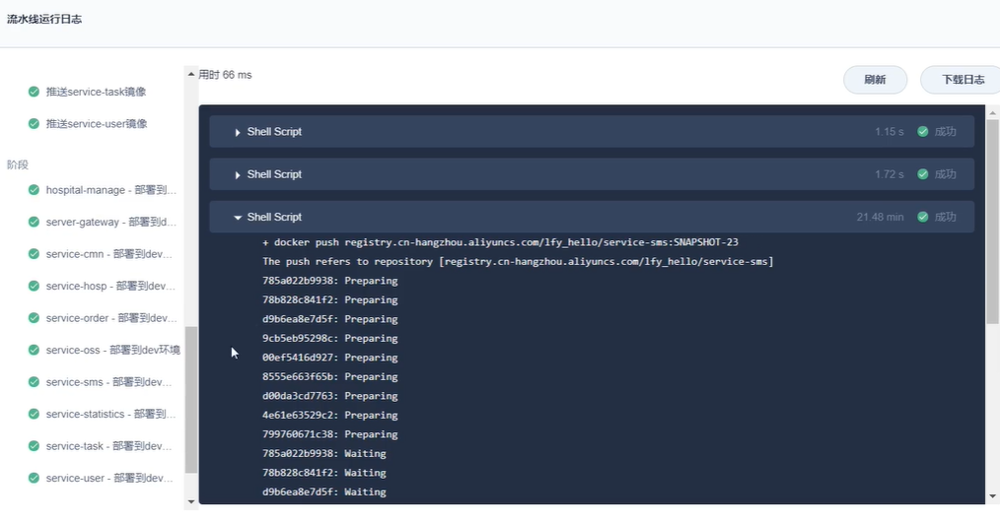

​		我们查看一下这个有错误的节点，然后查看日志

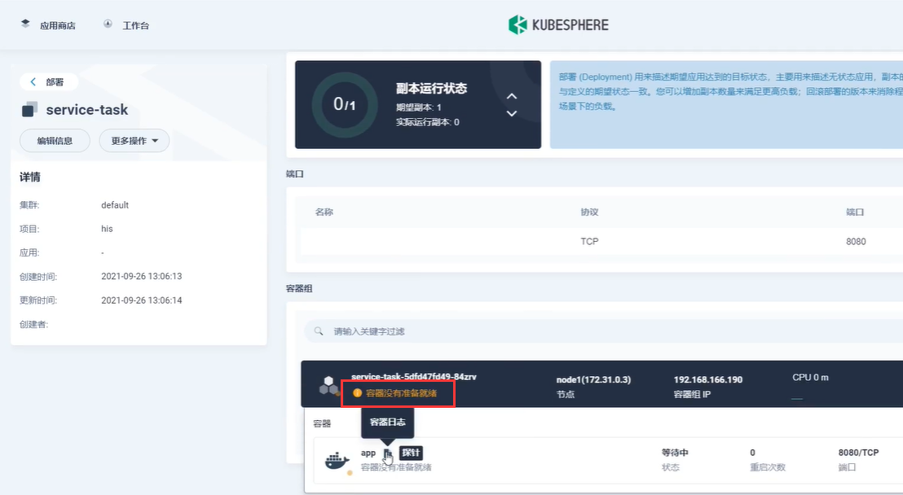

​	

​		我们等待了很久发现容器还是没有等待就绪，我们检查一下探针，使用curl在master节点上请求一下这个服务，我们请求后可以看到 返回的内容 status 是 DOWN就是因为这个dowm，才是导致我们容器一直没有就绪

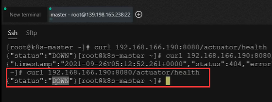

​	我们现在先把这个就绪的探针取消掉，让他可以正常的运行

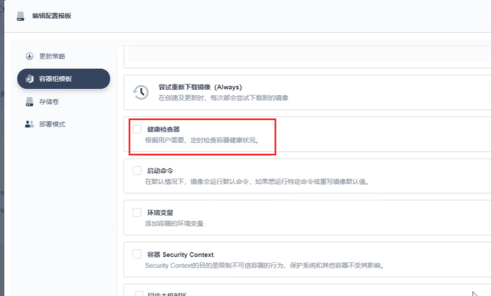

​	我们进入到节点的日志中，找一下日志查看一下日志中有没有问题

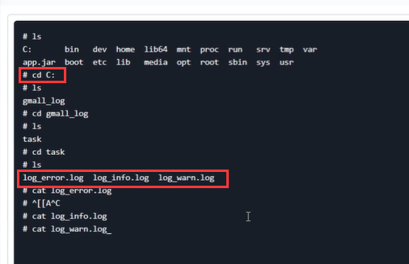

​		我们在查看warn的时候有一些日志---日志中有报nacos-discovery invalid characters 这里说我们的nacos中字符有一些非法的字符

​			这些非法字符有bus-env，bus-refresh，service-registry

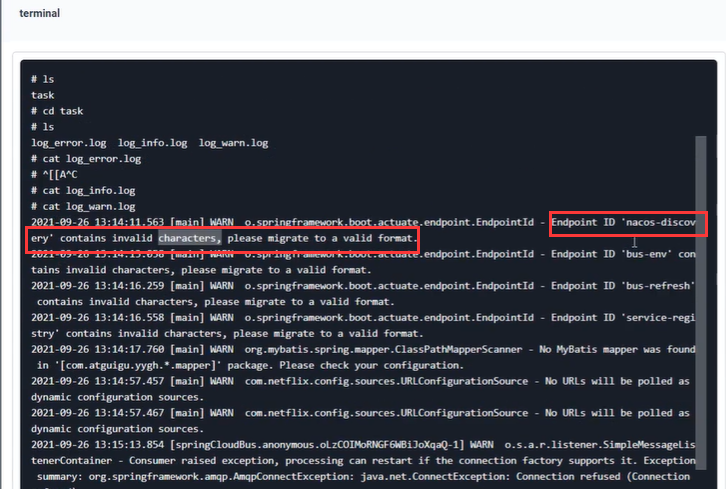

​		还有另外的报错的问题是--连接拒绝，是RabbitMQ的连接有拒绝的情况

​	我们看看这些处理超时的服务，比如用户服务的日志有什么问题

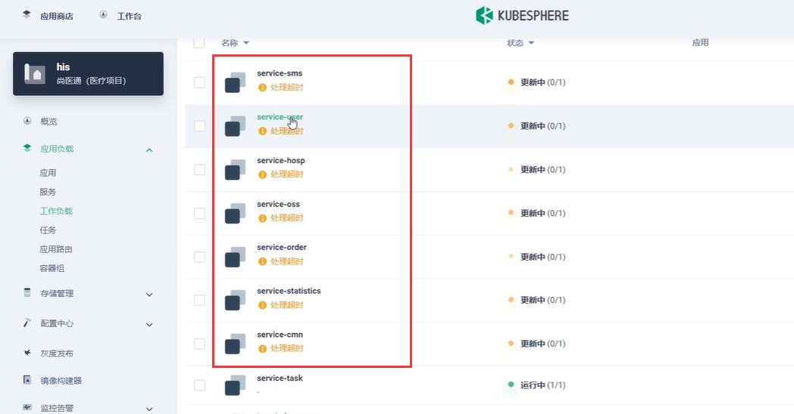

​		查看用户服务日志前，我们也是把他的模板的探针先给取消了

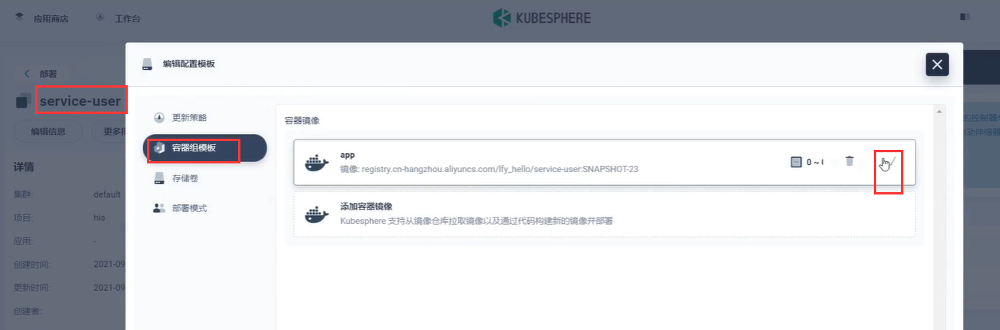

​		然后我们进入到容器，看一下他的日志

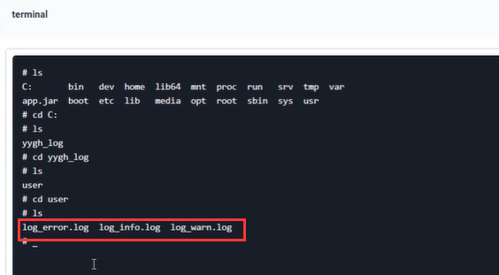

​		我们看一下警告级别的信息 cat log_warn.log

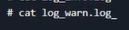

​	我们发现--还是报一些非法字符的问题----nacos-discovery,和service-registry(服务的注册配置)

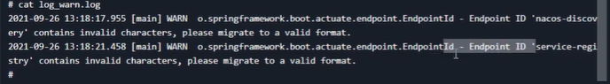

​	现在我们排一下我们的Nacos是否有非法字符，我们看一下每个微服务的生产配置

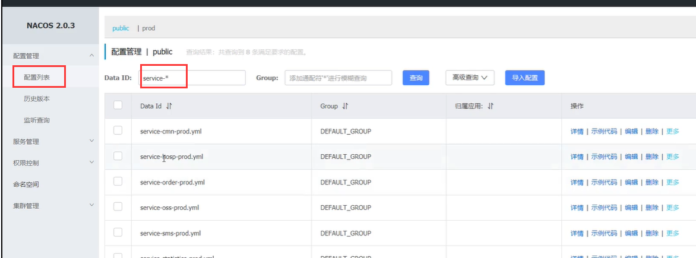

​	我们打开并没有一些非法的字符的配置，我们在项目启动的时候也配置了字符集，然后我们现在检查一下在idea中的编码问题----发现有gbk的编码，我们都改为utf-8

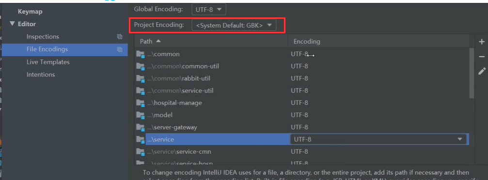

​		

​	因为我们的项目不是utf-8的，但是我们的docker file文件中在启动的时候配置的utf-8，按这个字符编码启动可能就有问题了

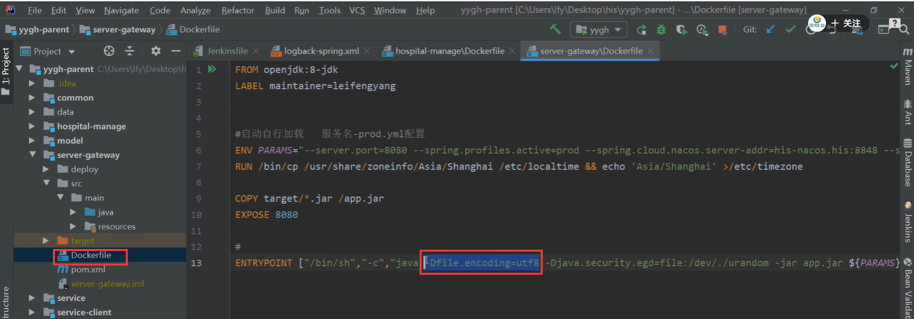

​		所以我们将我们的项目需要修改为utf8的编码方式

https://www.bilibili.com/video/BV13Q4y1C7hS?p=122&spm_id_from=pageDriver&vd_source=243ad3a9b323313aa1441e5dd414a4ef

