# 18.devops-可视化Pipeline-第五步-就绪探针问题

​	

​			针对前面的编码问题，我们发现每个微服务都有一个bootstrap.properties,这个编码问题会导致中文乱码的问题

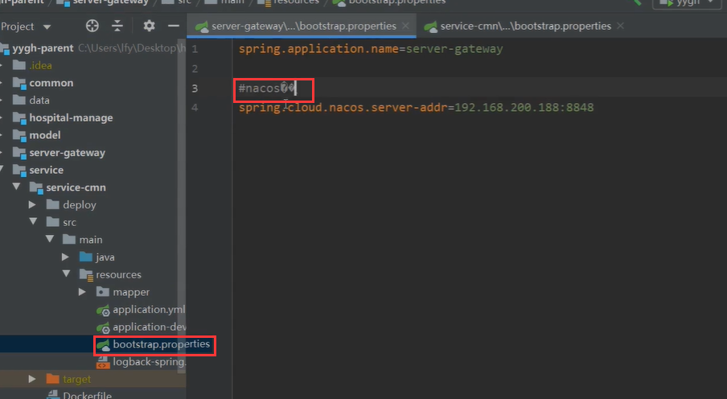

​		所以我们把每个中文乱码的问题都处理了，都删除掉这些中文乱码

​	还有就是每个微服务都是没有加Nacos配置中心的依赖的，我们现在都加上，这样的话每个微服务就能从Nacos中自己获取自己的生产环境配置了，这样我们的配置 比如redis的地址才能生效

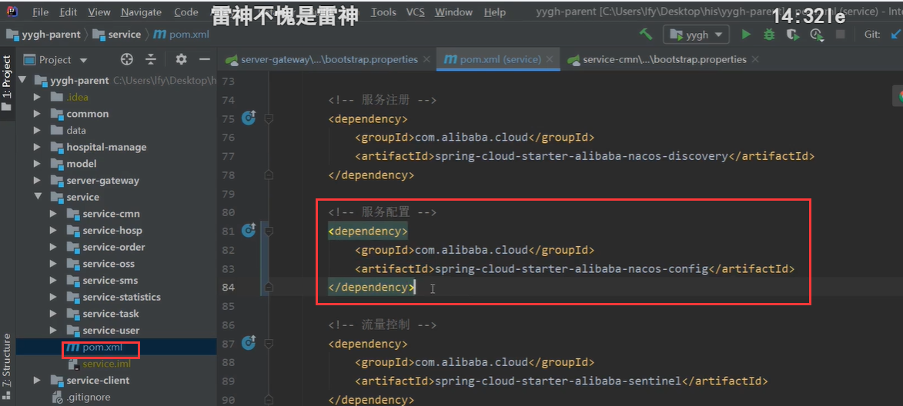

​	另外为了调试错误方便，我们在日志中也添加了调试错误的控制台输出日志 CONSOLE

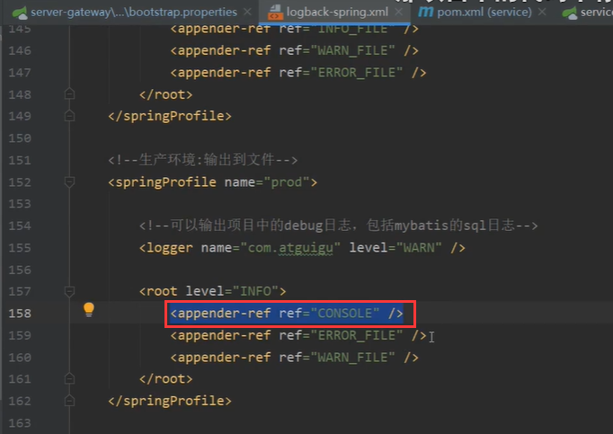

​		修改后---我们提交代码，然后再次运行流水线

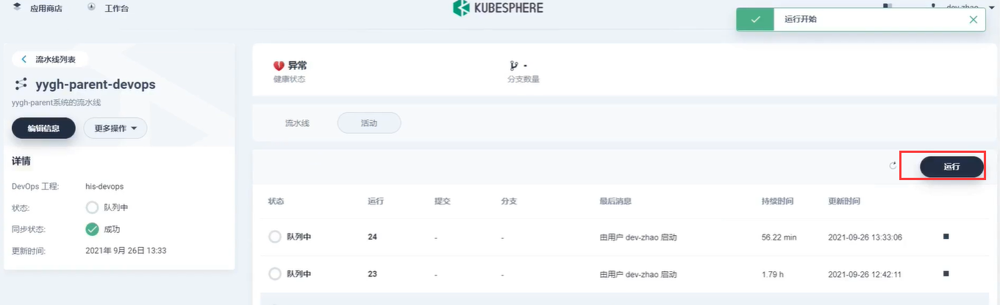

​		我们还是看一下有些应用容器没有准备就绪，我们进入查看一下日志

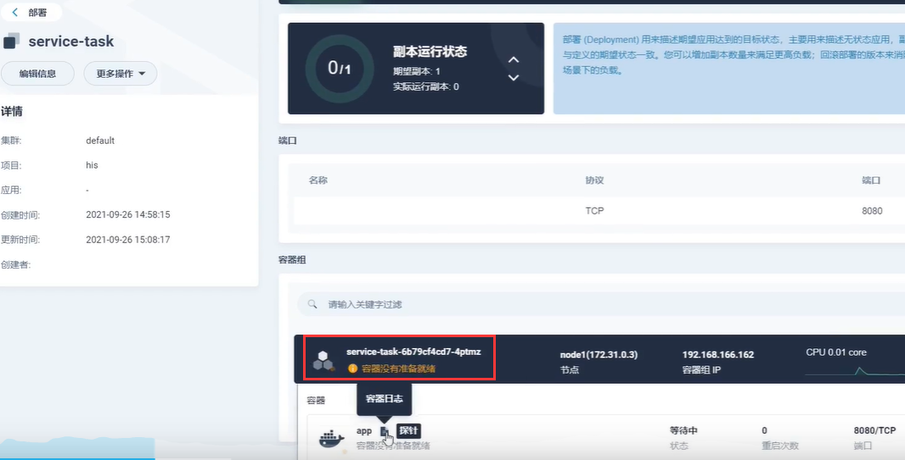

​	我们进入日志查看--这个task没有问题，应用也启动成功了，那么提示的--容器没有准备就绪的问题就是探针的问题

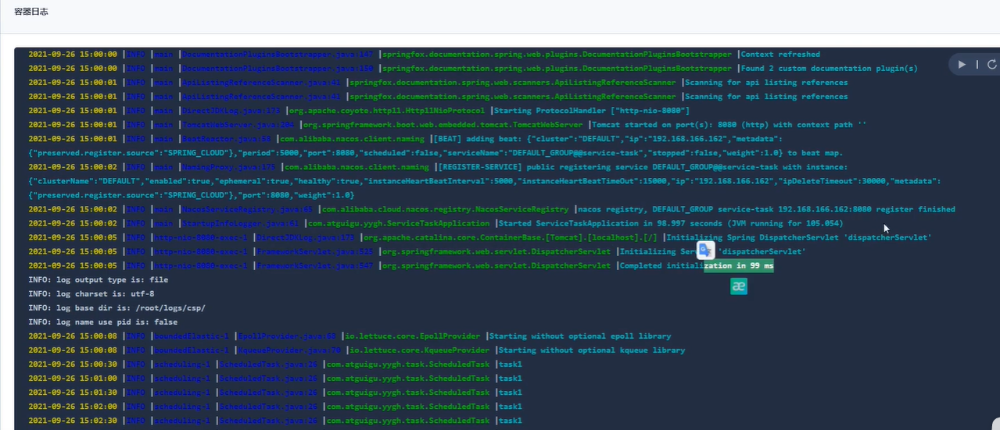

​	然后我们在master节点，请求一下这个容器，测试一下探针，发现status是DOWN

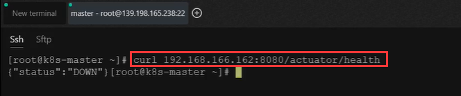

​		我们查看其它的微服务--发现也是服务都成功的启动没有问题，但是还是--容器没有准备就绪的问题一直都有，原因就是这个探针的状态返回的不对DOWN

​		那么我们在微服务中的Application.yaml中加入managment的暴露*和 暴露详细信息 show-datails：always

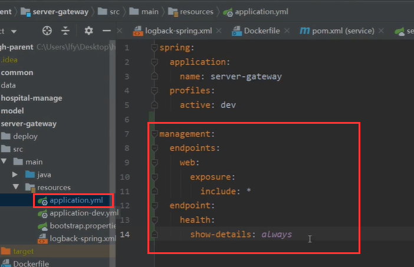

​	这个配置指的是，当这个健康信息真的是宕机的情况的话，我们就让他展示详细信息

​		这样的话，我们就可以看到他是什么原因宕掉的了

​	我们在本机随便启动一个微服务---然后我们请求一下健康检查

​	我们在本机是都是UP，UP没问题

​		我们在Nacos上，我们给每个微服务都加上这个配置

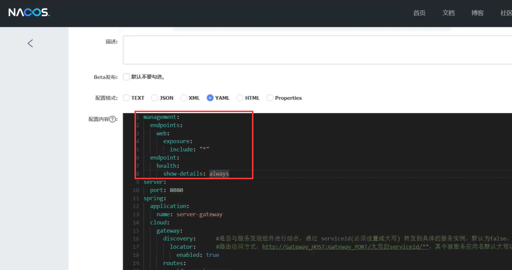

​		然后我们现在重新启动一个服务，测试一下他的详细健康信息有没有问题

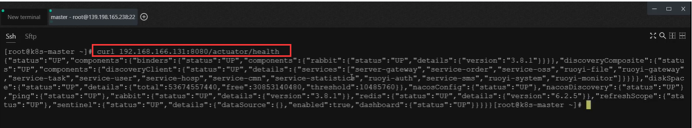

​		我们可以看到这个是up

​	然后这个容器也就就绪好了---没有之前那个提示的--容器没有就绪的提醒了

​	然后现在我们把每一个 处理超时的警告 的微服务都节点重新启动一下

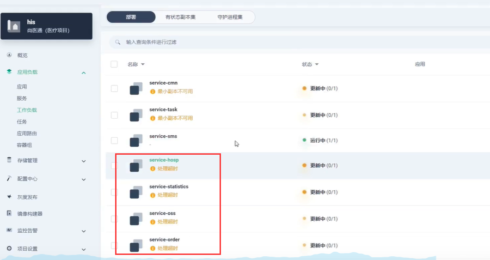

​	我们发现还是会有个别的服务不行---然后我们使用curl请求一下反而就好了

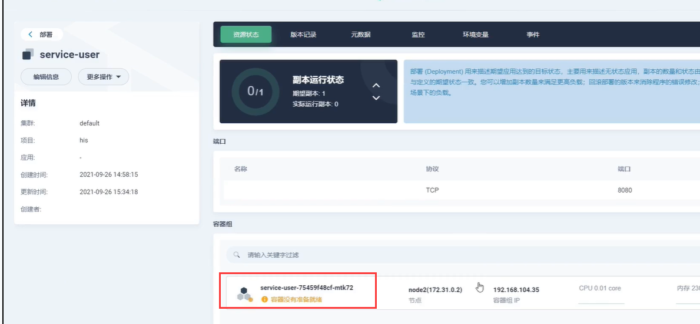

​	我们这个服务的端口是8203，我们将线上的都使用8080，这个服务端口在Nacos中没有修改

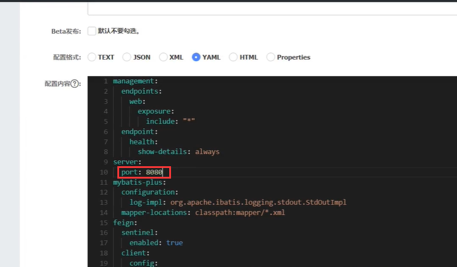

​		而使用8080端口的服务--我们使用curl请求一下这个服务及端口，发现就变好了，这个现象就很神奇

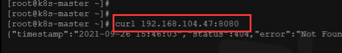

​		变为正常了

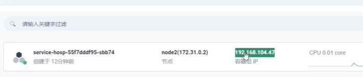

​	这就完全正常了

https://www.bilibili.com/video/BV13Q4y1C7hS?p=123&spm_id_from=pageDriver&vd_source=243ad3a9b323313aa1441e5dd414a4ef

​		

​	

​	