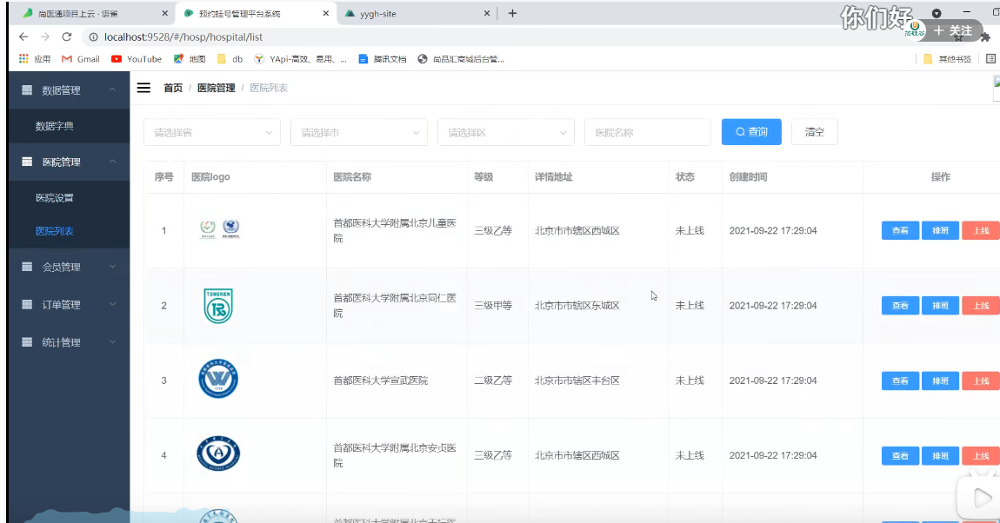
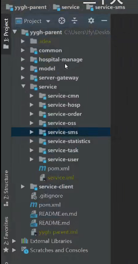
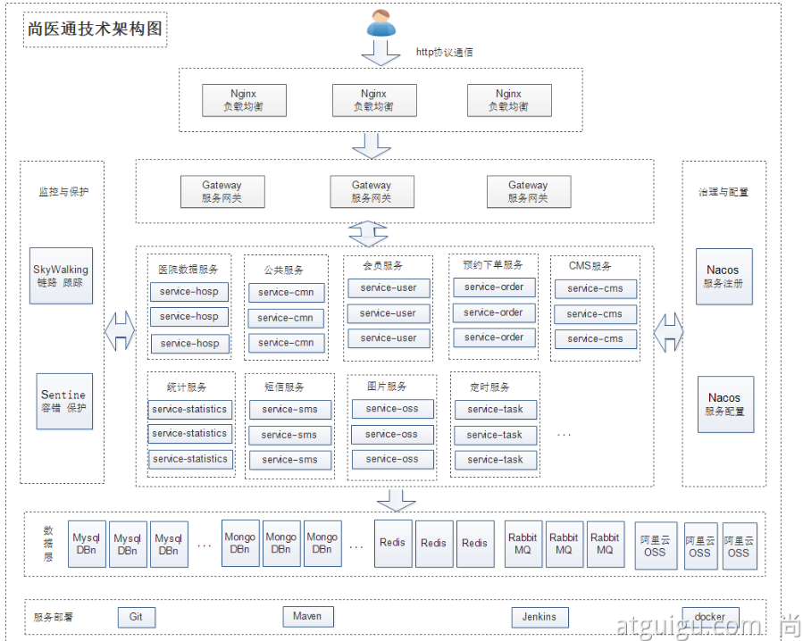

# 2.devops-尚医通项目演示


​	尚医通项目--是模拟网上进行医院挂号的项目


数据层，有MySQL，MongoDB，Redis，RabbitMQ，阿里云OSS，而医院的数据都是存在MongoDB中的


​	因为挂号的话就需要有医院的排班，那么就会有一个医院的后台系统




​	这个挂号系统会拆分出很多个微服务模块，比起之前的ruoyi只是一个简单的后台管理系统，而尚医通类似于一个真实的项目

​	我们看一下整体的架构及代码模块







Parent是挂号系统，admin是后台管理项目，site是医院挂号的用户端

```
yygh-parent
|---common                                  //通用模块
|---hospital-manage                         //医院后台				[9999]   
|---model																		//数据模型
|---server-gateway													//网关    				[80]
|---service																	//微服务层
|-------service-cmn													//公共服务				[8202]
|-------service-hosp												//医院数据服务		[8201]
|-------service-order												//预约下单服务		[8206]
|-------service-oss													//对象存储服务		[8205]
|-------service-sms													//短信服务				[8204]
|-------service-statistics									//统计服务				[8208]
|-------service-task												//定时服务				[8207]
|-------service-user												//会员服务				[8203]


====================================================================

yygh-admin																	//医院管理后台		[9528]
yygh-site																		//挂号平台				[3000]
```


https://www.bilibili.com/video/BV13Q4y1C7hS?p=107&spm_id_from=pageDriver&vd_source=243ad3a9b323313aa1441e5dd414a4ef


