# 20.devops-后台应用部署完成&数据验证

​		之前我们使用流水线将我们后台的所有项目都部署起来了，我们就可以测试一下，因为在后台项目中我们部署里面有一个最重要的--在我们的服务这里有一个service-getaway-网关

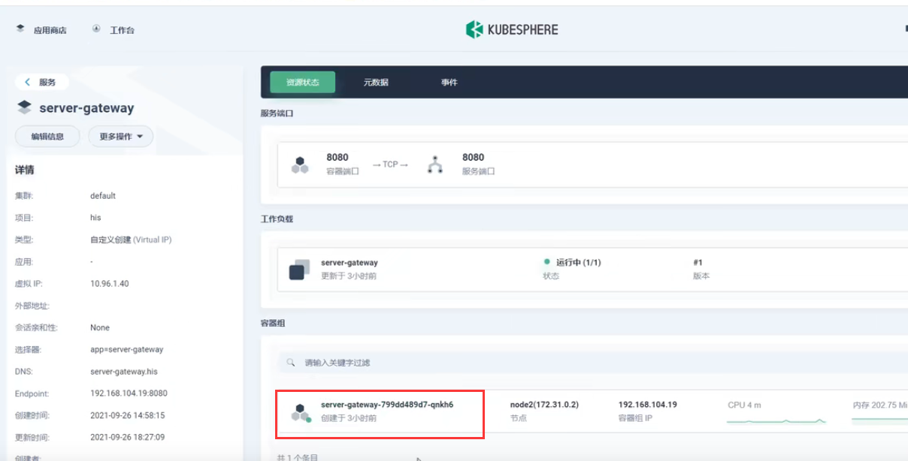

​		所以以后未来我们所有的请求都应该发送给这个网关，所以我们把这个网关开启外网访问

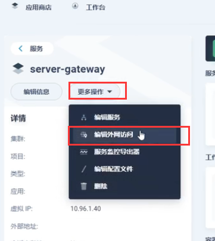

​	这个就是网关暴露的端口

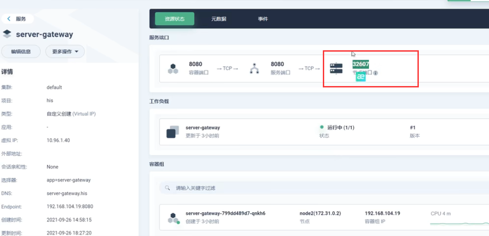

​	我们将我们本地的前端项目-连接到线上的网关，启动一下前端项目

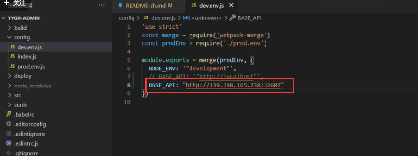

我们启动成功后，访问看一下是否会有数据，如果有数据的话那么就说明我们的请求线上是成功的

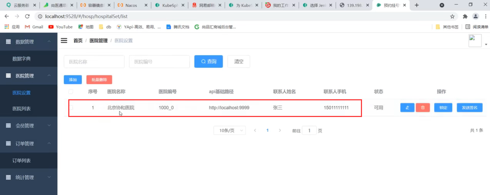

以上是我们后台系统的测试

​	现在我们测试一下用户系统YYGH-SITE--先安装依赖，我们把他的地址也切换成线上的地址

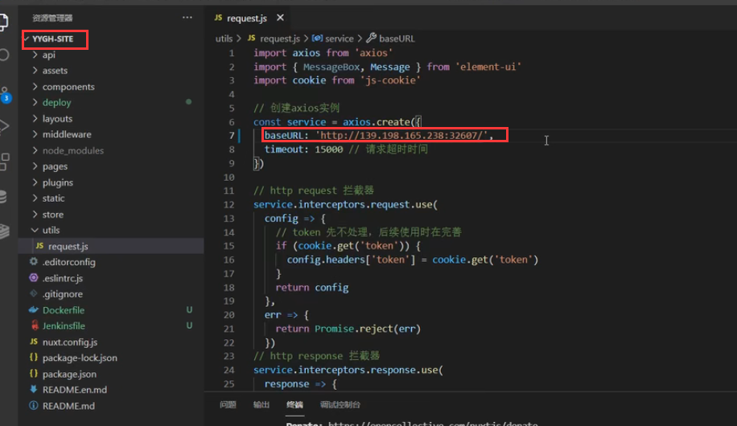

​	启动项目--访问3000端口，我们发现是有一部分数据的

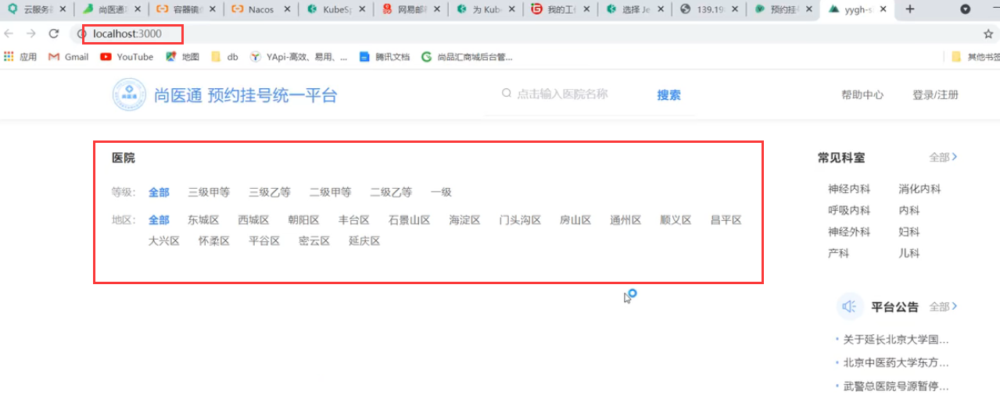

​	而下面有一部分没有数据的原因是---由于我们线上的MongoDB中没有导入初始化数据导致的

​		我们连接线上的MongoDB数据库--导入数据

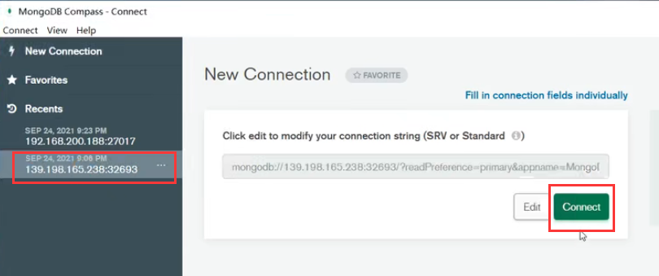

这个yygh-hops下面有三张表的数据，现在这三张表的数据是空的

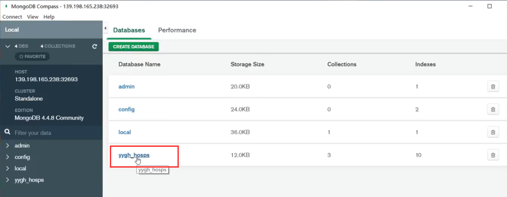

​	我们从项目中把这三张表的数据导入一下

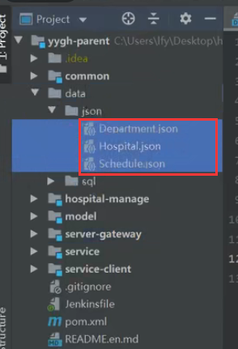

我们点击对应的表比如Department，然后点击Add data ---Import file导入数据文件

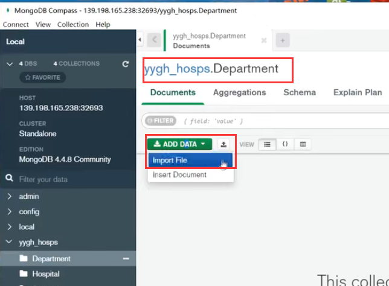

​	导入

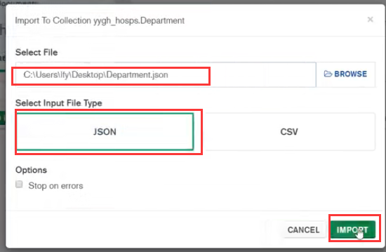

​	然后继续这样导入另外的2张表数据

​	然后我们导入完初始数据之后----我们再次刷新一下用户端的前端页面----就会展示出医院的一些数据

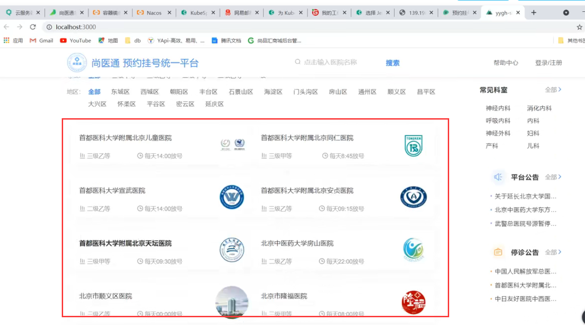

​	所以说明我们线上部署是正确的，我们线上整个部署正确之后呢，我们也可以看一下我们的sentinel流量保护的应用有没有起作用---先登录

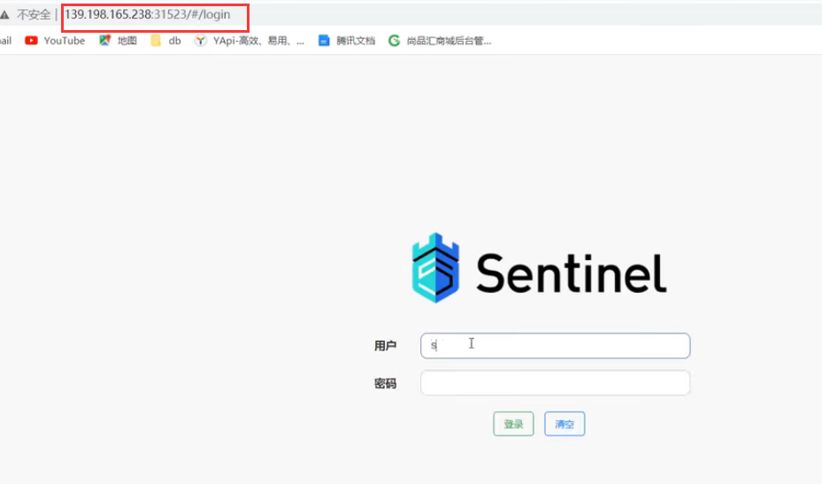

​	我们可以看到我们刚刚请求访问的数据，如果想进行流量的控制，在这里也可以进行流量的控制

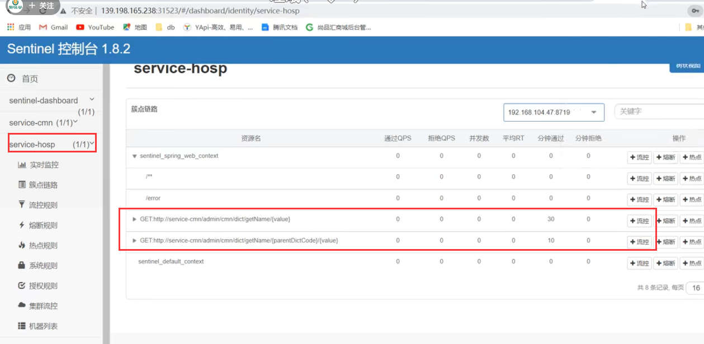

​		那么现在说明我们整个线上的调试算是通过的，当然我们不能这么来调试我们需要把这俩个前端的项目，也部署到线上去

​	以后我们就请求前端的线上地址-----然后经过网关-----然后由网关路由到我们各个微服务的地址，整个项目就跑通了

​	

https://www.bilibili.com/video/BV13Q4y1C7hS?p=125&vd_source=243ad3a9b323313aa1441e5dd414a4ef

​		

