# 22.devops-Jenkinsfile-部署nuxt-site项目

​	我们接下来把用户端的前端项目也上云处理一下

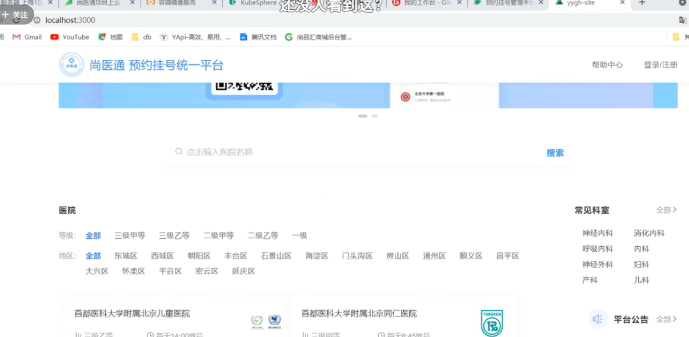

​	这个上云的过程几乎是和前面上云的过程是一模一样的

​		我们主要是把 jenkinsfile 和dockerfile都写好

、	我们和之前的前端项目上云还有一些区别，因为yygh-admin是使用vue写的--vue项目编译产生dist文件夹把dist文件夹copy到nginx中就可以了，而我们用户端的前端项目是使用nuxt是一种后端渲染技术实现的

​	我们查看一下他的dockerfile文件

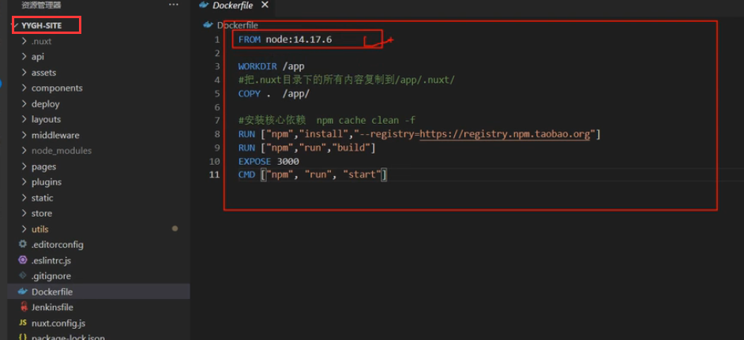

​	我们使用的是NodeJS的基础镜像，然后把整个项目都copy过来，然后是安装依赖，编译构建

​		然后暴露3000端口，然后npm run start运行 ，而这个npm run start 在nuxt中相当于以服务器的方式在3000端口启动的，所以我们把他称为服务端渲染

​		而且如果我们使用nuxt做服务端渲染有一个比较好的有点就是，客户端发起请求-到nuxt服务中他其实是再次发起请求到我们的后台网关地址的，因此其实我们可以在这里配置成网关的请求地址为内网地址也是可以的---这样就访问速度更快了

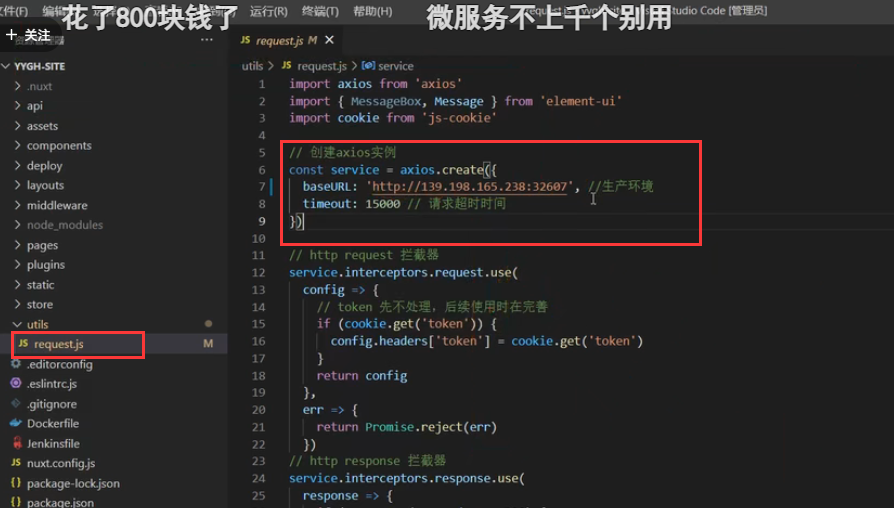

我们修改网关的地址为内网地址，拿到网关的DNS + 8080 端口

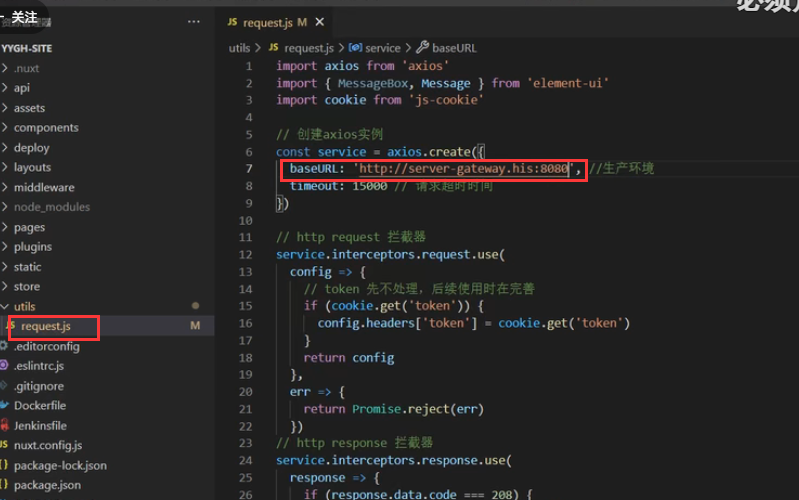

#### 部署

​	流水线--创建

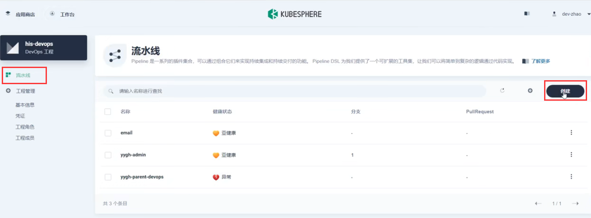

选择代码仓库

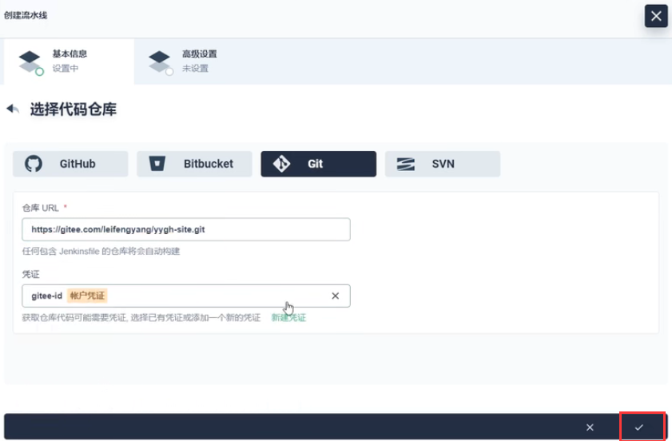

​	输入Jenkinsfile文件名称，让他自己找到这个文件

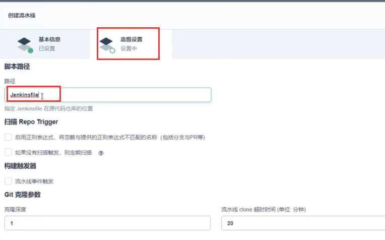

​	然后创建--启动运行--成功部署

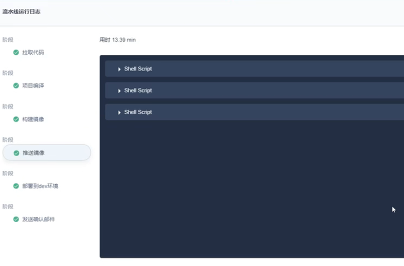

我们查看一下服务

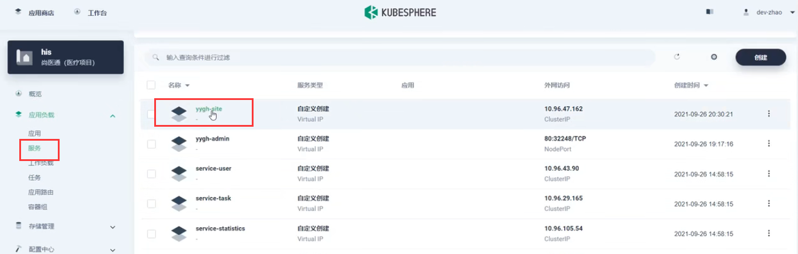

我们需要把他开启外网访问的功能

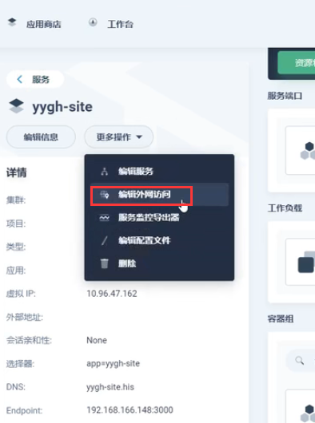

测试访问---发现是不可以的

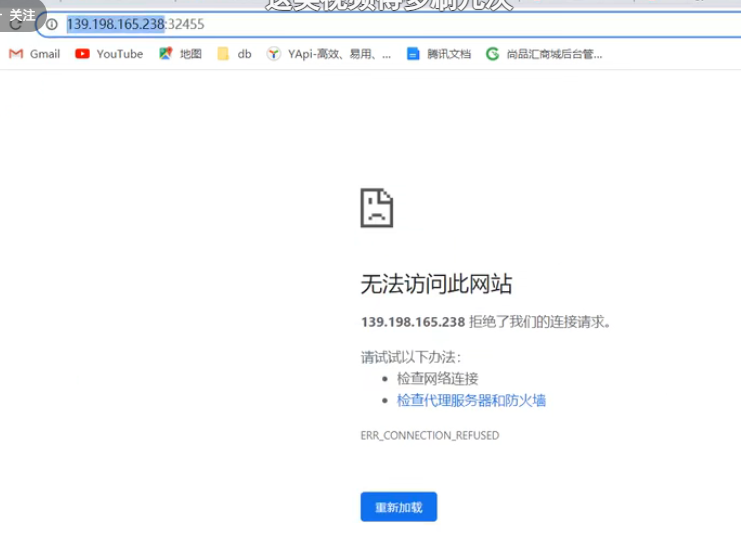

我们在容器内部 curl 请求的话是可以的，原因是这个nuxt项目，只监听localhost，我们配置一下nuxt的监听为0000，端口为3000

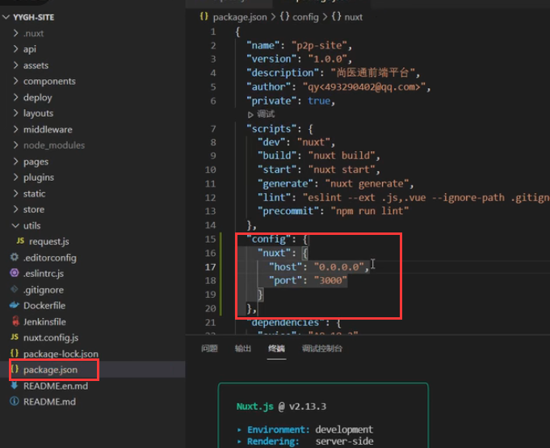

只要我们启动的时候不再打印localhost就说明生效了

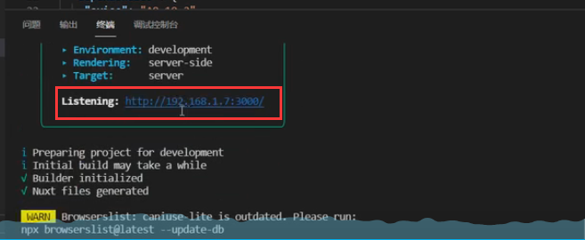

我们重新打包发布部署一下

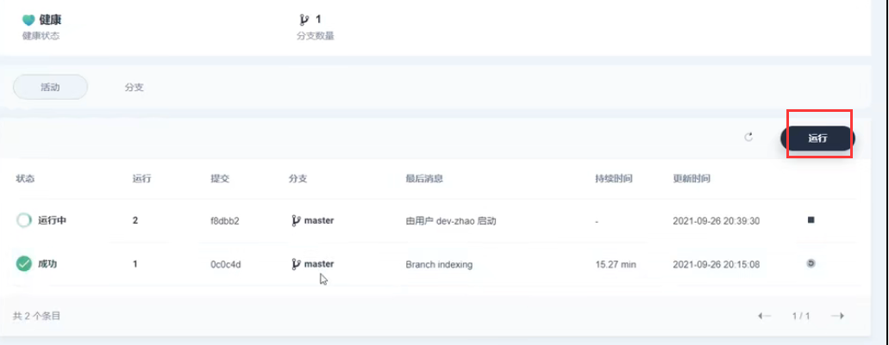

我们再次访问暴露的外网测试地址页面--成功了

https://www.bilibili.com/video/BV13Q4y1C7hS?p=127&spm_id_from=pageDriver&vd_source=243ad3a9b323313aa1441e5dd414a4ef

