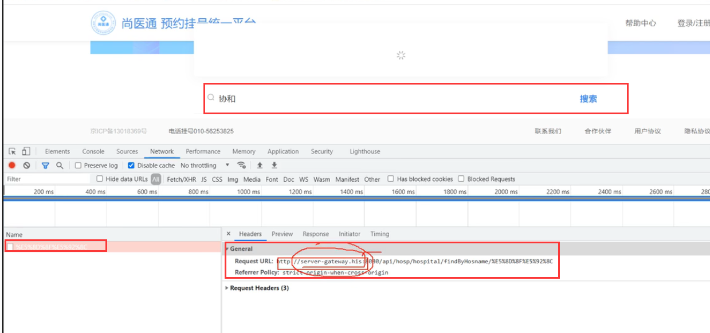
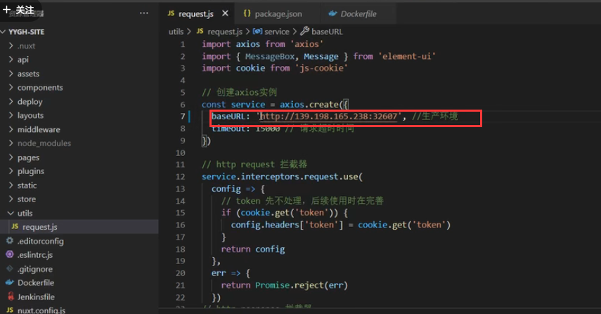
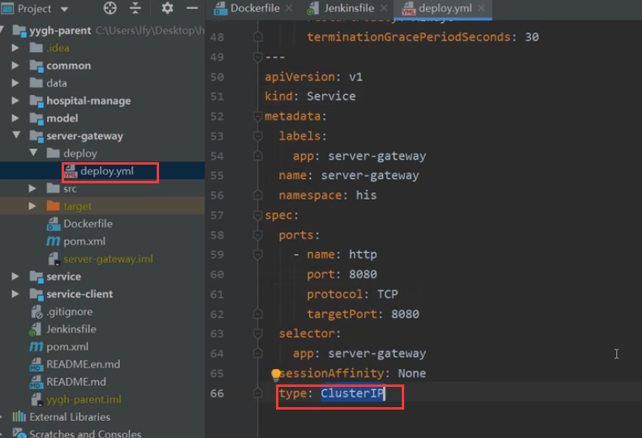
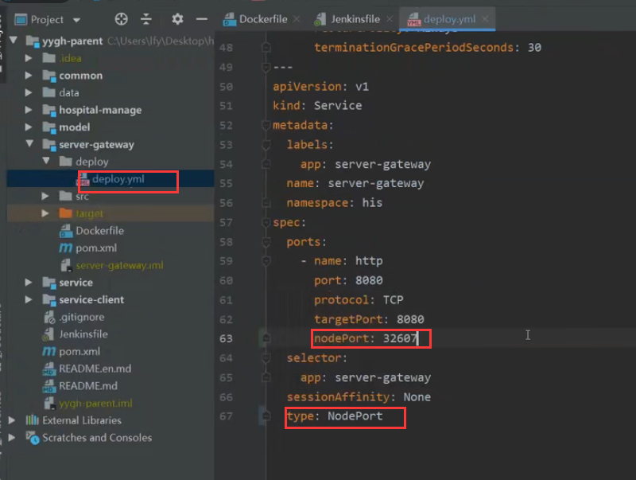
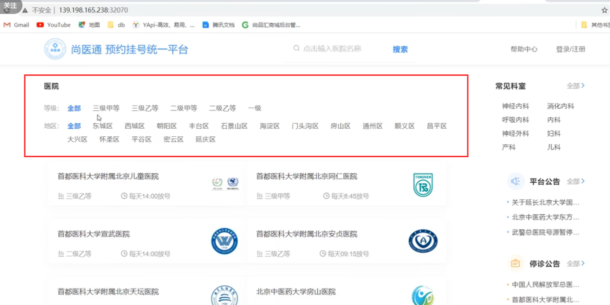
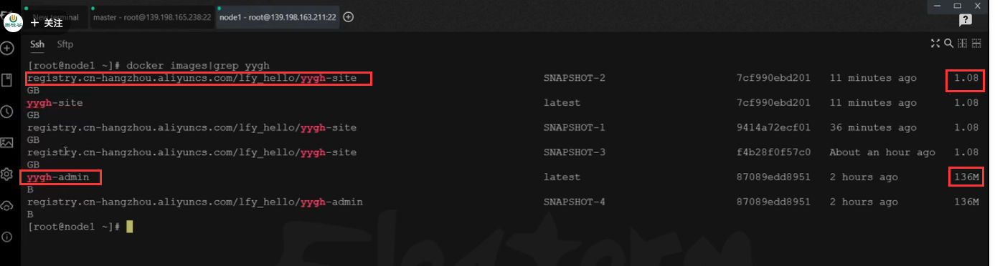

# 23.devops-最后的部署优化

​	我们前面已经把用户的前端系统部署好了，但现在有个问题就是有些数据可以出来有些数据不显示的问题，需要我们处理一下

比如我们现在测试一下搜索，我们发现请求的地址 server-gateway.his是交给浏览器解析的，浏览器肯定不知道这个地址是什么

我们还是使用集群网关暴露的端口--这样才可以访问的到

我们这个网关的外网访问地址是我们自己配置生成的，如果我们下次升级网关系统，重新配置外网访问的话，这个端口可能就会发生改变

​	所以如果我们确定了这个项目后期部署后是需要暴露外网端口的，那么在deploy.yml中就不需要写ClusterIP 这个了

​	我们改为NodePort--然后固定一下暴露的端口，要不然端口随机还是会有问题

重新部署后--数据就有了

#### 思考

​	为什么我们的yygh-admin和yygh-site这俩个镜像的占用差距这么大

​	我们如何对镜像进行瘦身呢？

​	

https://www.bilibili.com/video/BV13Q4y1C7hS?p=128&spm_id_from=pageDriver&vd_source=243ad3a9b323313aa1441e5dd414a4ef

