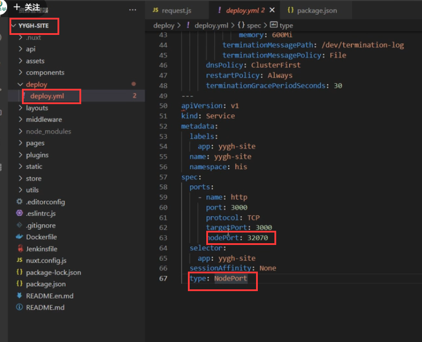
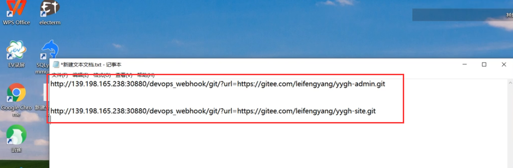
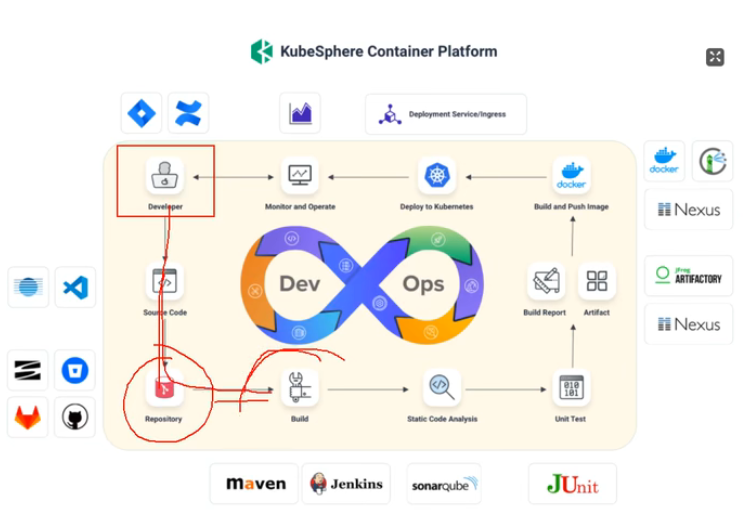
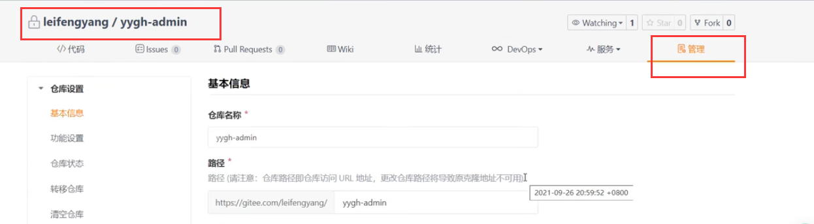
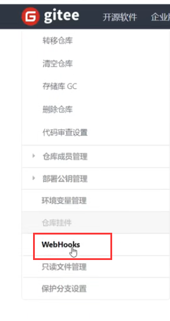
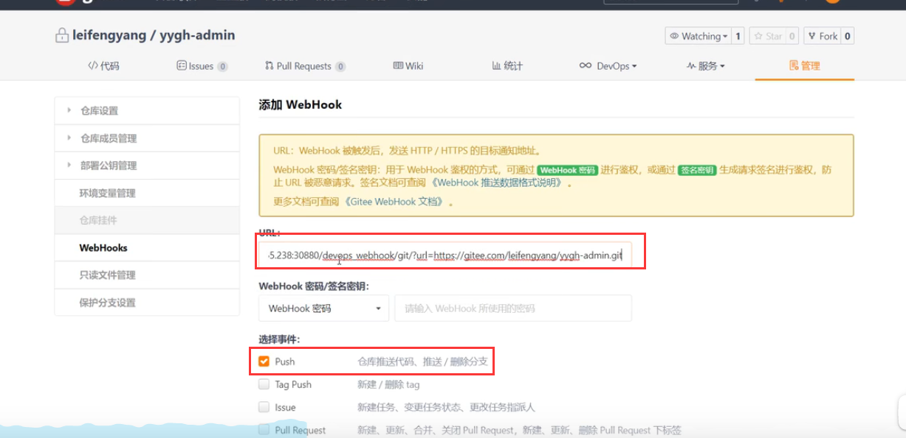
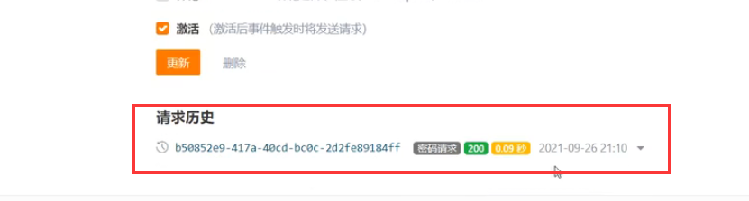
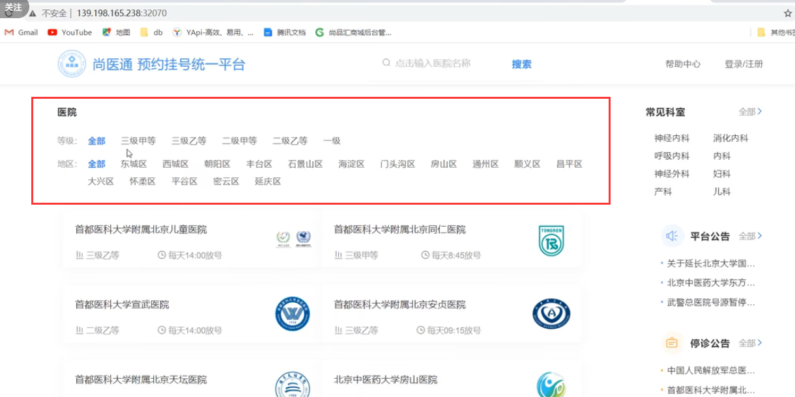

# 24、devops-webhook自动启动流水线进行构建

​	我们给前端的项目也指定暴露的端口

​	我们的前端项目可以多部署几份，在他们的前面可以使用igress来做

我们在之前部署的时候记录过一下 webhook的地址

WebHook是我们远程的触发能力

​	1.每个项目都有流水线文件

​	2.每次修改完项目，我们点击运行流水线

​	3.我们希望每次修改完项目，代码推送，流水线能自动运行（这个自动运行流水线就使用到webhook了）

​			写代码并提交---》比如gitee-----》只要我代码提交了让gitee给指定的地方发送请求，我们把这个行为就叫webhook，也叫web钩子

​			我们发送请求之后呢，kubesphere平台感知到后-----》重新启动流水线--这样的话就成功的触发了自动启动流水线了

​	最终就能实现我们devops最初的想法，代码提交--触发流水线

Web钩子的使用

​	进入到项目的管理中

​	然后在仓库挂件中有WebHooks点击进入

​	然后点击添加--输入webhook的地址和触发钩子的事件--点击提交就可以了

我们可以看到每次的触发

测试查看前端项目--正常

https://www.bilibili.com/video/BV13Q4y1C7hS?p=129&spm_id_from=pageDriver&vd_source=243ad3a9b323313aa1441e5dd414a4ef

