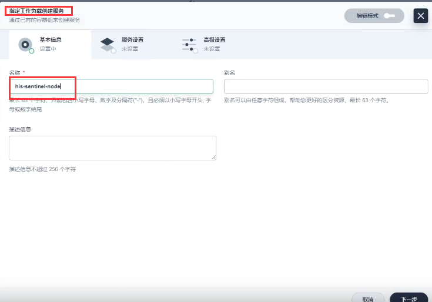

# 3.devops-尚医通-中间件sentinel部署

​	我们先把尚医通项目需要的所有中间件列出来，然后先来部署中间件，然后我们再把尚医通的微服务以devops的方式部署

​		中间件我们之前已经部署好了一部分，我们现在还差2个

#### 部署Sentinel

​	是用来做流量保护功能的

我们使用kubesphere--服务--创建无状态服务

选择镜像：

直接下一步--下一步-创建

查看服务地址

​	在集群内不太方便验证--我们加一个NodePort外网服务--指定工作负载创建服务

外网访问开启

可以看到内网和外网的服务都有了

访问没有问题

​	账号和密码都是sentinel

​	然后就可以看到我们的流量管控平台了

目前还没有我们的微服务，现在都是sentinel自己的服务监控，未来我们的微服务接入到sentinel后也会在sentinel的管理平台中显示整体的流量控制的

​	我们这个现在部署的sentinel比较简单， 其实sentinel还可以连接nacos，可以将 创建的流控规则保存在nacos中。

https://www.bilibili.com/video/BV13Q4y1C7hS?p=108&spm_id_from=pageDriver&vd_source=243ad3a9b323313aa1441e5dd414a4ef

