# 4.devops-尚医通-中间件-mongo部署完成

部署mongo

我们点击应用--部署新应用

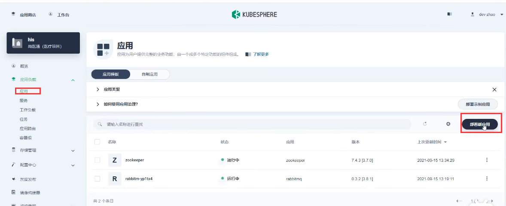

来自应用模板---因为我们之前将bitnami的库拉进来了，里面有很多应用

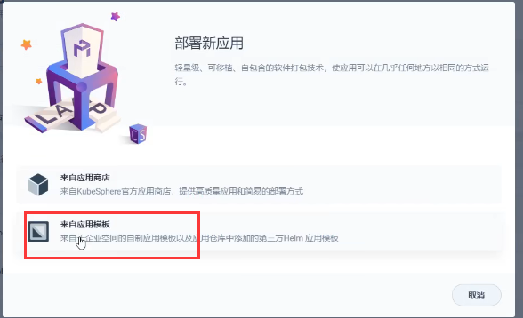

选择mongo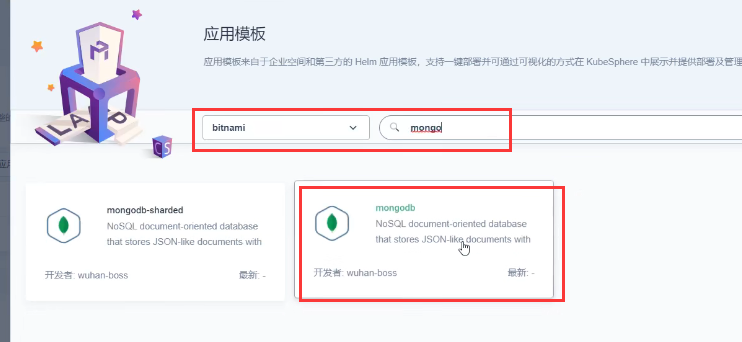

部署：

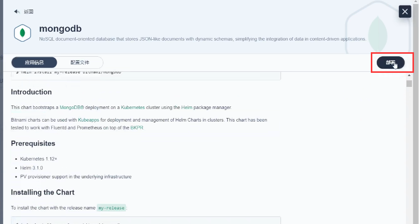

单节点模式

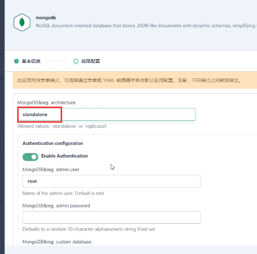

 	Enable Authentication 这个可以关闭掉账号密码的功能

部署

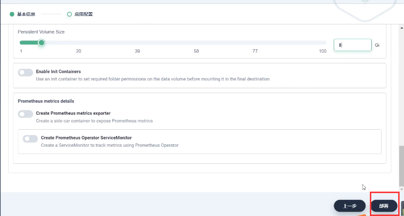

查看集群内地址 ，端口27017

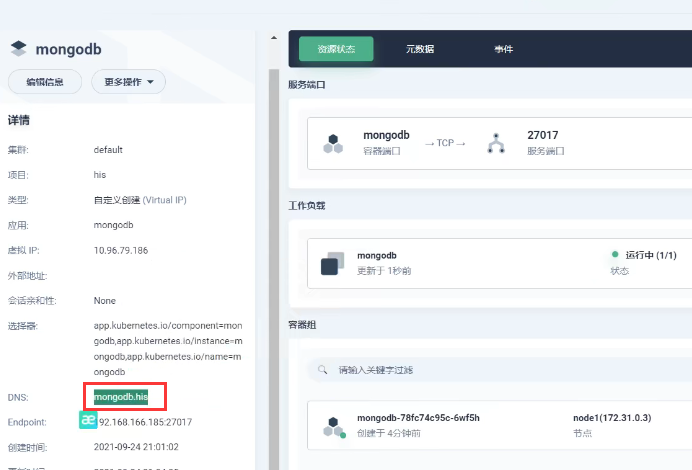

我们再部署一个 指定工作负载的MongoDB服务，设置外网访问方便测试

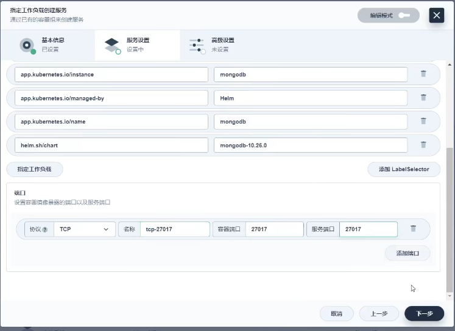

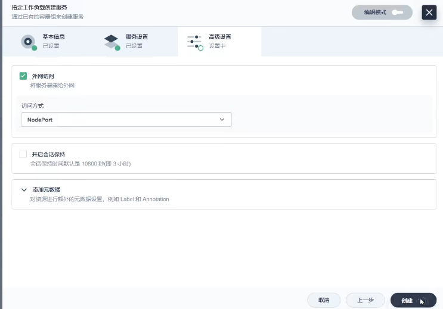

好了，可以看到有2个服务都是mongo的，一个内网，一个外网

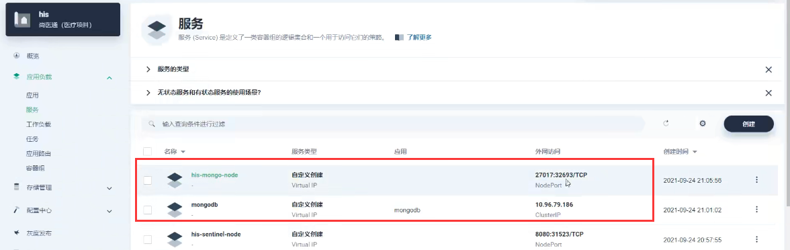

我们使用客户端工具测试一下：

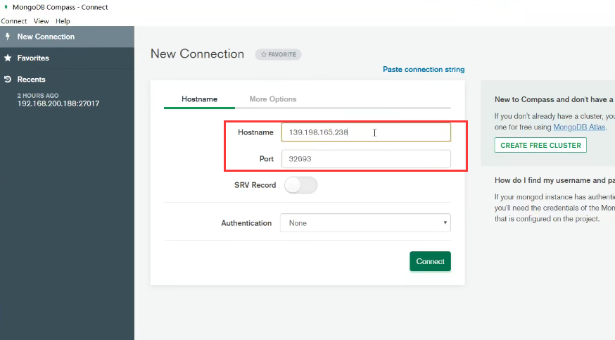

连接没有问题

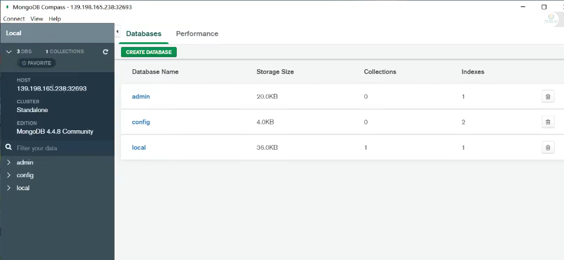

https://www.bilibili.com/video/BV13Q4y1C7hS?p=109&spm_id_from=pageDriver&vd_source=243ad3a9b323313aa1441e5dd414a4ef

