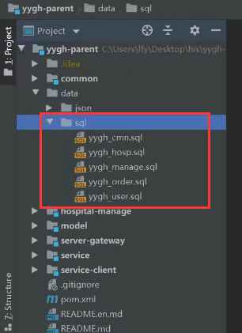
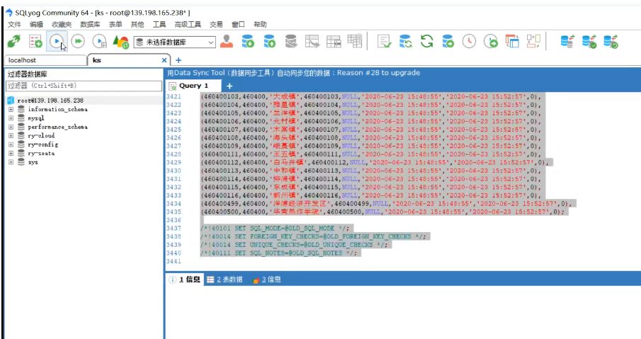
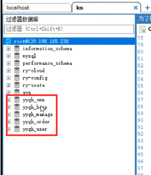

# 5.devops-尚医通-中间件-mysql数据初始化

​	我们需要导入一些项目的初始数据

​	我们的尚医通项目中存放着SQL文件

我们连接线上的mysql--进行数据的导入就可以了

​	一个个脚本执行就可以了

一共是5个库

​	mongodb的库现在可以不导入，项目启动的时候会自动导入

https://www.bilibili.com/video/BV13Q4y1C7hS?p=110&spm_id_from=pageDriver&vd_source=243ad3a9b323313aa1441e5dd414a4ef

