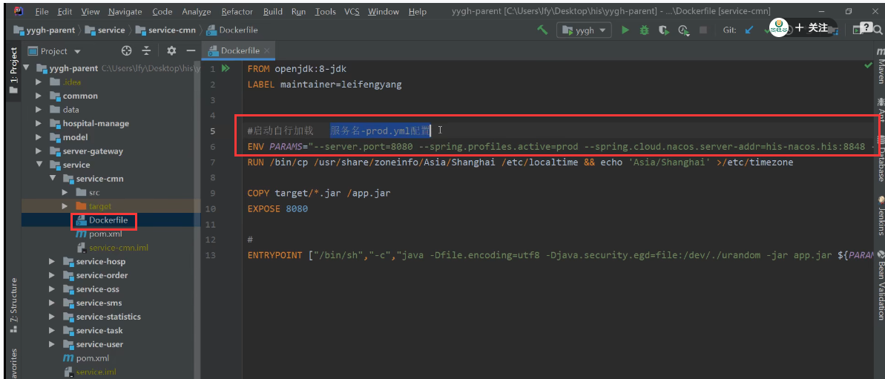
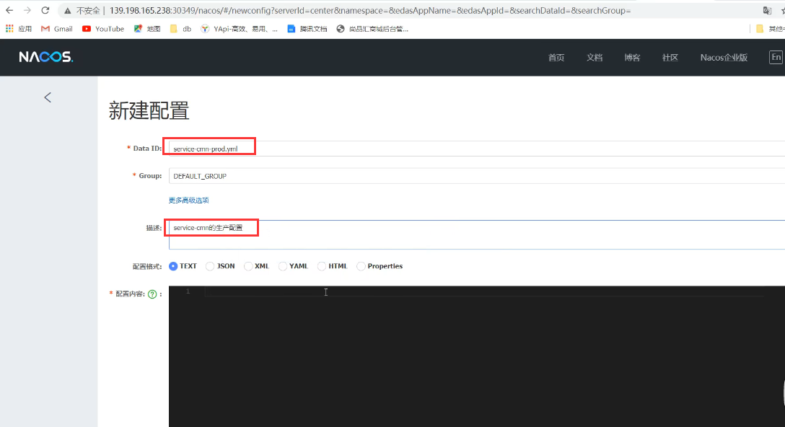
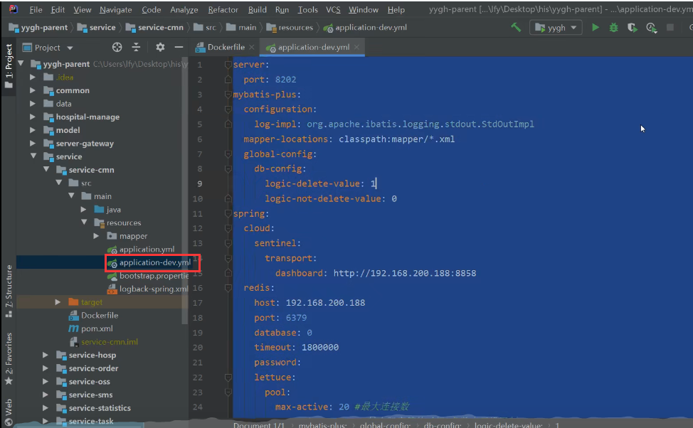
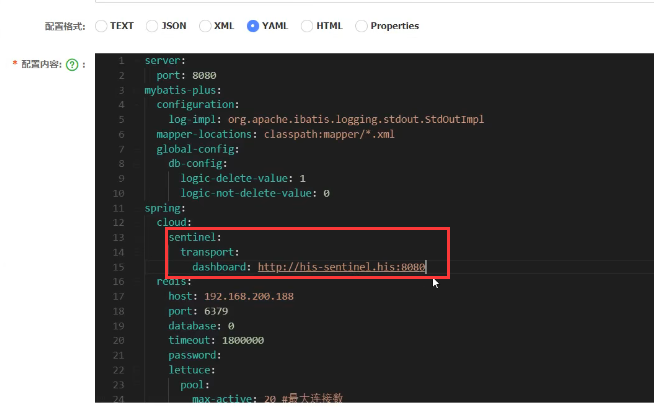
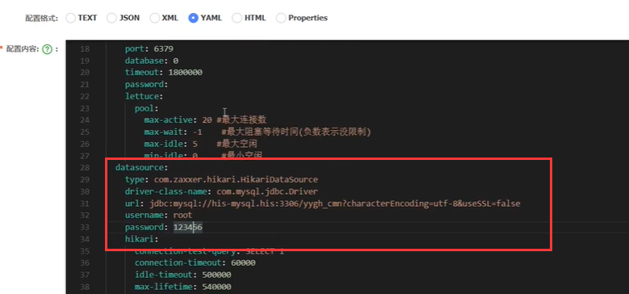
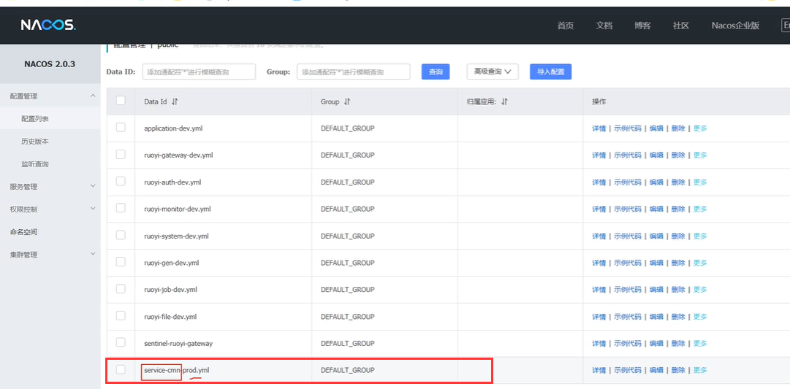
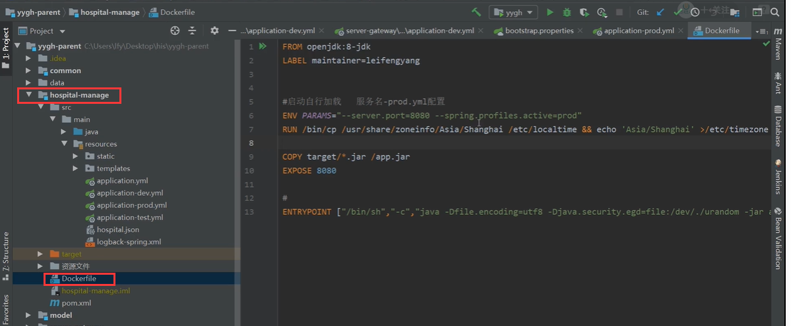
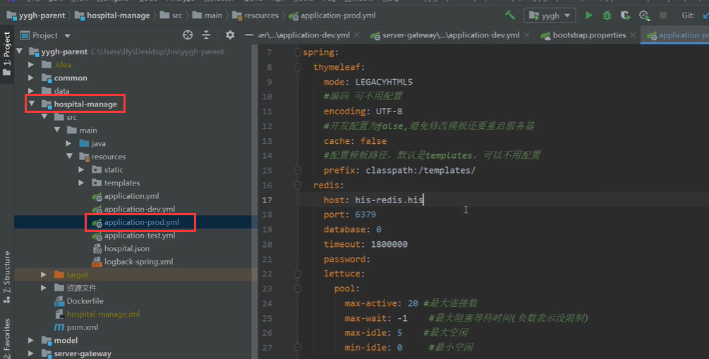

# 6.devops-尚医通-生产环境配置抽取

​		我们现在需要做的是 项目的 生产和开发的隔离

​	我们随便看一个尚医通的微服务的dockerfile

​			注意这里使用的都是线上的配置，如nacos的地址

​			而且每个微服务启动的时候都会激活 使用 服务名-prod.yml  这个配置（这个配置在Nacos中）

我们先连接上生产环境的Nacos，按这个规则进行一下配置

把开发环境的内容先全部拷贝过来

比如端口号我们不改都行，因为我们会用启动命令改掉端口

​	然后就是全部改为线上环境的地址

如sentinel

​	还有redis，数据库及账号密码

创建好了

这样的话，我们在部署微服务的时候，dockerfile打包的时候就会加载出生产环境的配置文件，然后就会以生产环境的模式运行

​	然后是我们的每个微服务都需要这么做

注意：在医院的管理系统部署的时候要注意一下，由于他不是一个SpringCloud应用，他只是一个单体应用，没有bootstrap.yml，所以他的生产环境配置是在项目的代码中，他的dockerfile只是激活prod生产环境，但是没有连Nacos配置中心

修改yml

https://www.bilibili.com/video/BV13Q4y1C7hS?p=111&spm_id_from=pageDriver&vd_source=243ad3a9b323313aa1441e5dd414a4ef

