# 7.devops-创建devops工程&Jenkins可视化

​		在我们devops上云期间，有一个核心组件 jenkins，它可以帮助我们完成整个部署化流程，而且在我们kubesphere里面深度整合了jenkins，而且使用jenkins集群，动态供应的方式--（动态供应就是闲时全力的部署，忙时可能有少量节点部署构建）

​	我们使用kubesphere集成的jenkins就可以把流水线的CI&CD全部打通

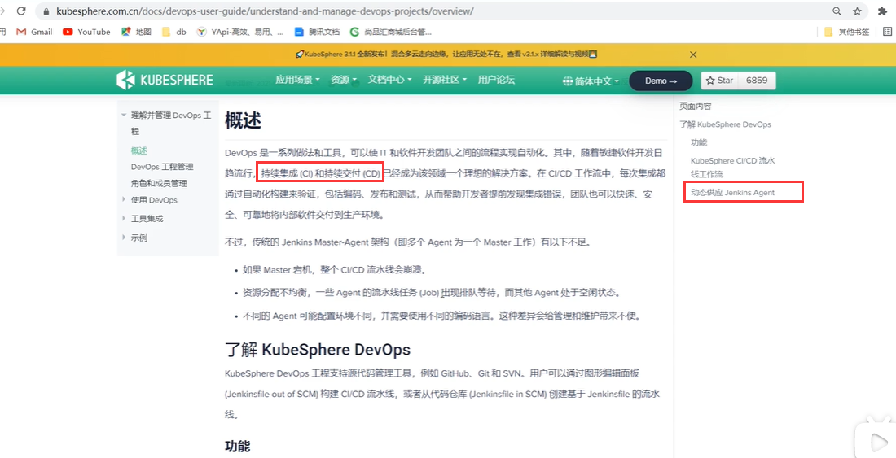

​	而我们要使用强大的jenkins能力，我们只需要在kubesphere中创建一个Devops工程就可以了

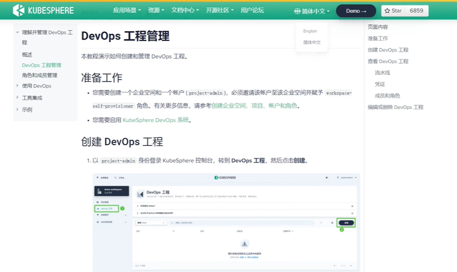

我们需要使用有创建devops工程权限的用户登录 kubesphere

创建devops工程

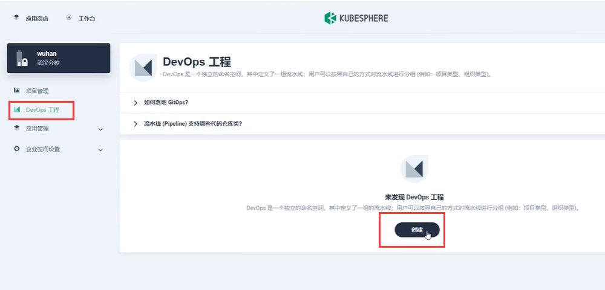

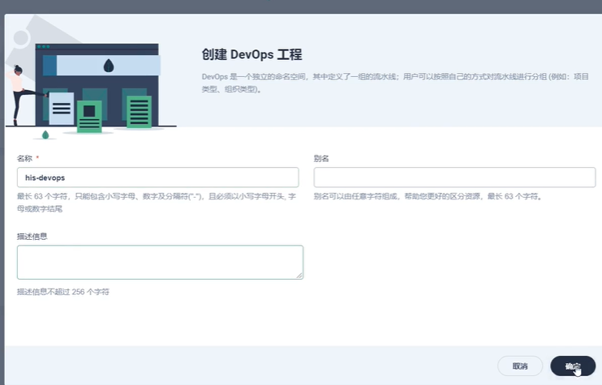

然后创建好devops工程后--邀请一些开发人员

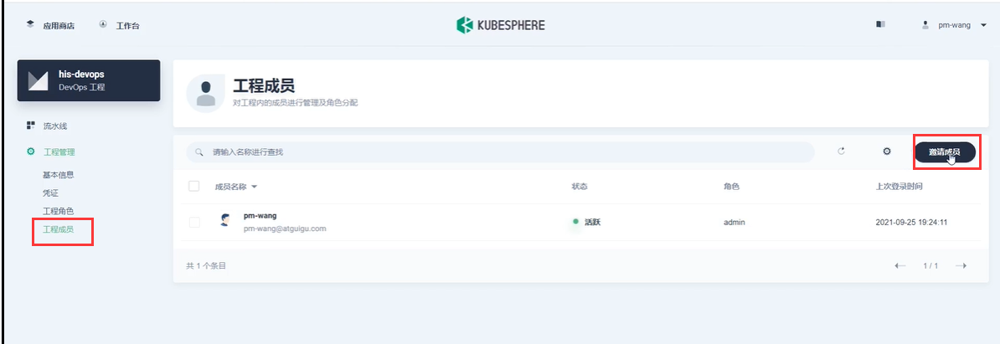

添加好人员后--我们创建devops流水线-----其实这里就是深度整合jenkins的功能

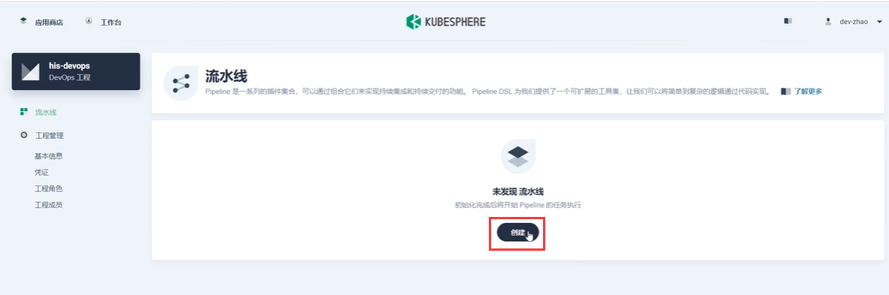

​	我们有了解过Jenkins的就知道其实在项目里面需要创建一个Jenkinsfile的文件，相当于这个jenkinsfile是我们整个工作用的流水线文件

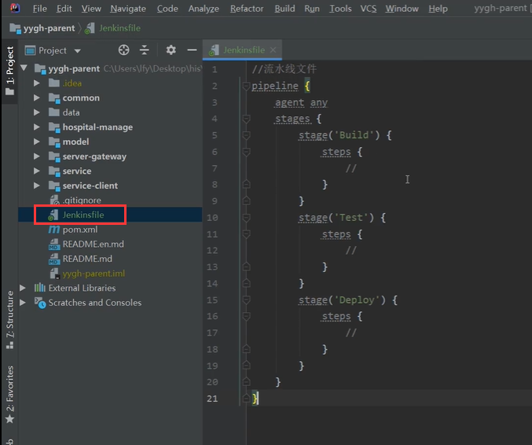

​	这个流水线文件的编写其实是比较麻烦的，按照以前我们需要参照Jenkins的官方文档

​			当然这段代码只是一个最简单的流水线

​			pipeline--代表整个项目开启自动化流水线的构建

​				agent any---这个和Jenkins的集群工作有关

​				stages---这个相当于在整个流水线操作的步骤

​					stage---相当于流水线的一个步骤

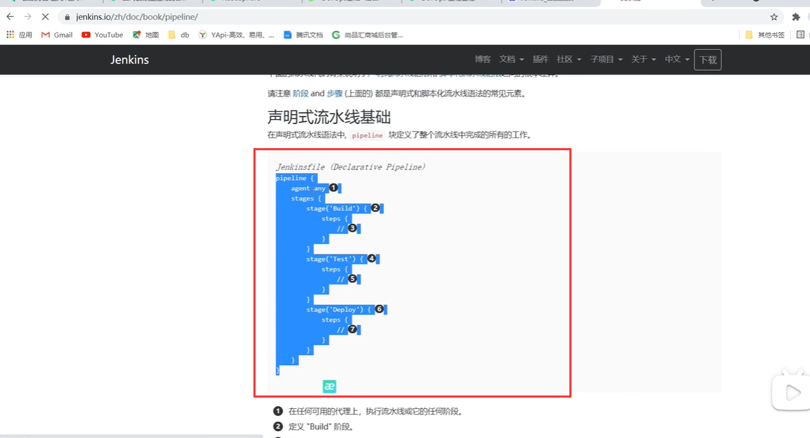

​	因为kubesphere提供了可视化的流水线创建方式，这样就更简单了，我们直接创建流水线

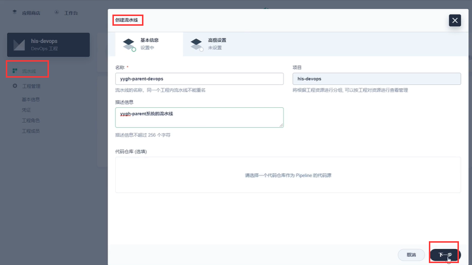

创建

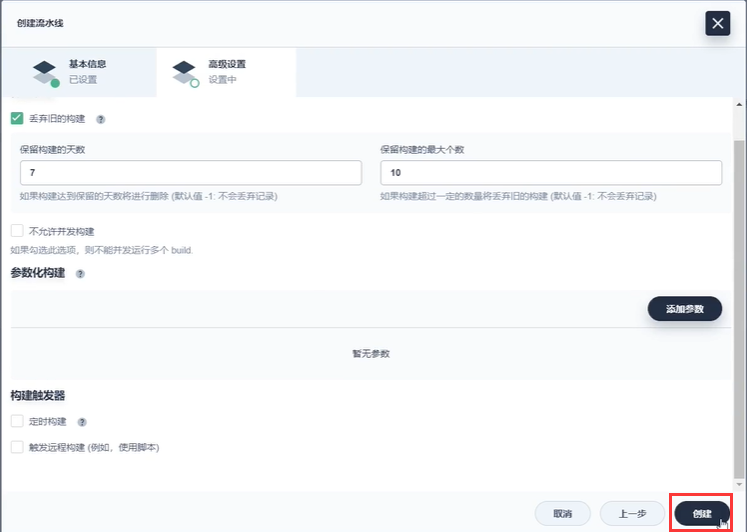

创建之后---我们可以编辑流水线

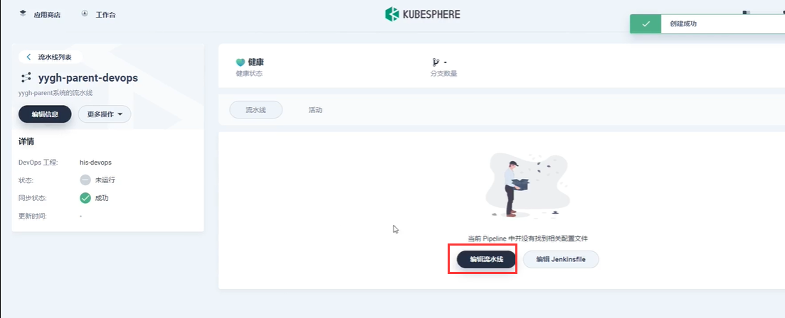

选择让他生成一个流水线模板----这个模板他是一个可视化界面

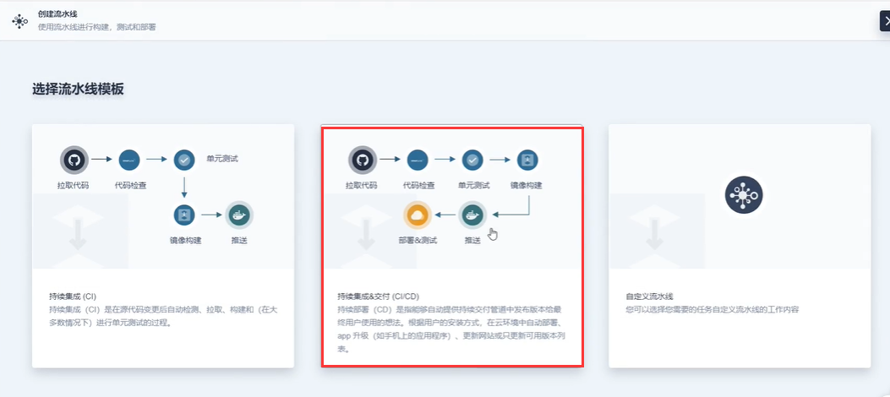

保存流水线

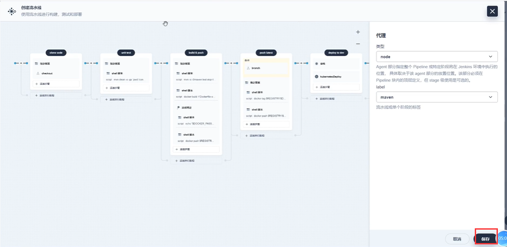

​	我们可以编辑Jenkinsfile模板文件

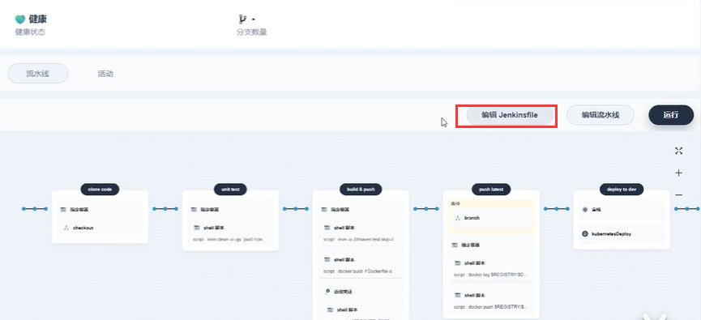

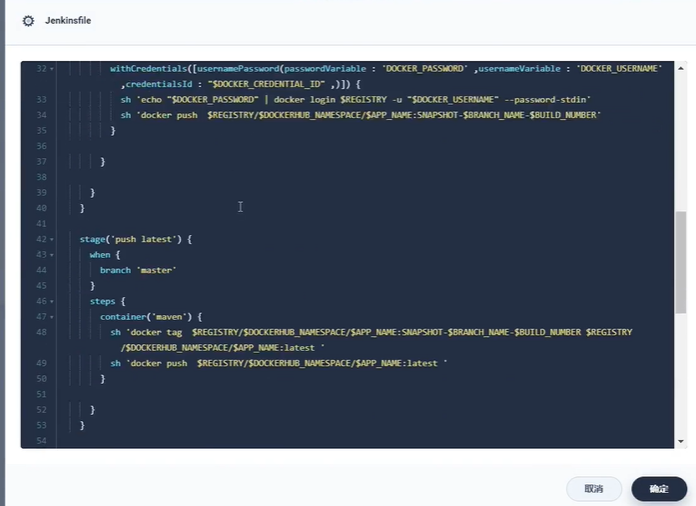

当我们不熟悉流水线文件的编写，我们不妨先自动生成一个流水线模板，然后再放到我们的项目中

https://www.bilibili.com/video/BV13Q4y1C7hS?p=112&spm_id_from=pageDriver&vd_source=243ad3a9b323313aa1441e5dd414a4ef