# 8.devops-可视化Pipeline-第一步-拉取代码

​	我们之前创建的流水线模板已经有了，我们下面只需要在可视化的编辑流水线就可以了

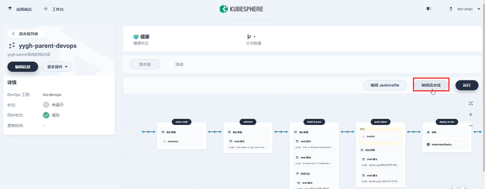

​	目前模板的第一步--是克隆代码

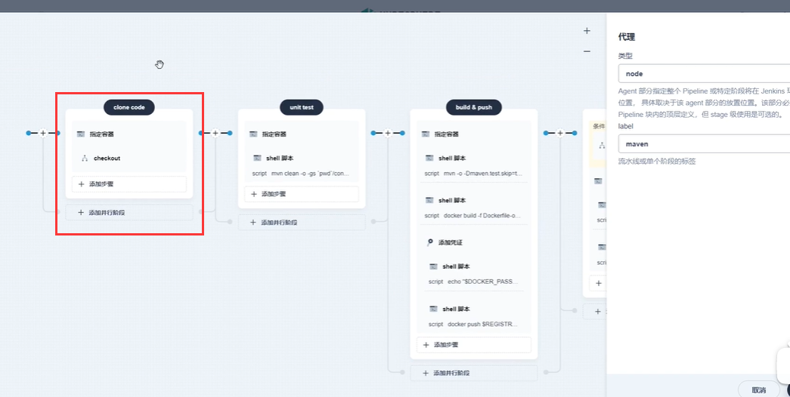

​	我们注意一下右侧的node及代理（agent是Jenkins集群里面的代理），这个代理的意思就是我们接下来要做什么样的工作，需要什么样的工作我们使用什么的代理，比如我们使用java写的项目，那么就选择maven，maven会对java项目进行打包构建，而如果是前端项目，我们就选择nodejs

​		Jenkins集群会有一个master节点有N个代理节点，代理节点会帮助我们进行各个项目的构建工作

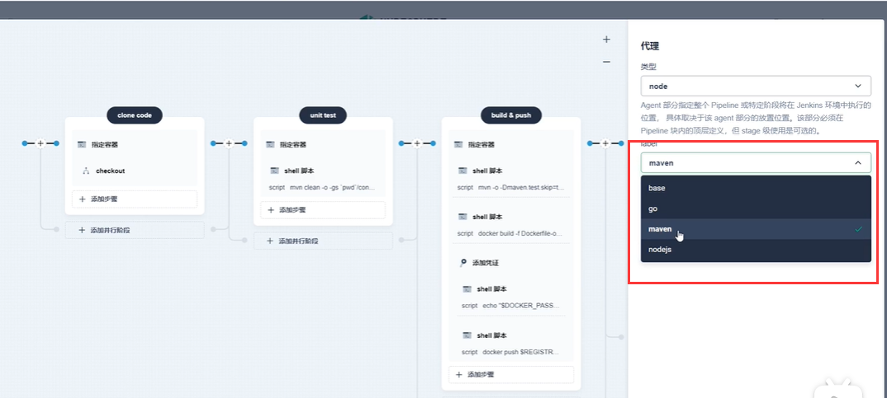

查看一下kubesphere集成Jenkins的官方文档

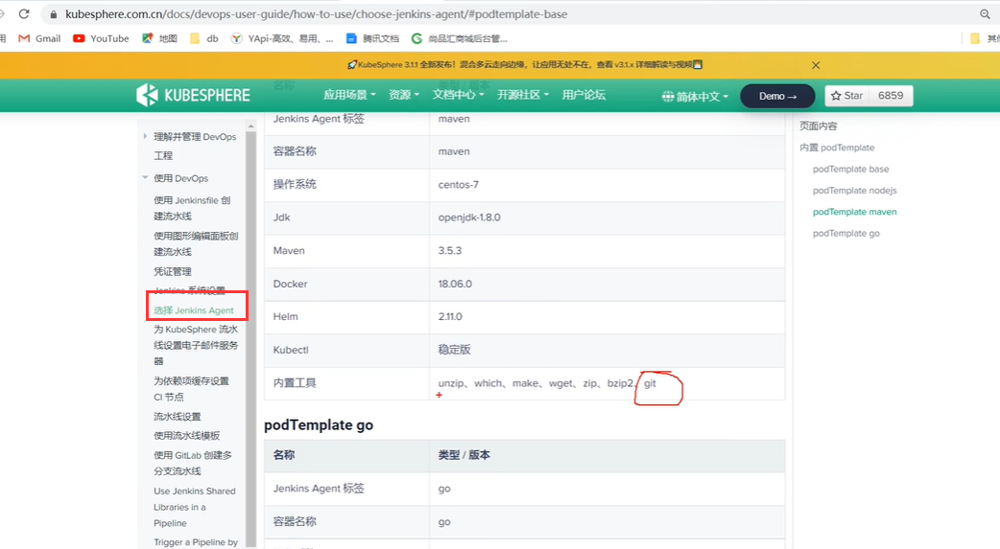

​	我们目前是在大背景下选择了使用maven进行项目的构建，如果某个步骤需要其他的代理来构建的话还是可以单独来选代理的。

#### 1、拉取代码

​	

​	我们点击第一步的框--然后编辑阶段步骤的名称，然后如果有条件我们设置条件，如果没有条件我们设置执行的任务

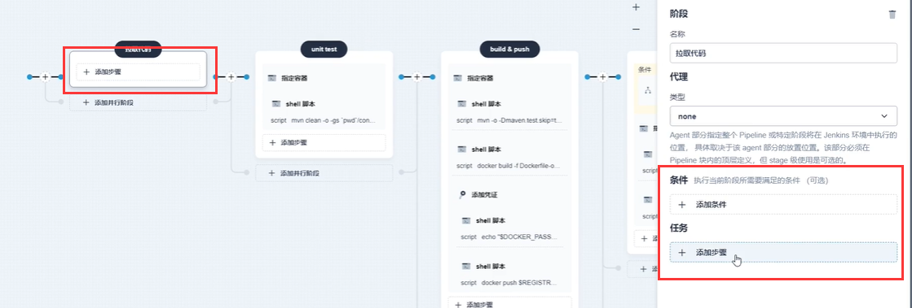

​	我们在添加步骤的时候--第一步要选择**指定容器**，就是我们接下来的任务是指定某个容器下进行工作

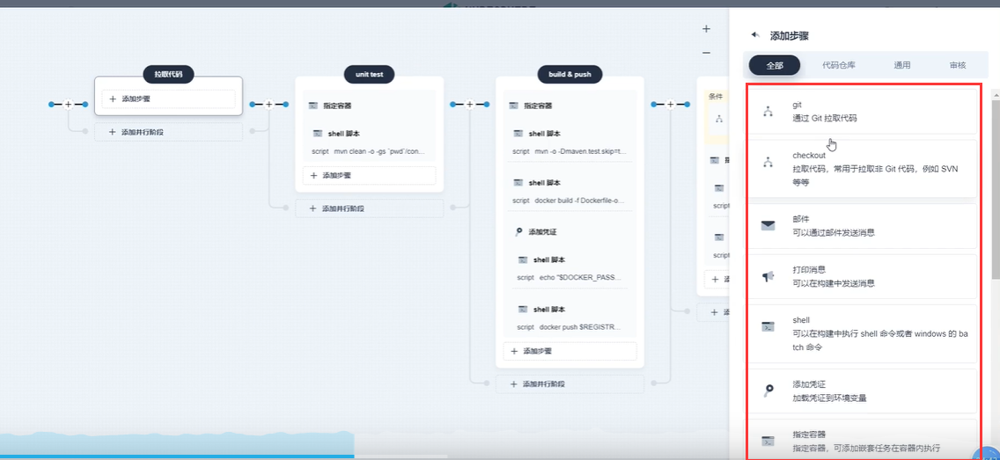

我们选择base容器--因为base容器也可以拉取代码

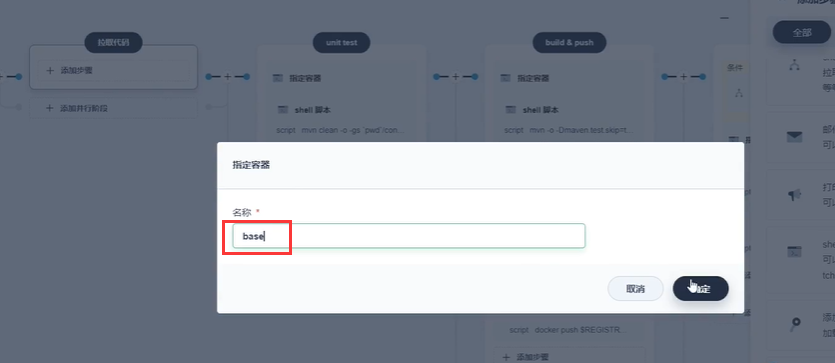

然后是添加嵌套步骤---嵌套步骤就是在容器内的操作

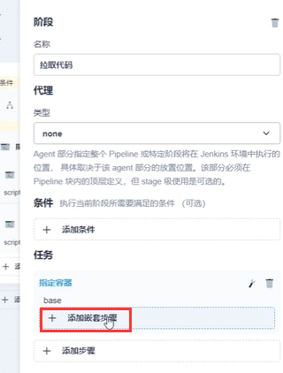

​	我们选择通过git拉取代码---如果是svn就选择checkout

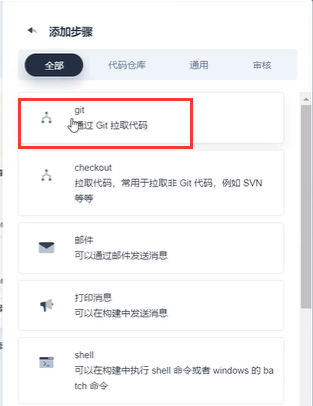

输入git代码地址--然后创建凭证

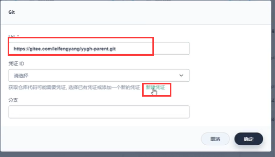

  创建凭证--k8s会自动存储这个git凭证的

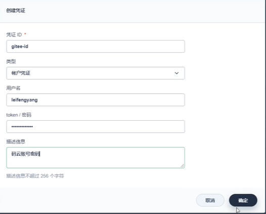

选择分支：

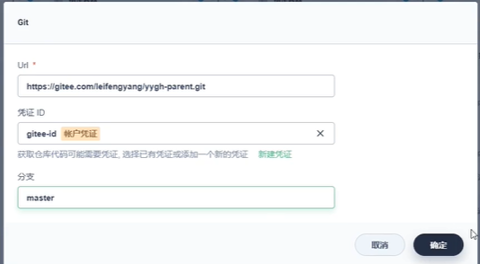

这样其实流水线的第一步就做完了

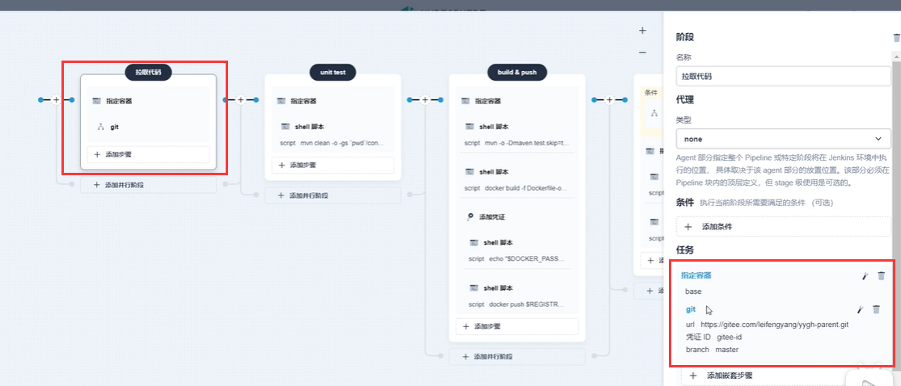

​	我们拉取完代码，我们不妨让他打印一下，那么我们就再添加一个嵌套步骤

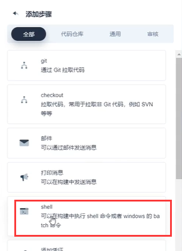

我们输入个ls或ll，列出文件的内容

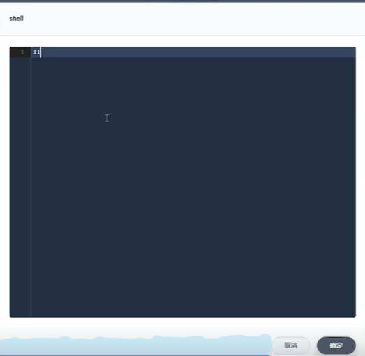

确定

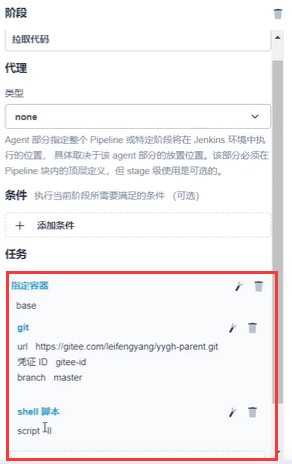

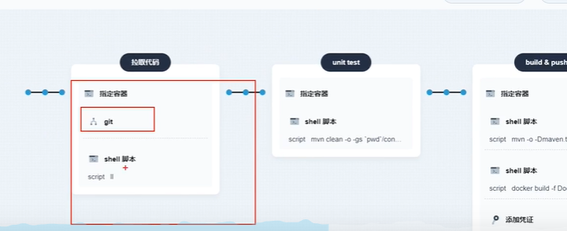

​	我们第一步做完后--我们不妨测试一下第一步做成了什么样的，点击运行

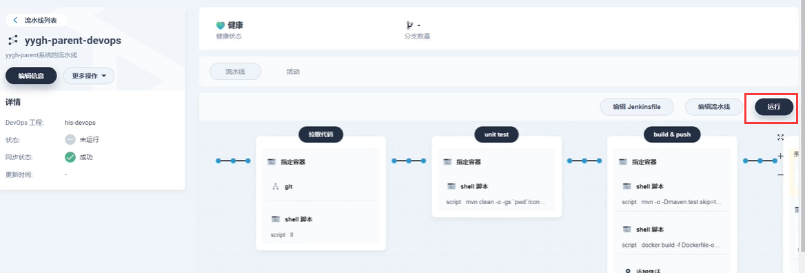

​	我们编辑Jenkinsfile查看一下这个文件，copy到项目中方便我们梳理一下这个文件是怎么写的

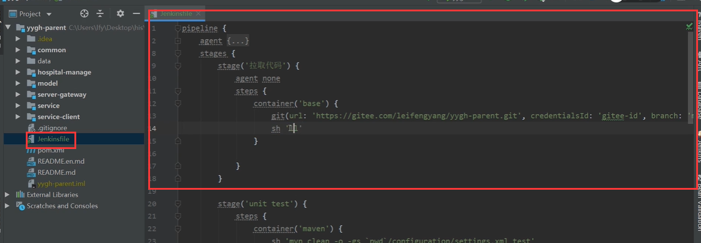

点击运行后---正在运行中，点进去

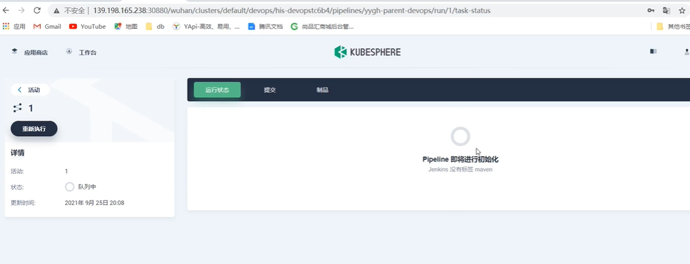

然后我们查看日志

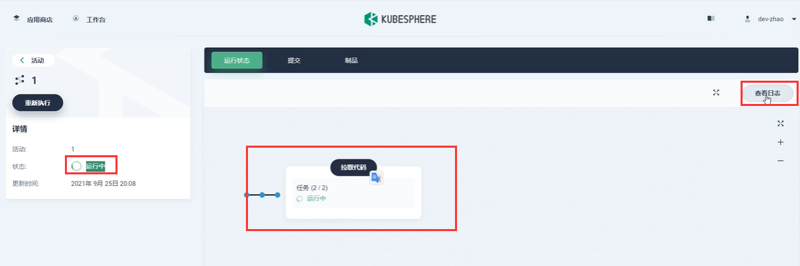

发现报错了--期待是一个Http的协议，但是现在出现了一个400的请求，说base容器是一个不合法的

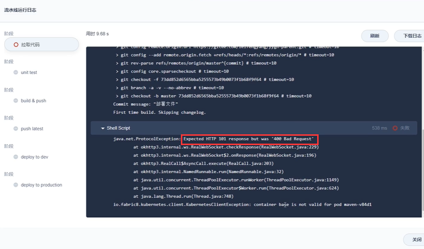

我们将容器指定成maven的试试

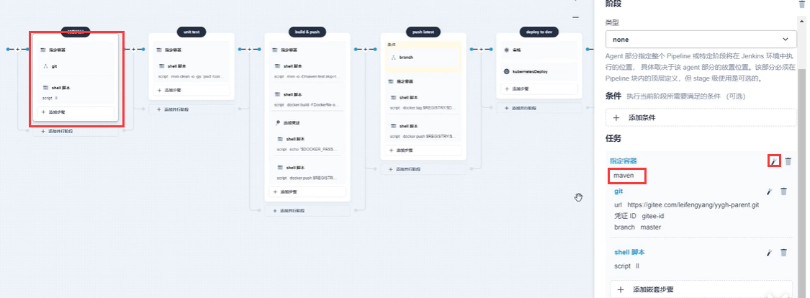

查看日志--我们可以看到代码已经拉取成功了，但是有个报错是ll这个命令找不到

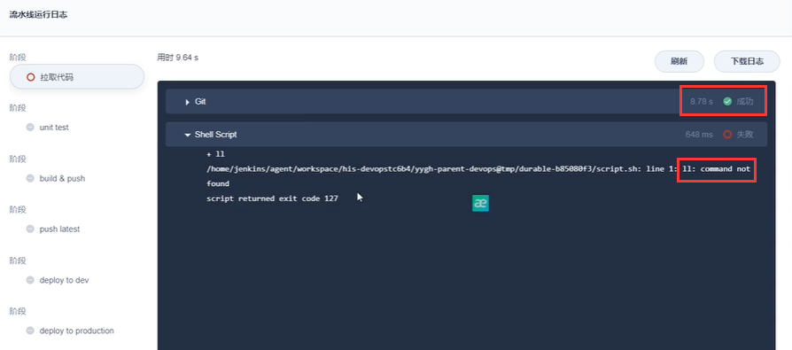

​	其实ll命令是在最纯净的linux里面是没有的，我们改为ls

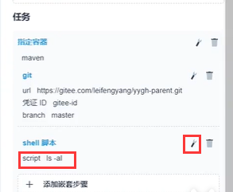

再次运行--查看日志--没有问题-流水线第一步运行成功了

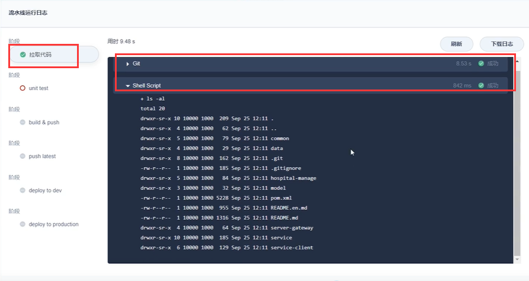

https://www.bilibili.com/video/BV13Q4y1C7hS?p=113&spm_id_from=pageDriver&vd_source=243ad3a9b323313aa1441e5dd414a4ef

