# 9.devops-可视化Pipeline-第二步-项目编译

​	我们的流水线第一步已经完成了--下面我们就来可视化Pipeline编辑第二步流水线

​	第二步默认模板是单元测试unit test 我们改为项目编译

​	添加步骤--指定容器maven，因为编译要使用到maven命令

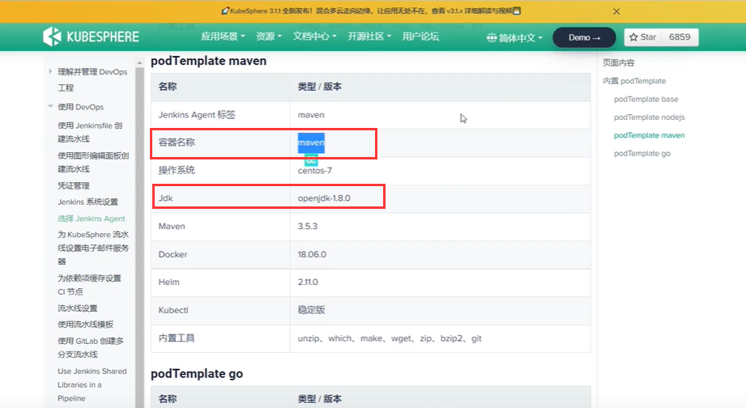

指定容器

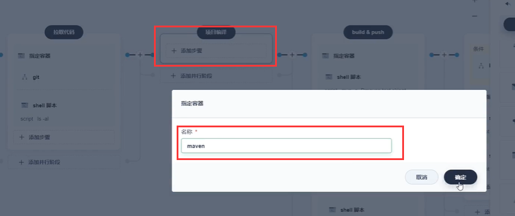

​	先确定代码文件--添加一个shell脚本 ls

​	我们想一下我们以前自己打包的时候，mvn 先clean 然后 package打包，然后-Dmaven.test.skip=true跳过测试

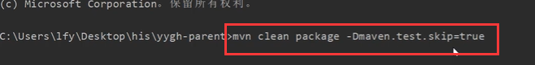

​	现在我们添加嵌套步骤--执行shell脚本 mvn的命令

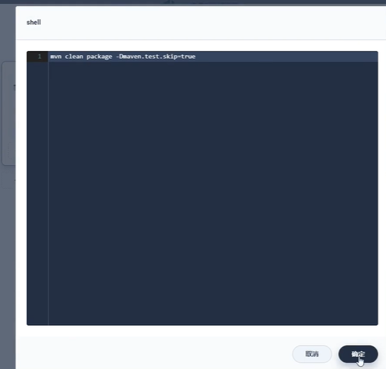

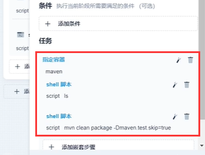

​	我们现在运行一下流水线--测试一下流水线项目是否能运行起来

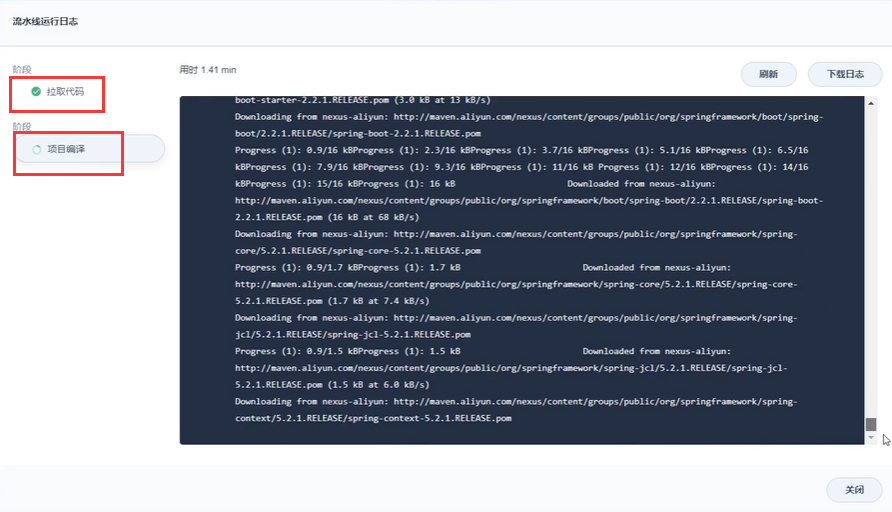

​	这个编译的过程比较慢-----注意可能这里是去maven的中央仓库去下载包，导致速度很慢，因为我们之前在本地运行的时候一般是设置maven的mirror指定镜像的加速仓库如阿里云的镜像，但是在这里并没有指定

​	如果需要修改镜像仓库地址的话---使用admin登录kubesphere

​	平台管理--集群管理--配置中心--配置下

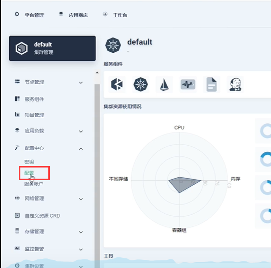

​	然后找到devops-agent这个就是maven的配置，修改这个配置

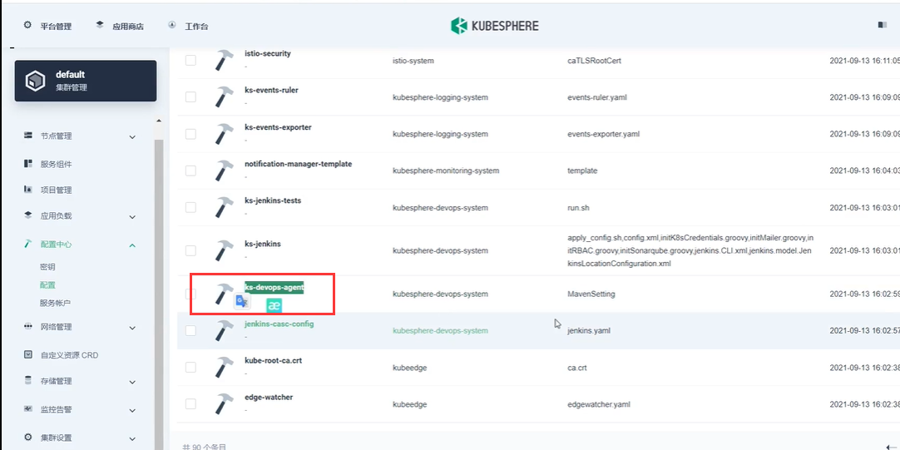

​	点击修改配置--将我们指定的mirror镜像地址拷贝进去

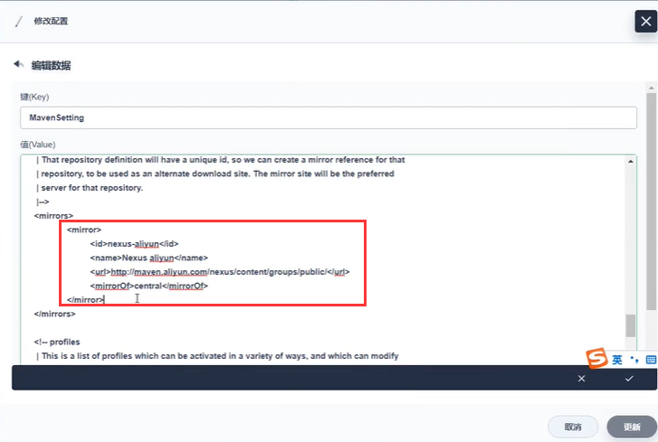

​		还有--如果是本地jar包---那么就需要使用到私服了

​	现在我们修改好以后--再来运行流水线，看看编译打包的速度是不是快了

​	可以看到编译和打包花费了4分钟的时间--编译成功没有问题

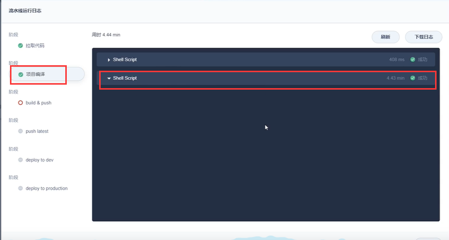

​	还有个问题就是，比如我们项目打包过了，那么我们的流水线还需不需要重新把所有的东西都下载一遍呢？

​	我们再次运行一下流水线--我们发现第二次，编译打包只用了18秒，日志中也没有下载包的日志，所以kubesphere在集成Jenkins也帮助我们加入了合理的缓存机制，下载过的jar包会缓存下来，下次就不需要下载了。

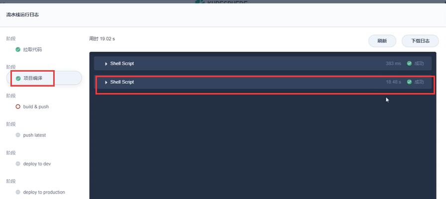

​	所以说我们的流水线是越来越快的

## 1、修改maven让他从阿里云下载镜像

- 使用admin登陆ks
- 进入集群管理
- 进入配置中心
- 找到配置

- - [ks-devops-agent](http://139.198.165.238:30880/clusters/default/projects/kubesphere-devops-system/configmaps/ks-devops-agent)
  - 修改这个配置。加入maven阿里云镜像加速地址

## 2、缓存机制

已经下载过的jar包，下一次流水线的启动，不会重复下载

https://www.bilibili.com/video/BV13Q4y1C7hS?p=114&spm_id_from=pageDriver&vd_source=243ad3a9b323313aa1441e5dd414a4ef

