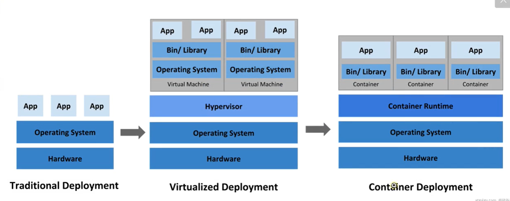
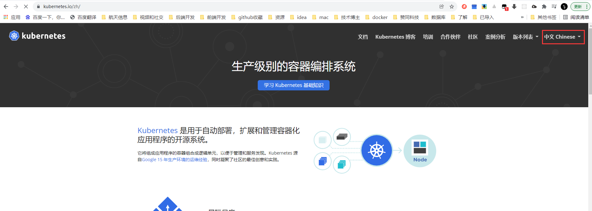
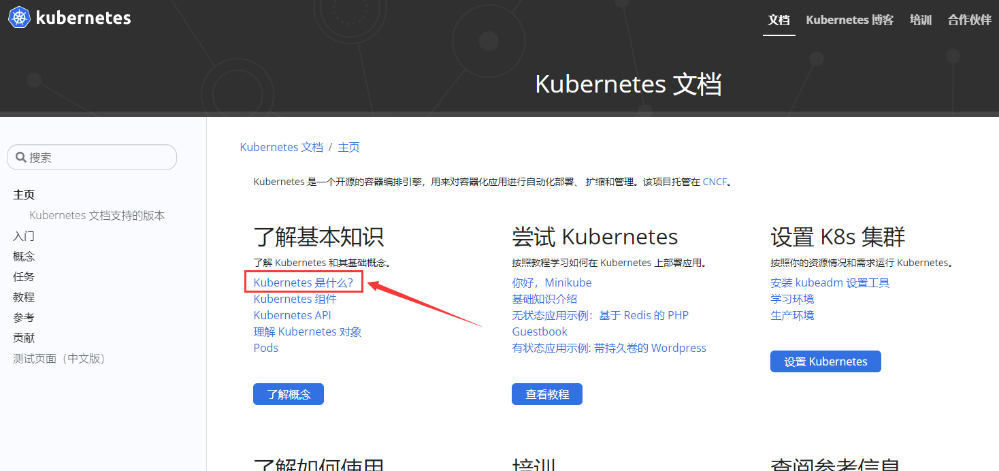

# 1.kubermetes基础-介绍

## 1.k8s的理解

​	我们先理解一下什么是k8s--kubermetes

先理解一下这个图：

- 1.Traditional是传统的部署方式
  - 如果把一些应用全部部署在某台机器上，由于应用之间没有隔离性，可能由于A应用内存泄漏，导致其他应用也奔溃掉了，所以不是特别的安全
- 2.virtualized是虚拟化的部署方式
  - 在物理机上可以通过虚拟化技术，开通几个虚拟机如图有2个虚拟机，我们把应用部署在虚拟机上，即使应用奔溃了，只影响某个部署的虚拟机，不会影响其他的虚拟机--虚拟机太笨重了
- 3.Container是容器化部署
  - 在操作系统之上，安装好容器环境Container Runtime也就是docker，然后就可以以容器化的方式来运行应用了，每个容器的应用大约也就是几百MB，还是非常的轻量化的，甚至有的几十MB，怎么也比在虚拟机几个G要轻的多
  - 以容器化的方式部署也是可以资源相互隔离的，可以理解为小linux系统

#### 问题：

​		**那么如果是以容器化的方式，又会给我们带来什么问题，比如我们开发了抖音，服务模块众多，微服务划分了好多小项目，每个小项目都以容器化的方式部署，而且一台服务器还不够，我们把这些项目放入十几台服务器中，可能每台服务器部署有30-50个容器，那么这么多的容器管理起来就非常的麻烦了**

​		我们以前使用docker我们docker run 跑上几个应用，我们可以人工的进行运维，但是我们几百几千个容器，哪个容器故障了，我们可能需要在其他的服务器上自动的启动备用容器或从节点，这样我们就需要一个**管理容器的系统**--**容器编排系统**。

​		那么k8s就是解决这个问题的。

​		注意编排的意思： 编--我们可以给所有的容器进行编组--有编才可以管理起来

​										排--比如一个应用在A服务器上放了3个，服务器不够放了，然后由k8s 排列到其他的服务器上进行扩充，这个就是排

## 2.k8s的特性

​	以下的特性是来自官方文档的内容

 

https://kubernetes.io/zh/docs/concepts/overview/what-is-kubernetes/

Kubernetes 为你提供：

- **服务发现和负载均衡**

  Kubernetes 可以使用 DNS 名称或自己的 IP 地址公开容器，如果进入容器的流量很大， Kubernetes 可以负载均衡并分配网络流量，从而使部署稳定。

- **存储编排**

  Kubernetes 允许你自动挂载你选择的存储系统，例如本地存储、公共云提供商等。

- **自动部署和回滚**

  你可以使用 Kubernetes 描述已部署容器的所需状态，它可以以受控的速率将实际状态 更改为期望状态。例如，你可以自动化 Kubernetes 来为你的部署创建新容器， 删除现有容器并将它们的所有资源用于新容器。

- **自动完成装箱计算**

  Kubernetes 允许你指定每个容器所需 CPU 和内存（RAM）。 当容器指定了资源请求时，Kubernetes 可以做出更好的决策来管理容器的资源。

- **自我修复**

  Kubernetes 重新启动失败的容器、替换容器、杀死不响应用户定义的 运行状况检查的容器，并且在准备好服务之前不将其通告给客户端。

- **密钥与配置管理**

  Kubernetes 允许你存储和管理敏感信息，例如密码、OAuth 令牌和 ssh 密钥。 你可以在不重建容器镜像的情况下部署和更新密钥和应用程序配置，也无需在堆栈配置中暴露密钥。

**Kubernetes 为你提供了一个可弹性运行分布式系统的框架。 Kubernetes 会满足你的扩展要求、故障转移、部署模式等。 例如，Kubernetes 可以轻松管理系统的 Canary 部署。**

https://www.bilibili.com/video/BV13Q4y1C7hS?p=26

