# 10.k8s集群搭建-初始化主节点

​	我们下面使用kubeadm引导启动集群，主要启动集群我们先来想一下这么几个事情，未来厂长kubelet会在每一台机器上，比如每台机器上都有kube-proxy，就相当于先由这个厂长下载镜像然后启动这个应用的

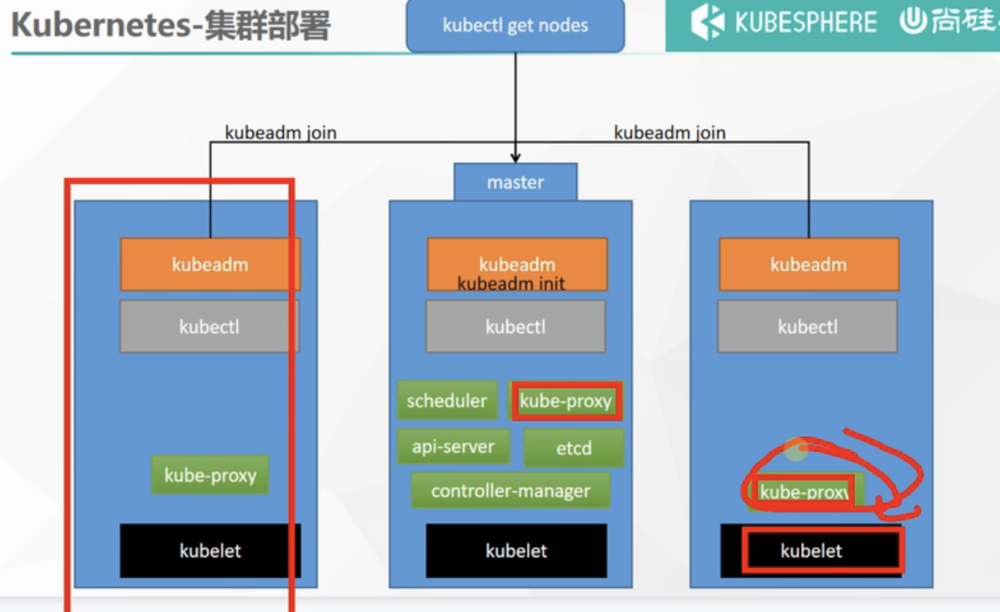

​	所以除了kubelet，剩下的应用都是以容器化的方式运行，先下载镜像，再来启动容器的，所以这个镜像呢我们可以提前下载下来，担心安装的过程中下载的中途卡主了，我们也不清楚卡在哪里了，所以我们准备了提前下载镜像的脚本


## 1、使用kubeadm引导集群

####  1、下载各个机器需要的镜像

脚本：

```bash
sudo tee ./images.sh <<-'EOF'
#!/bin/bash
images=(
kube-apiserver:v1.20.9
kube-proxy:v1.20.9
kube-controller-manager:v1.20.9
kube-scheduler:v1.20.9
coredns:1.7.0
etcd:3.4.13-0
pause:3.2
)
for imageName in ${images[@]} ; do
docker pull registry.cn-hangzhou.aliyuncs.com/lfy_k8s_images/$imageName
done
EOF
   
chmod +x ./images.sh && ./images.sh
```

​	我们复制第一个脚本命令到 EFO结束

​	然后我们只需要在master节点执行

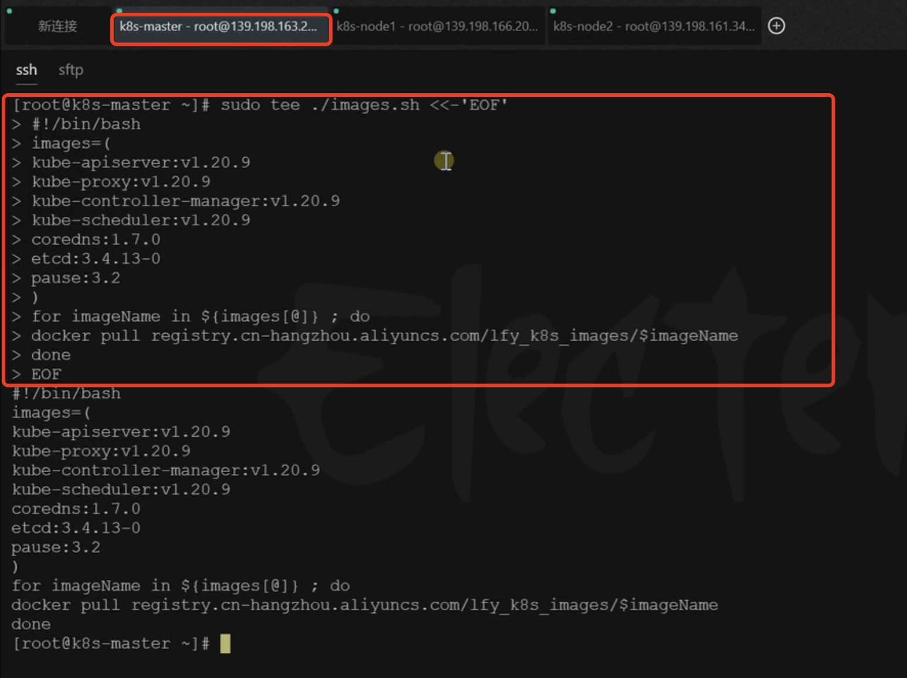


看下效果：这个脚本产生的一个效果，会给我们产生一个images.sh的文件

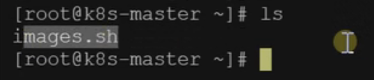


images.sh这个文件里面就是一个for循环，把我们需要的内容下载下来

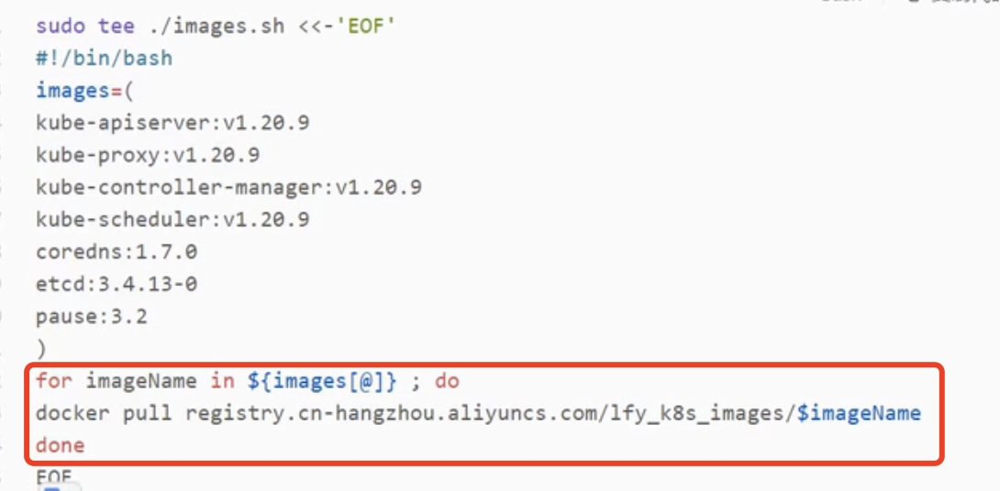


​	然后我们给这个images.sh加一下权限，让他可以正常执行下载

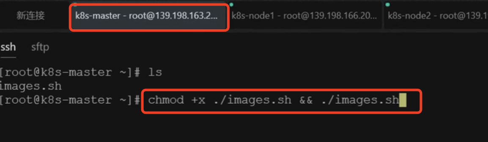

​	

​		现在master节点的机器就开始下载这些镜像了，那么第二台机器需要下载这些镜像吗？其实每台机器都是需要kube-proxy（门卫大爷）这个镜像的，所以这个镜像我们可以单独使用docker pull 来进行下载

```bash
docker pull registry.cn-hangzhou.aliyuncs.com/lfy_k8s_images/kube-proxy:v1.20.9
```

如果我们担心这些镜像可能缺，那么就和主节点一样，全部都执行一下


​	我们下载完所有的镜像后，我们可以检查一下下载的内容：有7个镜像

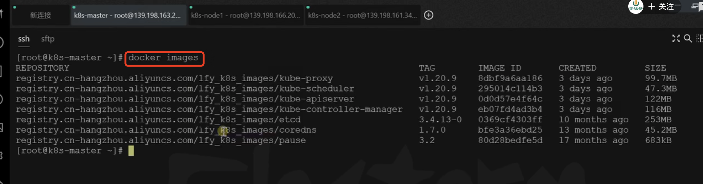


​	然后我们接下来就使用kubeadm工具先把k8s-master变成我们的主节点，如何做呢？

​	首先特别关键的一步：需要修改为自己的，先拿到集群内网的IP，如:172.31.0.2

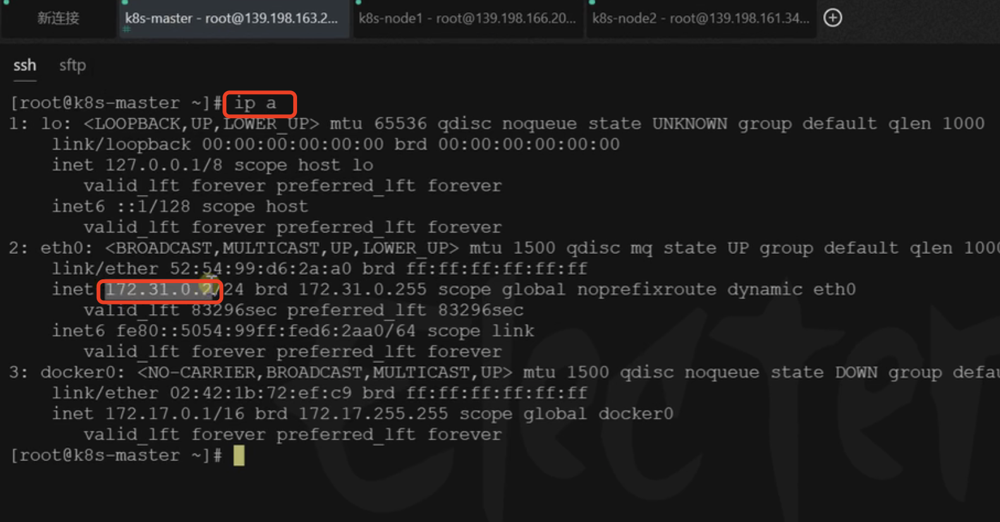

​	这相当于master节点的ip，也叫集群入口的节点，然后给etc/host中添加一个域名映射

```bash
#所有机器添加master域名映射，以下需要修改为自己的
echo "172.31.0.4  cluster-endpoint" >> /etc/hosts

```


​	要让所有节点都知道master节点在哪，所以每个节点都需要添加这个命令

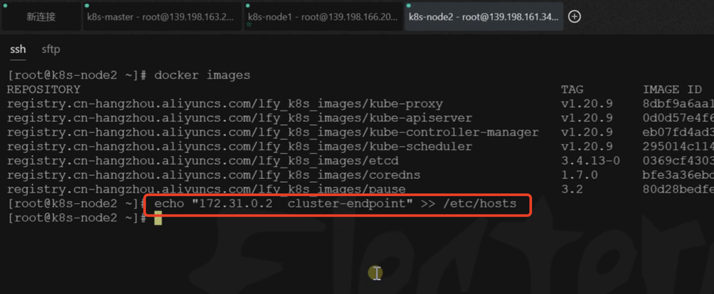


执行后，最终完成效果是什么呢？如果我们ping这个域名cluster-endpoint可以ping通就ok了

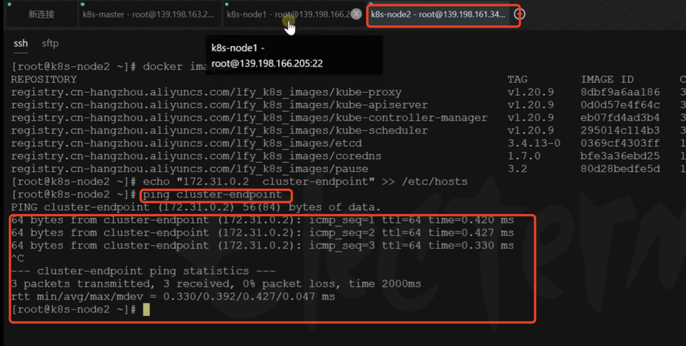


#### 主节点初始化

​	我们现在使用kubeadm帮我们快速初始化一个主节点，然后主节点需要

​	设置主节点master的ip（--apiserver-adverties-address）,

​	然后设置主节点的域名（--control-plane-endpoint）

​	设置镜像仓库（--image-repository）

​	设置k8s的版本（--kubernate-version）

​	设置网络范围（--service-cidr负载均衡用的，--pod-network-cidr）--这个我们后续再说，如果要改要保证这俩个网络范围不重叠，也不能和我们机器的ip重叠，这些我们使用默认的就可以

```bash
#主节点初始化
kubeadm init \
--apiserver-advertise-address=172.31.0.4 \
--control-plane-endpoint=cluster-endpoint \
--image-repository registry.cn-hangzhou.aliyuncs.com/lfy_k8s_images \
--kubernetes-version v1.20.9 \
--service-cidr=10.96.0.0/16 \
--pod-network-cidr=192.168.0.0/16

#所有网络范围不重叠
```

​	这个脚本只在主节点运行

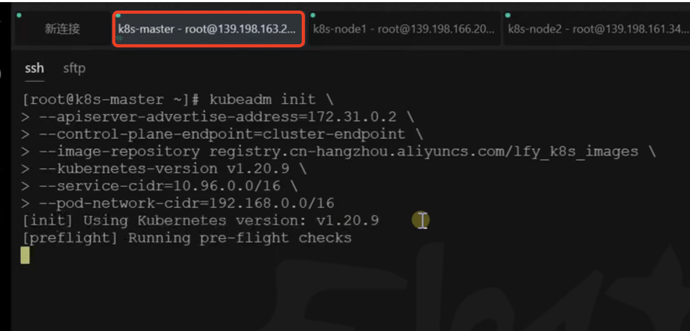


稍等一会儿：如果看到 你的k8s控制面变已经初始化成功就OK了

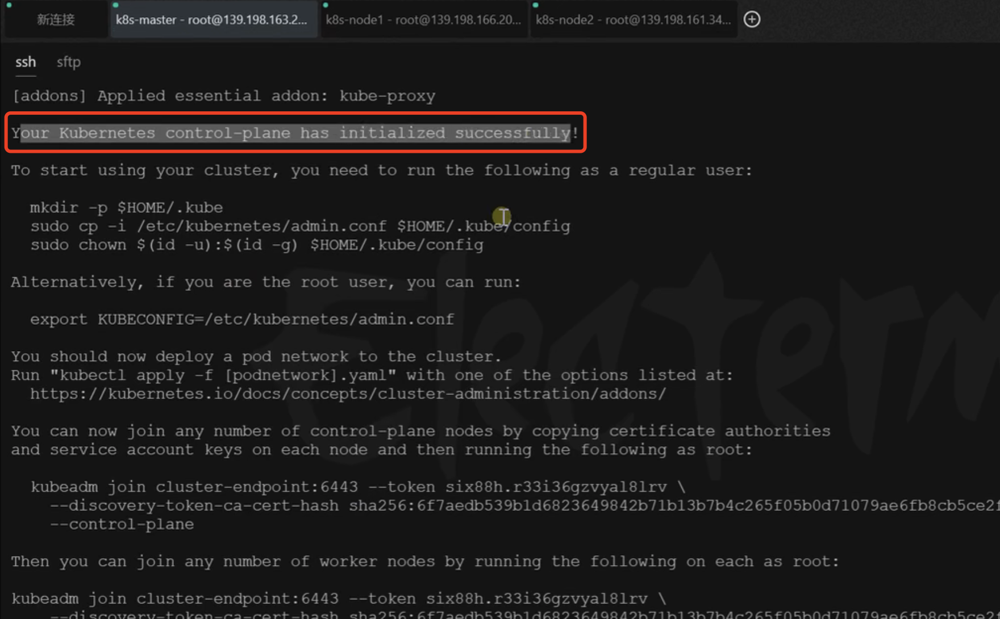


​		我们把初始化成功的提示复制出来看一下：可以看到提示 To Start 如果你要使用集群，你需要运行内容的提示

```bash
Your Kubernetes control-plane has initialized successfully!

To start using your cluster, you need to run the following as a regular user:

  mkdir -p $HOME/.kube
  sudo cp -i /etc/kubernetes/admin.conf $HOME/.kube/config
  sudo chown $(id -u):$(id -g) $HOME/.kube/config

Alternatively, if you are the root user, you can run:

  export KUBECONFIG=/etc/kubernetes/admin.conf

You should now deploy a pod network to the cluster.
Run "kubectl apply -f [podnetwork].yaml" with one of the options listed at:
  https://kubernetes.io/docs/concepts/cluster-administration/addons/

You can now join any number of control-plane nodes by copying certificate authorities
and service account keys on each node and then running the following as root:

  kubeadm join cluster-endpoint:6443 --token hums8f.vyx71prsg74ofce7 \
    --discovery-token-ca-cert-hash sha256:a394d059dd51d68bb007a532a037d0a477131480ae95f75840c461e85e2c6ae3 \
    --control-plane 

Then you can join any number of worker nodes by running the following on each as root:

kubeadm join cluster-endpoint:6443 --token hums8f.vyx71prsg74ofce7 \
    --discovery-token-ca-cert-hash sha256:a394d059dd51d68bb007a532a037d0a477131480ae95f75840c461e85e2c6ae3
```


​	这段成功的脚本必须copy下来，因为后续会使用到，比如，我们在其他节点运行kubeadm join 。。。。。可以将节点设置为主节点（因为集群里面可以有多个主节点-多个领导构成董事会）

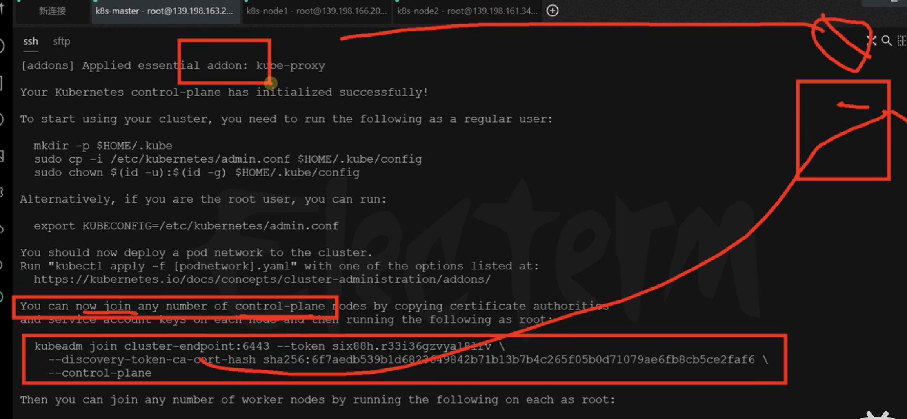


​	你也可以加入任意多个worker节点（工作节点）,如果想加入多个工作节点可以使用这些命令

```bash
Then you can join any number of worker nodes by running the following on each as root:

kubeadm join cluster-endpoint:6443 --token hums8f.vyx71prsg74ofce7 \
    --discovery-token-ca-cert-hash sha256:a394d059dd51d68bb007a532a037d0a477131480ae95f75840c461e85e2c6ae3
```


​	我们想使用我们的集群先来这一步：有3条命令，创建目录，把核心配置文件复制到这个目录中，然后给一些用户组权限

```bash
	mkdir -p $HOME/.kube
  sudo cp -i /etc/kubernetes/admin.conf $HOME/.kube/config
  sudo chown $(id -u):$(id -g) $HOME/.kube/config
```

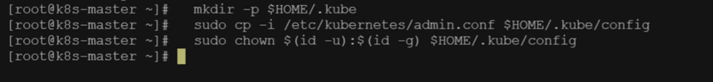


​		这个执行完毕后，你应该现在在集群中部署一个网络节点 pod network，他会把所有集群中的机器给串起来打通

```bash
You should now deploy a pod network to the cluster.
Run "kubectl apply -f [podnetwork].yaml" with one of the options listed at:
  https://kubernetes.io/docs/concepts/cluster-administration/addons/


```


​		如果我们想看一下我们集群中所有的节点：使用kubectl get nodes，我们看到现在集群中只有一个主节点，状态是NotRead，NotRead的原因是我们没有做上一步 部署一个网络节点

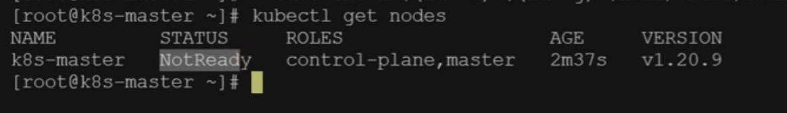


```bash
#查看集群所有节点
kubectl get nodes

#根据配置文件，给集群创建资源
kubectl apply -f xxxx.yaml

#查看集群部署了哪些应用？
docker ps   ===   kubectl get pods -A
# 运行中的应用在docker里面叫容器，在k8s里面叫Pod
kubectl get pods -A
```


​	