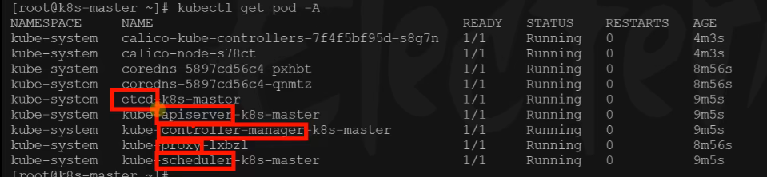

# 11.k8s集群搭建-master节点完成


​	我们之前已经把主节点初始化完成了，但是还差一步是需要部署一个网络节点，包括这个网络插件去哪找都是有官方地址的。


​	比如我们使用calico的网络插件，我们在master节点下执行curl....把calico的yaml配置文件下载下来


我们有了这个calico的配置文件以后，就可以在k8s中安装了


其实给k8s安装东西特别容易，只要有这个需要安装的配置文件我们就可以使用

kubectl apply -f 文件名称  ，可以使用这个命令来下载安装

-f 就是我需要的file文件


例如：我们安装calico网络组件


#### 2、安装网络组件

```bash
curl https://docs.projectcalico.org/manifests/calico.yaml -O

kubectl apply -f calico.yaml
```


还有就是安装这个网络组件的前提是我们没有修改过之前的--主节点初始化中的--pod-network-cidr=192.168.0.0/16这个地址，如果修改了，那么就需要 进入这个网络组件的calico.yaml配置文件中也修改一下

​		如果修改后就需要把默认的注释的这个配置打开修改为自己配置的网络范围--所以一般就使用我们的默认就可以，不明白就不要乱改以防故障


现在我们看一下我们前面学习使用过的几个k8s的命令：

```bash
#查看集群所有节点
kubectl get nodes

#根据配置文件，给集群创建资源
kubectl apply -f xxxx.yaml

#查看集群部署了哪些应用？
docker ps   ===   kubectl get pods -A
# 运行中的应用在docker里面叫容器，在k8s里面叫Pod -A就是获取所有
kubectl get pods -A
```


使用kubectl get pods -A 一定要在master节点，因为master节点是控制节点-领导人

​	然后我们现在可以看到 集群中有哪些资源 NAME：是我们应用的名称，READY：应用有没有就绪1/1就是有一个1个就绪，STATUS:状态Running正在运行，RESTART：重启了多少次，AGE：什么时候准备好的


我们等到我们集群中所有的状态都是running的时候，我们就可以继续往下做了

​	我们看一下集群中的内容都是什么：

	- kube-scheduler:调度者
	- kube-proxy：代理--看门大爷
	- kube-controller-manager：集群的决策者
	- kube-apiserver：相当于秘书部-所有请求经过这里调度
	- etcd-k8s：是我们集群的资料库




我们使用命令kubectl get nodes，我们的master节点就准备好了，将来集群中的其他节点往里加就可以了


