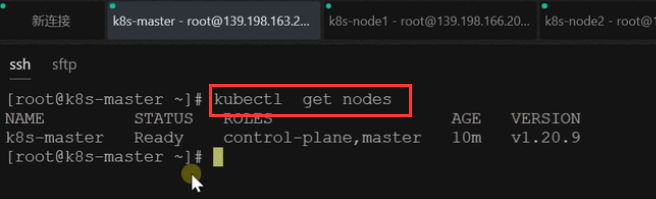
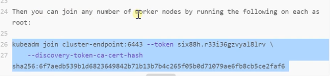
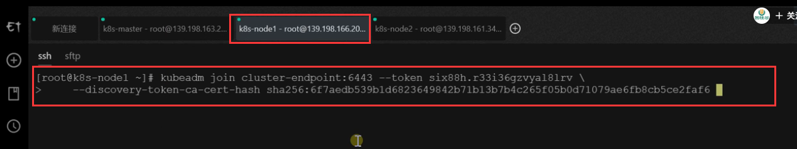
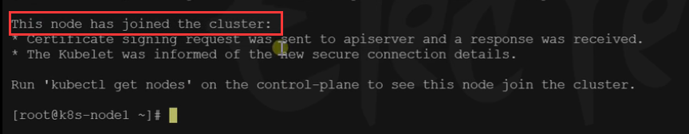
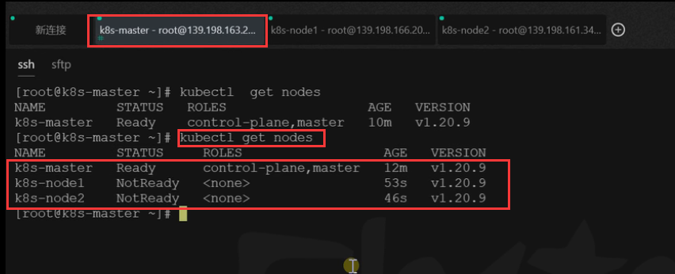
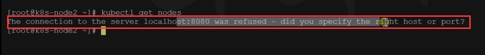
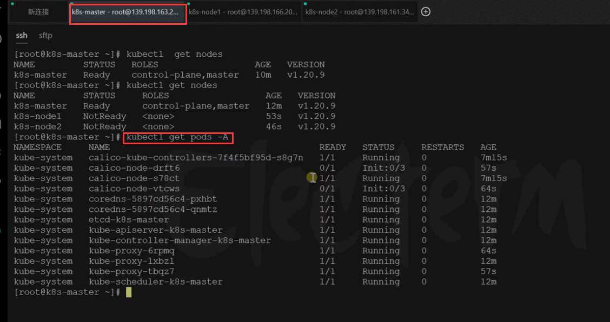
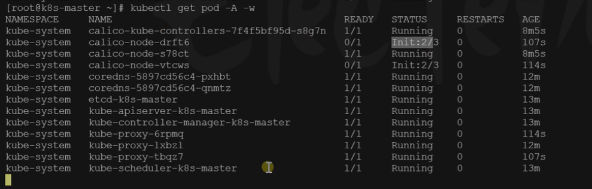
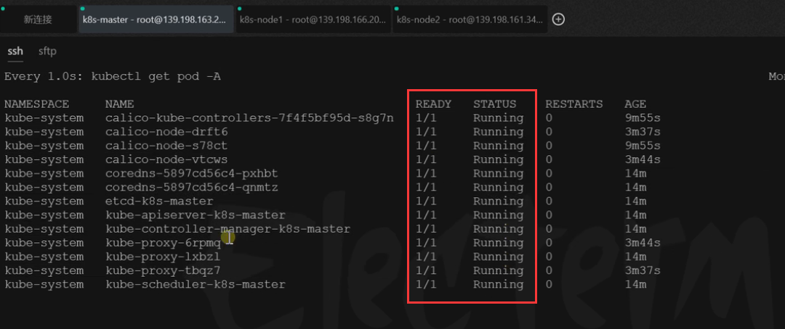
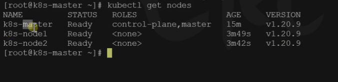

# 12.k8s集群搭建-worker节点加入集群完成

 之前我们的master节点已经准备就绪了，就相当于我总部已经ok了，那么接下来就是我们将其他工作节点接入进来。相当于接入分厂节点。

集群工作节点加入就简单多了，我们就可以使用之前我们初始化master节点的提示进行操作，我们可以加入任意多的工作节点

大家注意，这个命令是24小时有效

下面我们执行一下----在我们的工作节点机器上

执行完毕后，会提醒This node has joined the cluster：这个节点已经加入到集群

还有个提示就是，你可以使用这个命令 kubectl get nodes 在主节点看一下加入集群的节点

​	我们现在进入主节点master查看一下，看看其他节点有没有加入进来，所以大家注意，**如果你想查看k8s中的所有资源包括他的各种状态信息，我们都是使用kubectl命令 只能在主节点master中运行**

​	我们可以看到master是准备就绪了，其他2个节点还没有就绪

如果我们在工作节点运行此命令的话，我们可以看到提示：连接到服务器localhost:8080被拒绝-您指定了正确的主机或端口吗?

另外2个节点的原因是，我们使用kubectl get pods -A 查看一下

​	我们看到有一些应用还是在init的状态，所以我们再稍等一会

我们也可以使用命令 kubectl get pod -A -w     -w意思就是监控，阻塞在这里发生变化就会显示比如Status

所有的ready都是1 和status都是running 这就代表我们的集群搞定了

现在也都显示为ready就绪状态了

