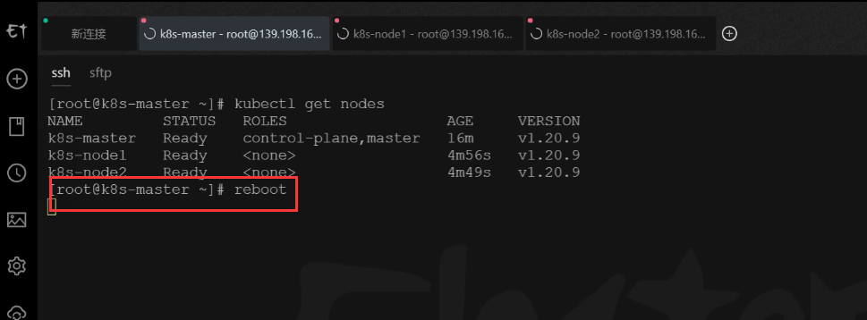
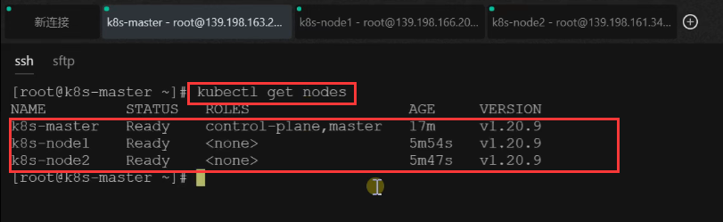
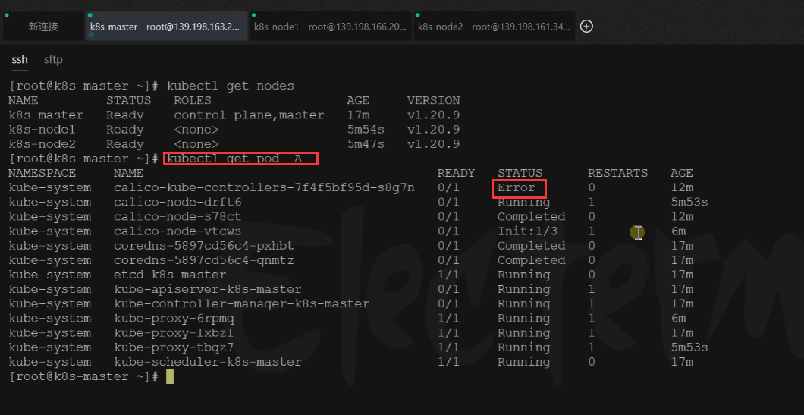
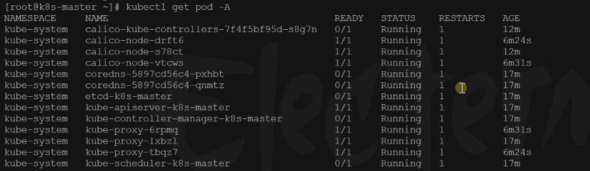
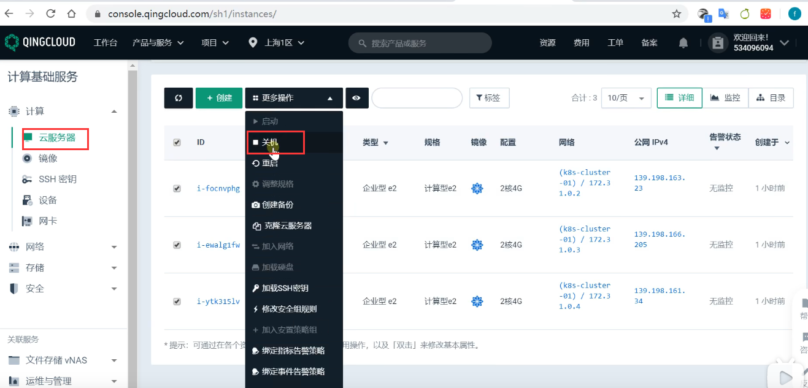

# 13.k8s集群搭建-集群自我修复能力测试

​		我们现在看一下k8s的强大之处，自我修复的能力。

​	比如，k8s本身集群要跑很多应用程序，假如我们的服务器宕机，我们在重新启动我们的k8s集群能不能启动起来，能不能一切都自动修复好，不用我们人工的干涉呢？

​	我们测试一下：我们先模拟一下，我们执行reboot 让三台集群的机器全部重启

重启后，我们在master节点上查看一下集群的状态---我们看到都是ready

我们继续看一下k8s全部的应用状态，可以看到有Error的情况，但这个不必担心，Error正在恢复

我们现在看到的是集群中有些东西是完蛋了，但是过一会儿他就会自动修复和恢复起来

几分钟后，我们发现全部正常了

另外我们在这些集群搭建完之后，我们也可以放心大胆的把我们的服务器关机了

