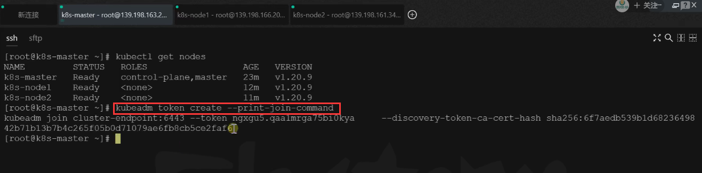

# 14.k8s集群搭建-令牌过期了怎么办？


​	我们之前说给集群加入节点的命令，是从我们初始化集群master节点时候提示拿过来的，但是这个是有一个有效期的24小时内执行是ok的，那么如果我们之后想加入集群的话就需要另外的操作了--因为令牌过期了。


#### 加入node节点

```bash
kubeadm join cluster-endpoint:6443 --token x5g4uy.wpjjdbgra92s25pp \
	--discovery-token-ca-cert-hash sha256:6255797916eaee52bf9dda9429db616fcd828436708345a308f4b917d3457a22
```


​	一旦过期后可以执行这个命令--这个命令只能在master节点运行

> 新令牌
>
> kubeadm token create --print-join-command


​	相当于让我们的总部给你创建一个新的令牌



​	然后我们把这一段代码复制，在我们的其他机器上直接运行加就可以了


