# 15.k8s集群搭建-部署dashboard

​	接下来，我们在给集群安装一个可视化的界面，我们如果一直是在linux操作命令行的话，这对初学者貌似有点不太友好。所以我们可以安装一个k8s官方提供的一个web的可视化界面，我们可以在界面上的点点点来操作k8s。这个web界面官方称为 dashboard


#### 1.部署dashboard

> kubernetes官方提供的可视化界面
>
> https://github.com/kubernetes/dashboard


我们从官方文档可以看到，安装使用一个命令就可以

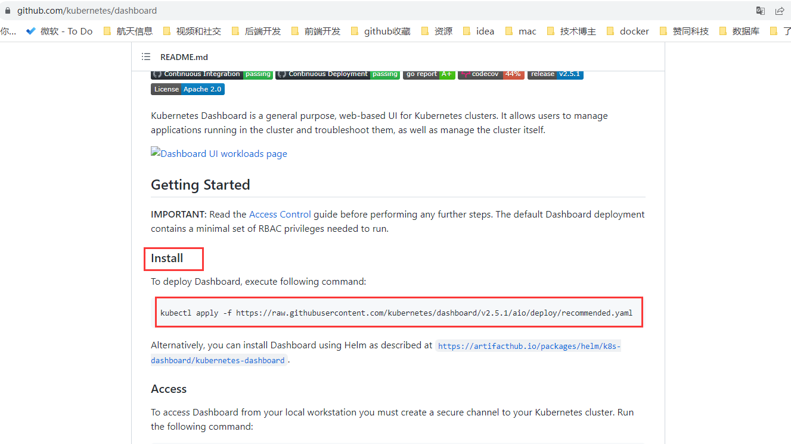

```
kubectl apply -f https://raw.githubusercontent.com/kubernetes/dashboard/v2.3.1/aio/deploy/recommended.yaml
```

​	我们之前说过kubectl apply -f 是我们在安装k8s应用或创建一些资源什么的，我们只要有资源的配置文件就可以了，然后我们 -f 读取配置文件进行加载内容，当然这个配置文件也可以是远程的


我们在master节点上安装一下dashboard

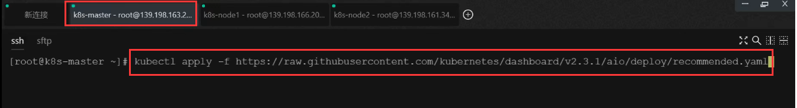


我们也可以先把这个远程的配置文件下载到本地，使用wget 命令进行下载

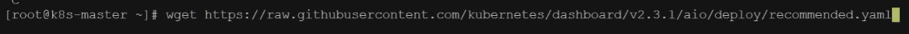


提示-bash：wget：command not found，因为wget没安装

​	安装一下wget 使用yum install -y wget

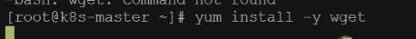


然后我们再下载一下：

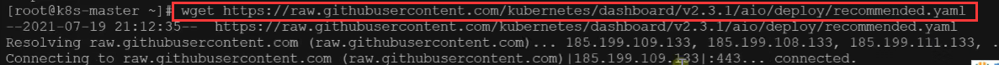


```
# Copyright 2017 The Kubernetes Authors.
#
# Licensed under the Apache License, Version 2.0 (the "License");
# you may not use this file except in compliance with the License.
# You may obtain a copy of the License at
#
#     http://www.apache.org/licenses/LICENSE-2.0
#
# Unless required by applicable law or agreed to in writing, software
# distributed under the License is distributed on an "AS IS" BASIS,
# WITHOUT WARRANTIES OR CONDITIONS OF ANY KIND, either express or implied.
# See the License for the specific language governing permissions and
# limitations under the License.

apiVersion: v1
kind: Namespace
metadata:
  name: kubernetes-dashboard

---

apiVersion: v1
kind: ServiceAccount
metadata:
  labels:
    k8s-app: kubernetes-dashboard
  name: kubernetes-dashboard
  namespace: kubernetes-dashboard

---

kind: Service
apiVersion: v1
metadata:
  labels:
    k8s-app: kubernetes-dashboard
  name: kubernetes-dashboard
  namespace: kubernetes-dashboard
spec:
  ports:
    - port: 443
      targetPort: 8443
  selector:
    k8s-app: kubernetes-dashboard

---

apiVersion: v1
kind: Secret
metadata:
  labels:
    k8s-app: kubernetes-dashboard
  name: kubernetes-dashboard-certs
  namespace: kubernetes-dashboard
type: Opaque

---

apiVersion: v1
kind: Secret
metadata:
  labels:
    k8s-app: kubernetes-dashboard
  name: kubernetes-dashboard-csrf
  namespace: kubernetes-dashboard
type: Opaque
data:
  csrf: ""

---

apiVersion: v1
kind: Secret
metadata:
  labels:
    k8s-app: kubernetes-dashboard
  name: kubernetes-dashboard-key-holder
  namespace: kubernetes-dashboard
type: Opaque

---

kind: ConfigMap
apiVersion: v1
metadata:
  labels:
    k8s-app: kubernetes-dashboard
  name: kubernetes-dashboard-settings
  namespace: kubernetes-dashboard

---

kind: Role
apiVersion: rbac.authorization.k8s.io/v1
metadata:
  labels:
    k8s-app: kubernetes-dashboard
  name: kubernetes-dashboard
  namespace: kubernetes-dashboard
rules:
  # Allow Dashboard to get, update and delete Dashboard exclusive secrets.
  - apiGroups: [""]
    resources: ["secrets"]
    resourceNames: ["kubernetes-dashboard-key-holder", "kubernetes-dashboard-certs", "kubernetes-dashboard-csrf"]
    verbs: ["get", "update", "delete"]
    # Allow Dashboard to get and update 'kubernetes-dashboard-settings' config map.
  - apiGroups: [""]
    resources: ["configmaps"]
    resourceNames: ["kubernetes-dashboard-settings"]
    verbs: ["get", "update"]
    # Allow Dashboard to get metrics.
  - apiGroups: [""]
    resources: ["services"]
    resourceNames: ["heapster", "dashboard-metrics-scraper"]
    verbs: ["proxy"]
  - apiGroups: [""]
    resources: ["services/proxy"]
    resourceNames: ["heapster", "http:heapster:", "https:heapster:", "dashboard-metrics-scraper", "http:dashboard-metrics-scraper"]
    verbs: ["get"]

---

kind: ClusterRole
apiVersion: rbac.authorization.k8s.io/v1
metadata:
  labels:
    k8s-app: kubernetes-dashboard
  name: kubernetes-dashboard
rules:
  # Allow Metrics Scraper to get metrics from the Metrics server
  - apiGroups: ["metrics.k8s.io"]
    resources: ["pods", "nodes"]
    verbs: ["get", "list", "watch"]

---

apiVersion: rbac.authorization.k8s.io/v1
kind: RoleBinding
metadata:
  labels:
    k8s-app: kubernetes-dashboard
  name: kubernetes-dashboard
  namespace: kubernetes-dashboard
roleRef:
  apiGroup: rbac.authorization.k8s.io
  kind: Role
  name: kubernetes-dashboard
subjects:
  - kind: ServiceAccount
    name: kubernetes-dashboard
    namespace: kubernetes-dashboard

---

apiVersion: rbac.authorization.k8s.io/v1
kind: ClusterRoleBinding
metadata:
  name: kubernetes-dashboard
roleRef:
  apiGroup: rbac.authorization.k8s.io
  kind: ClusterRole
  name: kubernetes-dashboard
subjects:
  - kind: ServiceAccount
    name: kubernetes-dashboard
    namespace: kubernetes-dashboard

---

kind: Deployment
apiVersion: apps/v1
metadata:
  labels:
    k8s-app: kubernetes-dashboard
  name: kubernetes-dashboard
  namespace: kubernetes-dashboard
spec:
  replicas: 1
  revisionHistoryLimit: 10
  selector:
    matchLabels:
      k8s-app: kubernetes-dashboard
  template:
    metadata:
      labels:
        k8s-app: kubernetes-dashboard
    spec:
      containers:
        - name: kubernetes-dashboard
          image: kubernetesui/dashboard:v2.3.1
          imagePullPolicy: Always
          ports:
            - containerPort: 8443
              protocol: TCP
          args:
            - --auto-generate-certificates
            - --namespace=kubernetes-dashboard
            # Uncomment the following line to manually specify Kubernetes API server Host
            # If not specified, Dashboard will attempt to auto discover the API server and connect
            # to it. Uncomment only if the default does not work.
            # - --apiserver-host=http://my-address:port
          volumeMounts:
            - name: kubernetes-dashboard-certs
              mountPath: /certs
              # Create on-disk volume to store exec logs
            - mountPath: /tmp
              name: tmp-volume
          livenessProbe:
            httpGet:
              scheme: HTTPS
              path: /
              port: 8443
            initialDelaySeconds: 30
            timeoutSeconds: 30
          securityContext:
            allowPrivilegeEscalation: false
            readOnlyRootFilesystem: true
            runAsUser: 1001
            runAsGroup: 2001
      volumes:
        - name: kubernetes-dashboard-certs
          secret:
            secretName: kubernetes-dashboard-certs
        - name: tmp-volume
          emptyDir: {}
      serviceAccountName: kubernetes-dashboard
      nodeSelector:
        "kubernetes.io/os": linux
      # Comment the following tolerations if Dashboard must not be deployed on master
      tolerations:
        - key: node-role.kubernetes.io/master
          effect: NoSchedule

---

kind: Service
apiVersion: v1
metadata:
  labels:
    k8s-app: dashboard-metrics-scraper
  name: dashboard-metrics-scraper
  namespace: kubernetes-dashboard
spec:
  ports:
    - port: 8000
      targetPort: 8000
  selector:
    k8s-app: dashboard-metrics-scraper

---

kind: Deployment
apiVersion: apps/v1
metadata:
  labels:
    k8s-app: dashboard-metrics-scraper
  name: dashboard-metrics-scraper
  namespace: kubernetes-dashboard
spec:
  replicas: 1
  revisionHistoryLimit: 10
  selector:
    matchLabels:
      k8s-app: dashboard-metrics-scraper
  template:
    metadata:
      labels:
        k8s-app: dashboard-metrics-scraper
      annotations:
        seccomp.security.alpha.kubernetes.io/pod: 'runtime/default'
    spec:
      containers:
        - name: dashboard-metrics-scraper
          image: kubernetesui/metrics-scraper:v1.0.6
          ports:
            - containerPort: 8000
              protocol: TCP
          livenessProbe:
            httpGet:
              scheme: HTTP
              path: /
              port: 8000
            initialDelaySeconds: 30
            timeoutSeconds: 30
          volumeMounts:
          - mountPath: /tmp
            name: tmp-volume
          securityContext:
            allowPrivilegeEscalation: false
            readOnlyRootFilesystem: true
            runAsUser: 1001
            runAsGroup: 2001
      serviceAccountName: kubernetes-dashboard
      nodeSelector:
        "kubernetes.io/os": linux
      # Comment the following tolerations if Dashboard must not be deployed on master
      tolerations:
        - key: node-role.kubernetes.io/master
          effect: NoSchedule
      volumes:
        - name: tmp-volume
          emptyDir: {}
```


如果我们加载不下来就访问网站把内容拿下来后，然后我们编辑一下内容添加进去保存。

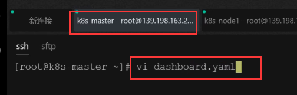


现在我们就可以安装了

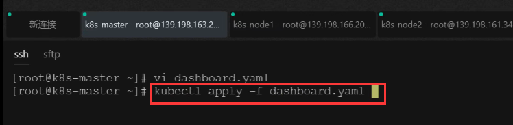


​	我们现在看一下k8s的应用，发现多了kubernetes-dashboard

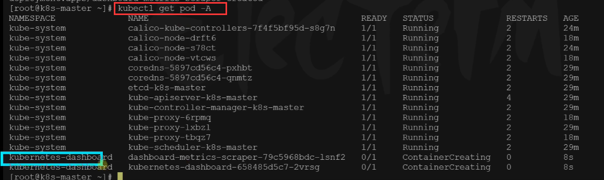


k8s的面板准备好以后，我们就可以通过公网IP进行访问了


#### 2.设置访问端口

```
kubectl edit svc kubernetes-dashboard -n kubernetes-dashboard
```

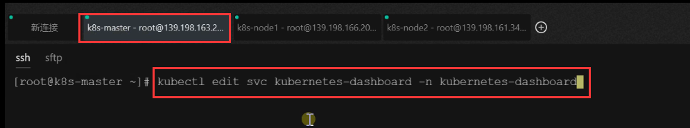


这个命令其实相当于在集群中修改某个资源的配置


然后敲/type：找到这个----然后按i插入编辑模式

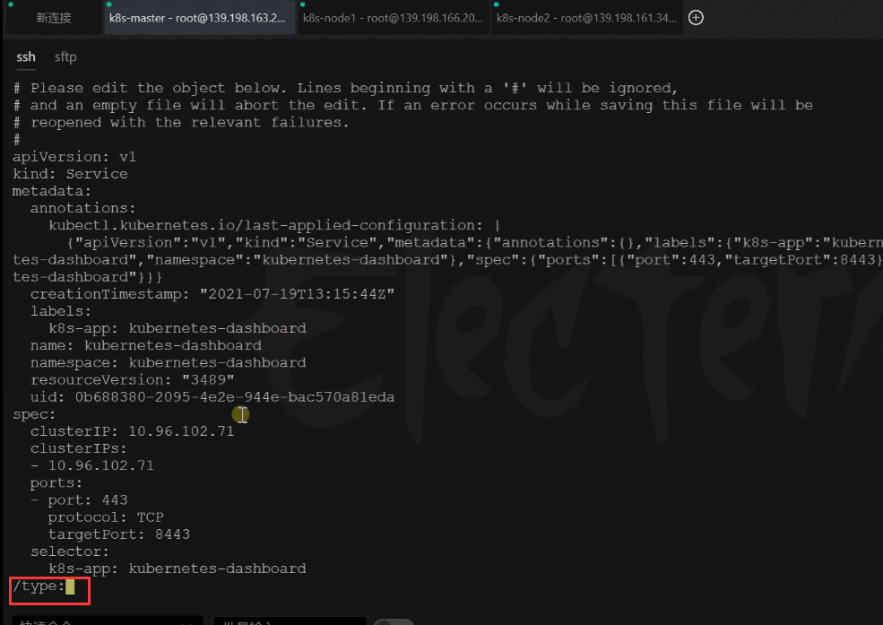


然后我们找到type:ClusterIP 我们改为 NodePort--wq退出保存--这步的操作其实就相当于把端口映射出来，类似docker把端口映射到本地端口一样

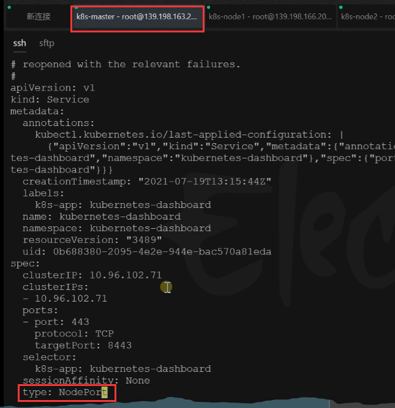


这个修改完之后，运行命令

```
kubectl get svc -A |grep kubernetes-dashboard
## 找到端口，在安全组放行

```

​	我们可以看到一个30753这个端口，这个端口就是我们未来访问k8s控制台的

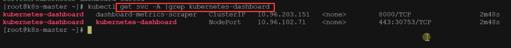


我们现在在云服务器组里面，把这个30753这个端口开放一下

​	我们现在是默认安全组--进入

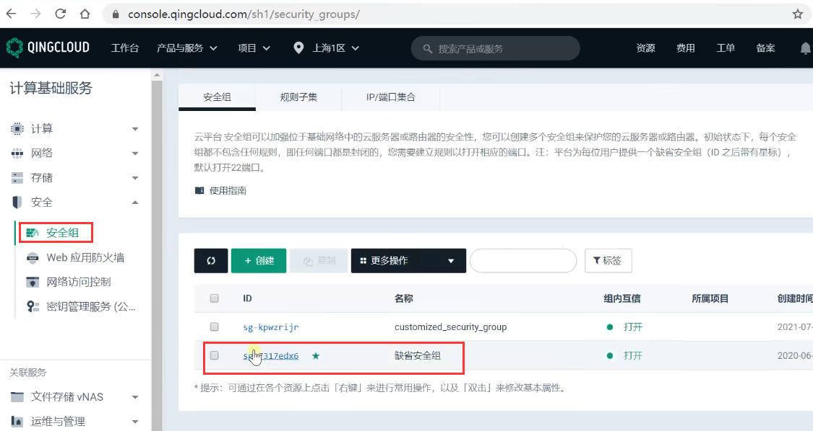


点击添加规则：

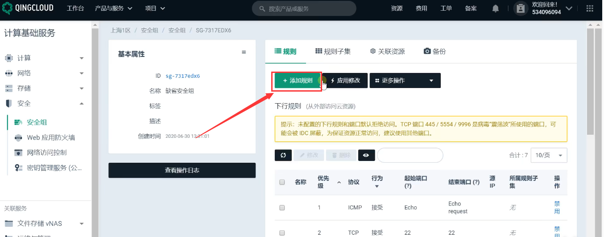


设置开放端口--然后提交--然后点击应用修改立即生效

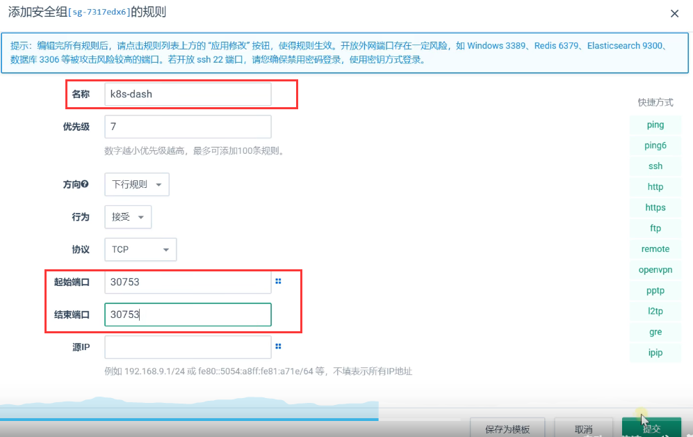


那么接下来，我们可以根据任意一台k8s集群机器的公网IP+30753这个端口就可以访问到了

比如我们使用k8s-node2这个机器的IP访问一下试试

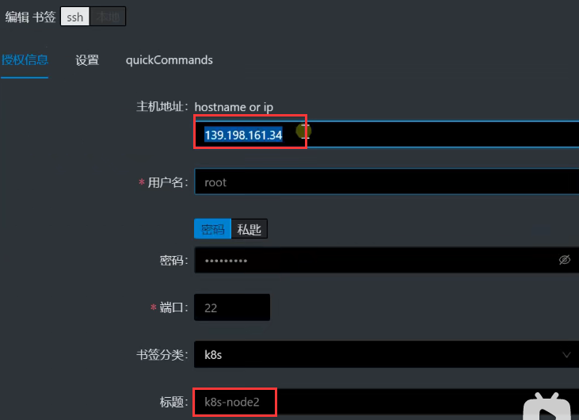

访问： https://集群任意IP:端口      https://139.198.165.238:32759


这样就成功了--这个登录界面要求填写一个token

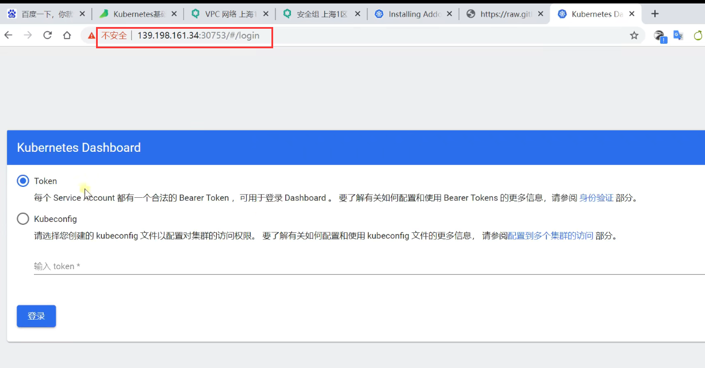


#### 3、创建访问账号

需要执行以下命令：

```
#创建访问账号，准备一个yaml文件； vi dash.yaml
apiVersion: v1
kind: ServiceAccount
metadata:
  name: admin-user
  namespace: kubernetes-dashboard
---
apiVersion: rbac.authorization.k8s.io/v1
kind: ClusterRoleBinding
metadata:
  name: admin-user
roleRef:
  apiGroup: rbac.authorization.k8s.io
  kind: ClusterRole
  name: cluster-admin
subjects:
- kind: ServiceAccount
  name: admin-user
  namespace: kubernetes-dashboard
  
```


​	准备一个文件 vi dash-usr.yaml --然后将内容复制进去，wq退出保存

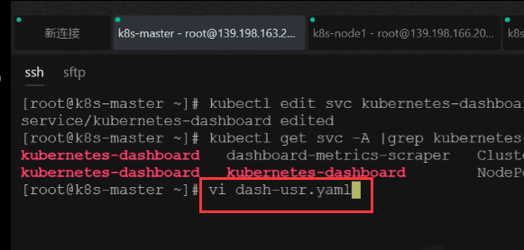


然后应用一下这个文件

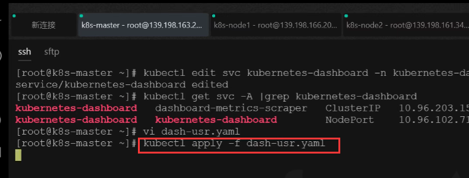


#### 4.令牌访问

然后我们执行一下这个，获取k8s-dashboard的秘钥

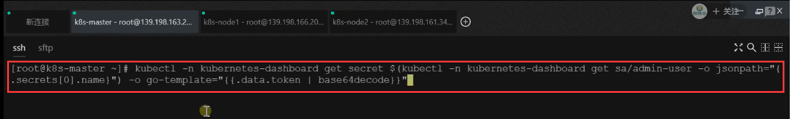

```
#获取访问令牌
kubectl -n kubernetes-dashboard get secret $(kubectl -n kubernetes-dashboard get sa/admin-user -o jsonpath="{.secrets[0].name}") -o go-template="{{.data.token | base64decode}}"
```


​	我们得到了token令牌，然后copy一下

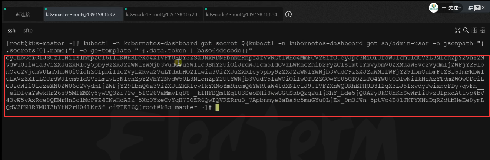


我们在web界面输入一下这个token点击登录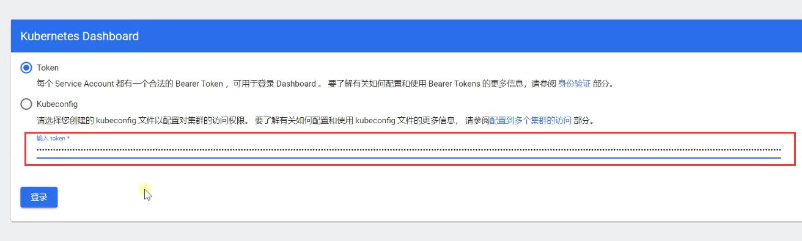


这就ok了，登录成功--我们进入了k8s的控制台

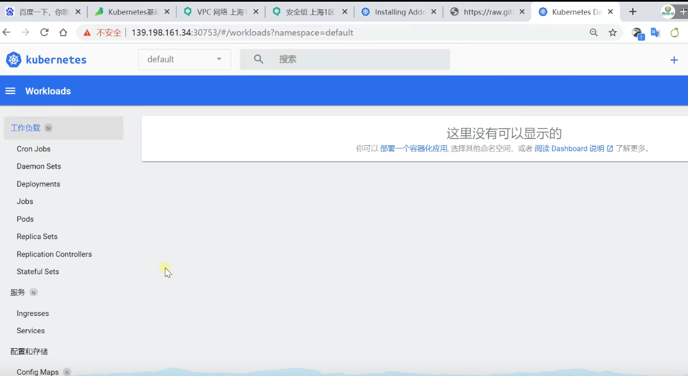


我们也可以切换他的命名空间，这个我们后续再说

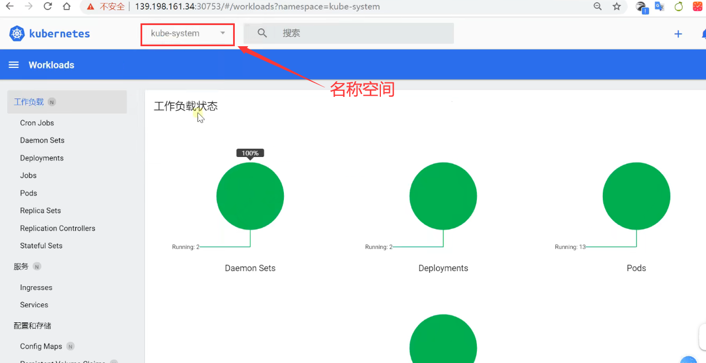


