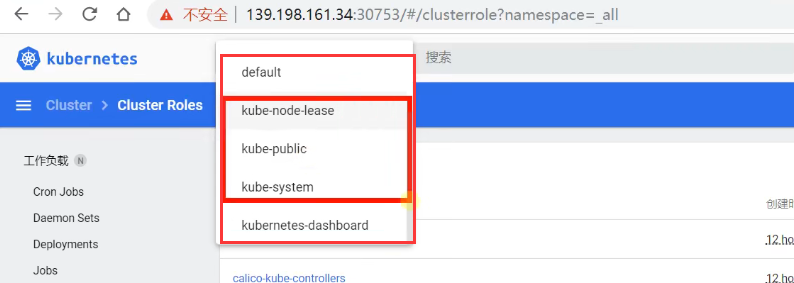

# 16.k8s核心实战-NameSpace

​		我们前面已经部署好可视化界面dashboard了，我们发现如果长时间不使用也会退出这个web界面，那么就需要重新输入token，所以我们把这个token最好给记下来。

## 1.k8s资源创建方式

​	所谓的资源创建方式就是k8s未来需要很多资源集成 或者可以叫他们是k8s的对象，有各种不同类型的资源，如果想创建这些东西呢，可以有2种方式：

	- 1.可以使用命令行的方式创建资源
	- 2.可以使用YAML的方式进行创建资源--然后使用kubectl apply -f **.yaml 命令创建资源

我们下面聊一下k8s中，第一种核心资源Namespace

## 2.k8s-Namespace

​	名称空间是用来隔离资源的，或者说是对这些资源进行分组的

​	默认只是隔离资源，并不会隔离网络

k8s会默认带几个名称空间，例如以下几个我们可以在dashboard中看到

如果我们使用命令的方式查看的话 kubectl get 想获取资源都是get ，如果获取名称空间可以使用kubectl get namespace 或 ns（namespace的缩写）

另外我们kubectl get pods 这个是查看在k8s中部署的所有应用，每一个应用我们称为pod， -A参数就是all全部

​	我们可以看到每个应用的名称-都有属于自己的名称空间

有时候kubectl get pods不加-A，可能什么也没有，原因是默认查看的是默认名称空间，因为默认名称空间没有东西，所以没有显示内容

如果我们想单独看一下 kubernetes-dashboard这个命名空间下部署了哪些应用，可以使用kubectl get pod -n 名称空间

如果-我们删除一个命名空间kubectl delete ns namespace，而且删除名称空间会把这个名称空间下所有资源连带删除

创建一个namespace

#### 如果我们使用配置文件的方式也是可以的

​	APIVersion-版本号，kind-资源类型，如Namespace，metedata-元数据，如name：hello那么就相当于要创建一个名称为hello的名称空间

例如，我们vi一个yarm文件，然后k8s应用一下

我们发现这样的方式也可以创建名称空间

如果我们使用配置文件的方式创建的，那么删除的时候如果配置文件还在的话，那么我们也指定一下配置文件，然后就将这个配置文件创建的所有资源都删除掉了

