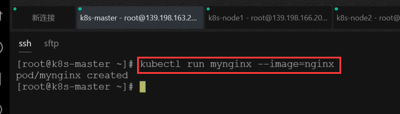
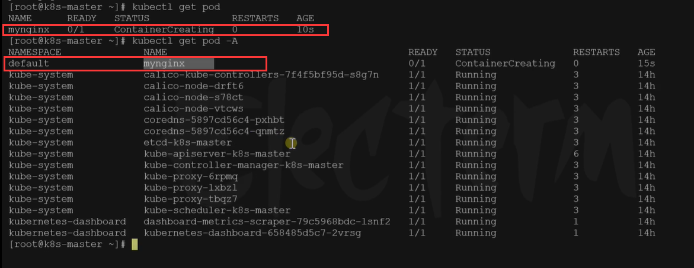
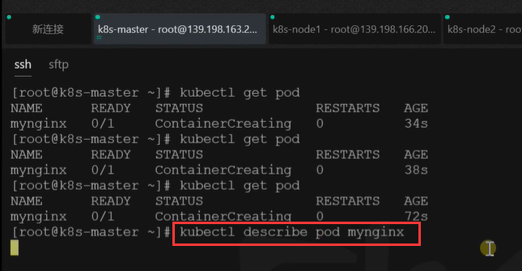
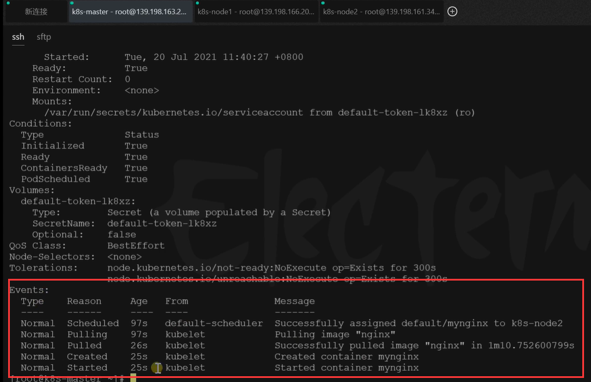
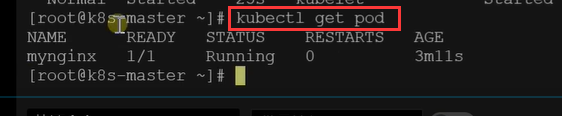
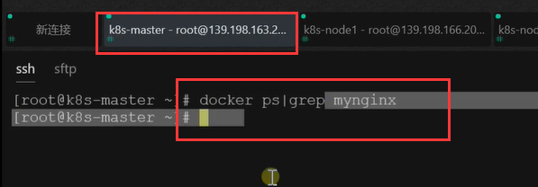
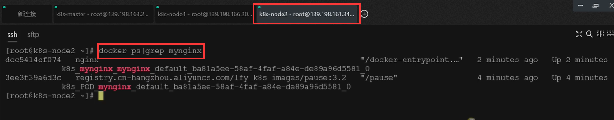
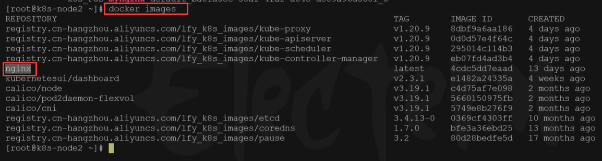

# 18.k8s核心实战-kubectl命令行方式创建pod


​	如果我们以命令行的方式创建--例如名为mynginx的pod

```bash
kubectl run mynginx --image=nginx
```





创建的pod在默认的名称空间




​	我们现在新建的pod正在构建中，构建容器并且在容器中下载和启动nginx

​	然后我们也可以使用描述命令来描述一下他 使用**kubectl describe pod podName**




我们可以看到事件的描述信息

​	例如：97秒前，message提示成功的将nginx分配给k8s-node2，相当于我们目前集群有3台机器，k8s帮我们在集群的k8s-node2这个机器上启动了一个pod

​		然后是pulling 使用kubelet 也就是node2这个节点的厂长负责 pulling images nginx 下载这个nginx镜像

​		然后是在26秒前，下载nginx成功 用时 1份10秒

​		然后是25秒前，Created 创建容器叫mynginx

​		最后在25秒前，Started 启动mynginx容器




我们等到容器启动成功后，查看一下pod，pod就是running状态了




​	那么k8s将pod分配到node2节点上了，所以一定是在node2节点才能看到，我怎么知道能在node2节点看到呢？可以让节点全部运行 docker ps 这个命令，因为我们这个pod还是以容器的方式运行的，只不过k8s封装了一下，docker ps | grep mynginx 过滤一下为mynginx的容器


​	我们执行一下，发现master没有输出任何内容




而我们的node2节点就打印出内容了

​	我们看到nginx是在这里启动起来了，我们看到容器dcc 以nginx启动的应用




包括docker images 可以看到--nginx镜像只在node2节点上




以上就是我们说的 我们使用一个命令创建了一个k8s的pod

```
kubectl run mynginx --image=nginx

# 查看default名称空间的Pod
kubectl get pod 
# 描述
kubectl describe pod 你自己的Pod名字
# 删除
kubectl delete pod Pod名字
# 查看Pod的运行日志
kubectl logs Pod名字

# 每个Pod - k8s都会分配一个ip
kubectl get pod -owide
# 使用Pod的ip+pod里面运行容器的端口
curl 192.168.169.136

# 集群中的任意一个机器以及任意的应用都能通过Pod分配的ip来访问这个Pod


```


