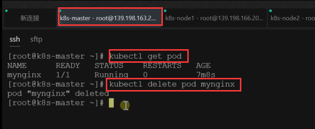
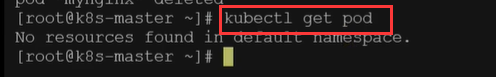
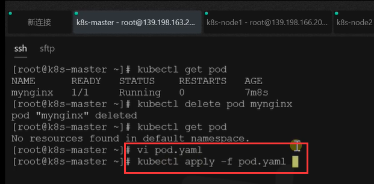
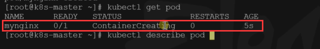
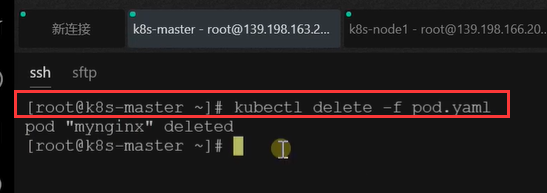

# 19.k8s核心实战-配置文件方式创建pod

​	如果我们现在创建好的pod想要删除怎么办？

​	删除pod使用命令 kubectl delete pod podName -n 名称空间




然后我们使用get pod 查看默认命名空间的pod发现没有内容了，被删除了




#### 1.使用配置文件的方式创建pod

	- apiversion: 版本
	- kind：资源类型
 - metadata：元数据
    - labels：标签内容
      	- run：执行
   	- name：这个是我们的资源名称叫什么
	- spec：spec下面的所有信息就是我们配置kind资源的详细配置信息


这个是yaml配置文件的方式创建pod

```
apiVersion: v1
kind: Pod
metadata:
  labels:
    run: mynginx
  name: mynginx
#  namespace: default
spec:
  containers:
  - image: nginx
    name: mynginx
```


执行一下将配置文件应用一下

		


我们可以看到又开始创建pod了




如果我们使用yaml进行的创建，可以使用 yaml的方式删除




