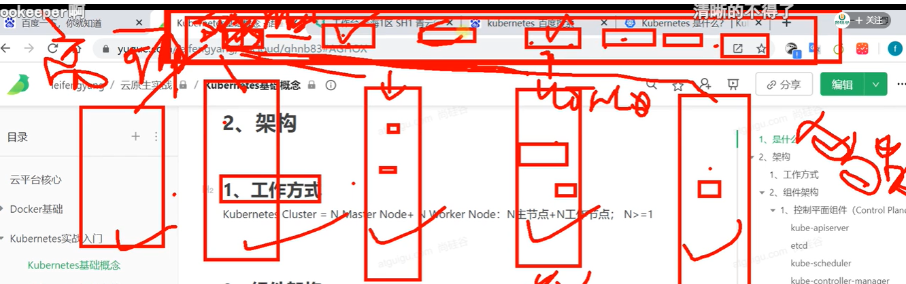

# 2.kubermetes基础-集群的方式

## 架构

	#### 1.工作方式

​	首先肯定是集群模式的--不可能在单机下安装一个k8s

​	如果是集群有很多机器工作那么k8s的工作方式是怎样的，我们把集群中每一台机器称为 一个节点，整个集群想要工作起来，其实就像我们现实中的公司一样，首先这个公司得有个领导--集群中也得需要个领导，我们把这个领导叫**主 master**，我们以后都是听从领导的，而领导一般不干重活，一般正常工作的节点我们称为 工作节点 worker node，那么之后就是领导 master节点 控制工作节点 worker ,这就是集群的工作方式，当然一个领导可能靠不住，公司规模大的话可能会有一个董事会，那么在集群中也一样我们称为高可用，如果领导master失联了，那么由董事会 进行选举，选一个新的领导来进行 对工作节点worker node 的管理，然后工作节点就听从新领导的指挥。

​	董事会选举投票也是有讲究的少数服从多数，在集群中也一样会进行投票的选举， 那么一般就肯定是放奇数个master，这样就不会出现投票一致的问题的。

Kubernetes **Cluster** **=** N **Master** Node **+** N **Worker** Node：N主节点+N工作节点； N>=1

