# 20.k8s核心实战-可视化操作与pod细节

​	我们在dashboard可视化web界面也是可以创建pod的

​	

​	+号，创建新的资源

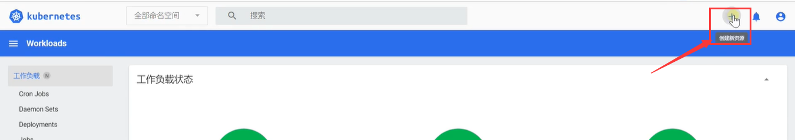

然后我们可以看到有**输入并创建**，**从文件创建**，**从表单创建**

​	输入并创建，我们可以输入配置文件信息，直接创建上传

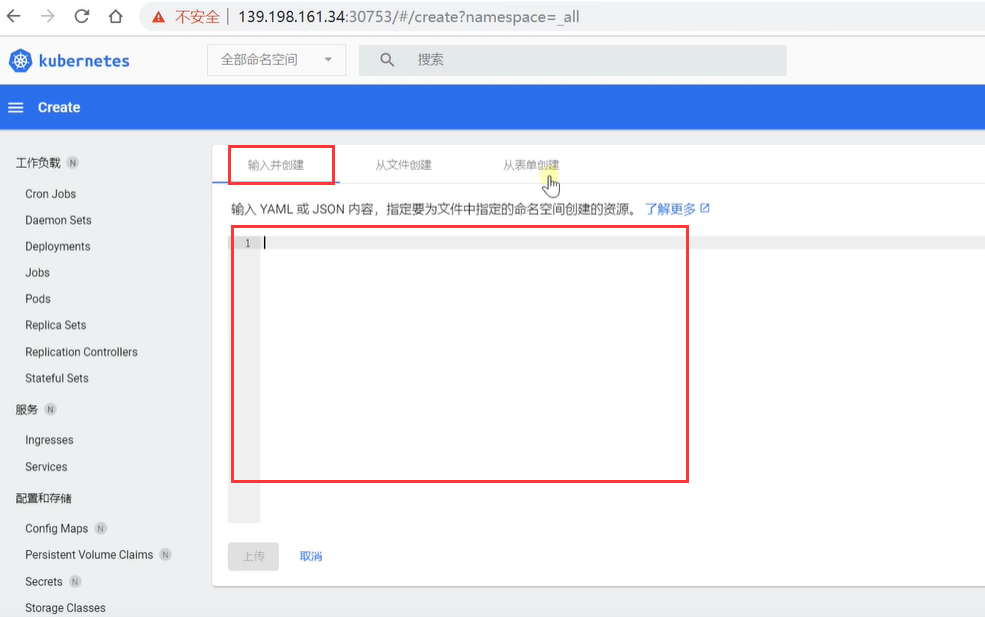

 表单创建：这个创建的不是pod

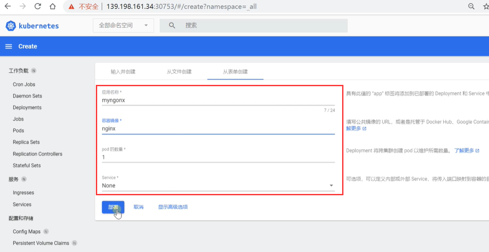

我们测试一下创建pod：

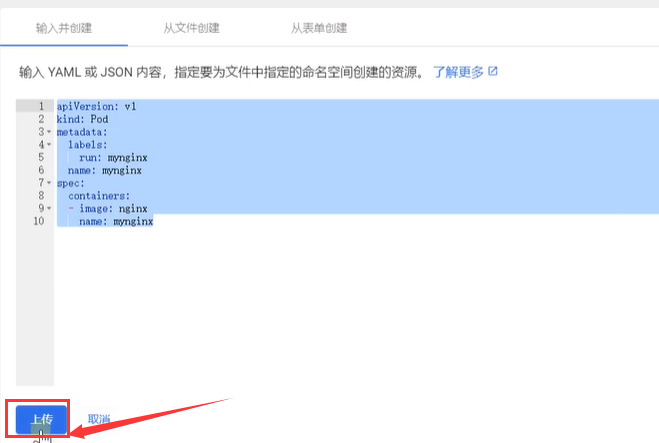

提示：部署失败，服务器不支持以此方式创建资源，为什么呢？

​		因为我们创建的pod，他一定在某个名称空间内

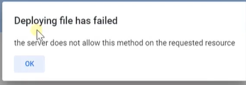

​	第一种办法就是我们切换到pod准备创建的名称空间下，如default默认名称空间

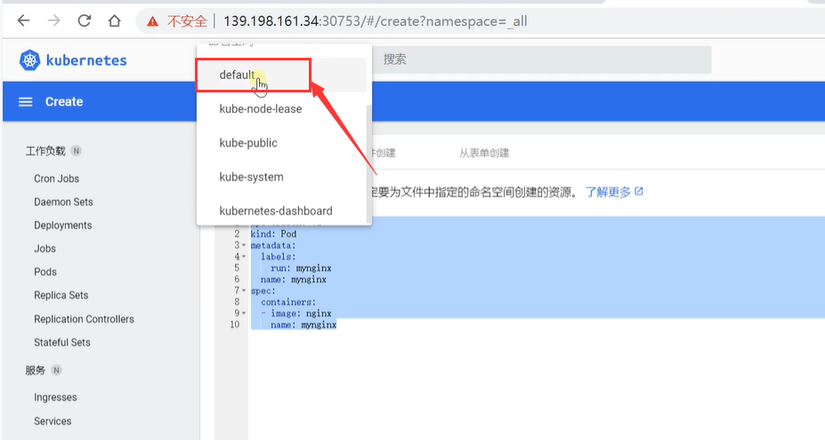

第二种就是，我们在配置文件中指定名称空间 这样也是可以的

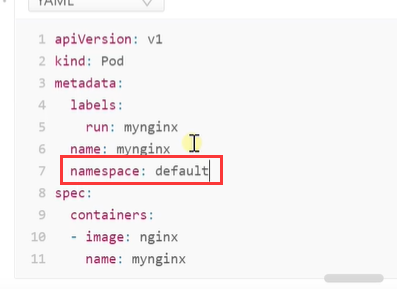

​	我们使用第一种切换到我们使用的名称空间试试：

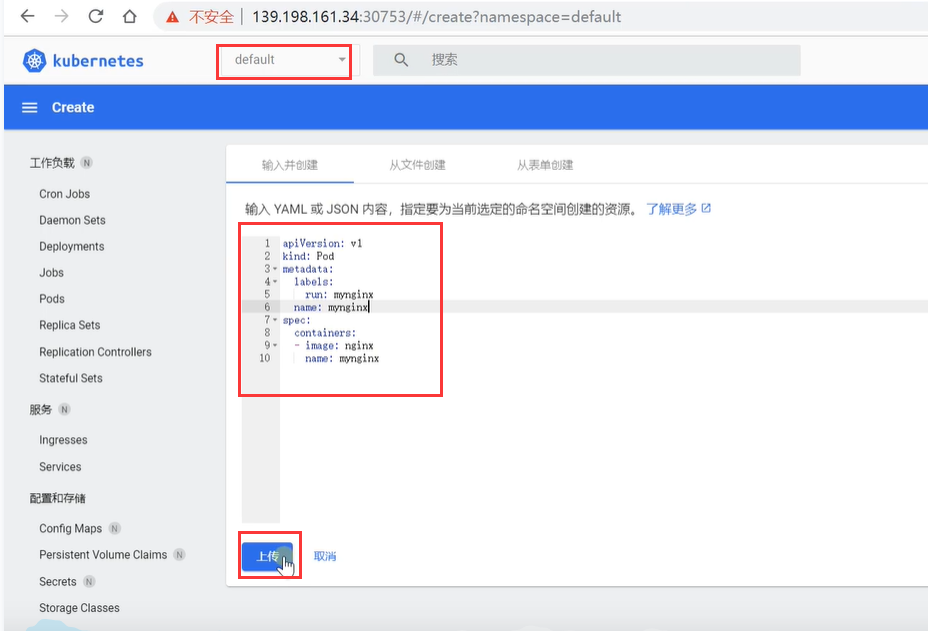

这次创建成功了，还有就是凡事带N的标识都是和名称空间相关的，下图我们可以理解带有N的都是default名称空间下的内容资源

​		没有加N的就是我们整个集群可用的就和名称空间没有关系了 

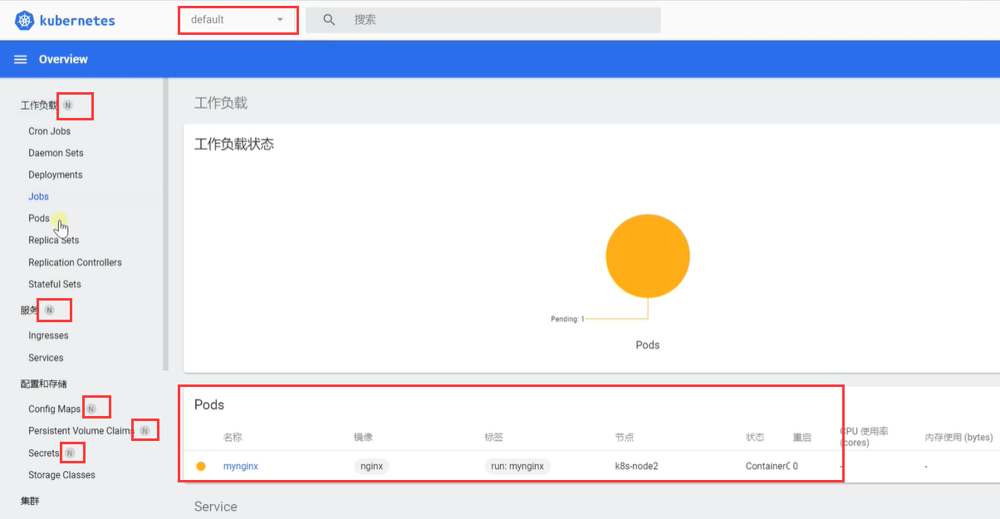

我们点击Pods可以查看里面的pod和运行状态

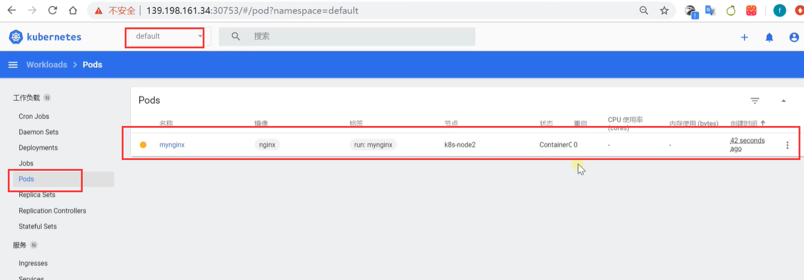

我们还可以点击pod名称，键入到详情然后查看详细情况

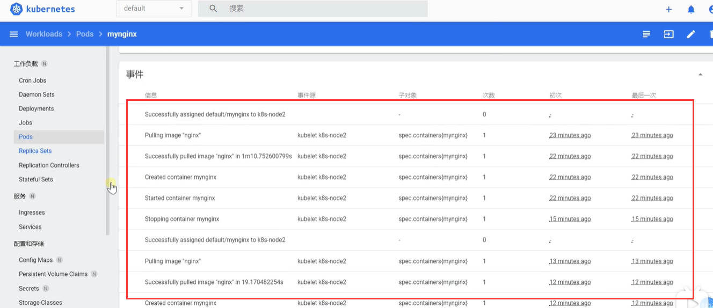

运行正常就是绿色的了--状态Running

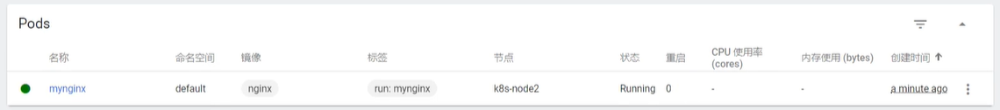

也可以对这个进行操作编辑或删除

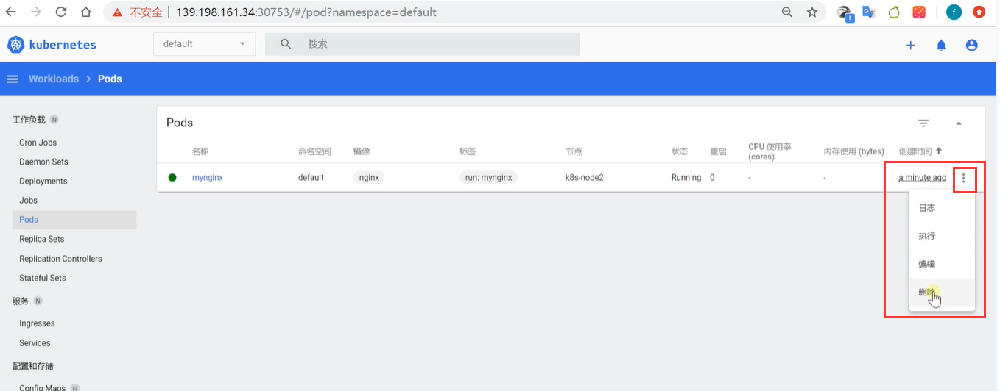

包括我们还可以看他的运行日志，就和docker一样 以前是实验docker logs查看日志，k8s也一样使用kubectl logs  PodName

​	例如查看我们刚刚创建的pod mynginx的日志

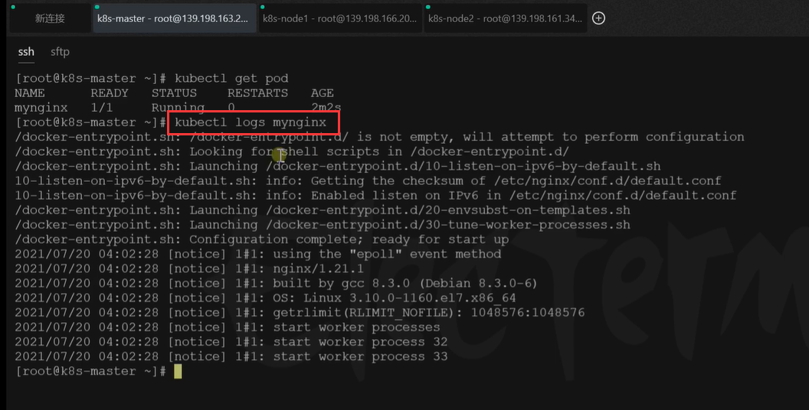

包括和docker一样实时查看日志的话就是kubectl logs -f  mynginx

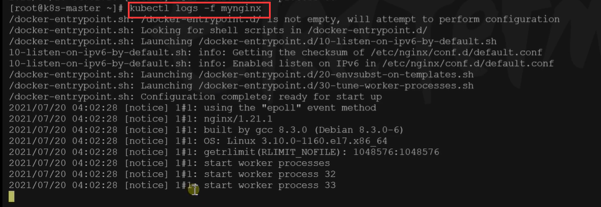

如果在我们的可视化界面那就更方便了--直接点击日志就可以了

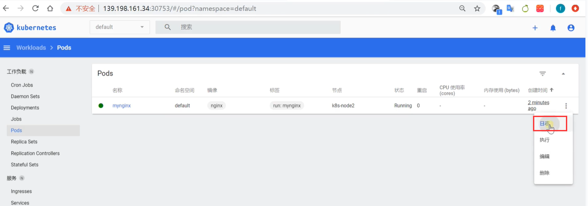

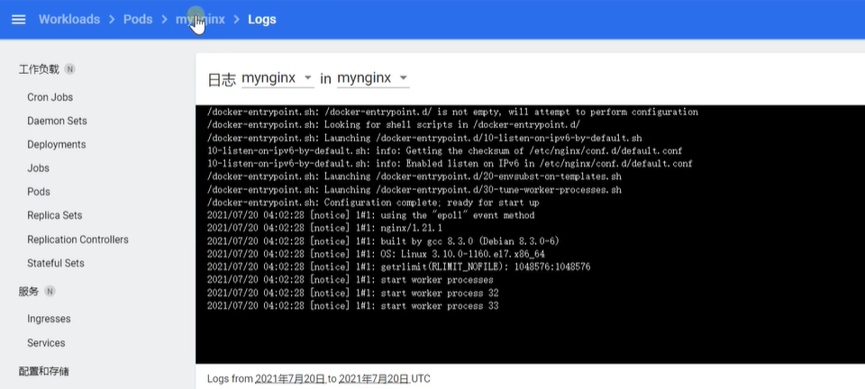

​		以前我们使用docker部署的nginx，我们进去修改他的首页还可以访问，那我们现在不是docker部署的nginx容器，是k8s部署的pod，我们能不能访问呢？也是可以的

​	我们使用kubectl get pod -owide 这个-owide是打印更详细的信息

​	他会有一个IP地址，而且是在k8s-node2节点运行的

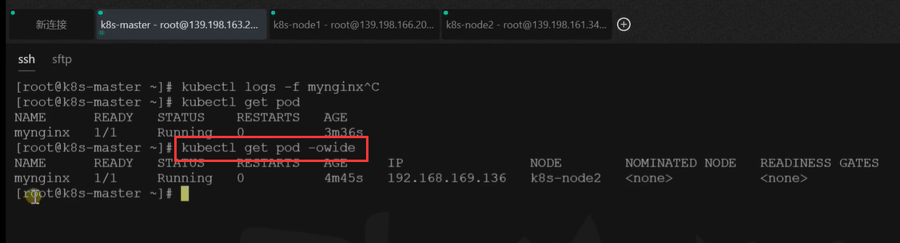

我们知道nginx是80端口，我们可以使用curl 访问一下，可以看到nginx的首页内容了

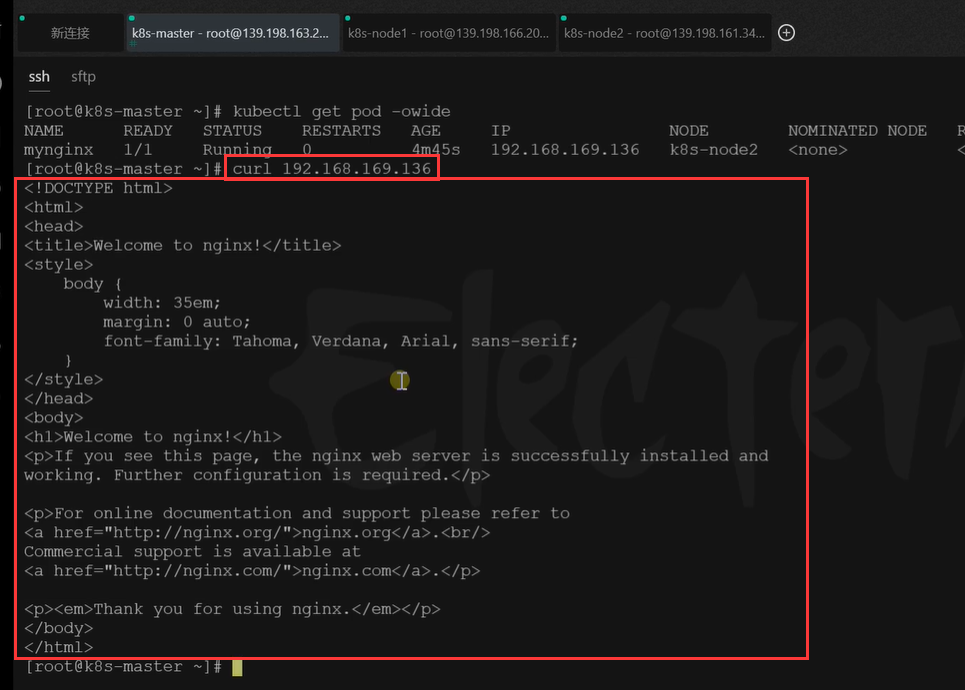

​	每个pod在k8s中都会给分配一个IP，这样保证了我们集群中所有的应用都可以使用ip访问的到

我们以前使用dicker部署的应用，如果我们想修改nginx的页面，我们可以进入到nginx容器里面去修改docker exec -it

​	k8s想进入容器的话使用：`kubectl exec -it pod名称 --bin/bash` 

​	然后我们可以看到现在是在root@mynginx：/  我们相当于已经进入mynginx里面了

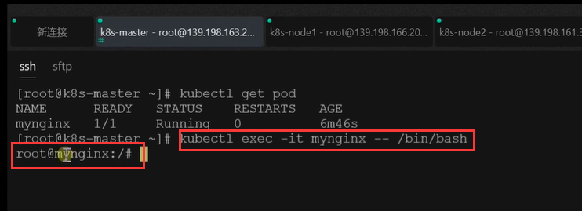

例如我们修改：输出一个1111到首页的内容中

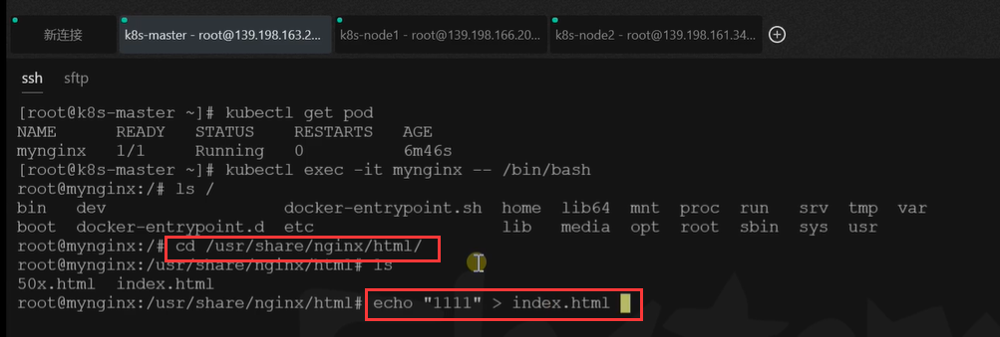

而且k8s部署的集群应用在任何集群节点中都是可以访问的

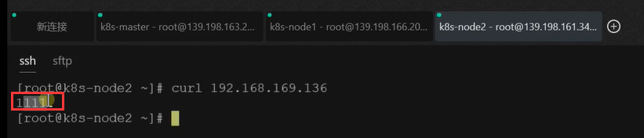

​	而我们现在有另外一种更方便的方式，在我们的可视化界面中，有个执行按钮

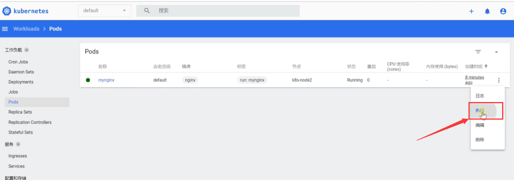

还是进入了容器的控制台

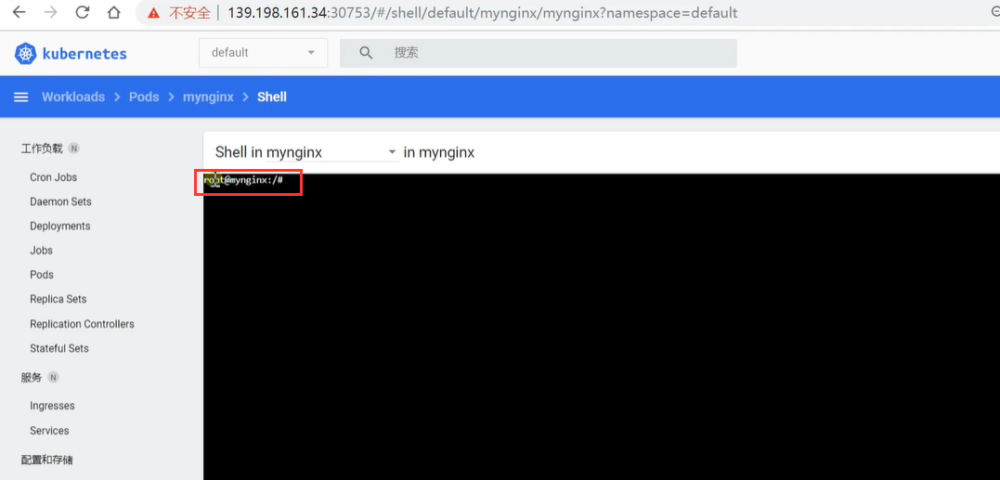

例如：我们修改一下首页面为2222

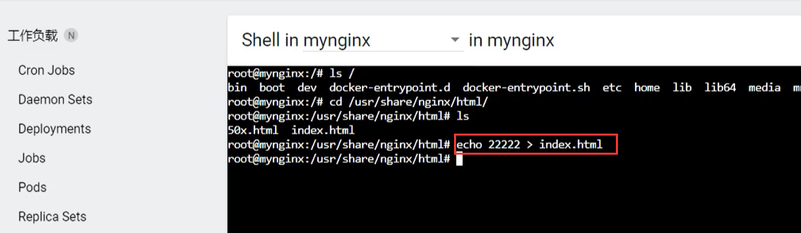

现在就变为2222了

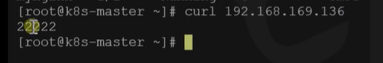

​	为什么k8s给我们每一个部署的应用都叫pod，为什么k8s给我们分配的IP地址192.168***

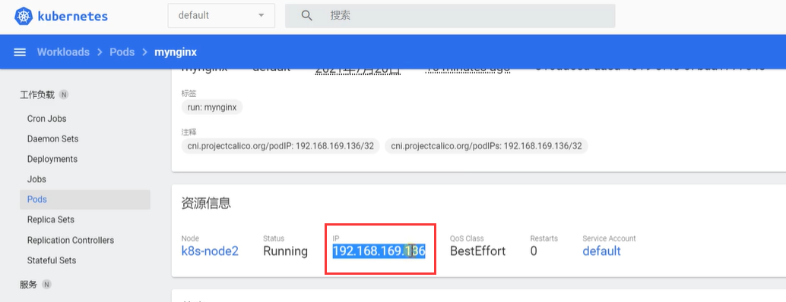

我们回到在我们安装k8s的时候，引导master节点初始化的时候，我们设置了--pod-network-cidr=192.168.0.0/16，其实这个就是pod的网络范围域

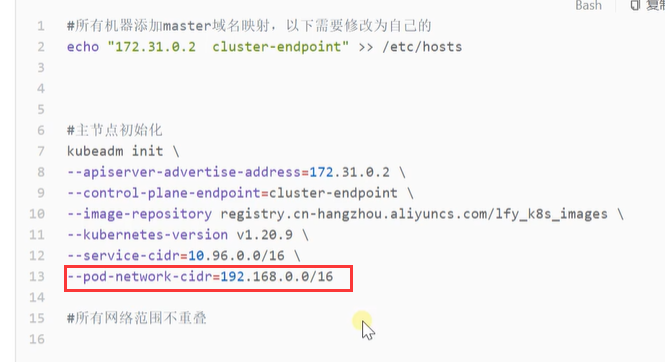

​	这个ip分配后，在集群的任意一台机器，任意一个应用都可以访问的到任意的pod

​	**但是注意：只是可以在集群内访问，在集群外就访问不到了**

比如我们使用外部浏览器访问一下：在集群机器外访问就需要暴露端口了，在k8s的对外暴露端口我们现在还没有学到

