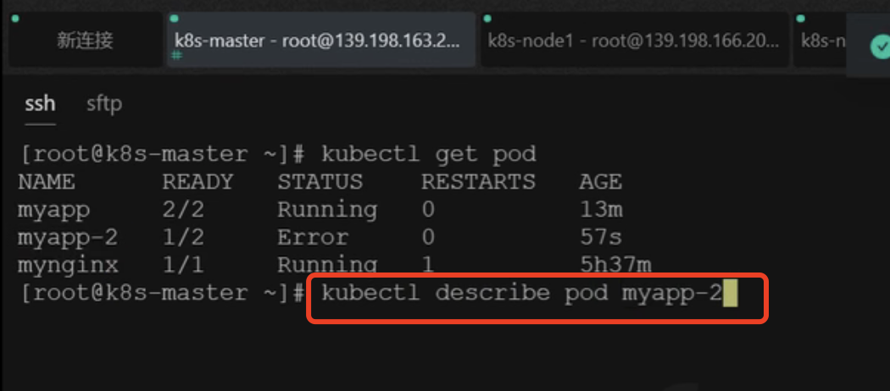
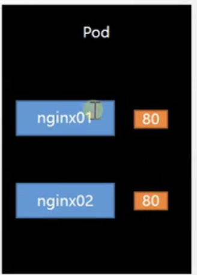

# 21.k8s核心实战-多容器pod细节

​		之前我们通过命令行的方式或者是配置文件的方式创建了pod。

​	pod是k8s的最小单元，每一个pod都有一个唯一的k8s分配的IP可以用于访问，集群中都可以访问到，还有就是pod是一组运行的容器。

​	下面我们看一下如何让一个pod中部署2个或者多个容器

​	我们再准备一个创建pod的配置文件

```
apiVersion: v1
kind: Pod
metadata:
  labels:
    run: mynginx
  name: mynginx
#  namespace: default
spec:
  containers:
  - image: nginx
    name: mynginx
```


```yaml
apiVersion: v1
kind: Pod
metadata:
  labels:
    run: myapp
  name: myapp
spec:
  containers:
  - image: nginx
    name: nginx
  - image: tomcat:8.5.68
    name: tomcat
```

​	注意俩个pod的name不能一致，就像我们每个宿舍的宿舍号不能一致了

​	那么在这个pod的配置文件中，我们看到有2个容器，第一个 -image是nginx第二个是tomcat，这就相当于一个宿舍里面有2个人


我们vi一个pod的配置文件


然后应用一下配置文件


我们看到第二个pod显示的是0/2是因为他启动了2个容器


我们在可视化界面中看一下，他被分配到了ks8-node1节点上了


我们可以看到这个pod中有2个容器


我们查看一下详细信息


那么我们访问这个192.168.36.68地址到底是访问到nginx还是tomcat呢？

​	curl访问得到的是nginx为什么？因为nginx的默认端口是80


我们访问一下8080端口试一下：访问到了tomcat


其实如果是nginx想要访问tomcat如何访问呢？其实就不需要这个ip了，因为他们相当于在一个机器环境下 可以直接使用127.0.0.1:8080访问到tomcat

​	我们验证一下：我们点击可视化界面的执行（可以选择进入那个容器），进入到nginx中


我们访问tomcat发现使用127.0.0.1访问是没有问题的


​	还有一个问题，就是如果我们新建了一个pod那么这个pod能不能运行2个nginx？或者2个tomcat等等？

​	我们现在创建2个nginx容器试一下


我们等待看创建出来是什么样子的


我们发现myapp2这个pod是error


每当有error的时候，我们就需要使用kubectl describe pod podName这个命令查看详情




​	或者是我们在可视化界面中找到pod，键入-然后查看事件


我们看一下命令执行后的提示：容器启动失败


启动失败的原因就是都使用了80端口在一个容器中--端口被占用



我们也可以看一下日志：


日志中可以看到地址被占用的错误提示


如果运行失败，k8s会一直进行重试进行启动pod


​	所以要注意：一个pod中有多个容器的话一定要注意端口不能冲突了

https://www.bilibili.com/video/BV13Q4y1C7hS?p=46


