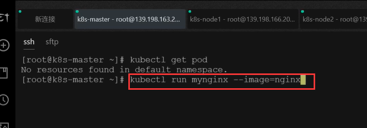
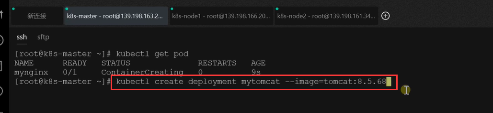
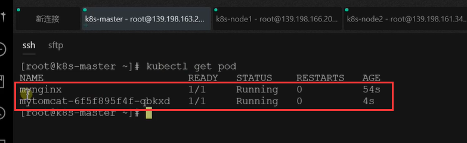
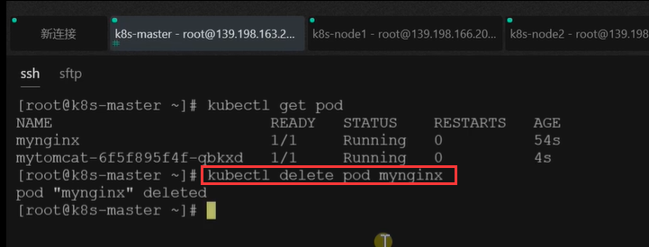
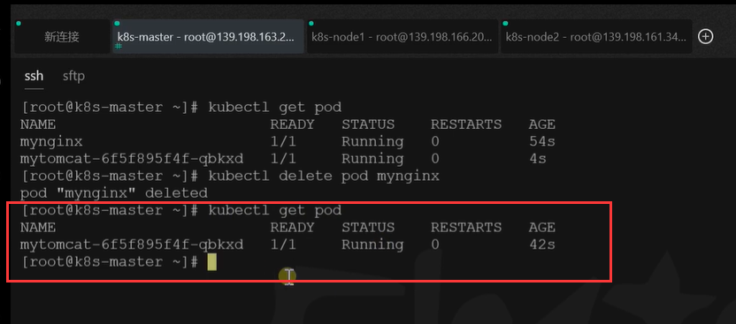
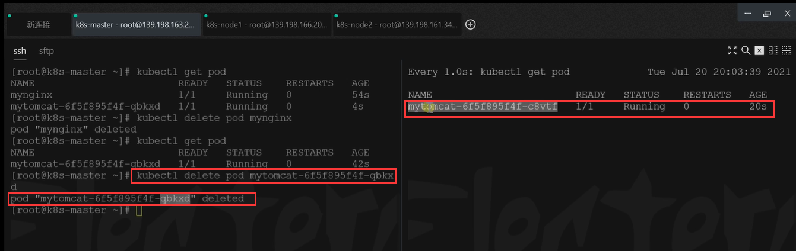
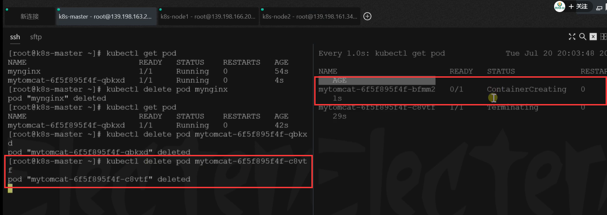

# 22.k8s核心实战-使用deployment部署应用

​	我们之前聊了Pod，现在我们了解一下k8s的另外一种资源Deployment--字面意思是部署。

​	如果我们现在想在k8s集群启动一个应用，我们部署成一个Pod，这个Pod的功能其实太单一，举个例子：假设我们有一个订单服务order，由于订单服务的访问量很高，我们部署到一台服务器上肯定不行，所以我们希望k8s帮我们把这个订单服务一次性部署上十几份，放到各种不同的服务器上，相当于同一个服务order让他们启动多个Pod。

​	我们以前运行一个Pod 执行命令kubectl run mynginx --image=nginx，那么如果我们启动100个Pod就需要运行100次这个命令吗？所以很麻烦，所以此时就引入一个概念叫Deployment。

​	让k8s帮我们做部署，我们需要告诉k8s这次部署需要什么镜像

如：`kubectl create deployment mytomcat -image=tomcat:8.5.68`,我们可以告诉k8s我们需要多少个副本，k8s会帮我们创建和控制多个副本Pod。

​	所以Deployment一句话就是用来控制Pod的，一旦deployment控制pod后，pod就赋予很多强大的能力了。

#### 部署应用

​	我们先看一下普通方式的部署应用：

​	我们以deployment的方式部署一下应用Pod

现在我们可以看到有2个pod

​	这俩个Pod有什么不同呢？

​	我们看一下删除掉用普通方式创建的pod

查看一下pod，确实删除没有了

我们删除一下我们刚刚使用deployment部署的pod，我们同时也监控一下这个pod

​	我们可以看到这个末尾是qbkxd的Pod删除了，但我们监视的地方看到同时又启动起一个Pod，名称结尾有点不一样，这个是c8vtf

我们再把这个是c8vtf后缀的Pod删除一下，发现k8s又给重新启动一个新的Pod

​	说明一个什么问题？就是如果我们以deployment启动的应用，我们不担心机器奔溃或者是宕机，就算是宕机k8s还会拉起一个新的，拥有自愈能力。

